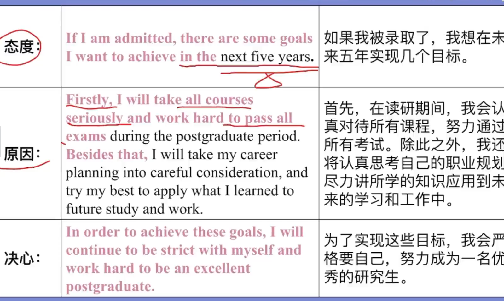
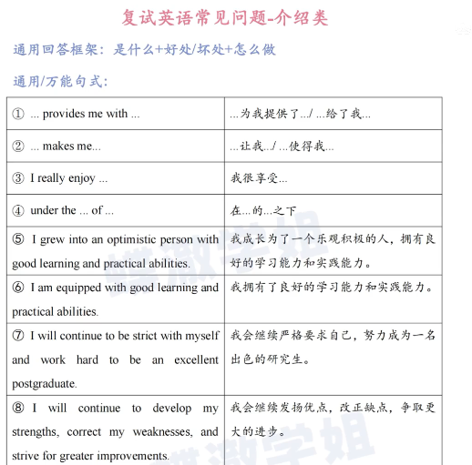
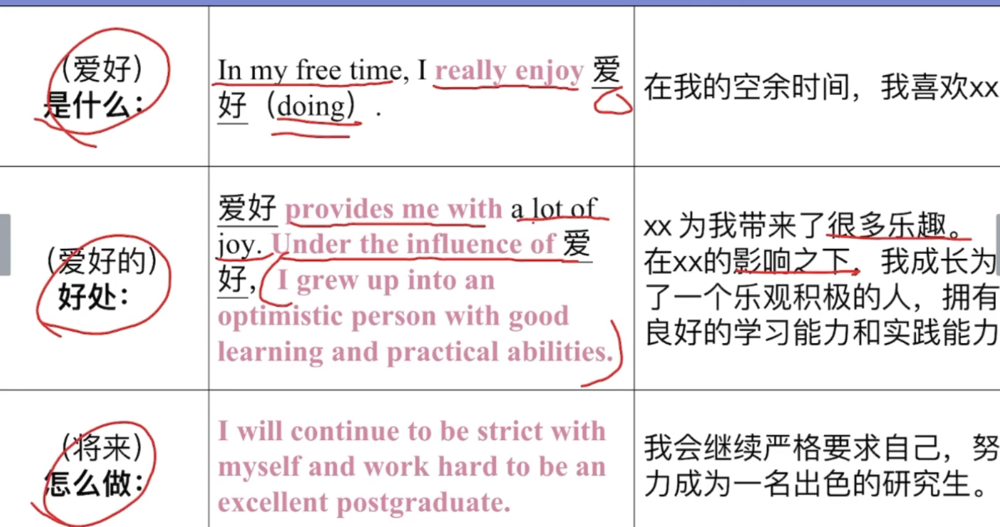
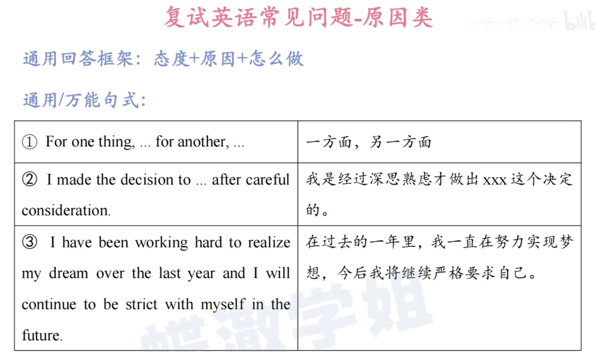
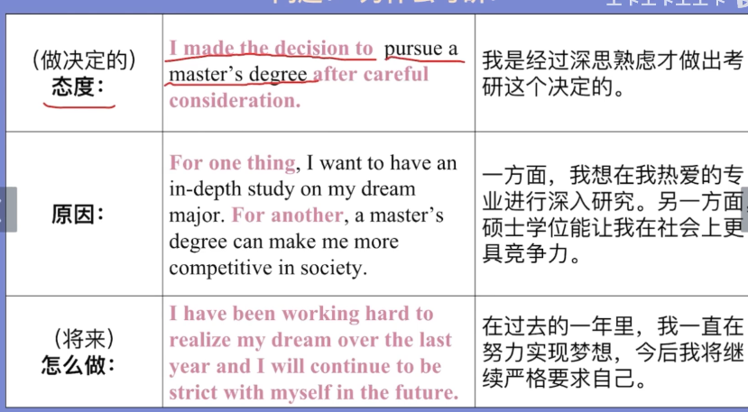
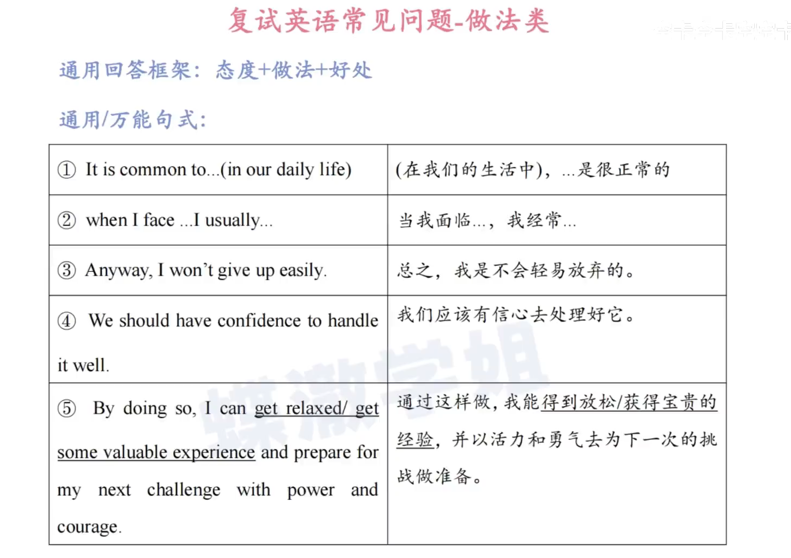
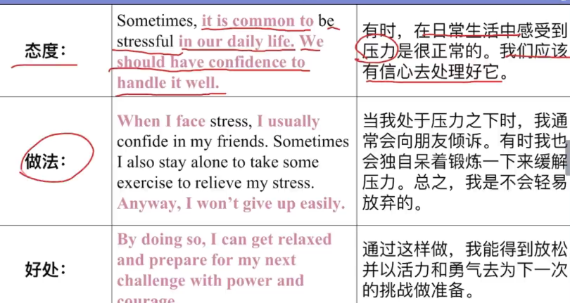

## 规划类

```
take sth seriously

take sth into careful consideration

be strict with myself and work hard to be an excellent postgraduate

apply what I learned to future study and work

apply for sth 申请

there are some goals I want to achieve in the postgraduate period
```



## 介绍类



```
continue to develop my strengths 

correct my weakness and strive for greater improvements

grew into an optimistic person with good learning and practical ablilities

be equipped with good learning and practical abilities
```



## 原因类



``` 
for one thing, ... for another, ...

I made the decision to ... after careful consideration

I have been workong hard to realize my dream over the last year and I will continue to be strict with myself in the future.
```



## 做法类



```
confide in sb

向（认为可信赖的人）透露秘密（或个人隐私）
to tell sb secrets and personal information because you feel you can trust them
It is important to have someone you can confide in.
有一位心腹知己很重要。

reflect on why I have failed  反思

draw some lessons from it and try again
draw attention to sth 引起对....的注意

pay attention to 注意，专心于
```


