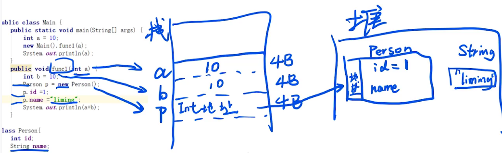
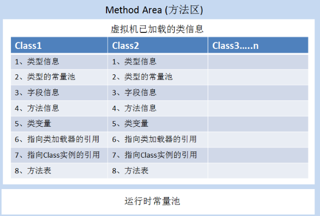
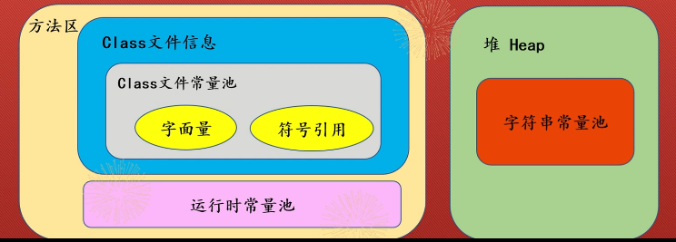
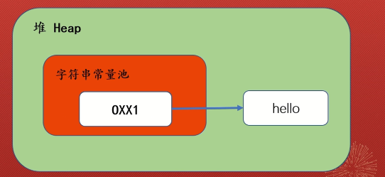

# 方法区

## Java运行顺序

当一个Java程序从编写到最终执行的过程中，经历了多个阶段，包括编译、加载、链接和执行。以下是这些阶段的简要解释：

1. 编写源代码：首先，程序员使用文本编辑器或集成开发环境（IDE）编写Java源代码文件，源代码文件的扩展名通常是`.java`。

2. 编译源代码：一旦源代码编写完成，需要使用Java编译器（`javac`命令）将源代码编译为字节码文件。字节码是一种与特定平台无关的中间代码，它被设计为JVM可以理解和执行的格式。编译后的字节码文件通常具有`.class`扩展名。

3. 类加载：在Java程序执行之前，JVM需要将编译后的字节码文件加载到内存中。类加载器（ClassLoader）负责加载类文件。类加载器会检查字节码文件的有效性，并将类的结构信息存储在方法区（或元空间）中。加载的类包括程序的入口类以及该类所依赖的其他类。

4. 链接：链接阶段主要包括三个步骤：

   - 验证（Verification）：在验证阶段，JVM会验证字节码文件的结构是否符合Java语言规范，并确保代码的安全性和正确性。
   - 准备（Preparation）：**在准备阶段，JVM会为类的静态变量分配内存空间，并设置默认的初始值。**
   - 解析（Resolution）：在解析阶段，JVM会将符号引用转换为直接引用，以确定类、方法和字段的真正引用地址。

5. 执行：一旦类加载和链接完成，JVM就开始执行程序。JVM从程序的入口方法（通常是`main`方法）开始执行，并按照字节码中的指令逐行执行。在执行过程中，JVM会根据需要从方法区中获取类信息、在栈上分配内存、执行方法调用、处理异常等。

需要注意的是，JVM具有即时编译器（Just-In-Time Compiler，JIT Compiler）的优化功能，它可以将热点代码（频繁执行的代码）编译成本地机器码，以提高执行效率。

这是Java程序从编译到执行的基本过程。每个阶段都有更多的细节和复杂性，但这个简要的解释应该可以帮助你理解Java程序的整体执行过程。

## JVM内存

**以下是Java虚拟机（JVM）在运行Java程序时用来管理内存和执行程序的重要组成部分。**

1. 栈（Stack）：栈是用来存储方法调用和局部变量的内存区域。每当一个方法被调用时，JVM会在栈中创建一个称为"栈帧"的区域，用于存储方法的参数、局部变量和返回值。栈采用"先进后出"（Last-In-First-Out）的方式管理数据，方法的调用和返回会不断地在栈上进行操作。
2. 堆（Heap）：堆是用来存储对象实例的内存区域。所有通过关键字"new"创建的对象都会在堆上进行分配。堆是动态分配和释放内存的，它的大小可以通过JVM的启动参数进行调整。Java的垃圾回收机制也主要针对堆进行垃圾回收操作。
3. 方法区（Method Area）：方法区是用来存储类信息、常量、静态变量和编译器编译后的代码等数据的内存区域。在方法区中存储的数据包括类的结构信息、运行时常量池、静态变量、方法代码等。方法区在JVM启动时被创建，它与堆一样，也是被所有线程共享的。



## 方法区存放内容

当我们在Java中定义类时，编译器会将类的信息存储在方法区（或元空间）中。这些信息包括类的结构、字段、方法、构造函数、注解、常量池等。



### 类型信息

**包括以下几点：**

类的完整名称（比如，java.long.String）
类的直接父类的完整名称
类的直接实现接口的有序列表（因为一个类直接实现的接口可能不止一个，因此放到一个有序表中）
类的修饰符

**可以看做是，对一个类进行登记，这个类的名字是什么，他父类是谁、有没有实现接口， 权限是什么；**

### 类型的常量池 （即class静态常量池）

每一个Class文件中，都维护着一个常量池（这个保存在类文件里面，不要与方法区的运行时常量池搞混），里面存放着编译时期生成的各种字面值和符号引用；这个常量池的内容，在类加载的时候，被复制到方法区的运行时常量池 。

Class文件中除了有类的版本、字段、方法、接口等描述信息外,还有一项信息是常量池表(Constant Pool
Table)，用于存放编译期生成的**各种字面量与符号引用**,这部分内容将在类加载后存放到方法区的运行时常量池中。

字面量比较接近于Java语言层面的常量概念,如文本字符串、被声明为fina的常量值等。**字面量**只可以右值出现,所谓右值是指等号右边的值,如:int a=1这里的a为左值,1为右值。在这个例子中1就是字面量。

符号引用则属于编译原理方面的概念,主要包括下面几类常量：被模块导出或者开放的包(Package)类和接口的全限定名(Fully Qualified Name)，字段的名称和描述符(Descriptor)，方法的名称和描述符。

**类成员变量声明为`final`并不会将该成员变量放入常量池**

在Java中，将类成员变量声明为`final`并不会将该成员变量放入常量池中。常量池是用于存储字符串常量和字面值常量的特殊内存区域，而`final`修饰符只是表示该成员变量的值不能被修改，它并不会影响常量池的使用。

当你将一个成员变量声明为`final`时，它将成为一个编译时常量。这意味着编译器会在编译阶段将该变量的值直接替换到使用它的地方，而不是在运行时进行计算或查找。这种替换仅适用于基本类型和字符串常量。

对于引用类型的`final`成员变量，它们的值在初始化后是不可更改的，但并不会放入常量池。引用类型的`final`成员变量仍然在堆中分配内存，并且需要通过引用来访问。

需要注意的是，**对于字符串常量**，无论是否使用`final`修饰符，如果其值是在编译时已知的，它们都会放入常量池中。但是使用`final`修饰符只是表示该变量不能被修改，并不是放入常量池的直接原因。

因此，将类成员变量声明为`final`并不会将其放入常量池中，它只是表示该变量是一个编译时常量或不可修改的值。

#### 例子

对于 `final int i = 100; final int j = 100;`，如果在同一个编译单元（即同一个类）中出现，且值相同的字面值常量，Java 编译器会重复使用相同的常量池中的值。这意味着 `i` 和 `j` 变量将共用相同的常量池中的 `100` 值。

在这种情况下，常量池中不会再创建一个新的 `100`。相反，编译器会重用已存在的常量池中的 `100` 值，并**将 `i` 和 `j` 变量都初始化为指向该值的引用**。这样可以节省内存，避免创建多个相同的常量。

需要注意的是，这种重用行为仅适用于编译时已知的字面值常量，而不适用于运行时确定的值或通过变量赋值得到的值。

### 字段信息

- 声明的顺序
- 修饰符
- 类型
- 名字

### 方法信息

- 声明的顺序
- 修饰符
- 返回值类型
- 名字
- 参数列表（有序保存）
- 异常表（方法抛出的异常）
- 方法字节码（native、abstract方法除外，）
- 操作数栈和局部变量表大小

### 类变量(即static变量）

非final类变量

在java虚拟机使用一个类之前，它必须在方法区中为每个非final类变量分配空间。非final类变量存储在定义它的类中；

final类变量（不存储在这里）

由于final的不可改变性，因此，final类变量的值在编译期间，就被确定了，因此被保存在类的常量池里面，然后在加载类的时候，复制进方法区的运行时常量池里面 ；**final类变量存储在运行时常量池里面，每一个使用它的类保存着一个对其的引用；**

### 对类加载器的引用

jvm必须知道一个类型是由启动加载器加载的还是由用户类加载器加载的。如果一个类型是由用户类加载器加载的，那么jvm会将这个类加载器的一个引用作为类型信息的一部分保存在方法区中。

### 指向Class实例的引用

jvm为每个加载的类都创建一个java.lang.Class的实例（**存储在堆上**）。而jvm必须以某种方式把Class的这个实例和存储在方法区中的类型数据（**类的元数据**）联系起来， 因此，类的元数据里面保存了一个Class对象的引用；**Class对象是存放在堆区的，不是方法区，这点容易犯错。** 类的元数据（ 元数据并不是类的Class对象！ Class对象是加载的最终产品，类的方法代码，变量名，方法名，访问权限，返回值等等都是在方法区的 ）才是存在方法区的。**Class对象的引用存储在方法区**

### 方法表

为了提高访问效率，必须仔细的设计存储在方法区中的数据信息结构。除了以上讨论的结构，jvm的实现者还可以添加一些其他的数据结构，如方法表。jvm对每个加载的非虚拟类的类型信息中都添加了一个方法表，方法表是一组对类实例方法的直接引用(包括从父类继承的方法。jvm可以通过方法表快速激活实例方法。(译者：这里的方法表与C++中的虚拟函数表一样，但java方法全都 是virtual的，自然也不用虚拟二字了。正像java宣称没有 指针了，其实java里全是指针。更安全只是加了更完备的检查机制，但这都是以牺牲效率为代价的,个人认为java的设计者 始终是把安全放在效率之上的，所有java才更适合于网络开发)

### 运行时常量池

## 常量池

Java为每个基本数据类型提供了封装类
为了编程的方便还是引入了基本数据类型，但是为了能够将这些基本数据类型当成对象操作，Java为每 一个基本数据类型都引入了对应的包装类型（wrapper class），int的包装类就是Integer，从Java 5开始引入了自动装箱/拆箱机制，使得二者可以相互转换。

基本数据类型: boolean，char，byte，short，int，long，float，double
封装类类型：Boolean，Character，Byte，Short，Integer，Long，Float，Double

int与Integer的深入对比
（1）由于Integer变量实际上是对一个Integer对象的引用，所以两个通过new生成的Integer变量永远是不相等的（因为new生成的是两个对象，其内存地址不同）。

```java
Integer i = new Integer(100);
Integer j = new Integer(100);
System.out.print(i == j); //false
```

（2）Integer变量和int变量比较时，只要两个变量的值是向等的，则结果为true（因为包装类Integer和基本数据类型int比较时，java会自动拆包装为int，然后进行比较，实际上就变为两个int变量的比较

```java
Integer i = new Integer(100);
int j = 100;
System.out.print(i == j); //true
```

（3）非new生成的Integer变量和new Integer()生成的变量比较时，结果为false。因为非new生成的Integer变量指向的是**JVM静态常量池**而new Integer()生成的变量**指向了堆中的Integer对象**，而new Integer()生成的变量指向堆中新建的对象，两者在内存中的对象引用（地址）不同。
```java
Integer i = new Integer(100);
Integer j = 100;
System.out.print(i == j); //false
```

（4）

```java
Integer i = 100;
Integer j = 100;
System.out.print(i == j); //true

Integer i = 128;
Integer j = 128;
System.out.print(i == j); //false
```

对于第4条的原因： java在编译Integer i = 100 ;时，会翻译成为Integer i = Integer.valueOf(100)。而java API中对Integer类型的valueOf的定义如下，对于-128到127之间的数，会进行缓存，Integer i = 127时，会将127这个Integer对象进行缓存，下次再写Integer j = 127时，就会直接从缓存中取，就不会new了。

```java
public static Integer valueOf(int i){
	assert IntegerCache.high >= 127;
	if (i >= IntegerCache.low && i <= IntegerCache.high){
		return IntegerCache.cache[i + (-IntegerCache.low)];
	}
return new Integer(i);
```

**Java的8大类型除了浮点运算没有类似的常量（缓冲）池，其余6个类型都有缓冲池**

**解释如下**

```java
//自动装箱：将基本数据类型重新转化为对象

public class Test {
public static void main(String[] args) {
	// 声明一个Integer对象，用到了自动的装箱：解析为:Integer num = Integer.valueOf(9);
	Integer num = 9;
  }
}

//自动拆箱：将对象重新转化为基本数据类型
public class Test {  
       public static void main(String[] args) {  
           / /声明一个Integer对象
        Integer num = 9;
           
           // 进行计算时隐含的有自动拆箱
   	    System.out.print(num--);
       }     
}
```
在-128~127之内：**静态常量池中cache数组**是static final类型，**cache数组对象会被存储于静态常量池中。**

cache数组里面的元素却不是static final类型，而是cache[k] = new Integer(j++)，那么这些元素是存储于堆中，只是cache数组对象存储的是指向了堆中的Integer对象（引用地址）**cache池在运行之前已经将-128~127的缓存定义好了**

### 常量池




每一个Class文件中，都维护着一个常量池(该常量池为静态常量池)（这个保存在类文件里面，不要与方法区的运行时常量池搞混），里面存放着编译时期生成的各种字面值和符号引用；这个常量池的内容，在类加载的时候，被复制到方法区的运行时常量池 。

 1）所谓静态常量池，即*.class文件中的常量池，class文件中的常量池不仅仅包含字符串(数字)字面量，还包含类、方法的信息，占用class文件绝大部分空间。

2）运行时常量池，则是jvm虚拟机在完成类装载操作后，将class文件中的常量池载入（就是加载classLoader过程，可以详见反射那一章）到内存中，并保存在方法区中，我们常说的常量池，就是指方法区中的运行时常量池。

#### *.class文件中的常量池（静态常量池）

#### 运行时常量池（动态常量池）

运行时常量池(Runtime Constant Pool)是方法区的一部分。Class文件常量池里的内容将在类加载后存放到方法区的运行时常量池中,并将符号引用解析为直接引用。

我们看到类文件的信息存储在class静态文件中,在程序运行时会由类加载器加载到运行时常量池中,并在解析阶段,将符号引用转换为直接引用,指向真正的内存地址。

#### string常量池（存储在堆内存中）

字符串常量池里的内容是在类加载、验证、准备阶段之后在堆中生成字符串对象实例,然后将该字符串对象实例的引用值存到string pool中。在HotSpot VM里实现的string pool功能的是一个StringTable类,它是一个哈希表。这个StringTable在每个HotSpot VM的实例只有一份,被所有的类共享。

