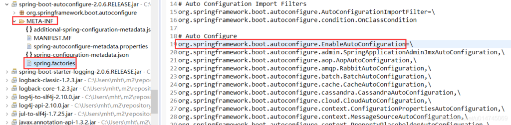

# 自动配置

## SpringBoot引入自动配置类

**Spring Boot的启动类上有一个@SpringBootApplication注解**

```java
@Target(ElementType.TYPE)
@Retention(RetentionPolicy.RUNTIME)
@Documented
@Inherited
@SpringBootConfiguration
@EnableAutoConfiguration
@ComponentScan(excludeFilters = { @Filter(type = FilterType.CUSTOM, classes = TypeExcludeFilter.class),
		@Filter(type = FilterType.CUSTOM, classes = AutoConfigurationExcludeFilter.class) })
public @interface SpringBootApplication {}
```

**@SpringBootApplication是一个复合注解或派生注解，在@SpringBootApplication中有一个注解@EnableAutoConfiguration，翻译是开启自动配置，其定义如下：**

```java
@Target(ElementType.TYPE)
@Retention(RetentionPolicy.RUNTIME)
@Documented
@Inherited
@AutoConfigurationPackage
@Import(AutoConfigurationImportSelector.class)
public @interface EnableAutoConfiguration {}
```

而这个注解也是一个派生注解，其中的关键功能由@Import提供，其导入的**AutoConfigurationImportSelector**的**selectImports()方法**通过`SpringFactoriesLoader.loadFactoryNames()`扫描所有具有META-INF/spring.factories的jar包。**spring-boot-autoconfigure-x.x.x.x.jar里就有一个这样的spring.factories文件。**

```java
protected List<String> getCandidateConfigurations(AnnotationMetadata metadata, AnnotationAttributes attributes) {
	List<String> configurations = new ArrayList<>(
			SpringFactoriesLoader.loadFactoryNames(getSpringFactoriesLoaderFactoryClass(), getBeanClassLoader()));
	ImportCandidates.load(AutoConfiguration.class, getBeanClassLoader()).forEach(configurations::add);
	Assert.notEmpty(configurations,"No auto configuration classes found in META-INF/spring.factories nor in META-INF/spring/org.springframework.boot.autoconfigure.AutoConfiguration.imports. If you " + "are using a custom packaging, make sure that file is correct.");
	return configurations;
}
```

这个spring.factories文件也是一组一组的key=value的形式，其中一个key是EnableAutoConfiguration类的全类名，而它的value是一个xxxxAutoConfiguration的类名的列表，这些类名以逗号分隔，如下所示：



**总结**：这个@EnableAutoConfiguration注解通过@SpringBootApplication被间接的标记在了Spring Boot的启动类上。在SpringApplication.run(…)的内部就会执行selectImports()方法，找到所有JavaConfig自动配置类的全限定名对应的class，然后将所有自动配置类加载到Spring容器中。

## 自动配置类的注解

每一个XxxxAutoConfiguration自动配置类都是在某些条件之下才会生效的，这些条件的限制在Spring Boot中以注解的形式体现，常见的条件注解有如下几项：

```text
@ConditionalOnBean：当容器里有指定的bean的条件下。
@ConditionalOnMissingBean：当容器里不存在指定bean的条件下。
@ConditionalOnClass：当类路径下有指定类的条件下。
@ConditionalOnMissingClass：当类路径下不存在指定类的条件下。
@ConditionalOnProperty：指定的属性是否有指定的值，比如@ConditionalOnProperties(prefix=”xxx.xxx”, value=”enable”, matchIfMissing=true)，代表当xxx.xxx为enable时条件的布尔值为true，如果没有设置的情况下也为true。
```

## 以JDBCTemplate为例

在Spring Boot中，`自动配置类（AutoConfiguration）`、`属性（Properties）`和`配置类（Configuration）`是三个关键概念，用于实现自动化配置和定制化。

1. `自动配置类（AutoConfiguration）`：
    自动配置类是Spring Boot中的一个特殊类，用于自动配置应用程序的各个组件。这些自动配置类通常使用条件注解（如`@ConditionalOnClass`、`@ConditionalOnBean`等）来确定是否需要应用某个自动配置。它们在Spring Boot启动时自动生效，根据所引入的依赖和配置自动完成相应的配置工作。自动配置类可以为应用程序提供默认配置，但同时也允许用户根据自己的需求进行定制和覆盖。

  ```java
  @AutoConfiguration(after = DataSourceAutoConfiguration.class)
  @ConditionalOnClass({ DataSource.class, JdbcTemplate.class })
  @ConditionalOnSingleCandidate(DataSource.class)
  @EnableConfigurationProperties(JdbcProperties.class)
  @Import({ DatabaseInitializationDependencyConfigurer.class, JdbcTemplateConfiguration.class,
  		NamedParameterJdbcTemplateConfiguration.class })
  public class JdbcTemplateAutoConfiguration {
  
  }
  ```

2. `属性（Properties）`：
    属性是Spring Boot中的配置项，它们定义了应用程序的行为和特性。**属性通常被定义在`application.properties`或`application.yml`文件中**，也可以通过其他方式进行定义。这些属性可以通过`@Value`注解、`@ConfigurationProperties`注解或`Environment`对象来注入到应用程序中，从而影响应用程序的行为。Spring Boot的自动配置类可以读取这些属性，并根据属性的值来完成相应的配置工作。

3. `配置类（Configuration）`：
    配置类是Spring框架中的一种常用方式，用于定义应用程序的配置信息。在Spring Boot中，配置类通常使用`@Configuration`注解进行标识，并可以使用`@Bean`注解定义一些需要被Spring容器管理的Bean。配置类可以包含各种自定义配置，如数据库连接、缓存配置、消息队列配置等。通过编写自定义的配置类，可以覆盖或扩展Spring Boot自动配置类的行为。

  **可以理解为实例化一个该配置类到bean中**

  ```java
  @Configuration(proxyBeanMethods = false)
  @ConditionalOnMissingBean(JdbcOperations.class)
  class JdbcTemplateConfiguration {
  
  	@Bean
  	@Primary
  	JdbcTemplate jdbcTemplate(DataSource dataSource, JdbcProperties properties) {
  		JdbcTemplate jdbcTemplate = new JdbcTemplate(dataSource);
  		JdbcProperties.Template template = properties.getTemplate();
  		jdbcTemplate.setFetchSize(template.getFetchSize());
  		jdbcTemplate.setMaxRows(template.getMaxRows());
  		if (template.getQueryTimeout() != null) {
  			jdbcTemplate.setQueryTimeout((int) template.getQueryTimeout().getSeconds());
  		}
  		return jdbcTemplate;
  	}
  
  }
  ```

总结：
自动配置类是Spring Boot实现自动化配置的核心机制，它根据引入的依赖和配置的属性来自动配置应用程序的各个组件。属性定义了应用程序的行为和特性，而配置类则用于定义自定义的配置信息。这三个概念共同协作，实现了Spring Boot的自动化配置和定制化能力。