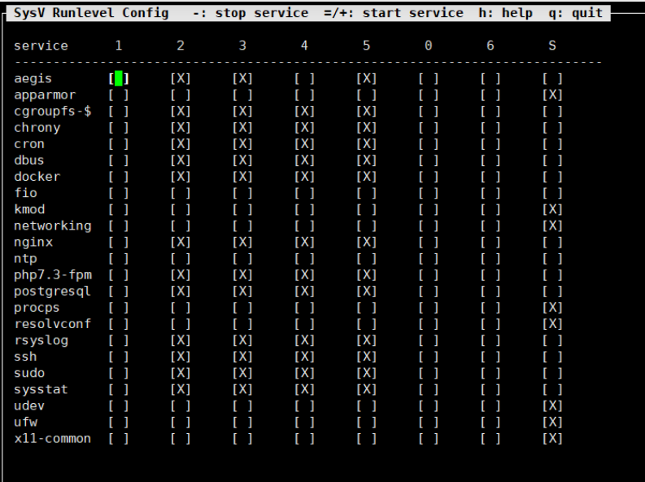

# Crontab

## crontab -e 和 vim /etc/crontab 区别

`crontab -e` 和 `vim /etc/crontab` 是两种不同的方法来编辑 crontab 文件，其区别在于：

1. `crontab -e`: 这个命令用于编辑当前用户的 crontab 文件。每个用户都有一个独立的 crontab 文件，用于定义该用户的定时任务。使用 `crontab -e` 命令会打开一个文本编辑器，通常是默认的编辑器（比如 Vim 或者 Nano），用于编辑当前用户的 crontab 文件。该文件包含了 cron 任务的配置信息，定义了要运行的命令、执行时间等。
2. `vim /etc/crontab`: 这个命令用于编辑系统级的 crontab 文件。系统级的 crontab 文件位于 `/etc/crontab` 路径下，用于定义整个系统的定时任务。与用户级的 crontab 文件不同，系统级的 crontab 文件需要 root 权限来编辑。因此，你需要使用 sudo 或者以 root 用户身份运行 `vim /etc/crontab` 命令。系统级的 crontab 文件与用户级的 crontab 文件类似，但是有一些额外的字段（如运行任务的用户）需要填写。

总结：`crontab -e` 用于编辑当前用户的 crontab 文件，而 `vim /etc/crontab` 用于编辑系统级的 crontab 文件。用户级的 crontab 文件与系统级的 crontab 文件具有不同的权限和位置，因此使用的方法也有所不同。

```text
crontab -e这种所有用户都可以使用，普通用户也只能为自己设置计划任务。
这个命令完成后会自动写入/var/spool/cron/usename 中
```

## init

 `init 0` 是一个在 Linux 中用于关机的命令。在 Linux 中，进程管理的初始进程是 `init`，而 `init` 进程的标识符是 0。通过运行 `init 0` 命令，你可以发送一个关机信号给 `init` 进程，从而触发系统的关机操作。

具体而言，`init 0` 命令会将系统切换到关机运行级别（runlevel）。在关机运行级别下，系统会执行相应的关机脚本和操作，以安全地关闭所有服务和进程，最终将系统关机。

需要注意的是，运行 `init 0` 命令通常需要管理员（root）权限。确保在执行此命令之前保存好你的工作，以免丢失未保存的数据。另外，还可以使用 `shutdown` 命令来执行关机操作，并提供更多的选项和灵活性。

在 Linux 系统中，`init` 命令后面可以接不同的数字，这些数字代表不同的运行级别（runlevel）。运行级别定义了系统所运行的服务和进程的集合。

### init 运行级别

以下是常见的运行级别及其含义：

- 0：关机模式。系统将停止所有服务并关闭计算机。
- 1：单用户模式。只有最基本的系统服务运行，用户通常只能以 root 用户登录。用于系统维护和故障排除。
- 2：多用户模式，没有网络连接。类似于运行级别 3，但不运行网络服务。
- 3：多用户模式，有网络连接。系统完全启动，运行所有标准服务，包括网络服务。
- 4：保留。未分配给特定的运行级别。
- 5：图形用户界面模式（GUI 模式）。类似于运行级别 3，但还启动了图形登录界面（如 X Window System）。
- 6：重新启动模式。系统将重新启动。

这些运行级别在不同的 Linux 发行版中可能会有一些差异，因此请参考你所使用的发行版的文档或手册以了解准确的运行级别定义。

你可以使用 `init` 命令加上相应的运行级别数字来切换系统的运行级别。例如，`init 3` 将切换到多用户模式，而 `init 0` 将关机系统。注意，在现代的 Linux 发行版中，通常使用更先进的初始化系统（如 systemd）来管理运行级别，而不是直接使用 `init` 命令。

### 运行级别文件目录

在/etc/rc.d下有7个名为rcN.d的目录，对应系统的7个运行级别

"rc" 是 "run commands" 的缩写，表示在 Unix 和类 Unix 系统中用于启动系统进程和服务的脚本文件。它是一种传统的初始化脚本文件的命名约定。

在 Linux 系统中，通常会在 `/etc/rc.d` 目录下有多个名为 `rcN.d` 的子目录，其中 `N` 表示运行级别的数字。这些子目录与不同的运行级别对应，用于存放在相应运行级别下启动或停止的服务的符号链接。

以下是常见的 `/etc/rc.d` 目录下的运行级别子目录和对应的运行级别：

- `rc0.d`: 关机运行级别 (0)
- `rc1.d`: 单用户模式运行级别 (1)
- `rc2.d`: 多用户模式 (无网络)运行级别 (2)
- `rc3.d`: 多用户模式 (有网络)运行级别 (3)
- `rc4.d`: 保留运行级别 (4)
- `rc5.d`: 图形用户界面 (GUI) 运行级别 (5)
- `rc6.d`: 重新启动运行级别 (6)

每个运行级别子目录中都包含了一系列以字母 `K` 或 `S` 开头的符号链接文件。这些符号链接文件对应着系统中安装的服务，以及在特定运行级别下启动或停止这些服务所需的顺序。以 `K` 开头的符号链接表示在特定运行级别下停止服务，而以 `S` 开头的符号链接表示在特定运行级别下启动服务。数字前缀指定了服务的启动或停止顺序。

注意，具体的运行级别子目录名称和符号链接文件的前缀命名约定可能因 Linux 发行版而异。因此，对于特定的系统，请参考相应的文档或手册以获取准确的命名约定和配置信息。

系统会根据指定的运行级别进入对应的 `rcN.d` 目录，并按照文件名顺序检索该目录下的链接文件。符号链接文件的命名约定通常遵循以下规则：

- 以 `K` 开头的文件：表示需要在该运行级别下停止（kill）对应的服务。

- 以 `S` 开头的文件：表示需要在该运行级别下启动（start）对应的服务。

### 服务的链接文件

这些符号链接文件通常指向 `/etc/init.d` 目录中的实际服务脚本文件。通过按照文件名顺序检索链接文件，并执行相应的操作，系统可以在特定的运行级别下启动或停止服务。

每个链接文件的名称通常由以下组成：

- 两位数字：指定启动或停止服务的顺序。较低的数字表示较早启动或较晚停止的服务。
- 服务名称：对应要启动或停止的服务的名称。

例如，在运行级别 3 下，系统会按照 `rc3.d` 目录中符号链接文件的顺序执行。以 `K` 开头的文件将会停止对应的服务，以 `S` 开头的文件将会启动对应的服务。

需要注意的是，对于某些 Linux 发行版，特定的运行级别和文件名约定可能会有所不同。因此，在具体的系统中，请参考相关文档或手册以获取准确的命名约定和配置信息。

### Linux /etc/rc...

`/etc/init.d` 目录中的实际服务脚本文件。通过按照文件名顺序检索链接文件，并执行相应的操作，系统可以在特定的运行级别下启动或停止服务。

**可以直接运行**    `/etc/init.d/docker start`

常见的 `/etc/rc.d` 目录下的运行级别子目录，但是在Debian 系统中，没有rc.d目录，在rc按下tab按键的时候，显示如下**即直接全部显示在etc文件下**


## Linux开机自启 命令怎么实现

**本质上都是创建服务的过程，所以可以使用systemctl 命令**

在 Linux 中，可以通过以下方法实现开机自启动命令：

### 方法1

使用 `/etc/rc.local` 文件：`/etc/rc.local` 是一个系统级别的启动脚本文件，可以在其中添加需要在系统启动时执行的命令。你可以编辑 `/etc/rc.local` 文件，将需要自启动的命令添加到文件的末尾，并确保文件以 `exit 0` 结尾。注意，该文件需要有可执行权限。示例：

```shell
sudo nano /etc/rc.local
```

在文件中添加你的命令，如：

```shell
#!/bin/sh
# Commands to be executed at startup

/path/to/your/command

exit 0
```

保存并退出文件。**注意exit 0后面不能带有空格和空行**

### 方法2

使用 systemd 服务：systemd 是 Linux 系统中常用的初始化系统，它提供了一种更为现代的方式来管理系统服务和自启动。可以创建一个 systemd 服务单元文件来定义要在系统启动时运行的命令。示例：

首先，创建一个名为 `your_service.service` 的服务单元文件：

```shell
sudo nano /etc/systemd/system/your_service.service
```

在文件中添加以下内容：

```shell
[Unit]
Description=Your Service
After=network.target

[Service]
ExecStart=/path/to/your/command

[Install]
WantedBy=default.target
```

替换 `/path/to/your/command` 为你想要在启动时运行的命令的实际路径。

保存并退出文件。

然后，重新加载 systemd 配置并启用服务：

```shell
systemctl daemon-reload
sudo systemctl enable your_service
```

现在，你的命令将在系统启动时自动运行。

注意：这里的示例是基于 systemd 的方式，如果你的系统不使用 systemd，可以考虑其他 init 系统或者启动脚本来实现开机自启动。

#### 具体例子

当使用 systemd 作为服务管理器时，你可以创建自定义的 systemd 服务单元来管理和控制特定的应用程序或脚本。下面是一个具体的例子，展示如何创建一个简单的 systemd 服务单元。

假设你有一个名为 `myapp` 的应用程序，它需要在系统启动时自动运行。你可以按照以下步骤创建一个 systemd 服务：

1. 在 `/etc/systemd/system/` 目录下创建一个以 `.service` 结尾的服务单元文件，例如 `myapp.service`。

```
sudo nano /etc/systemd/system/myapp.service
```

2. 编辑 `myapp.service` 文件，并添加以下内容：

```plaintext
[Unit]
Description=My App
After=network.target

[Service]
ExecStart=/path/to/myapp
WorkingDirectory=/path/to/myapp
Restart=always

[Install]
WantedBy=multi-user.target
```

- 在 `[Unit]` 部分，你可以指定服务的描述和依赖关系。`After=network.target` 表示该服务应在网络服务启动之后启动。

- 在 `[Service]` 部分，你需要指定要执行的命令或脚本的路径。将 `ExecStart` 设置为你的应用程序的路径，并使用 `WorkingDirectory` 指定应用程序的工作目录。`Restart=always` 表示如果服务意外停止，它将自动重启。

- 在 `[Install]` 部分，你可以指定服务的安装位置。`WantedBy=multi-user.target` 表示该服务将在多用户模式下启动。

3. 保存并关闭文件。

4. 运行以下命令以重新加载 systemd 配置：

```
sudo systemctl daemon-reload
```

5. 启动服务并设置开机自启：

```
sudo systemctl start myapp
sudo systemctl enable myapp
```

现在，你的 `myapp` 应用程序将启动，并在系统引导时自动运行。你可以使用 `systemctl status myapp` 命令来检查服务的状态，使用 `journalctl -u myapp` 命令来查看服务的日志。

这只是一个简单的例子，你可以根据自己的需求进一步自定义 systemd 服务单元。需要注意的是，具体的服务配置可能因系统和应用程序而异，所以请根据你的实际情况进行调整。

### 方法3

**创建类似于rc.d的服务**

首先，进入 /etc/init.d 目录中：

``` shell
cd /etc/init.d/
```

然后，我们使用 ls 命令，会发现里面有一些文件。这些文件就是在开机启动时自动运行的程序。我们现在来开始添加一个自定义的开机启动项 MyTest ：

```shell
vim MyTest
```

文件名严格区分大小写，请注意！

你可以使用你自己喜欢的文本编辑工具进行编辑工作。此文以 vim 为例。

然后，在继续之前，先看一下开机启动项文件的一个模板：

```shell
#!/bin/sh
 
### BEGIN INIT INFO
# Provides: [程序名称，唯一]
# Required-Start: $network $remote_fs $local_fs
# Required-Stop: $network $remote_fs $local_fs
# Default-Start: 2 3 4 5
# Default-Stop: 0 1 6
# Short-Description: [启动项的简短说明]
# Description: [启动项的完整说明]
### END INIT INFO
 
[需要执行的命令]
 
exit 0
```

在这个模板中，Provides 是唯一的，也就是在所有的开机启动项中，Provides不能有任何同名冲突。

**Short-Description 和 Description 随便写。**

需要执行的命令，按照正常的Bash Shell书写方式书写即可。

最后的 exit 0 请不要删除！这个是返回正常退出信号的一个传值！

那么，我们设想我们需要创建一个名为 MyTest 的开机启动项，并要求其在开机时在 /root/mytest.txt 文件中写入一句话：“Hello Linux World !”，根据上面的模板，我们需要修改成这个样子：

```shell
#!/bin/sh
 
### BEGIN INIT INFO
# Provides: MyTest
# Required-Start: $network $remote_fs $local_fs
# Required-Stop: $network $remote_fs $local_fs
# Default-Start: 2 3 4 5
# Default-Stop: 0 1 6
# Short-Description: MyTest
# Description: MyTest Test Program
### END INIT INFO
 
echo "Hello Linux World !" >> /root/mytest.txt
 
exit 0
```

之后将文件保存，关闭编辑器。 接下来，我们将刚才编辑好的 MyTest 文件加上可执行的属性（如果不加属性，启动脚本将无法运行）：

```shell
chmod +x MyTest
```

然后，将这个启动脚本加入开机启动项中：

```shell 
update-rc.d MyTest defaults 
```

然后重新启动系统，或者命令行执行 `/etc/init.d/MyTest` ，执行启动脚本，然后使用 cat /root/mytest.txt，验证文件是否正确创建。

**使用chkconfig命令用于检查，设置系统的各种服务。**



比如配置的Docker服务是在运行状态为2，3，4，5的时候运行。