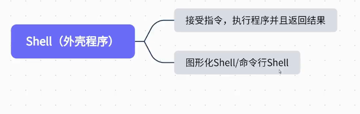
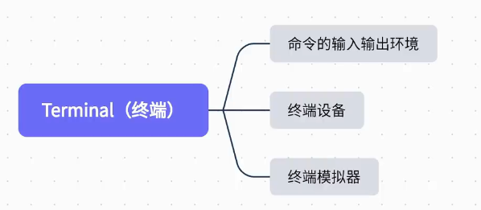
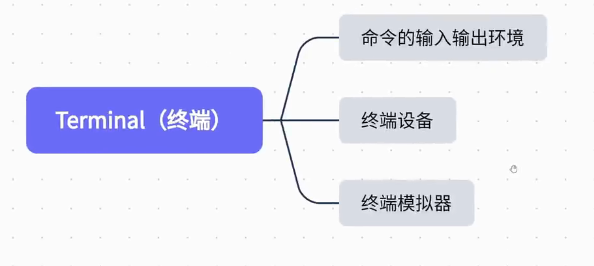
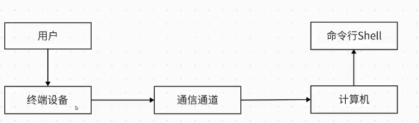
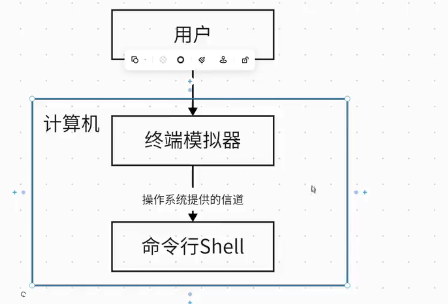
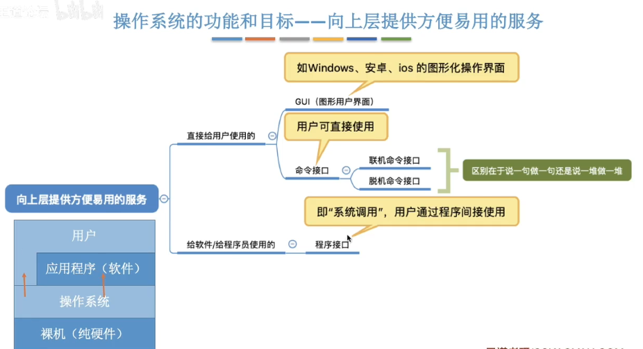
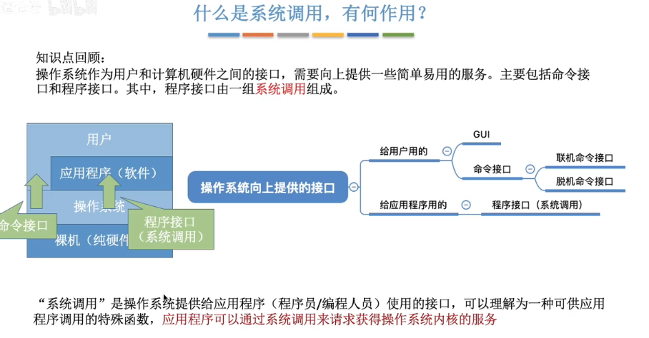
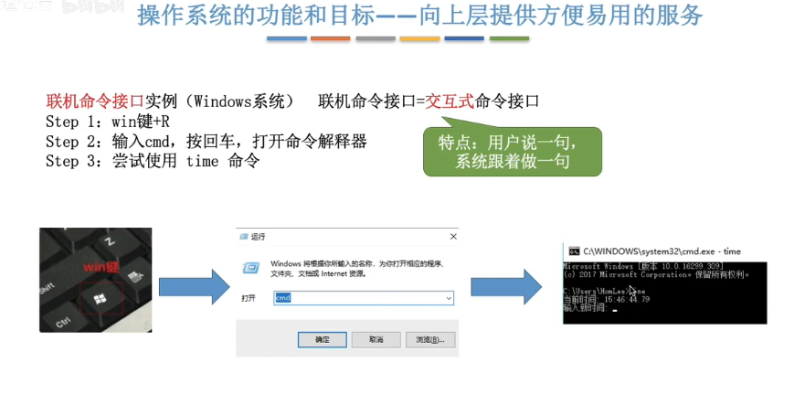
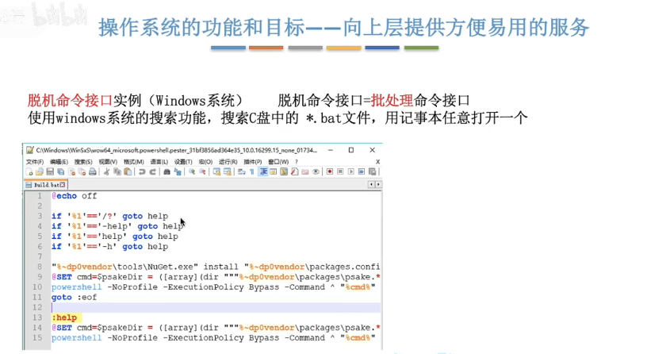
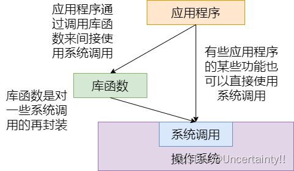

# shell 和 终端

## shell

Shell 是一个 C 语言编写的脚本语言，它是用户与 Linux 的桥梁，用户输入命令交给 Shell 处理，shell是一个命令解释器，是一个工具箱， Shell 将相应的操作传递给内核（Kernel），内核把处理的结果输出给用户。 Linux 操作系统的 Shell 作为操作系统的外壳，为用户提供使用操作系统的接口。 它是命令语言、命令解释程序及程序设计语言的统称。 **Shell 是用户和 Linux 内核之间的接口程序**，如果把 Linux 内核想象成一个球体的中心，Shell 就是围绕内核的外层。 当从 Shell 或其他程序向 Linux 传递命令时，内核会做出相应的反应。

### Shell 与应用层的关系
- **Shell**：Shell 是一个用户与操作系统内核之间的接口，它解释用户输入的命令并将其传递给操作系统执行。在 Linux 系统中，Shell 本身也是一个应用程序，运行在应用层。常见的 Shell 有 Bash、Zsh、Fish 等。

- **命令行工具**：如 `ls`、`cp`、`mv` 等命令行工具是独立的程序，通常安装在系统的 `/bin`、`/usr/bin` 等目录下。这些程序由 Shell 解释器调用执行。虽然它们通过 Shell 执行，但它们是运行在应用层的工具，而非 Shell 本身的一部分。

### 总结
- Shell 是一个应用程序，用于解释和执行用户输入的命令，它本身属于应用层。
- `ls`、`cp`、`mv` 等命令行工具也是应用程序，通过 Shell 调用运行在应用层。
  

因此，这些命令虽然在 Shell 中执行，但它们仍然是操作系统应用层的组成部分。

## 终端

早期计算机比较贵重，只有一个主机连接多个shell（终端可能由一个显示器和键盘组成）

终端连接计算机操作命令行shell

现在终端已经被淘汰了，现在主要使用的是终端模拟器，现在很多人直接将终端模拟器叫成终端了

## cmd是shell还是终端

**cmd.exe是shell**

**windows的终端是conhost.exe**

**windows上的shell还有powershell等，打开时还是使用的conhost.exe终端**

**因为终端离开shell不发挥作用，所以将两者混为一谈**

## Linux分层

UNIX/Linux 系统可以粗糙地抽象为 3 个层次，底层是系统内核（Kernel）；中间层是Shell层，即命令解释层；高层则是应用层。

（1）内核层

内核层是 UNIX/Linux 系统的核心和基础，它直接附着在硬件平台之上，控制和管理系统内各种资源（硬件资源和软件资源），有效地组织进程的运行，从而扩展硬件的功能，提高资源的利用效率，为用户提供方便、高效、安全、可靠的应用环境。

（2）Shell层

Shell 层是与用户直接交互的界面。用户可以在提示符下输入命令行，由 Shell 解释执行并输出相应结果或者有关信息，所以我们也把 Shell 称作命令解释器，利用系统提供的丰富命令可以快捷而简便地完成许多工作。

（3）应用层

应用层提供基于 X Window 协议的图形环境。X Window 协议定义了一个系统所必须具备的功能。**说明：**X Window 与微软的 Windows 图形环境有很大的区别：UNIX/Linux 系统与 X Window 没有必然捆绑的关系，也就是说，UNIX/Linux 可以安装 X Window，也可以不安装；而微软的 Windows 图形环境与内核捆绑密切。UNIX/Linux 系统不依赖图形环境，依然可以通过命令行完成 100% 的功能，而且因为不使用图形环境还会节省大量的系统资源。

应用层包括**应用程序**，而这些应用程序可以是**图形化界面**的，也可以是**命令行界面**的。换句话说，应用层不仅仅指图形化界面，而是涵盖了所有运行在操作系统之上的用户级应用程序。

具体来说：

1. **应用程序**：这是应用层的主要组成部分，包括所有用户运行的软件，例如文本编辑器、浏览器、开发工具等。应用程序可以是图形化的（如通过 X Window 系统显示的 GUI 应用程序），也可以是基于命令行的（如 `vim`、`grep` 等）。

2. **图形化界面**：这是应用程序的一个类别，专指那些具有图形用户界面（GUI）的程序。这类程序通常依赖于图形显示系统，如 X Window 系统来运行。在 Linux 系统中，图形化界面不是必需的，系统可以完全通过命令行操作。

因此，应用层不仅仅是图形化界面，也不仅限于应用程序，它涵盖了在用户空间中运行的所有应用程序，不论它们是图形化的还是基于命令行的。

## 命令接口、程序接口（系统调用）、库函数

操作系统针对不同“客户”向上层提供了不同接口
向用户提供了命令接口和GUI
向应用程序提供了程序接口
==这些接口方便了这些“客户”，“客户”通过这些接口，让操作系统代劳实现需要的功能==

### 命令接口（Command Line Interface, CLI）

- **概念**: 命令接口通常指的是用户通过输入命令与操作系统或软件交互的方式。在Linux中，命令接口通常指的是Shell（例如Bash、Zsh等），它是一个解释器，允许用户输入命令，操作系统会执行这些命令并返回结果。
- **功能**: 通过命令接口，用户可以直接输入单个命令来执行各种任务，如文件管理、进程控制、网络配置等。

### 程序接口（系统调用）

在计算机中，系统调用（英语：systemcall），又称为系统呼叫，指运行在使用者空间的程序向操作系统内核请求需要更高权限运行的服务。系统调用提供了用户程序与操作系统之间的接口（即系统调用是用户程序和内核交互的接口）。

操作系统中的状态分为管态（核心态）和目态（用户态）。大多数系统交互式操作需求在内核态执行。如设备IO操作或者进程间通信。特权指令：一类只能在核心态下运行而不能在用户态下运行的特殊指令。不同的操作系统特权指令会有所差异，但是一般来说主要是和硬件相关的一些指令。用户程序只在用户态下运行，有时需要访问系统核心功能，这时通过系统调用接口使用系统调用。

应用程序有时会需要一些危险的、权限很高的指令，如果把这些权限放心地交给用户程序是很危险的(比如一个进程可能修改另一个进程的内存区，导致其不能运行)，但是又不能完全不给这些权限。于是有了系统调用，危险的指令被包装成系统调用，用户程序只能调用而无权自己运行那些危险的指令。另外，计算机硬件的资源是有限的，为了更好的管理这些资源，所有的资源都由操作系统控制，进程只能向操作系统请求这些资源。操作系统提供访问这些资源的唯一入口，这个入口就是系统调用。

**库函数与系统调用的关系**
库函数是对系统调用的再次封装
注意：有些库函数涉及系统调用，而有些库函数不涉及系统调用

**直接调用：应用程序使用汇编语言直接请求系统调用服务**

### IO和系统调用的关系

## 应用层

### 应用层概述
在 Linux 系统中，**应用层**是操作系统中最靠近用户的一层，也是用户直接与之交互的一部分。应用层包含了所有的用户应用程序和工具，这些程序运行在操作系统之上，并提供各种功能和服务。应用层的程序既可以是图形化的应用程序，也可以是基于命令行的工具。

### 应用层的组成
1. **用户应用程序（User Applications）**：
   - 这些是用户安装和使用的软件，可以满足各种需求，如文字处理、浏览网页、播放多媒体、编程等。
   - 图形化的用户应用程序通过图形界面（GUI）与用户交互，例如浏览器、媒体播放器、文档编辑器等。
   - 基于命令行的用户应用程序通过 Shell 与用户交互，例如 `vim`（文本编辑器）、`gcc`（编译器）等。

2. **系统工具和实用程序（System Tools and Utilities）**：
   - 这些工具是系统自带的基础应用程序，通常用于系统管理、维护和操作。例如，`ls`、`cp`、`mv` 等命令行工具就是系统工具的一部分。
   - 这些工具通常通过 Shell 执行，但它们本质上仍然是应用程序，运行在应用层。

3. **图形界面（GUI）应用程序**：
   - 在图形界面环境下（如 GNOME、KDE），应用程序通过 X Window 系统或 Wayland 等显示服务器与用户交互。图形化应用程序包括文件管理器、浏览器、邮件客户端等。
   - X Window 系统本身也算作应用层的一部分，因为它为应用程序提供了图形显示的基础功能。

4. **命令行工具和 Shell 脚本**：
   - 许多用户应用程序是基于命令行的，例如 `grep`、`awk`、`sed` 等文本处理工具。
   - 用户还可以编写 Shell 脚本（例如 Bash 脚本）来自动执行一系列任务，这些脚本也是应用层的一部分。

### 应用层的作用
- **提供用户功能**：应用层是用户实际使用系统的入口。用户通过应用层的程序完成日常任务，如浏览网页、编写代码、处理文档等。
- **接口作用**：应用层程序通过系统调用与操作系统内核进行交互。例如，文件管理器需要通过系统调用与文件系统交互来操作文件。
- **扩展性和灵活性**：用户可以根据需要安装或卸载应用程序，使得应用层是整个系统中最灵活和可扩展的一层。

### 应用层与其他层的关系
- **与 Shell 的关系**：Shell 本质上是应用层的一部分，但由于它在解释和执行用户命令方面的重要性，通常被单独列出。通过 Shell，用户可以执行各种应用层程序。
- **与内核的关系**：应用层通过系统调用与内核通信。例如，当用户在文件管理器中打开文件时，实际的文件操作是由内核完成的，但用户的操作界面和体验是由应用层提供的。

### 总结
Linux 的应用层是用户与操作系统交互的主要层次，涵盖了所有用户级的程序和工具。无论是命令行工具、图形界面应用程序，还是用户编写的脚本，都是应用层的一部分。这一层提供了直接的功能和服务，使得用户能够利用系统完成各种任务。

