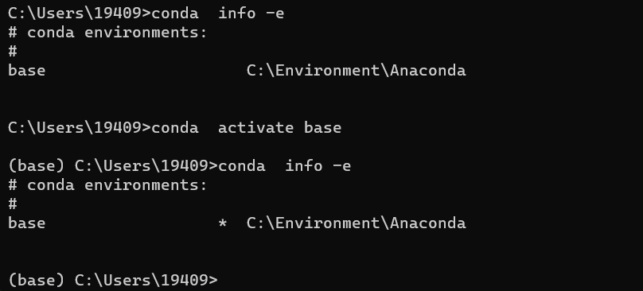
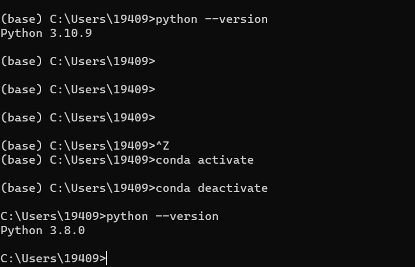

# Anaconda

## conda和anaconda区别

Anaconda是一个**软件发行版**。软件发行版是一个预先建立和配置好的packages的集合，可以被安装在操作系统上，并被使用。Anaconda是由Anaconda公司开发的，一个包含PyData生态中的核心软件的完全发行版，它包含了Python本身和数百个第三方开源项目的二进制文件，例如conda、numpy、scipy、ipython等。

Conda是一个**包和环境管理工具**。包管理工具是一个用来自动化安装、升级、删除packages的工具。由于Conda拥有“conda install“、”conda update“、”conda remove“等子命令，它完全符合包管理工具的定义。

**Conda只能在conda环境中安装包**，但是可以安装各种语言、各种类型的包。

所以说，如果我们希望在一个已有的系统Python环境中安装Python包，conda是帮不了我们的，因为它只能在conda环境中安装包。

## anaconda安装和使用

**anaconda安装成功后，配置一下环境变量**

### 创建conda环境

**创建虚拟环境**

```shell
conda create -n env_name python=3.8
```

**创建虚拟环境并且安装包**

```shell
conda create -n env_name numpy matplotlib python=3.8
```

### 查看有哪些虚拟环境

```shell
conda env list
conda info -e
conda info --envs
```

星号的位置表示我现在在base环境下工作。注意，也有不是显示base而显示root的，root是因为是以系统管理身份作业（?待确认）

### 激活虚拟环境(切换虚拟环境）

使用如下命令即可激活创建的虚拟环境。

```bash
conda activate env_name
```

此时使用python --version可以检查当前python版本是否为所想要的（即虚拟环境的python版本）。

退出虚拟环境：使用如下命令即可退出当前工作的虚拟环境。

```shell
conda activate
conda deactivate
```

有意思的是，以上两条命令只中任一条都会让你回到base environment，它们从不同的角度出发到达了同一个目的地。可以这样理解，activate的缺省值是base，deactivate的缺省值是当前环境，因此它们最终的结果都是回到base





### 删除虚拟环境

执行以下命令可以将该指定虚拟环境及其中所安装的包都删除。
```shell
conda remove --name env_name --all
```
如果只删除虚拟环境中的某个或者某些包则是：
```shell
conda remove --name env_name  package_name
```
### 导出环境 
很多的软件依赖特定的环境，我们可以导出环境，这样方便自己在需要时恢复环境，也可以提供给别人用于创建完全相同的环境。

```shell
#获得环境中的所有配置(myenv 为环境的名字)
conda env export --name myenv > myenv.yml
#重新还原环境
conda env create -f  myenv.yml
```

## 包（Package）的管理

### 查询看当前环境中安装了哪些包

```bash
conda list
```

查询当前Anaconda repository中是否有你想要安装的包

```bash
conda search package_name
```

当然与互联网的连接是执行这个查询操作乃至后续安装的前提条件

### 包的安装和更新
在当前（虚拟）环境中安装一个包：

```shell
conda install package_name
```
当然也可以如上所述在创建虚拟环境的同时安装包，但是并不建议。安装完一个包后可以执行`conda list`确认现在列表中是否已经包含了新安装的包。

也可以以以下命令安装某个特定版本的包(以下例为安装0.20.3版本的numpy)：
```shell
conda install numpy=0.20.3
```
可以用以下命令将某个包更新到它的最新版本 ：
```shell
conda update numpy
```
安装包的时候可以指定从哪个channel进行安装，比如说，以下命令表示不是从缺省通道，而是从conda_forge安装某个包。
```shell
conda install pkg_name -c conda_forge
```
### conda卸载包

```shell
conda uninstall package_name
```
这样会将依赖于这个包的所有其它包也同时卸载。

如果不想删除依赖其当前要删除的包的其他包：
```shell
conda uninstall package_name --force
```
但是并不建议用这种方式卸载，因为这样会使得你的环境支离破碎。

### 清理anaconda缓存

```shell
conda clean -p      # 删除没有用的包 --packages
conda clean -t      # 删除tar打包 --tarballs
conda clean -y -all # 删除所有的安装包及cache(索引缓存、锁定文件、未使用过的包和tar包)
```

## Python版本的管理
除了上面在创建虚环境时可以指定python版本外，Anaconda基环境的python版本也可以根据需要进行更改。

将版本变更到指定版本
```shell
conda install python=3.5
```
更新完后可以用以下命令查看变更是否符合预期。
```shell
python --version
```
将python版本更新到最新版本
如果你想将python版本更新到最新版本，可以使用以下命令：
```shell
conda update python
```