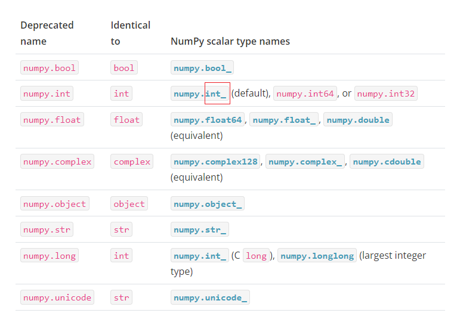

# CodeError

## numpy has no attribute int

**yolov5训练时报错AttributeError: module ‘numpy‘ has no attribute ‘int‘**

module 'numpy' has no attribute 'int'.
原因：np.int 在 NumPy 1.20 中已弃用，在 NumPy 1.24 中已删除

在训练YOLO模型时突然发现这个报错，后来发现是numpy版本问题，yolo官方给的是大于等于1.18.5，当你执行pip install -r requirements.txt命令时，他默认安装为1.24，但是在numpy版本更新时numpy.int在NumPy 1.20中已弃用，在NumPy 1.24中已删除。

重新安装numpy

```
pip uninstall numpy
pip install numpy==1.22
```

yolov5中pip install numpy==1.22默认安装的1.22.0，与其他包版本有冲突，建议直接运行pip install numpy 1.22.4==


