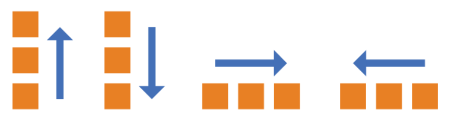

# Flex布局

## 容器属性

- flex-direction
- flex-wrap
- flex-flow
- justify-content
- align-items
- align-content

###  flex-direction属性

**以下6个属性设置在容器上**

flex-direction属性决定主轴的方向（即项目的排列方向）。

```css
.box {
  flex-direction: row | row-reverse | column | column-reverse;
}
```



它可能有4个值。

> - row（默认值）：主轴为水平方向，起点在左端。
> - row-reverse：主轴为水平方向，起点在右端。
> - column：主轴为垂直方向，起点在上沿。
> - column-reverse：主轴为垂直方向，起点在下沿。

### flex-wrap属性

默认情况下，项目都排在一条线（又称”轴线”）上。flex-wrap属性定义，如果一条轴线排不下，如何换行。


```css
.box{
  flex-wrap: nowrap | wrap | wrap-reverse;
}
```

它可能取三个值。

（1）nowrap（默认）：不换行。


（2）wrap：换行，第一行在上方。


（3）wrap-reverse：换行，第一行在下方。


### flex-flow

flex-flow属性是flex-direction属性和flex-wrap属性的简写形式，默认值为row nowrap。

```css
.box {
  flex-flow: <flex-direction> <flex-wrap>;
}
```

### justify-content属性

justify-content属性定义了项目在主轴上的对齐方式。

```css
.box {
  justify-content: flex-start | flex-end | center | space-between | space-around;
}
```


它可能取5个值，具体对齐方式与轴的方向有关。下面假设主轴为从左到右。

> - flex-start（默认值）：左对齐
> - flex-end：右对齐
> - center： 居中
> - space-between：两端对齐，项目之间的间隔都相等。
> - space-around：每个项目两侧的间隔相等。所以，项目之间的间隔比项目与边框的间隔大一倍。

### align-items属性

align-items属性定义项目在交叉轴上如何对齐。

```cs
.box {
  align-items: flex-start | flex-end | center | baseline | stretch;
}
```


它可能取5个值。具体的对齐方式与交叉轴的方向有关，下面假设交叉轴从上到下。

> - flex-start：交叉轴的起点对齐。
> - flex-end：交叉轴的终点对齐。
> - center：交叉轴的中点对齐。
> - baseline: 项目的第一行文字的基线对齐。
> - stretch（默认值）：如果项目未设置高度或设为auto，将占满整个容器的高度。

### align-content属性

align-content属性定义了多根轴线的对齐方式。如果项目只有一根轴线，该属性不起作用。

```css
.box {
  align-content: flex-start | flex-end | center | space-between | space-around | stretch;
}
```


该属性可能取6个值。

> - flex-start：与交叉轴的起点对齐。
> - flex-end：与交叉轴的终点对齐。
> - center：与交叉轴的中点对齐。
> - space-between：与交叉轴两端对齐，轴线之间的间隔平均分布。
> - space-around：每根轴线两侧的间隔都相等。所以，轴线之间的间隔比轴线与边框的间隔大一倍。
> - stretch（默认值）：轴线占满整个交叉轴。

## 项目的属性

### order属性

order属性定义项目的排列顺序。数值越小，排列越靠前，默认为0。

```css
.item {
  order: <integer>;
}
```


### flex-grow属性

flex-grow属性定义项目的放大比例，默认为0，即如果存在剩余空间，也不放大。**(有剩余空间可以放大)**

```css
.item {
  flex-grow: <number>; /* default 0 */
}
```


如果所有项目的flex-grow属性都为1，则它们将等分剩余空间（如果有的话）。如果一个项目的flex-grow属性为2，其他项目都为1，则前者占据的剩余空间将比其他项多一倍。

### flex-shrink属性

flex-shrink属性定义了项目的缩小比例，默认为1，即如果空间不足，该项目将缩小。**（无剩余空间会缩小）**

```css
.item {
  flex-shrink: <number>; /* default 1 */
}
```


如果所有项目的flex-shrink属性都为1，当空间不足时，都将等比例缩小。如果一个项目的flex-shrink属性为0，其他项目都为1，则空间不足时，前者不缩小。

负值对该属性无效。

### flex-basis属性

flex-basis属性定义了在分配多余空间之前，项目占据的主轴空间（main size）。浏览器根据这个属性，计算主轴是否有多余空间。它的默认值为auto，即项目的本来大小。

```css
.item {
  flex-basis: <length> | auto; /* default auto */
}
```

它可以设为跟width或height属性一样的值（比如350px），则项目将占据固定空间。

### flex属性

flex属性是flex-grow, flex-shrink 和 flex-basis的简写，默认值为0 1 auto。后两个属性可选。

```css
.item {
  flex: none | [ <'flex-grow'> <'flex-shrink'>? || <'flex-basis'> ]
}
```

该属性有两个快捷值：auto (1 1 auto) 和 none (0 0 auto)。

建议优先使用这个属性，而不是单独写三个分离的属性，因为浏览器会推算相关值。

### align-self属性

align-self属性允许单个项目有与其他项目不一样的对齐方式，可覆盖align-items属性。默认值为auto，表示继承父元素的align-items属性，如果没有父元素，则等同于stretch。

```css
.item {
  align-self: auto | flex-start | flex-end | center | baseline | stretch;
}
```

