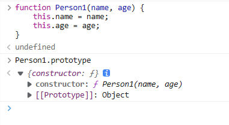
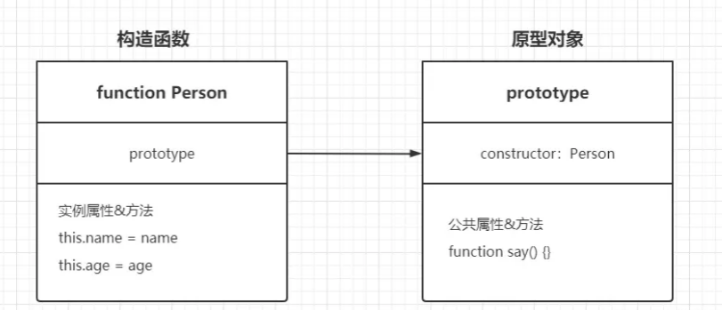
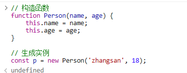
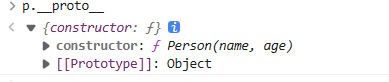
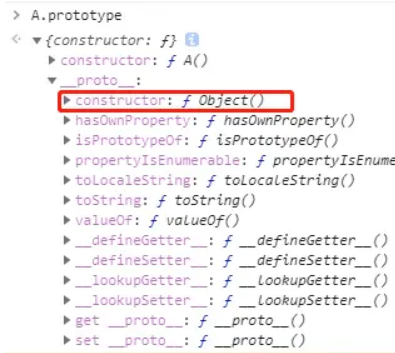
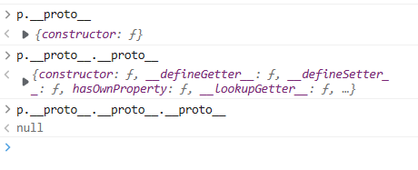
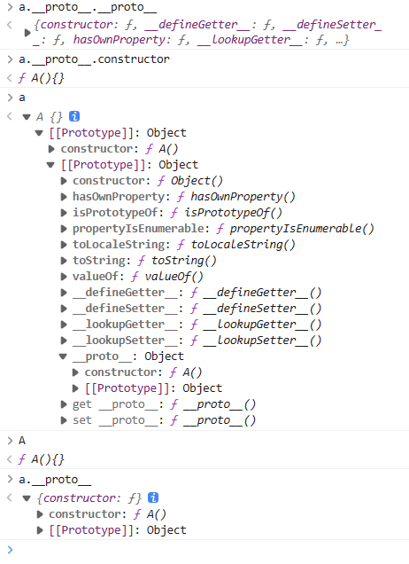
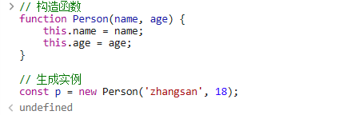
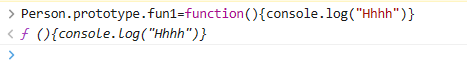
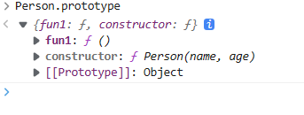

# Proxy

**Proxy** 对象用于创建一个对象的代理，从而实现基本操作的拦截和自定义（如属性查找、赋值、枚举、函数调用等）。

代理模式：当用户不方便直接访问一个对象或者不满足需要时，提供一个替身对象来控制这个对象的访问，用户**实际访问**的是**替身对象**

关键：代理对象和本体都对外提供了 **某个行为【方法】**，通过代理分层，**将不同的行为和主体分离的思想**

# 原型

## JS原型

众所周知，JS的复杂类型都是对象类型（**Object**），而JS不是一门完全面向对象编程的语言，所以如何涉及继承机制，就是一个问题。

### 构造函数

因为JS中没有类（**Class**）这个概念，所以JS的设计者使用了`构造函数`来实现继承机制。

> ES6中的`class`可以看作只是一个语法糖，它的绝大部分的功能，ES5都可以做到，新的`class`写法只是让原型的写法更加的清晰、更像面向对象编程的语法而已。

```js
// 构造函数
function Person(name, age) {
    this.name = name;
    this.age = age;
}

// 生成实例
const p = new Person('zhangsan', 18);

```

如上述代码所示，JS通过`构造函数`来生成`实例`。但是又出现了一个新的问题，在`构造函数`中通过`this`赋值的属性或者方法，是每个实例的`实例属性`以及`实例方法`，无法共享公共属性。所以又设计出了一个`原型对象`，来存储这个`构造函数`的公共属性以及方法。

### 构造函数创建一个实例的过程

1. 创建一个新对象
2. 将构造函数的作用域赋值给新对象（这样this就指向了新对象）
3. 执行构造函数中的代码（为新对象添加实例属性和实例方法）
4. 返回新对象

### 原型对象（prototype）

说了这么久，终于说到了JS的`原型对象`了。JS的每个函数在创建的时候，都会生成一个属性`prototype`，这个属性指向一个对象，这个对象就是此函数的`原型对象`。该`原型对象`中有个属性为`constructor`，指向该函数。这样`原型对象`和`它的函数`之间就产生了联系。





## JS原型链

讲清楚了JS的`原型对象`，来就是介绍JS的`原型链`了。既然有了`构造函数`，那么就可以通过该`构造函数`，来创建一个实例对象了。此时，完善一下我们的`Preson`构造函数

```javascript
    // 构造函数
    function Preson(name, age) {
      this.name = name;
      this.age = age;
    }
    // 所有实例共享的公共方法
    Preson.prototype.say = function (word) {
      console.log(`${this.name}说：${word}`);
    }

    const p1 = new Preson('张三', 18); // 创建一个Person实例对象
    p1.hasOwnProperty('say') // false 说明不是定义在其本身上的
    p1.say('hello world'); // 调用公共方法 打印：张三说：hello world

```

这里就要思考了，为什么我们构造的`p1`这个`实例对象`，它可以调用到`Person`这个`构造函数`的`原型对象`上的方法呢？明明只有在`构造函数`内部通过`this`来赋值的属性或者方法才会被实例所继承，为什么在`构造函数`的`原型对象`上定义的`say`方法也能通过实例来调用到呢？这里就引出了`原型链`这个概念。

### 实例对象指向原型对象的属性（\_\_proto__）

每个通过`构造函数`创建出来的`实例对象`，其本身有个属性`__proto__`，这个属性会指向该`实例对象`的`构造函数`的`原型对象`，这么说好像有点绕，我们看下图

**不是组合，是指向**，都可以通过属性访问到函数的原型对象


现在我们知道了，当访问一个`对象`的某个属性时，会先在这个对象本身属性上查找，如果没有找到，则会通过它的`__proto__`隐式属性，找到它的`构造函数`的`原型对象`。**如果还没有找到就会再在其`构造函数`的`原型对象`的`__proto__`中查找**，这样一层一层向上查找就会形成一个链式结构，我们称为`原型链`。

`构造函数`的`prototype`也是一个对象，该对象上也会有\_\_proto__属性

类的实例会有一个\_\_proto__属性指向的是类的构造函数的原型对象（构造函数就是function Person）







**注意点**：如果通过`p1实例对象`的`__proto__`属性赋值，则会改变其`构造函数`的`原型对象`，从而被所有实例所共享。

```javascript
    // 构造函数
    function Preson(name, age) {
      this.name = name;
      this.age = age;
    }
    // 所有实例共享的公共方法
    Preson.prototype.say = function (word) {
      console.log(`${this.name}说：${word}`);
    }

    const p1 = new Preson('张三', 18); // 创建一个Person实例对象
    const p2 = new Preson('李四', 20); // 新创建一个Proson实例对象
    p1.say('hello world'); // 调用公共方法
    p1.hasOwnProperty('say') // false 说明不是定义在其本身上的
    p1.__proto__.do = function () {
      console.log('往原型对象中添加方法');
    }
    p2.do(); // 打印出了-往原型对象中添加方法

```

> 所以，我们在开发的时候，要注意不要通过`实例对象`去改变其`构造函数`的`原型对象`，这样会对其他通过该`构造函数`生成的`实例对象`造成影响。

### 原型链的尽头

既然我们之前构造的`p1实例对象`有`__proto__`属性指向其`构造函数`的`原型对象`，那么该`构造函数`的`原型对象`有这个`__proto__`属性吗？如果有，那么其又指向谁呢？我们不妨打印一下。


我们随便创建了一个`A`的`构造函数`，通过打印它的`prototype`属性，我们可以看到，在浏览器中，它有个`__proto__`属性指向了一个`Object`对象。


>
>**函数具有prototype属性**




而进一步展开后，我们会发现，该对象的`构造函数`为`function Object`，我们由此可以得知，**所有的`原型对象`的`__proto__`属性都是指向`function Object`的`原型对象`。** 而`function Object`的`原型对象`在上图中我们可以得知是不存在`__proto__`这个属性的，它指向了`null`。我们就得知了`原型链`的尽头是`null`。

## prototype 继承

所有的 JavaScript 对象都会从一个 prototype（原型对象）中继承属性和方法：

- `Date` 对象从 `Date.prototype` 继承。
- `Array` 对象从 `Array.prototype` 继承。
- `Person` 对象从 `Person.prototype` 继承。

所有 JavaScript 中的对象都是位于原型链顶端的 Object 的实例。

**原型链的解释**

JavaScript 对象有一个指向一个原型对象的链。当试图访问一个对象的属性时，它不仅仅在该对象上搜寻，还会搜寻该对象的原型，以及该对象的原型的原型，依次层层向上搜索，直到找到一个名字匹配的属性或到达原型链的末尾。

`Date` 对象, `Array` 对象, 以及 `Person` 对象从 `Object.prototype` 继承





**可以发现**：对象A的原型包括了constructor和A原型的原型。发现A原型的原型中没有再包括原型，且A原型的原型包括的constructor是继承自Object类的，说明A的原型的构造函数是Object()。

## 自行研究

**创建函数，生成实例**



**在函数的原型上，加入function fun1**



**再次打印出原型**



可以发现原型中多了func1方法。
