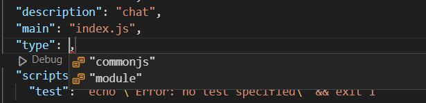

## 代码规范

### CommonJS

CommonJS 是一种规范，它定义了如何在 JavaScript 中创建模块，它最早出现在 Node.js 中。CommonJS 规范是基于 ES5 的语法和特性的，而 ES6 则是在 CommonJS 规范之后出现的。但是，ES6 也提供了新的模块语法，它可以用来替代 CommonJS 规范。虽然两者在语法和实现上有所不同，但是它们的目的都是为了解决 JavaScript 中模块化的问题。

### ES6
ES6（也称为 ECMAScript 2015）是 JavaScript 的一个重要版本，它引入了许多新的语法和特性，使得 JavaScript 更加现代化和强大。ES6 规范被广泛采用，并成为了 JavaScript 代码编写的主流标准。

ES6 引入了一些新的语法特性，如箭头函数、模板字符串、解构赋值、扩展运算符等等，这些新的特性使得 JavaScript 代码更加易读易写，同时还引入了一些新的数据类型和数据结构，如 Set、Map、Promise 等等，这些新的数据类型和数据结构使得 JavaScript 更加强大和灵活。

ES6 也提供了新的模块语法，它可以用来替代 CommonJS 规范，以更加清晰和简单的方式定义模块。模块是独立的、可重复使用的代码块，可以被导入和导出。ES6 的模块语法可以让 JavaScript 开发者更加轻松地构建大型、复杂的应用程序。

总之，ES6 规范对于 JavaScript 的发展和进步起到了重要的推动作用，许多新的语法和特性被广泛采用，成为了 JavaScript 编写的主流标准。

### 两者区别

1. 变量绑定：CommonJS 是使用 `require` 导入模块时，会将模块中的变量赋值给一个变量，而该变量与模块中的变量是绑定关系，即修改该变量的值会影响模块中的变量；而 ES6 是使用 `import` 导入模块时，会将模块中的变量赋值给一个常量，而该常量与模块中的变量是只读关系，即无法修改常量的值。
2. 异步加载：ES6 支持异步加载模块，即可以在需要时再去加载模块，而 CommonJS 不支持异步加载，必须在导入模块前将其加载完成。
3. 静态分析：ES6 的模块化是静态分析的，即在编译时就可以确定模块的依赖关系和输出内容，而 CommonJS 的模块化是动态运行的，即在运行时才能确定模块的依赖关系和输出内容。

综上所述，CommonJS 和 ES6 在语法和特性上有一些不同，需要根据具体情况来选择使用哪一种模块化规范。如果是在浏览器环境下，建议使用 ES6 模块化规范，而在 Node.js 环境下，可以使用 CommonJS 或者 ES6 模块化规范。

## Node使用规范

### node项目中，使用commonJS规范还是使用ES6规范

**简单的说 Node.js 就是运行在服务端的 JavaScript，利用JavaScript在服务端进行编程。**Node.js是一个让JavaScript运行在服务器端的开发平台，它让JavaScript的触角伸到了服务器端，可以与PHP、JSP、Python、Ruby平起平坐。

在Node.js中，你可以使用CommonJS规范或者ES6规范来编写JavaScript代码。

使用CommonJS规范时，你可以使用 `require()` 函数来导入模块，使用 `module.exports` 或 `exports` 对象来导出模块

使用ES6规范时，你可以使用` import` 和` export` 关键字来导入和导出模块。

### 使用CommonJs规范

**我想使用commonJS规范，请问node 环境应该如何初始化，比如在package.json文件应该怎么修改**

如果你想在 Node.js 环境中使用 CommonJS 规范，你无需对 `package.json` 文件进行修改。只需按照以下步骤初始化你的 Node.js 项目：

1. 创建项目目录并进入该目录，例如：

   ```shell
   mkdir myproject
   cd myproject
   ```

2. 在该目录中初始化 Node.js 项目，可以使用以下命令：

   ```shell
   npm init
   ```

   执行此命令后，会提示你输入一些项目相关的信息，例如项目名称、描述、版本、作者等等。最后，它将在该目录中创建一个 `package.json` 文件，其中包含你输入的所有信息。

3. 在你的项目代码中使用 CommonJS 规范，例如：

   ```js
   express = require('express');
   const app = express();
   ```

   在这个例子中，我们使用 `require` 函数加载 `express` 模块，并将它赋值给一个变量 `express`。这里的 `require` 函数就是 CommonJS 规范中定义的模块加载函数。

总之，对于 Node.js 项目来说，CommonJS 规范是默认的模块系统，你只需要按照上述步骤初始化你的项目，并使用 `require` 函数加载模块即可。

### 使用ES6规范

如果你想在 Node.js 中使用 ES6 规范，与使用 CommonJS 规范不同，需要进行一些额外的设置。（其实只需要将package.json文件的type改成module即可）

以下是在 Node.js 中使用 ES6 规范的步骤：

1. 初始化项目并创建 `package.json` 文件，同样使用 `npm init` 命令。

2. 安装 Babel 编译器，它可以将 ES6 代码转换为 ES5 代码。你可以使用以下命令来安装 Babel：

   ```shell
   npm install --save-dev @babel/core @babel/cli @babel/preset-env
   ```

   这里安装了 `@babel/core`、`@babel/cli` 和 `@babel/preset-env` 三个包。`@babel/core` 是 Babel 的核心库，`@babel/cli` 是 Babel 的命令行工具，`@babel/preset-env` 是 Babel 的一个预设，它可以根据目标环境自动确定需要转换的功能。

3. 在项目根目录下创建一个名为 `.babelrc` 的文件，并在其中指定使用 `@babel/preset-env` 预设。例如：

   ```json
   {
     "presets": ["@babel/preset-env"]
   }
   ```

   这个文件告诉 Babel 使用 `@babel/preset-env` 预设来转换代码。

4. 在代码中使用 ES6 语法。例如：

   ```js
   import express from 'express';
   const app = express();
   ```

   这里使用了 ES6 的 `import` 语法，它可以替代 CommonJS 的 `require` 函数。需要注意的是，使用 `import` 语法需要在代码中添加 `"type": "module"` 字段，或者在命令行中加上 `--experimental-modules` 参数，以启用 ES6 模块。

5. 使用 Babel 编译代码。可以使用以下命令来编译代码：

   ```shell
   npx babel src -d dist
   ```

   这里假设你的源代码在 `src` 目录下，编译后的代码将输出到 `dist` 目录下。你可以根据实际情况修改这些路径。

6. 在 Node.js 中运行编译后的代码。例如：

   ```shell
   node dist/index.js
   ```

   这里假设你的入口文件为 `index.js`，它在 `dist` 目录下。

总之，使用 ES6 规范需要进行一些额外的设置，例如安装 Babel 编译器、添加 `.babelrc` 文件、使用 `import` 语法等等。不过，这样可以让你在代码中使用更加现代的语法和特性，提高开发效率和代码可读性。

### 在nodeJS中使用ES6规范的package.json

```shell
# 新建一个工程目录；
mkdir project && cd project
# 初始化当前模块信息
npm init
#如果是ES6规范的话，在type处加入"type": "module"
#如果是commonJS规范的话，不用添加，默认就是commonJS规范
```



```json
{
  "name": "chat",
  "version": "1.0.0",
  "description": "chat",
  "main": "index.js",
  "type": "module",
  "scripts": {
    "test": "echo \"Error: no test specified\" && exit 1"
  },
  "author": "Aerial",
  "license": "ISC",
  "dependencies": {
    "node-fetch": "^3.3.1"
  }
}

```

## 浏览器使用规范 

### 使用ES6规范

浏览器本身并不支持 CommonJS 规范，而是支持 ES6 规范的模块化。在浏览器中，我们可以使用 `<script type="module">` 标签来加载 ES6 模块，例如：

```html
<!DOCTYPE html>
<html>
  <head>
    <meta charset="UTF-8">
    <title>My ES6 Module</title>
  </head>
  <body>
    <script type="module" src="main.js"></script>
  </body>
</html>
```

在上面的代码中，我们使用 `<script type="module">` 标签来加载一个名为 `main.js` 的 ES6 模块。在这个模块中，我们可以使用 `import` 和 `export` 关键字来定义模块的导入和导出。

在一些旧版本的浏览器中，可能还不支持 ES6 的模块化，这时我们可以使用一些工具来将 ES6 的模块化语法转换成浏览器可以识别的代码，例如使用 Babel 或者 Webpack 等工具。

### 使用commonJS模块

在浏览器中，如果你想要加载 CommonJS 模块，你需要使用一些工具来将 CommonJS 的模块化语法转换成浏览器可以识别的代码。例如使用 Browserify 或者 Webpack 等工具。

在使用 Browserify 或者 Webpack 等工具时，你需要创建一个入口文件来引入你的模块，例如：

```js
// index.js
const myModule = require('./myModule');

// 使用 myModule
myModule.doSomething();
```

在上面的代码中，我们使用 CommonJS 的 `require` 方法来加载一个名为 `myModule` 的模块。这个模块可以是一个本地的 JavaScript 文件，也可以是一个从 npm 仓库中安装的第三方库。

然后，我们可以使用 `myModule` 对象来访问这个模块导出的方法或变量。

然后，你需要使用 Browserify 或者 Webpack 等工具将你的代码打包成一个浏览器可以识别的 JavaScript 文件，例如：

```shell
browserify index.js -o bundle.js
```

上面的命令会将 `index.js` 文件和它所依赖的模块打包成一个名为 `bundle.js` 的文件，你可以将这个文件通过 `<script>` 标签引入到 HTML 文件中：

```html
<!DOCTYPE html>
<html>
  <head>
    <meta charset="UTF-8">
    <title>My CommonJS Module</title>
  </head>
  <body>
    <script src="bundle.js"></script>
  </body>
</html>
```

这样就可以在浏览器中使用 CommonJS 模块了。

## WebPack

**webpack可以给commonJS项目打包吗**

是的，webpack 可以给使用 CommonJS 规范编写的 Node.js 项目进行打包。webpack 本身是一个模块打包工具，它支持多种模块规范，包括 **CommonJS、ES6、AMD、UMD **等。

如果你想使用 webpack 对 CommonJS 项目进行打包，你需要在 webpack 配置文件中进行相应的配置。首先，你需要指定入口文件和出口文件，以告诉 webpack 应该从哪里开始打包和打包后应该生成哪个文件。

**webpack.config.js**

```js
const path=require('path')

module.exports={
    mode:'production',
    entry:path.resolve(__dirname,"./index.cjs"),
    output:{
        path:path.resolve(__dirname,'./build'),
        filename:"demo.js"
    },
    module:{
        rules:[
            {
                test: /\.js$/,
                exclude: /node_modules/,
                use: ['babel-loader']
            }
        ]
    }
}
```

## Babel

Babel 是一个 JavaScript 编译器，用于将 ECMAScript 2015+ 版本的代码转换为向后兼容的 JavaScript 代码，以便在不支持 ES2015+ 特性的浏览器和环境中运行。

ES2015（也称为 ES6）是 JavaScript 语言的重大更新，引入了许多新的语法和特性，例如箭头函数、类、解构赋值、let 和 const 关键字、模板字符串等等。这些新特性可以大大提高 JavaScript 的编程体验和可读性，但是由于浏览器的兼容性问题，这些新特性不是所有浏览器和环境都支持。

Babel 可以帮助开发者将使用了 ES2015+ 特性的 JavaScript 代码转换成 ES5 的代码，从而使这些代码在所有主流浏览器中都能够运行。Babel 会将新特性转换成等价的 ES5 代码，包括将新语法转换成老语法，将新 API 转换成老 API 等等。同时，Babel 也支持许多插件和预设，可以根据开发者的需要进行定制。

除了将 ES2015+ 特性转换成 ES5 代码之外，Babel 还支持许多其他功能，例如 TypeScript、JSX、Flow 等等。这些功能都可以通过插件和预设进行配置。

总之，Babel 是一个非常重要的工具，它让开发者可以放心使用最新的 JavaScript 特性，而不必担心浏览器兼容性问题。

## WebPack内置了对babel的支持

是的，Webpack 内置了对 Babel 的支持。Webpack 的官方文档中提到，Webpack 的主要作用是将各种资源打包成一个 JavaScript 文件，而 Babel 则是一个 JavaScript 编译器，它可以将 ES6+ 的代码转换为浏览器能够理解的 ES5 代码。

Webpack 默认支持解析和编译一些最新的 JavaScript 语言特性，如 ES6/ES2015 的模块语法、箭头函数、类等，但是对于某些新语法（如 async/await）或新的 API（如 Promise）可能需要额外的编译器或插件支持。

如果你需要使用 Babel 来编译你的 JavaScript 代码，你可以在 Webpack 的配置文件**webpack.config.js**中添加以下配置：

```js
module.exports = {
  // ...
  module: {
    rules: [
      {
        test: /\.js$/,
        exclude: /node_modules/,
        use: {
          loader: "babel-loader",
          options: {
            presets: ["@babel/preset-env"]
          }
        }
      }
    ]
  }
};
```

上面的配置中，我们使用了 `babel-loader`，这是一个能够让 Webpack 能够处理 Babel 编译过程的 loader，它会将所有匹配 `test` 条件的文件进行编译。

然后，我们配置了 `@babel/preset-env` 作为 Babel 的预设，它能够根据你的代码中使用的语法自动确定需要编译的语言特性，并且仅编译你的目标浏览器不支持的语言特性。这样可以使编译后的代码更加高效。

注意，为了使用这个配置，你需要先安装 `babel-loader` 和 `@babel/preset-env`：

```shell
npm install --save-dev babel-loader @babel/core @babel/preset-env
```

并且在**.babelrc文件**中写入以下信息

```js
{
    // "presets":[
    //     "@babel/preset-env"
    // ],
    "presets": [
        ["@babel/preset-env", {
          "targets": {
            "browsers": [ "ie >= 8", "chrome >= 62" ]
          }      
        }]
    ],
    "plugins":[]
}
```

这样运行webpack命令，就可以在webpack中使用babel命令

## 运行JS环境

JavaScript 是一种通用的脚本语言，可以在许多不同的环境中运行。下面列举了一些常见的环境：

1. Web 浏览器：最常见的运行 JavaScript 的环境，JavaScript 通常用于增强网站的交互性和动态性，比如实现动画效果、表单验证等等。
2. Node.js 环境：Node.js 是一个基于 Chrome V8 引擎的 JavaScript 运行时环境，可以让 JavaScript 代码在服务器端运行。它为 JavaScript 提供了许多服务器端相关的功能和模块，如文件系统模块、网络模块、数据库模块等等。
3. 移动应用程序：许多移动应用程序都采用了 JavaScript 技术，例如 Apache Cordova、React Native 等框架，它们可以将 JavaScript 代码转换成原生的移动应用程序。
4. 桌面应用程序：一些桌面应用程序也采用了 JavaScript 技术，例如 Electron、nw.js 等框架，它们可以将 JavaScript 代码转换成本地的桌面应用程序。
5. IoT 设备：JavaScript 还可以运行在一些 IoT 设备中，例如 Raspberry Pi、Arduino 等。

总之，JavaScript 的灵活性和可移植性使得它在各种不同的环境中都有广泛的应用。
