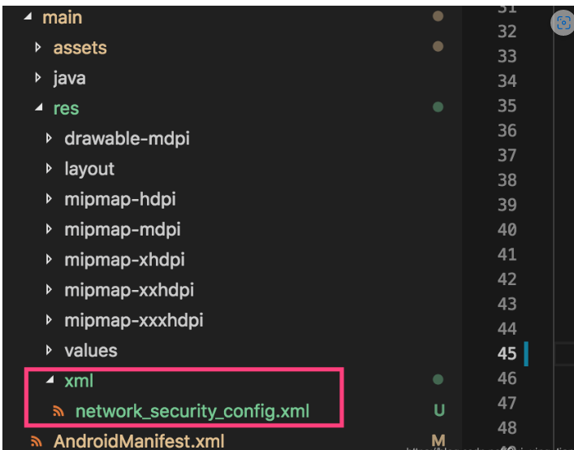
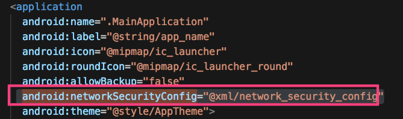

## ReactNative 发布签名APK

### 生成一个签名密钥

```shell
keytool -genkeypair -v -storetype PKCS12 -keystore my-release-key.keystore -alias my-key-alias -keyalg RSA -keysize 2048 -validity 10000
```
**这里把前两个密码都设置成123456即可**

### 设置gradle变量

在 React Native 项目中，`android/app` 目录下的 `build.gradle` 文件和`android `目录下的 `gradle.properties` 文件可以用来配置应用程序的构建过程。

`build.gradle` 文件包含了一些构建任务和依赖项的定义，比如编译版本、构建类型、签名配置、依赖项等。你可以在这个文件中添加自定义的构建脚本或修改默认配置。

`gradle.properties` 文件用来定义一些 Gradle 的配置属性。例如，你可以在这个文件中定义应用程序的版本号、应用程序的名字等。

### 开始

如果你需要自定义构建过程，可以修改这些文件中的配置，从而达到你想要的效果。

1. 把my-release-key.keystore文件放到你工程中的android/app文件夹下。
2. 编辑项目目录/android/gradle.properties文件

```text
MYAPP_RELEASE_STORE_FILE = my-release-key.keystore 
 
MYAPP_RELEASE_KEY_ALIAS = my-key-alias 
 
MYAPP_RELEASE_STORE_PASSWORD = 123456 
 
MYAPP_RELEASE_KEY_PASSWORD = 123456
```

### 把签名配置加入到项目的 gradle 配置中
编辑 项目目录/android/app/build.gradle文件，添加如下的签名配置

```text
...
android {
    ...
    defaultConfig { ... }
    signingConfigs {
        release {
          storeFile file("my-release-key.keystore")
          storePassword "123456"
          keyAlias "my-key-alias"
          keyPassword "123456"
        }
    }
    buildTypes {
        release {
            ...
            signingConfig signingConfigs.release
        }
    }
}
...
```

```chatgpt
android {
    ...
    defaultConfig {
        ...
        // 添加以下内容
        signingConfigs {
            release {
                storeFile file("my-release-key.keystore")
                storePassword "密钥库密码"
                keyAlias "密钥别名"
                keyPassword "密钥密码"
            }
        }
        buildTypes {
            release {
                ...
                // 添加以下内容
                signingConfig signingConfigs.release
            }
        }
    }
}

```

### 生成发行 APK 包

```bash
$ cd android 

$ ./gradlew assembleRelease
```

生成的 APK 文件位于android/app/build/outputs/apk/release/app-release.apk，它已经可以用来发布了。

## rn访问http 的 api请求

**android9.0默认禁止访问不安全的请求，比如http。**

第一步：在res下新增加一个xml目录，然后创建一个名为network_security_config.xml文件

如下图：



文件内容如下：

```xml
<?xml version="1.0" encoding="utf-8"?>
<network-security-config>
    <base-config cleartextTrafficPermitted="true" />
</network-security-config>
```

第二步：

在androidManifiest.xml文件中添加

```javascript
android:networkSecurityConfig="@xml/network_security_config"
```

