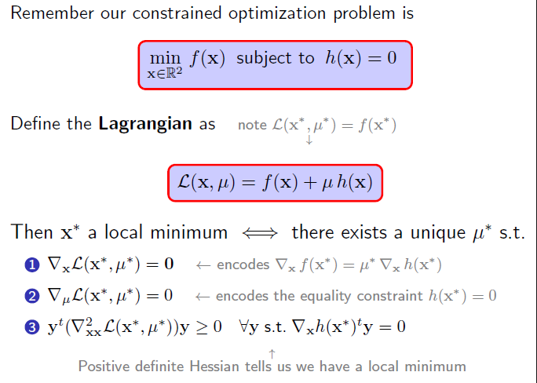

## 凸函数和非凸函数

**凸函数（Convex Function）**和**非凸函数（Non-Convex Function）**在数学优化、经济学、机器学习等领域具有重要意义。理解它们的性质有助于更好地分析和解决各种优化问题。

---

### **凸函数**

- 在一个向量空间（通常是实数向量空间）中，集合$C$被称为**凸集**，如果对于集合中任意两个点$x, y \in C$和任意的实数$\theta \in [0, 1]$，满足下述条件：

  $θx+(1−θ)y∈C\theta x + (1 - \theta) y \in Cθx+(1−θ)y∈C$

  - **直线段**：在二维平面中的一条直线段是凸集，因为连接直线段上任意两点的线段仍然在这条直线上。

  - **平面**：二维平面上的一个闭合圆盘是凸集，因为圆盘内任意两点的连接线段仍然在圆盘内部。

  - **空间中的球体**：三维空间中的一个球体是凸集，因为球体内部任意两点的连接线段也都在球体内部。

- 表达式 **$ f: C \rightarrow \mathbb{R}$ **是数学中的一种函数表示法，描述了一个从集合  $C $ 到实数集合  $\mathbb{R}$  的函数 $ f $。

在一个实数向量空间中的一个函数$f: C \rightarrow \mathbb{R}$，其中$C$是一个凸集，如果对于任意的$x, y \in C$和任意的$\theta \in [0,1]$，满足以下不等式：

$$
f(\theta x + (1 - \theta) y) \leq \theta f(x) + (1 - \theta) f(y)
$$

则称$f$为**凸函数**。

#### **几何解释**

这个定义意味着，连接函数图像上两点$(x, f(x))$和$(y, f(y))$的线段位于函数图像之上或与其重合。换句话说，函数的图像是“向上凸起”的。

#### **性质**

1. **局部极小即全局极小**：对于凸函数，任何局部最小值也是全局最小值。
2. **次微分**：凸函数在凸集内的每一点都有次微分，这对优化算法非常有用。
3. **凸组合保凸性**：凸函数的非负加权和仍然是凸函数。

#### **示例**

- 二次函数$f(x) = x^2$在$\mathbb{R}$上是凸的。
- 指数函数$f(x) = e^x$也是凸的。

---

### **非凸函数**

#### **定义**

如果一个函数不满足凸函数的定义，即存在$x, y \in C$和$\theta \in (0,1)$使得：

$$
f(\theta x + (1 - \theta) y) > \theta f(x) + (1 - \theta) f(y)
$$

则称$f$为**非凸函数**。

#### **几何解释**

这意味着存在至少一段，连接函数图像上两点的线段位于函数图像之下，表现为函数图像有“凹陷”或“波动”。

#### **性质**

1. **多重局部极小值**：非凸函数可能有多个局部最小值，这使得优化变得复杂。
2. **优化难度**：由于存在多个局部极值点，找到全局最小值可能非常困难，需要复杂的优化算法。

#### **示例**

- 三次函数$f(x) = x^3 - 3x$在$\mathbb{R}$上是非凸的。
- 正弦函数$f(x) = \sin(x)$也是非凸的。

---

### **应用与重要性**

- **优化问题**：在优化问题中，目标函数的凸性决定了问题的复杂度。凸优化问题通常更容易解决，有成熟的算法和理论支持。

- **机器学习**：许多机器学习模型的损失函数是凸的，如线性回归、逻辑回归，这使得训练过程更稳定和高效。然而，深度学习中的损失函数通常是非凸的，增加了训练的难度。

- **经济学**：凸性在消费者和生产者理论中也扮演着重要角色，例如，偏好的凸性反映了消费者对多样性的偏好。

---

**总结**：凸函数具有良好的数学性质，尤其是在优化领域，可以保证局部最小值即为全局最小值，使得求解过程更加简洁明了。而非凸函数虽然更复杂，但在实际应用中也非常常见，需要更加复杂和精巧的算法来处理。

## 凸优化条件

### 目标函数的最陡下降方向

在无约束优化问题中，函数 $f(x)$ 在某一点 $x$ 处的最陡下降方向就是梯度的反方向：

$$
d = -\nabla f(x)
$$

换句话说，梯度 $\nabla f(x)$ **总是指向函数值增长最快的方向**，而它的反方向则是最快下降的方向。

但如果加入约束 $h(x) = 0$，我们不能随便选方向下降，而必须**沿着约束面移动**，否则就会离开可行区域。

### 约束的法向量

约束 $h(x) = 0$ 的梯度 $\nabla h(x)$ **指向约束面的法线方向**。  
几何上，它描述的是约束面的“垂直方向”，即任何想要**离开约束面**的方向。

例如：
- 如果 $h(x) = x_1^2 + x_2^2 - 1$ 是一个单位圆，则
  
  $$
  \nabla h = (2x_1, 2x_2)
  $$
  
  在点 $(1,0)$，它的梯度是 $(2,0)$，指向 $x$ 轴正方向，即**垂直于圆的方向**。

- 任何满足 $h(x) = 0$ 的可行移动方向，必须在**约束面的切空间**内，即任何可行方向 $v$ 都要满足：
  
  $$
  \nabla h(x)^T v = 0
  $$
  
  这意味着 $v$ 不能有指向法线的分量，而只能在切平面内。

### 为什么最陡下降方向不完全沿着约束面

因为梯度 $\nabla f(x)$ 可能**不是完全沿着约束的切平面方向**。  
换句话说，$\nabla f(x)$ 可以分解成：

$$
\nabla f(x) = \text{(切向分量)} + \text{(法向分量)}
$$

- 如果梯度 $\nabla f(x)$ 有法向分量，那说明最陡下降方向会**偏离约束面**，这显然不行，因为必须保持在 $h(x) = 0$ 上。
- 但是，切向分量可以用于沿着约束面下降。

这就是为什么在最优点，$\nabla f(x)$ **不能有切向分量，否则就可以继续沿着切平面下降**，说明还没达到最优点。

因此，最优点处梯度 $\nabla f(x^*)$ 只能沿着法向方向，即：

$$
\nabla f(x^*) = \mu^* \nabla h(x^*)
$$

其中 $\mu^*$ 是拉格朗日乘子。