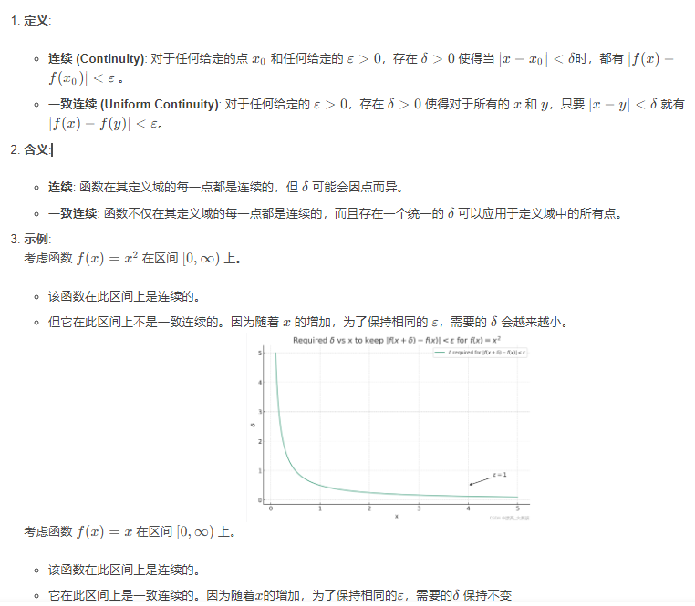
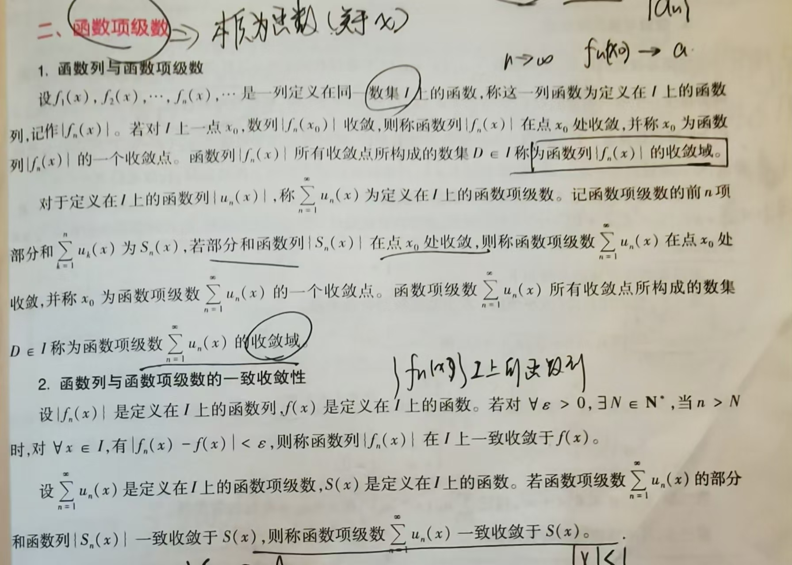
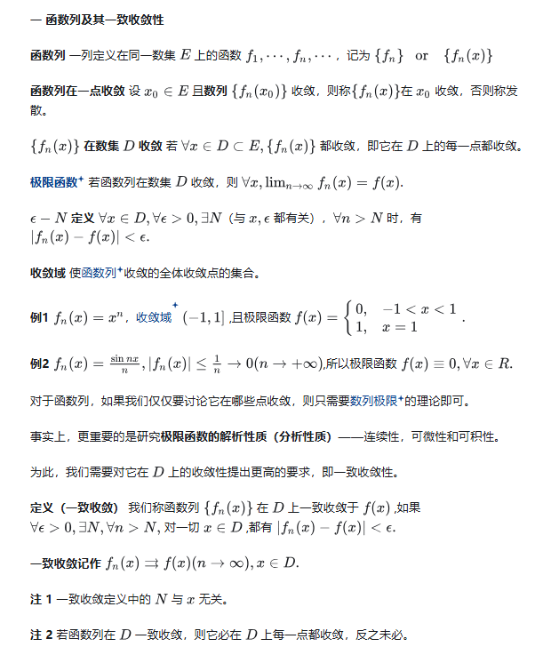
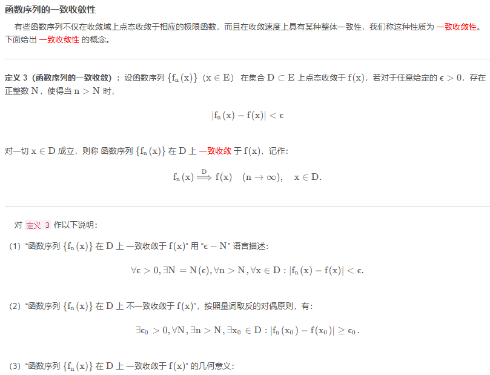
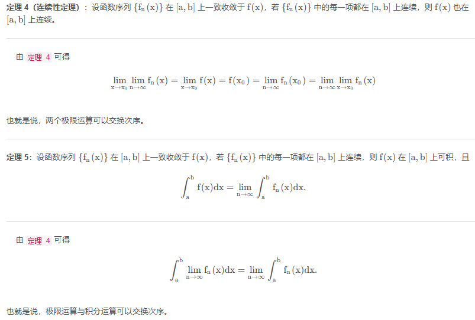
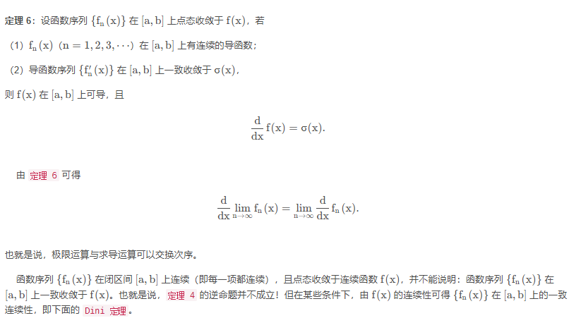
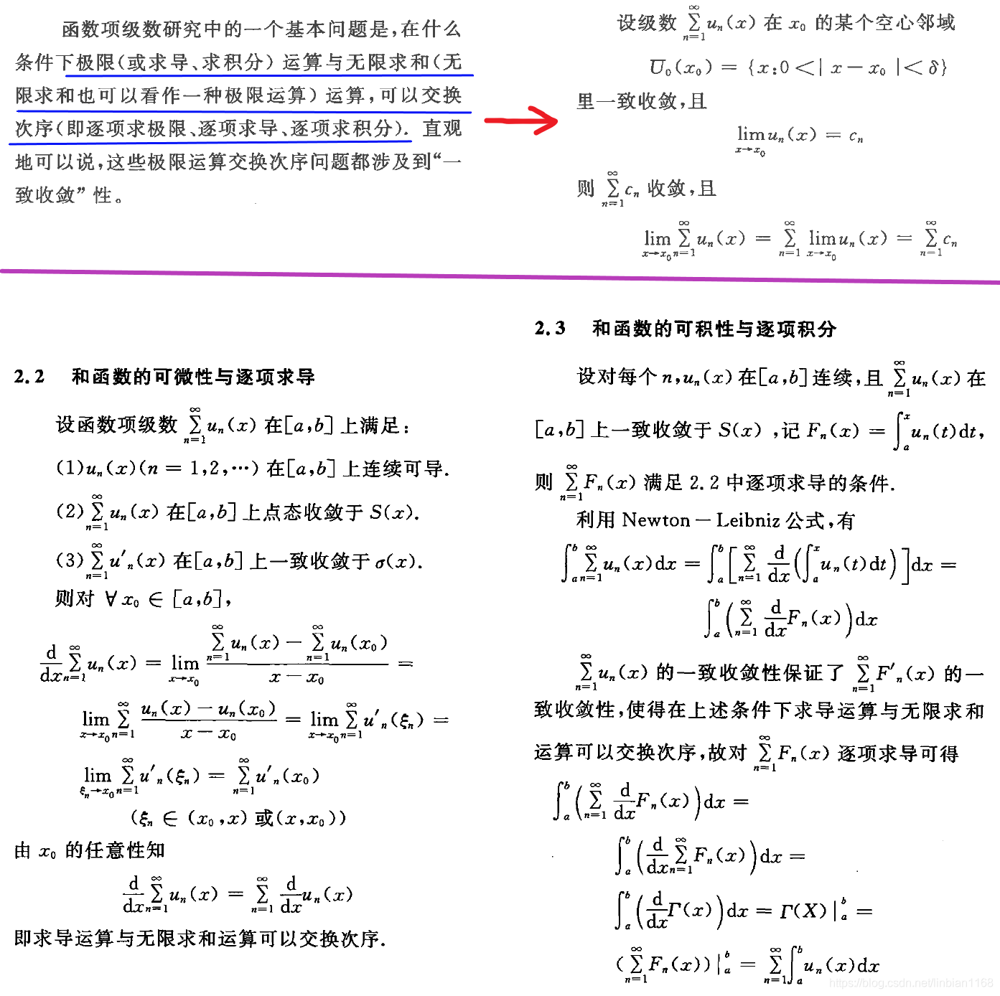

## 一致收敛

### 函数的一致连续

一致连续 (Uniform Continuity) 和连续 (Continuity) 都是描述函数连续性的概念，但它们的定义和含义有所不同。以下是它们的主要区别：

- 一致连续性确保了函数在其整个定义域上的行为是有一定的“一致性”的，而不是在某些地方变化得很快。
- 一致连续的函数在闭区间上一定是连续的，但反之不一定成立。

总的来说，连续性关注的是函数在单个点上的行为，而一致连续性关注的是函数在整个定义域上的行为。

### 函数列的一致收敛

#### 函数序列

#### 极限函数

#### 函数序列的一致收敛性

几何意义：对任意给定的$ϵ>0$,存在正整数$N$,当$n>N$时,曲线$y=f_n(x)$都将落在以曲线$y=f(x)−ϵ$与$y=f(x)+ϵ$为边的带状区域

#### 一致收敛的函数序列的性质

### 一致收敛对级数的影响

