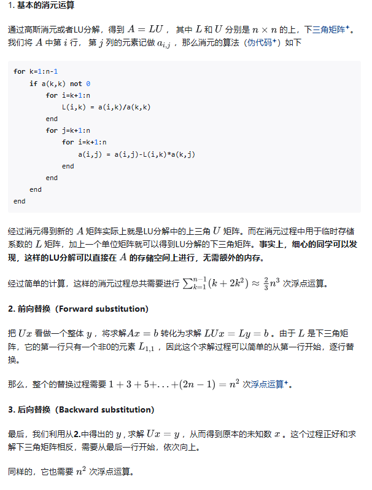
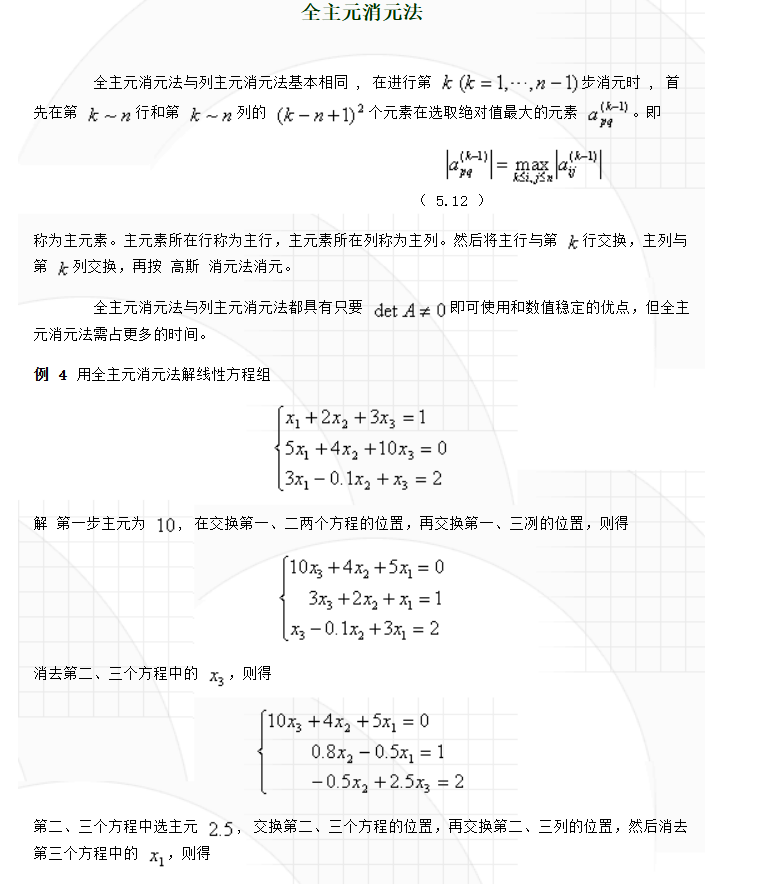
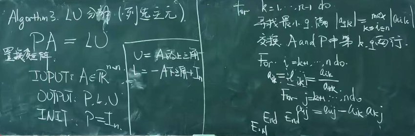
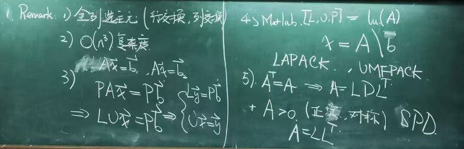
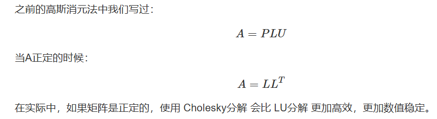

# 高斯消元

## backward和forward 

经过消元得到新的 A 矩阵实际上就是LU分解中的上三角 $U$ 矩阵。而在消元过程中用于临时存储系数的 $L$ 矩阵，加上一个单位矩阵就可以得到$LU$分解的下三角矩阵。**事实上，细心的同学可以发现，这样的$LU$分解可以直接在** $A$ **的存储空间上进行，无需额外的内存**。

这样看起来，我们把求解一个线性方程组的问题转化成了一个$LU$分解和求解两个线性方程组，但是由于 $L$ 和 $U$ 都是三角矩阵，它们的求解过程非常简单，因此整个过程的总体运算复杂度始终是由$LU$分解所主导，即为 $O(n^3) $。

## 列选主元

**具体操作步骤**（全列选主元法）

**列选主元法类似于先对A进行 行变换，再对矩阵进行LU分解**

**Remark**

因为这是 partial pivoting(枢轴上旋转)，还有一种 total pivoting，就是不仅仅只考虑行的交换，比如我们为了得到最大的a~11~, 我们也把列的交换也考虑上。

因为有行交换的原因，所以严格写会是：

**A=PLU**

