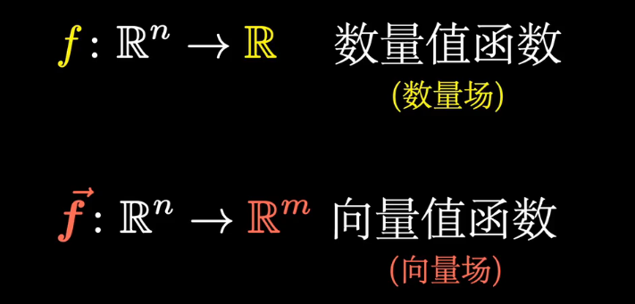
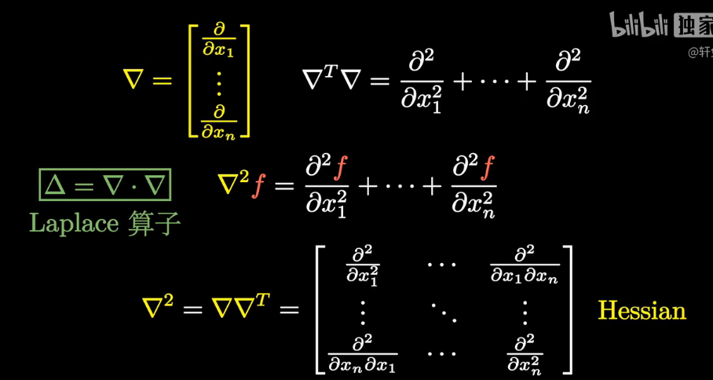
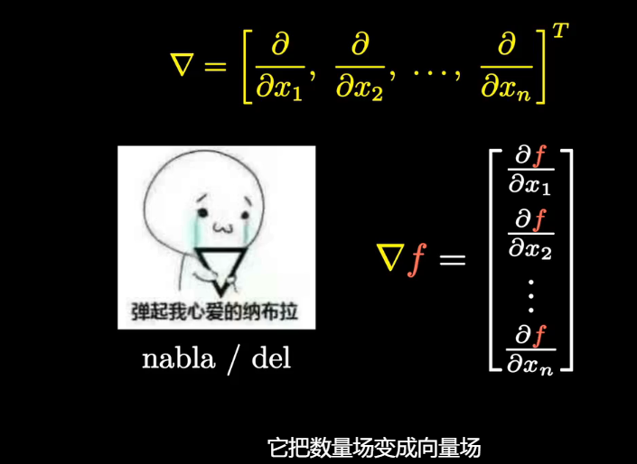

# 梯度，散度，旋度

## 算子

**函数的分类=>所以函数也叫场**

**数学中的算子**：在数学中，算子（operator）通常是一个作用于函数或向量空间元素的规则。例如，导数算子 $\frac{d}{dx}$ 就是一个典型的算子，它将函数转换为其导数。积分、线性变换等也可以看作算子。**可以将函数变为函数**

广义的讲，对任何函数进行某一项操作都可以认为是一个算子，甚至包括求幂次，开方都可以认为是一个算子，只是有的算子我们用了一个符号来代替他所要进行的运算罢了，所以大家看到算子就不要纠结，他和$f(x)$的$f$没区别，它甚至和加减乘除的基本运算符号都没有区别，只是他可以对单对象操作罢了

## 微分算子（Differential Operator）

微分算子是数学中的一个重要工具，用来描述函数变化的规律。在微积分中，它的主要作用是表示函数的导数，即反映一个函数的变化率。微分算子可以作用于标量函数或向量函数，并且可以推广到更复杂的函数空间中。

常见的微分算子包括：

### 一阶导数算子

一阶导数算子 $ \frac{d}{dx} $：这是最基础的微分算子，表示函数关于某个变量 $x$ 的一阶导数。即：

$$
\frac{d}{dx} f(x) = \lim_{\Delta x \to 0} \frac{f(x + \Delta x) - f(x)}{\Delta x}
$$

### 偏导数算子

偏导数算子 $ \frac{\partial}{\partial x} $：用于多变量函数中，表示函数对某个变量的偏导数。例如，对于 $ f(x, y) $：

$$
\frac{\partial f}{\partial x} = \lim_{\Delta x \to 0} \frac{f(x + \Delta x, y) - f(x, y)}{\Delta x}
$$

### Nabla 算子$\nabla$

Nabla 算子$\nabla$，也称为 Del 算子，是一个重要的微分算子，广泛应用于数学和物理学中。它由哈密尔顿引入，用于表示梯度、散度、旋度等。下面是 Nabla 算子的定义和主要应用。

Nabla 算子通常表示为 $ \nabla $ 或 $ \vec{\nabla} $，定义为一个向量微分算子：

$$
\nabla = \left( \frac{\partial}{\partial x}, \frac{\partial}{\partial y}, \frac{\partial}{\partial z} \right)
$$

它表示了在三维空间中对每个坐标轴进行偏导数的操作。

### 拉普拉斯算子

拉普拉斯算子 $ \nabla^2 $ 或 $ \Delta $：是一种二阶微分算子，用于标量场的分析。它常用于物理学中的热传导方程、电势方程等。对于三维标量场 $ \phi(x, y, z) $，拉普拉斯算子定义为：

$$
\nabla^2 \phi = \frac{\partial^2 \phi}{\partial x^2} + \frac{\partial^2 \phi}{\partial y^2} + \frac{\partial^2 \phi}{\partial z^2}
$$

### 梯度算子

梯度算子 $ \nabla $：表示标量函数的梯度，是一个向量场，表示函数在空间中的最大变化方向。对于标量场 $ f(x, y, z) $，梯度算子定义为：

$$
\nabla f = \left( \frac{\partial f}{\partial x}, \frac{\partial f}{\partial y}, \frac{\partial f}{\partial z} \right)
$$

### 散度算子

散度算子 $ \nabla \cdot $：用于描述向量场的散度，表示场在某点的“源”或“汇”的程度。对于三维向量场 $ \mathbf{F} = (F_x, F_y, F_z) $，散度定义为：

$$
\nabla \cdot \mathbf{F} = \frac{\partial F_x}{\partial x} + \frac{\partial F_y}{\partial y} + \frac{\partial F_z}{\partial z}
$$

### 旋度算子

旋度算子 $ \nabla \times $：用于描述向量场的旋度，表示场的旋转特性。对于向量场 $ \mathbf{F} = (F_x, F_y, F_z) $，旋度定义为：

$$
\nabla \times \mathbf{F} = \left( \frac{\partial F_z}{\partial y} - \frac{\partial F_y}{\partial z}, \frac{\partial F_x}{\partial z} - \frac{\partial F_z}{\partial x}, \frac{\partial F_y}{\partial x} - \frac{\partial F_x}{\partial y} \right)
$$

微分算子在物理学、工程学和计算机科学中有广泛的应用，如流体力学、电磁学、量子力学等。

**总结**

## 外积（Cross Product）

外积（Cross Product）主要定义在三维空间中，对于两个三维向量 $\mathbf{a}$ 和 $\mathbf{b}$，其外积定义为：

$$
\mathbf{a} \times \mathbf{b} = \left( a_2 b_3 - a_3 b_2, a_3 b_1 - a_1 b_3, a_1 b_2 - a_2 b_1 \right)
$$

其中 $\mathbf{a} = (a_1, a_2, a_3)$ 和 $\mathbf{b} = (b_1, b_2, b_3)$。

**特点**

- **结果**：外积的结果是一个新的向量，该向量垂直于 $\mathbf{a}$ 和 $\mathbf{b}$ 所在的平面。
- **大小**：外积的大小等于 $\mathbf{a}$ 和 $\mathbf{b}$ 所夹平行四边形的面积。
- **方向**：由右手法则确定方向。

## 广义外积（Generalized Cross Product）

**广义外积**是外积在更高维空间中的推广。对于两个 $n$ 维向量 $\mathbf{a}$ 和 $\mathbf{b}$，其外积生成一个矩阵：

$$
\mathbf{a} \wedge \mathbf{b} = \begin{bmatrix}
a_1 b_1 & a_1 b_2 & \cdots & a_1 b_n \\
a_2 b_1 & a_2 b_2 & \cdots & a_2 b_n \\
\vdots & \vdots & \ddots & \vdots \\
a_n b_1 & a_n b_2 & \cdots & a_n b_n
\end{bmatrix}
$$

**特点**

- **结果**：结果是一个高维张量，而不是单一的向量或矩阵。
- **应用**：广泛用于高维几何、代数拓扑、物理学中的张量运算等领域。

## 梯度

梯度算子（$\nabla$）是一个向量微分算子，用来描述标量场的空间变化。简单来说，梯度算子应用于一个标量函数时，会生成一个向量函数，指向该函数增长最快的方向，其大小代表函数在该方向上的变化率。

### 梯度算子的定义

对于一个标量函数  $f(x, y, z)$ ，梯度算子 $\nabla$ 作用在该函数上得到其梯度，表示为：
$
\nabla f = \left( \frac{\partial f}{\partial x}, \frac{\partial f}{\partial y}, \frac{\partial f}{\partial z} \right)
$
其中：

- $\frac{\partial f}{\partial x}$ 是函数  $f$  对  $x $ 方向的偏导数，
- $\frac{\partial f}{\partial y}$ 是函数  $f$  对  $y $ 方向的偏导数，
- $\frac{\partial f}{\partial z}$ 是函数  $f $ 对  $z $ 方向的偏导数。

这个向量表示函数  $f $ 在每个方向的变化率。

**物理意义**

梯度算子有着广泛的物理意义。它不仅表示函数在不同方向上的变化，还表明了该函数在某点处变化最快的方向。比如：
- 在**温度场**中，梯度表示温度变化最快的方向，向量的大小表示变化的速率。
- 在**高度场**中，梯度指向陡峭的方向，也就是山坡最陡的地方。

### 符号表示

梯度算子的符号是 $\nabla$，也称为 “del” 运算符。这个符号通常与偏导数相结合，在标量场上产生一个向量场。

#### 二维标量场

对于一个二维的标量函数 $ f(x, y) $，梯度表示为：
$
\nabla f = \left( \frac{\partial f}{\partial x}, \frac{\partial f}{\partial y} \right)
$
这表示函数  $f $ 在  $x $ 和 $ y $ 方向上的变化。

#### 三维标量场

对于三维标量函数  $f(x, y, z) $，梯度表示为：
$
\nabla f = \left( \frac{\partial f}{\partial x}, \frac{\partial f}{\partial y}, \frac{\partial f}{\partial z} \right)
$

### 总结

梯度算子是一个向量微分算子，表示标量场在空间中的变化。它的作用是给出一个向量，指示标量场在该点变化最快的方向，并描述变化的速率。

## 散度

## 旋度

