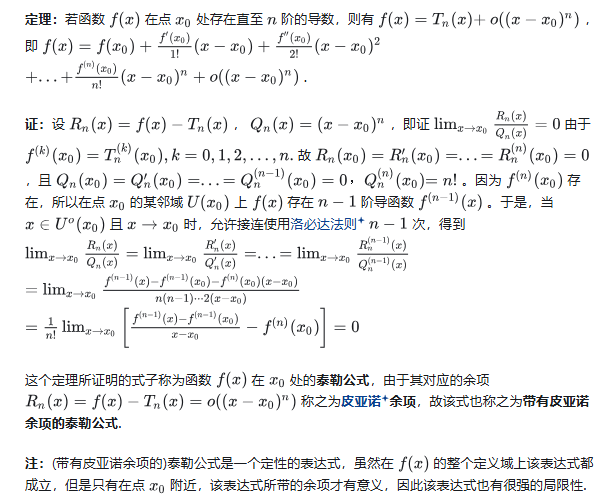
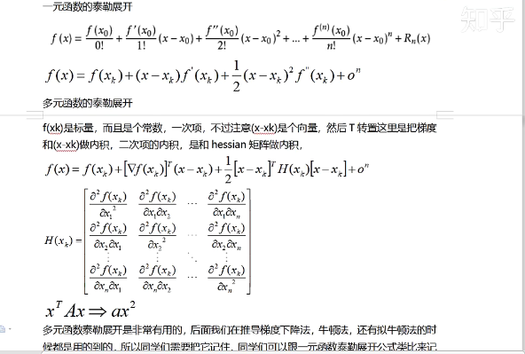
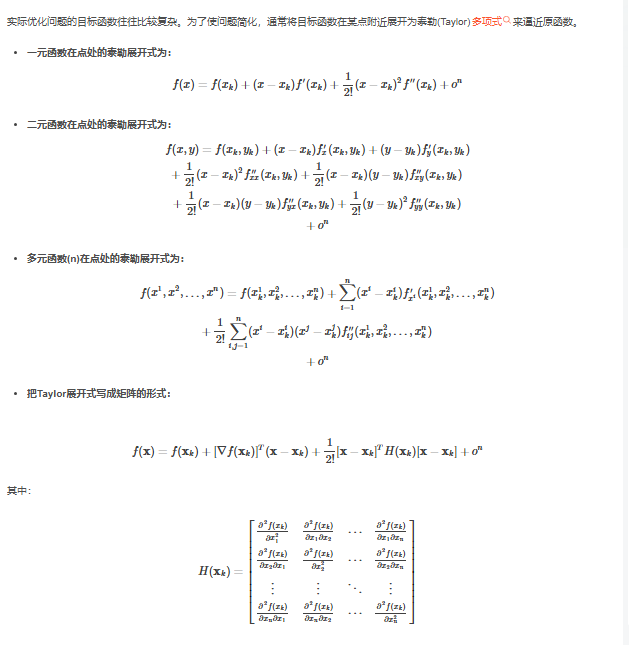
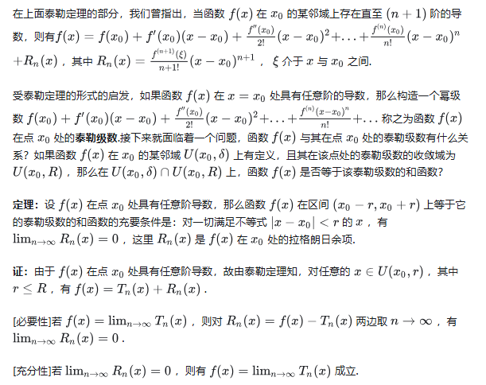
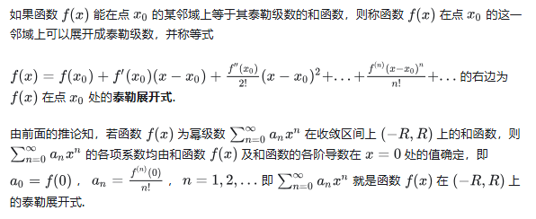

## 泰勒公式

即在点 $x_0$ 附近，我们可以用一次多项式函数 $f(x_0)+f^′(x_0)(x−x_0)$ 来逼近函数 $f(x)$ ，其误差为 $(x−x_0)$ 的高阶无穷小量，有些时候，这样的逼近方式是粗糙的，即逼近的误差较大，于是我们很自然的想到能否让更高次的 n 次多项式去逼近函数 f(x) ，使得误差为 $o((x−x_0)^n)$ 。

所以我们可以使用泰勒公式去逼近某一个函数

### 皮亚诺余项

### 多元函数的泰勒公式

## 泰勒级数

## 泰勒展开式

