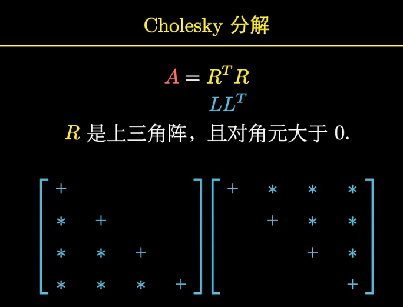
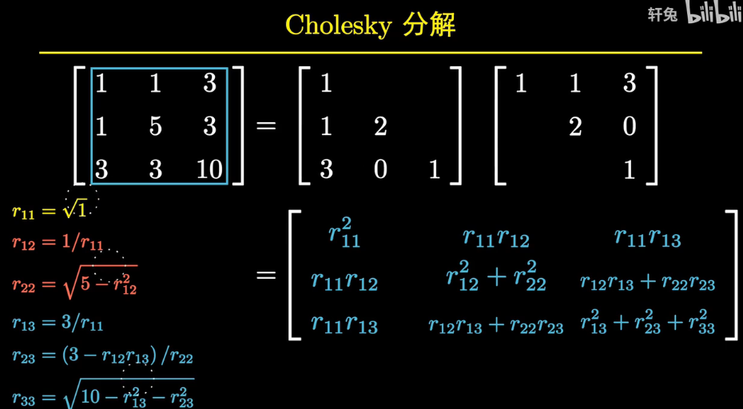
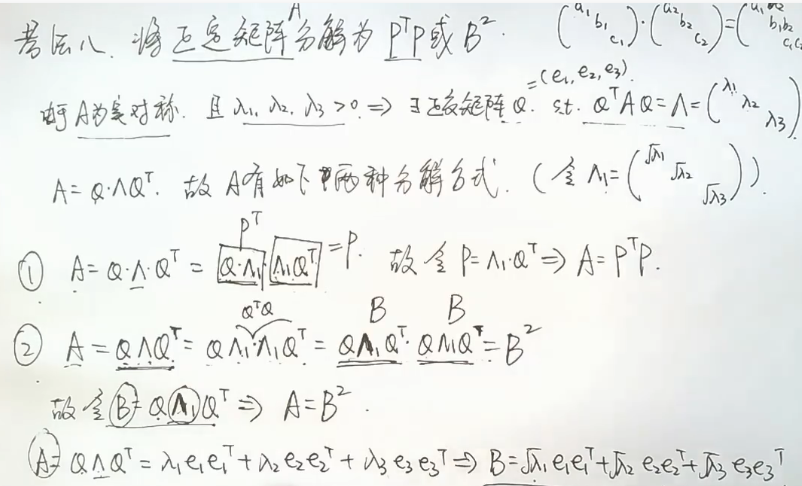
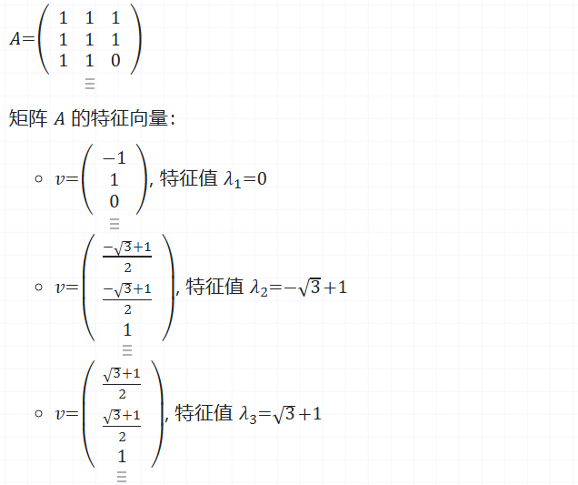

## 正定矩阵

### 正定矩阵的分解 Cholesky分解--解决LU分解问题

**分解是唯一的**

### 正定矩阵分解成P^T^P

## 半正定矩阵

### 广义定义

定义1 设A是n阶方阵，如果对任何非零向量X，都有X'A*X≥0*，其中*X'*表示X的转置，就称A为**半正定矩阵**。

### 狭义定义(SPD matrix)

定义2 设A为实对称矩阵，若对于每个非零实向量*X*，都有X*'AX≥*0，则称A为**半正定矩阵**，称X'AX为半正定二次型。（其中，X'表示*X*的转置。）
- $$ A^T = A $$
- $$ x^T A x >= 0 \quad \text{for all} \quad x \neq 0 $$

### 1. 主子式（Principal Minor）

主子式是指通过从矩阵中选取某些行和列得到的子矩阵的行列式。例如，从一个 n 矩阵中选择任意 k 行和对应的 k 列（不一定是最左上角的那些行和列），然后对这个子矩阵计算行列式。这就是主子式。

### 2. 顺序主子式（Leading Principal Minor）

顺序主子式是一个更特殊的主子式，它是指从左上角开始，逐步增加行和列，得到的各个子矩阵的行列式。例如，考虑一个 n×n 矩阵，顺序主子式是指第1阶、第2阶，直到第 n 阶的从左上角开始的子矩阵的行列式。

==**顺序主子式非负并不能推出矩阵是半正定的。**==

### 反例：

考虑以下矩阵 $A$：

$
A = \begin{pmatrix}
1 & 1 & 1 \\
1 & 1 & 1 \\
1 & 1 & 0
\end{pmatrix}
$

#### 1. 计算顺序主子式：

- **1阶顺序主子式**： 
  $\det(A_1) = 1$

- **2阶顺序主子式**（前两行前两列的子矩阵）： 
  $\det(A_2) = \det\begin{pmatrix}
  1 & 1 \\
  1 & 1
  \end{pmatrix} = (1 \times 1) - (1 \times 1) = 0$

- **3阶顺序主子式**（整个矩阵的行列式）： 
  $\det(A_3) = \det\begin{pmatrix}
  1 & 1 & 1 \\
  1 & 1 & 1 \\
  1 & 1 & 0
  \end{pmatrix} = 0$

可以看到，1阶主子式非负，2阶主子式和3阶主子式也非负。因此，矩阵的顺序主子式都是非负的。

#### 2. 检查矩阵的特征值：

### 结论：

虽然矩阵 $A$ 的所有顺序主子式都是非负的，但由于它有一个负的特征值（$\lambda_3 = -\sqrt3+1$），因此它不是半正定矩阵。这说明顺序主子式非负并不能保证矩阵是半正定的。

这个反例清楚地展示了顺序主子式非负和矩阵半正定性之间的区别。