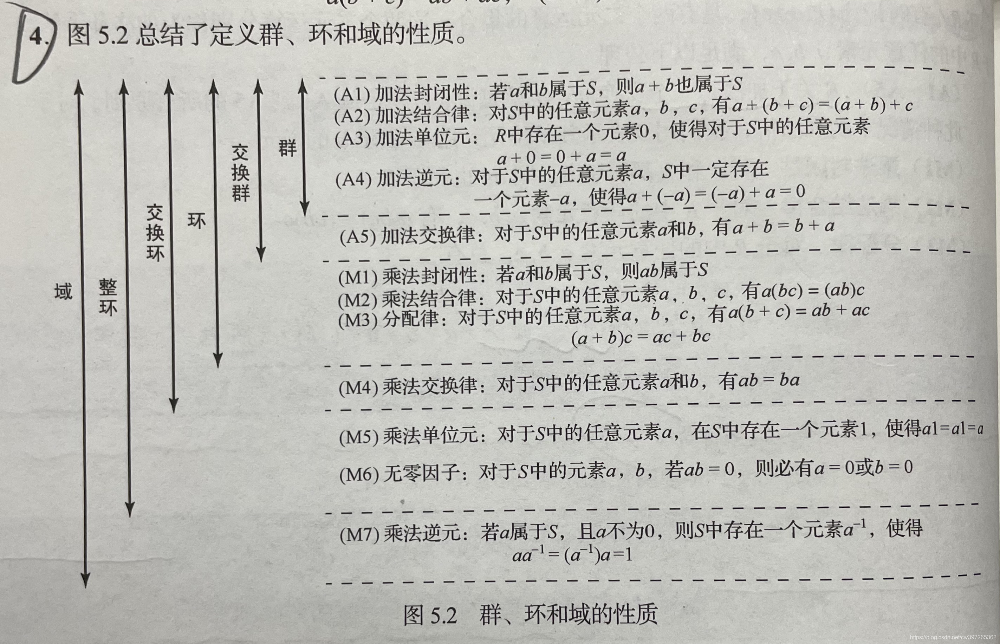

# 群环域

```text
数集是给定集合，通常是自定义的任意集合。
数系是特殊集合，通常是约定俗成的，比如有自然数，正整数等等。
数集中任意两数的和差积商仍在数集中，则数集即为数域。通常用到的只有有理数域、实数域、复数域三个。当然也有其它的，但比较边缘，一般是用不到的。
```

## 代数系统

非空集合 $ A $ 和 $ A $ 上 $ k $ 个一元或二元运算 $ f_1, f_2, \ldots, f_k $ 组成的系统称为一个**代数系统**，简称**代数**，记作 $ (A, f_1, f_2, \ldots, f_k) $。

由定义可知，一个代数系统需要满足下面3个条件：

1. 有一个非空集合 $ A $（不一定是数集）;
2. 有一些建立在集合 $ A $ 上的运算;
3. 这些运算在集合 $ A $ 上是封闭的。

有的书上对代数系统定义时不要运算的封闭性，而是把具有封闭性的代数系统定义为一个新的概念——**广群**。

### 运算

运算是代数系统的基本概念。在初等代数中有 $ +, -, \times, \div $ 等四则运算，更进一步有**乘方**、**开方**、**指数**、对数等运算。而将其扩展至**线性代数**，高等代数中有向量运算、矩阵运算及行列式运算等。在这里我们将运算作更为抽象的扩充，使运算不仅包含前面的所有运算，而且还是有更广涵的含义。

我们说：运算是建立在集合 $ S $ 上的 $ n $ 元函数。它可以表示为 $ f: S^n \rightarrow S $。这个 $ f $ 称为 $ n $ 元运算。当 $ n = 1 $ 时称为一元运算，当 $ n = 2 $ 时称为二元运算，而当 $ n \geq 3 $ 时就称为多元运算。

这种运算定义具有广泛的意义。例如，在计算机中字符的拼接、分解等均为运算；“图形”中的放大、缩小及旋转、移动等均为运算。有关扩展性的运算研究，客观世界中包括非数学的多种处理手段均为运算，从而都可以纳入代数系统的讨论范围。因此我们说：运算是对客观世界对象的一种抽象手段与工具。

### 代数系统

有了运算后就可以建立系统。这种系统称为**代数系统**。它由三部分组成：

1. 一个非空集合 $ S $ 。
2. 有 $ k $ 个 $ S $ 上的运算 $ o_1, o_2, \dots, o_k $ 。
3. 运算封闭性——即 $ S $ 中元素经运算后的结果仍在 $ S $ 中。

这三者组成代数系统：$ (S, o_1, o_2, \dots, o_k) $。

代数系统的三个条件给出了一个完整系统的基本对象、加工工具和基本约束。这里所定义的代数系统是一种具有普通意义的表达， 一般常用的是以二元运算为主（元运算较少见，多元运算基本不用），而在一个系统中一般仅包含一个或两个运算为多见。

下面给出一些代数系统的例子。

- **例1** 自然数集 $ N $ 及其 “+” 运算组成代数系统，即 $ (N, +) $ 是代数系统。
- **例2** 实数集 $ R $ 及其运算 “+” 组成代数系统 $ (R, +) $。
- **例3** 有限字母 $ X $ 组成的集合 $ X^* $ 在其上可以构造字母串的组合运算 “∘” ；设 $ \alpha, \beta \in X^* $，则 $ \alpha \circ \beta = \alpha \beta $ ，这样， $ X^* $ 与“∘”所构成的代数系统 $ (X^*, \circ) $ 是代数系统。

代数系统因系统的观点研究数学，将不同集合与运算构成的不同的系统划分为门别类研究。

### 运算规则

代数系统是以运算为中心的一种系统。因此，讨论代数系统首先要讨论运算的规律。运算一般有下面这些主要规律。对 $(S, \circ)$ 有：

1. **结合律**：若 $a, b, c \in S$，则有 $(a \circ b) \circ c = a \circ (b \circ c)$。
2. **交换律**：若 $a, b \in S$，则有 $a \circ b = b \circ a$。
3. **单位元（幺元）**：$S$ 中存在唯一一个元素 $e$，对任意 $a \in S$，必有 $e \circ a = a \circ e = a$，$e$ 称为运算 $\circ$ 的单位(素)。
4. **零元**：$S$ 中存在唯一一个元素 $0$，对任意 $a \in S$，必有 $0 \circ a = a \circ 0 = 0$，$0$ 称为运算 $\circ$ 的零元(素)。
5. **逆元**：对 $S$ 中元素 $a \in S$，若存在唯一一个元素 $a^{-1} \in S$，有 $a \circ a^{-1} = a^{-1} \circ a = e$，$a^{-1}$ 称为 $a$ 的逆元(素)。
6. **对 $(S, \circ, +)$ 有分配律**：若 $a, b, c \in S$，均有：

$$
a \circ (b + c) = (a \circ b) + (a \circ c)
$$

$$
a + (b \circ c) = (a + b) \circ (a + c)
$$

$$
(b + c) \circ a = (b \circ a) + (c \circ a)
$$

$$
(b \circ c) + a = (b + a) \circ (c + a)
$$

则称运算 $\circ$ 与 $+$ 满足分配律。

**例 4**：整数集及其运算 $+$ 所组成的代数系统 $(Z, +)$ 满足结合律、交换律，并存在单位 $0$，且每个整数必有逆元，如 $+3$ 之逆元为 $-3$；$7$ 之逆元为 $-7$；$0$ 的逆元为 $0$ 等。

**例 5**：代数系统 $(Z, \times)$ 满足结合律、交换律，且存在单位 $1$。

## 群

**闭结幺逆**

代数系统 $(G, \circ)$ 如满足结合律、有单位元与逆元，则称为群。 群是代数系统中研究具有一个二元运算的代表性系统。

## 环

代数系统 $(R, +, \circ)$ 如满足 $(R, +)$ 是群，且满足交换律、$(R, \circ)$ 满足结合律、$(R, +, \circ)$ 中 $\circ$ 对 $+$ 满足分配律，则称为环。

环是代数系统中有两个二元运算且运算性质不对称的代表性系统。

在非空集合 $R$ 中，若定义了两种代数运算 $+$ 和 $\times$ （不一定为加与乘），且满足：

1. 集合 $R$ 在 $+$ 运算下构成**群 (group)**。

2. $\times$ 运算在集合 $R$ 下满足结合律，即 $\forall a, b, c \in R$，$(a \times b) \times c = a \times (b \times c)$。$R$ 对 $\times$ 构成一个半群。

3. 对 $+$ 和 $\times$ 有分配律成立，即 $\forall a, b, c \in R$，有：

$$
a \times (b + c) = a \times b + a \times c
$$

$$
(a + b) \times c = a \times c + b \times c
$$

称代数系统 $<R, +, \times >$ 是一个环 (Ring)。在不引起混淆的情况下，简记为 $R$。

$R$ 上加法群的 **幺元** (单位元) 称为 **零元**，记为 $0$，且对 $\forall a \in R$ 有 $a \times 0 = 0 \times a = 0$。

定义 $R$ 的加法群部分的单位元为零元，写作 $0$ ，乘法的部分单位元写作 $e$ ，称为单位元。

### 多项式环

验证一个集合是环（即满足环的定义）通常需要验证两个运算（加法和乘法）在这个集合上满足以下几个条件：

1. **封闭性**：对任意两个元素，运算的结果仍然在集合中。
2. **加法满足交换律**：对任意两个元素 $ f(x) $ 和 $ g(x) $，有 $ f(x) + g(x) = g(x) + f(x) $。
3. **加法满足结合律**：对任意三个元素 $ f(x), g(x), h(x) $，有 $ (f(x) + g(x)) + h(x) = f(x) + (g(x) + h(x)) $。
4. **存在加法单位元（零元）**：存在一个元素 $ 0 $ 使得对任意 $ f(x) $，有 $ f(x) + 0 = f(x) $。
5. **存在加法逆元**：对任意 $ f(x) $，存在 $ -f(x) $ 使得 $ f(x) + (-f(x)) = 0 $。
6. **乘法满足结合律**：对任意三个元素 $ f(x), g(x), h(x) $，有 $ (f(x) \cdot g(x)) \cdot h(x) = f(x) \cdot (g(x) \cdot h(x)) $。
7. **乘法分配律**：对任意 $ f(x), g(x), h(x) $，有 $ f(x) \cdot (g(x) + h(x)) = f(x) \cdot g(x) + f(x) \cdot h(x) $ 以及 $ (f(x) + g(x)) \cdot h(x) = f(x) \cdot h(x) + g(x) \cdot h(x) $。

### 验证多项式环是一个环

假设 $ R[x] $ 是一个以 $ R $ 为系数环的多项式环，$ R[x] $ 中的元素是形如 $ f(x) = a_0 + a_1x + \dots + a_nx^n $ 的多项式，其中 $ a_i $ 属于 $ R $，并且 $ x $ 是一个不定元。

1. **加法封闭性**：两个多项式 $ f(x) $ 和 $ g(x) $ 的和仍然是一个多项式，因此封闭性成立。

2. **加法交换律**：由于系数在 $ R $ 中，而 $ R $ 是一个环，系数的加法满足交换律，所以 $ f(x) + g(x) = g(x) + f(x) $。

3. **加法结合律**：同理，由于 $ R $ 中的加法满足结合律，多项式的加法也满足结合律。

4. **存在加法单位元**：零多项式 $ 0(x) = 0 $ 是加法单位元，对于任意多项式 $ f(x) $，有 $ f(x) + 0(x) = f(x) $。

5. **存在加法逆元**：对任意多项式 $ f(x) $，它的加法逆元是 $ -f(x) $，即每个系数取负号。

6. **乘法封闭性和结合律**：两个多项式的乘积仍然是一个多项式，并且多项式的乘法遵循结合律。

7. **分配律**：多项式的乘法对加法满足分配律，这是由多项式运算的定义决定的。

由于以上所有性质都满足，因此多项式集合 $ R[x] $ 构成一个环。

## 域

域在交换环的基础上，还增加了二元运算除法，要求元素(除零以外)可以作除法运算，即每个非零的元素都要有。

由此可见，域是一种可以进行加减乘除(除0以外)的代数结构，是与四则运算的推广。

整数集合，不存在乘法逆元(1/3不是整数)，所以整数集合不是域。有理数、实数、复数可以形成域，分别叫有理数域、实数域、复数域。

### 数域

设P是由一些复数组成的集合，其中包括0与1，如果P中任意两个数的和、差、积、商（除数不为0）仍是P中的数，则称P为一个数域。

常见数域： 复数域C；实数域R；有理数域Q。

（注意：自然数集N及整数集Z都不是数域。）

说明：

1）若数集P中任意两个数作某一运算的结果仍在P中，则说数集P对这个运算是封闭的。

2）数域的等价定义：如果一个包含0，1在内的数集P对于加法，减法，乘法与除法（除数不为0）是封闭的，则称数集P为一个数域。

## 交换的概念

因为阿贝尔群的群运算满足交换律和结合律，群元素乘积的值与乘法运算时的次序无关。 而群运算不满足交换律的群被称为“**非阿贝尔群**”，或“非交换群”。


