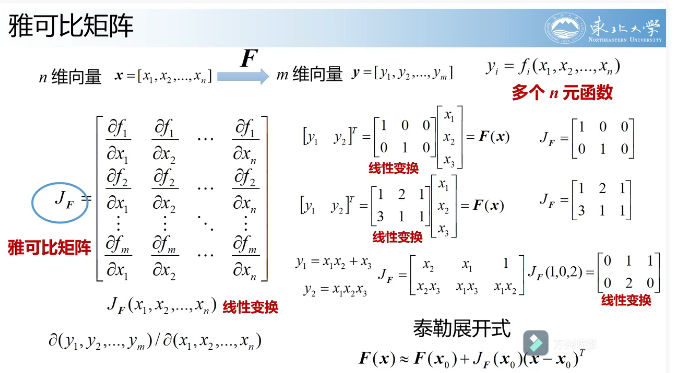
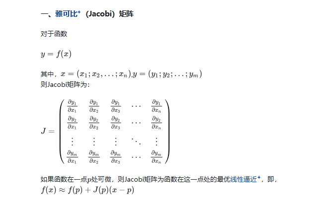
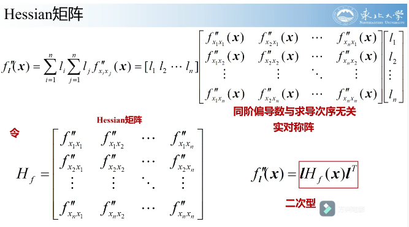
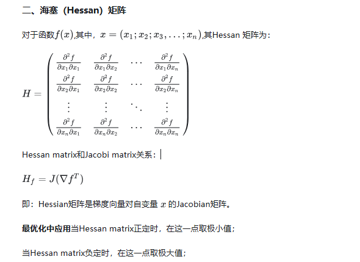
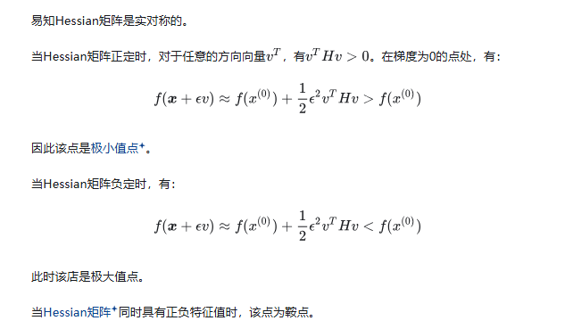
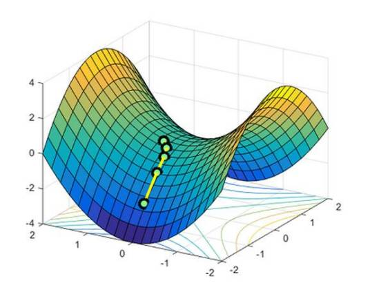
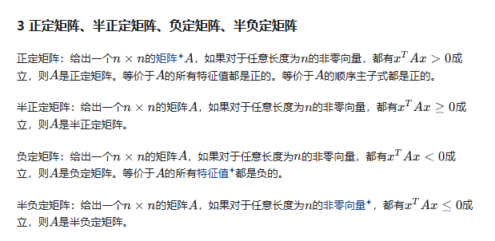
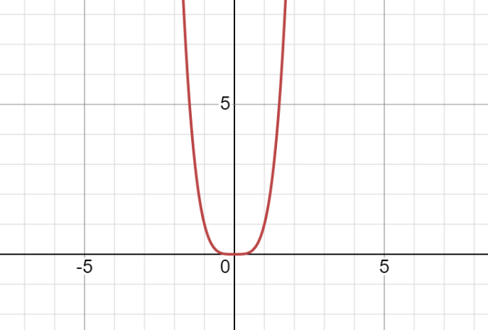

## 雅可比（Jacobian）矩阵、海塞（Hessian）矩阵

### 雅可比（Jacobian）矩阵

https://blog.csdn.net/u011754972/article/details/121721296

**函数组**

### 海塞（Hessian）矩阵

**单函数**

**Hessian矩阵l方向的二次方向导数**

 

>### 最优化问题
>
>

>### 鞍点
>
>**鞍点**：在一个方向是极大值，另一个方向是极小值的点
>
>

>**正定矩阵，半正定矩阵，负定矩阵，半负定矩阵**
>
>
>
>

### 二维鞍点

要判断一个点是否是**鞍点**，通常按照以下步骤：

**鞍点：一个不是局部极值点的驻点**

#### 1. 找到临界点

临界点是指在该点处函数的一阶导数（偏导数）都为 0。因此，我们需要先找到一阶偏导数为 0 的点。

- 对多元函数 $f(x, y)$，我们计算偏导数 $\frac{\partial f}{\partial x}$ 和 $\frac{\partial f}{\partial y}$。
- 令所有偏导数等于 0，解方程组，得到临界点 $(x_0, y_0)$。

#### 2. 计算二阶导数（Hessian矩阵）

对于多元函数，Hessian矩阵是二阶偏导数组成的矩阵，用来分析该点附近的曲率。假设函数是 $f(x, y)$，Hessian矩阵 $H$ 的形式如下：

$$
H = \begin{pmatrix}
\frac{\partial^2 f}{\partial x^2} & \frac{\partial^2 f}{\partial x \partial y} \\
\frac{\partial^2 f}{\partial x \partial y} & \frac{\partial^2 f}{\partial y^2}
\end{pmatrix}
$$

#### 3. 计算行列式与判定式

使用 Hessian 矩阵的行列式来进一步判断临界点的性质。

- 计算 Hessian 矩阵的行列式 $\Delta = \det(H)$：

$$
\Delta = \frac{\partial^2 f}{\partial x^2} \cdot \frac{\partial^2 f}{\partial y^2} - \left( \frac{\partial^2 f}{\partial x \partial y} \right)^2
$$

- 根据 $\Delta$ 和 Hessian 矩阵的二阶偏导数 $\frac{\partial^2 f}{\partial x^2}$ 来判断该点的性质：

  - 如果 $\Delta > 0$ 且 $\frac{\partial^2 f}{\partial x^2} > 0$，则 $(x_0, y_0)$ 是局部极小值。
  - 如果 $\Delta > 0$ 且 $\frac{\partial^2 f}{\partial x^2} < 0$，则 $(x_0, y_0)$ 是局部极大值。
  - 如果 $\Delta < 0$，则 $(x_0, y_0)$ 是**鞍点**。
  - 如果 $\Delta = 0$，不能确定，需要进一步分析。

#### 4. 几何分析

如果通过 Hessian 行列式无法直接判断，可以进一步分析函数在不同方向的行为。例如，可以考察沿 $x$ 轴、$y$ 轴或其他方向上的变化趋势，以确定该点是否是鞍点。

---

#### 例子1：二元函数的鞍点分析

分析函数 $f(x, y) = x^2 - y^2$ 是否有鞍点

1. **计算一阶导数**：

$$
\frac{\partial f}{\partial x} = 2x, \quad \frac{\partial f}{\partial y} = -2y
$$

解 $\frac{\partial f}{\partial x} = 0$ 和 $\frac{\partial f}{\partial y} = 0$，得出临界点 $(0, 0)$。

2. **计算二阶导数**：

$$
\frac{\partial^2 f}{\partial x^2} = 2, \quad \frac{\partial^2 f}{\partial y^2} = -2, \quad \frac{\partial^2 f}{\partial x \partial y} = 0
$$

3. **计算 Hessian 行列式**：

$$
\Delta = 2 \cdot (-2) - 0^2 = -4
$$

因为 $\Delta < 0$，所以 $(0, 0)$ 是一个鞍点。

---

#### 例子2：二元函数的鞍点分析

函数 $z = x^4 - y^4$ 在点 $(0, 0)$ 是一个鞍点。鞍点的定义是：在一个点附近，函数沿着某些方向是极小值，而沿着其他方向是极大值，或者没有局部极值。

我们来具体分析 $z = x^4 - y^4$ 在点 $(0, 0)$ 的情况：

1. **一阶导数**：

   - 对 $x$ 求偏导：$\frac{\partial z}{\partial x} = 4x^3$
   - 对 $y$ 求偏导：$\frac{\partial z}{\partial y} = -4y^3$

   在点 $(0, 0)$ 处，两个偏导数均为 0：
   $$
   \frac{\partial z}{\partial x} \bigg|_{(0,0)} = 0, \quad \frac{\partial z}{\partial y} \bigg|_{(0,0)} = 0
   $$
   这意味着 $(0, 0)$ 是一个临界点。

2. **二阶导数（Hessian矩阵）**：

   - $\frac{\partial^2 z}{\partial x^2} = 12x^2$
   - $\frac{\partial^2 z}{\partial y^2} = -12y^2$
   - $\frac{\partial^2 z}{\partial x \partial y} = 0$

   在点 $(0, 0)$ 处，Hessian矩阵为：

   $
   H = \begin{pmatrix}
   0 & 0 \\
   0 & 0
   \end{pmatrix}
   $
   Hessian矩阵在点 $(0, 0)$ 处行列式为零，因此不能通过二阶导数直接判断该点的性质。

3. **沿不同方向的变化**：

   - 沿 $x$ 轴（即当 $y = 0$ 时），函数简化为 $z = x^4$，在 $x = 0$ 处是一个极小值。
   - 沿 $y$ 轴（即当 $x = 0$ 时），函数简化为 $z = -y^4$，在 $y = 0$ 处是一个极大值。

由于函数在不同方向上的表现不同，点 $(0, 0)$ 既不是局部极大值，也不是局部极小值，而是一个**鞍点**。

---

**总结**
判断鞍点的关键步骤是找到临界点并通过 Hessian 行列式（或其他几何方法）来分析函数在该点的行为。

### 高维鞍点

对于多元函数 $f(x_1, x_2, \dots, x_n)$，我们仍然可以通过以下步骤来判断某个临界点是否是鞍点：

#### 1. 找到临界点

首先，我们需要计算每个变量的偏导数，并解出所有偏导数等于 0 的临界点。

- 计算一阶偏导数 $\frac{\partial f}{\partial x_1}, \frac{\partial f}{\partial x_2}, \dots, \frac{\partial f}{\partial x_n}$。
- 解出 $\frac{\partial f}{\partial x_i} = 0$（$i = 1, 2, \dots, n$）得到临界点 $(x_1^*, x_2^*, \dots, x_n^*)$。

#### 2. 计算 Hessian 矩阵

对于多元函数，Hessian 矩阵 $H$ 是由所有二阶偏导数组成的对称矩阵。对于 $n$ 个变量的函数 $f(x_1, x_2, \dots, x_n)$，Hessian 矩阵的形式为：

$$
H = \begin{pmatrix}
\frac{\partial^2 f}{\partial x_1^2} & \frac{\partial^2 f}{\partial x_1 \partial x_2} & \cdots & \frac{\partial^2 f}{\partial x_1 \partial x_n} \\
\frac{\partial^2 f}{\partial x_2 \partial x_1} & \frac{\partial^2 f}{\partial x_2^2} & \cdots & \frac{\partial^2 f}{\partial x_2 \partial x_n} \\
\vdots & \vdots & \ddots & \vdots \\
\frac{\partial^2 f}{\partial x_n \partial x_1} & \frac{\partial^2 f}{\partial x_n \partial x_2} & \cdots & \frac{\partial^2 f}{\partial x_n^2}
\end{pmatrix}
$$

#### 3. 检查 Hessian 矩阵的正定性

判断临界点的性质，取决于 Hessian 矩阵是否是**正定**、**负定**还是**不定**。可以通过以下步骤来判断：

1. **正定性**：计算 Hessian 矩阵的**主子式**，即从 $1 \times 1$ 到 $n \times n$ 的所有左上角子矩阵的行列式。如果所有主子式的行列式都大于 0，则 Hessian 矩阵是正定的，表明该点是局部**极小值**。

2. **负定性**：如果所有主子式的行列式交替正负，则 Hessian 矩阵是负定的，表明该点是局部**极大值**。

3. **不定性**：如果 Hessian 矩阵既不是正定也不是负定，即其行列式的符号变化不规律，则该点是**鞍点**。

#### 4. 几何分析

当 Hessian 矩阵的正定性或负定性不明确时，我们可以进一步分析函数在不同方向的变化情况，以判断该点的性质。例如，沿某些方向可能呈现极小值，而沿其他方向呈现极大值，这通常意味着该点是鞍点。

---

#### 例子：多元函数的鞍点分析

考虑函数 $f(x, y, z) = x^2 + y^2 - z^2$，分析是否存在鞍点。

1. **计算一阶导数**：

$$
\frac{\partial f}{\partial x} = 2x, \quad \frac{\partial f}{\partial y} = 2y, \quad \frac{\partial f}{\partial z} = -2z
$$

解 $\frac{\partial f}{\partial x} = 0$，$\frac{\partial f}{\partial y} = 0$，$\frac{\partial f}{\partial z} = 0$，得到临界点 $(0, 0, 0)$。

2. **计算 Hessian 矩阵**：

$$
H = \begin{pmatrix}
2 & 0 & 0 \\
0 & 2 & 0 \\
0 & 0 & -2
\end{pmatrix}
$$

3. **分析 Hessian 矩阵**：

Hessian 矩阵的主子式分别为：

- $\det(H_1) = 2$（正），
- $\det(H_2) = \det\begin{pmatrix} 2 & 0 \\ 0 & 2 \end{pmatrix} = 4$（正），
- $\det(H_3) = \det\begin{pmatrix} 2 & 0 & 0 \\ 0 & 2 & 0 \\ 0 & 0 & -2 \end{pmatrix} = -8$（负）。

因为 Hessian 矩阵的主子式不全为正，并且主子式符号不一致，说明 Hessian 矩阵是**不定的**，因此 $(0, 0, 0)$ 是一个鞍点。

---

**总结**
在多个变量的情况下，鞍点的判断依赖于 Hessian 矩阵的正定性。如果 Hessian 矩阵是不定的，则临界点是鞍点。

### Hessian 矩阵有零特征值时的分析

当 Hessian 矩阵是非零矩阵，但其中有一个或多个特征值为零时，我们无法通过传统的二阶导数法来简单判断临界点的性质。通常，零特征值意味着函数在某些方向上的曲率为零。下面是判断步骤：

#### 1. 特征值的含义

Hessian 矩阵的特征值反映了函数在各个方向上的局部曲率：

- **正特征值**：表示该方向上曲率为正，函数是**凹的**，即局部极小值。

- **负特征值**：表示该方向上曲率为负，函数是**凸的**，即局部极大值。

- **零特征值**：表示该方向上曲率为零，函数可能是平坦的。

  >

#### 2. Hessian 矩阵有零特征值的影响

- **特征值为 0 的情况**

  当 Hessian 矩阵的某个特征值为 0 时，意味着在对应的特征向量方向上，函数的二阶导数（曲率）为 0，即在这个方向上函数的曲率为0。具体来说：

  - 函数在该方向上是**平坦的**，即没有明显的凹凸性。
  - 如果海森矩阵的一个特征值为0，对应的特征向量方向上的曲率为0，这意味着在这个方向上，函数的一阶导数（梯度）不会变化。
  - 这一现象通常表示该方向上无法单凭二阶信息（Hessian）判断该点是局部最小值、最大值还是鞍点。

- 解决方法：

  - 更高阶导数分析
  - 选定特定直线进行分析（固定方向，当成一维函数求解）
  - Taloy展开

#### 3. 如何处理

当有零特征值时，我们可以采取以下措施进一步分析函数：

1. **分析非零特征值**：
   - 如果所有非零特征值为正，则该点在这些方向上为**局部极小值**。
   - 如果所有非零特征值为负，则该点在这些方向上为**局部极大值**。
   - 如果非零特征值有正有负，则可能是**鞍点**。

2. **更高阶导数分析**：
   对于零特征值对应的方向，计算三阶或四阶导数来判断局部行为。如果高阶导数不为零，则可以根据该阶导数确定方向上的性质。

3. **Taylor 展开**：
   对函数进行 Taylor 展开，通过分析高阶项的符号来判断局部极值或鞍点。

#### 4. 例子：$f(x, y) = x^4 + y^2$

1. 计算 Hessian 矩阵：

$$
H = \begin{pmatrix}
\frac{\partial^2 f}{\partial x^2} & \frac{\partial^2 f}{\partial x \partial y} \\
\frac{\partial^2 f}{\partial y \partial x} & \frac{\partial^2 f}{\partial y^2}
\end{pmatrix}
=
\begin{pmatrix}
12x^2 & 0 \\
0 & 2
\end{pmatrix}
$$

在点 $(0, 0)$ 处，Hessian 矩阵为：
$$
H(0, 0) = \begin{pmatrix} 0 & 0 \\ 0 & 2 \end{pmatrix}
$$

2. 特征值分析：

- 该 Hessian 矩阵的特征值为 $0$ 和 $2$，表明 $x$ 方向曲率为零，$y$ 方向曲率为正。

3. 进一步分析：

- 沿 $x$ 方向，$f(x, 0) = x^4$，高阶导数为正，表示**局部极小值**。
- 沿 $y$ 方向，$f(0, y) = y^2$，也是**局部极小值**。

因此，$(0, 0)$ 是一个局部极小值。

#### 5. 总结

- **零特征值**对应方向无法通过二阶导数判断，需要通过更高阶导数或 Taylor 展开来分析。
- **非零特征值**的符号可以判断非零方向的极值或鞍点性质。
