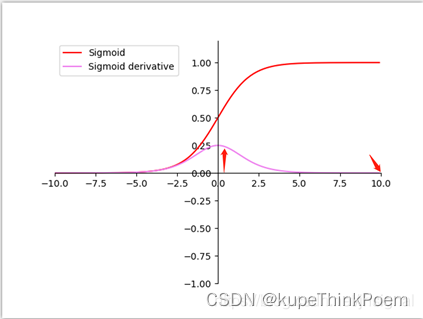

## Layer Normalization

###  code

Layer Normalization（层归一化）是深度学习中常用的一种归一化技术，主要用于加速训练和提高稳定性。它的主要目标是在每个样本的每一层上进行标准化，而不像批量归一化（Batch Normalization）那样跨批次进行计算。

在 PyTorch 中，`LayerNorm` 函数的常用参数如下：

```python
torch.nn.LayerNorm(normalized_shape, eps=1e-5, elementwise_affine=True)
```

1. `normalized_shape` (必选)

- 这是一个表示输入张量每一维的形状的参数，通常是一个整数或一个整数的元组（tuple），指定了归一化时要处理的维度。
- 例如，若输入数据是二维的（例如：`(batch_size, features)`），则 `normalized_shape` 可以设置为 `features` 的维度大小。

2. `eps` (可选)

- 默认值是 `1e-5`。
- 这是一个非常小的常数，用来避免除以零的情况，通常是为了数值稳定性。在计算标准化时，避免分母接近零时的溢出。

3. `elementwise_affine` (可选)

- 默认值是 `True`。
- 如果设置为 `True`，则会学习两个可训练的参数 `gamma` 和 `beta`，分别用于缩放和偏移标准化后的输出。这两个参数可以帮助网络恢复一些标准化后丧失的信息。
- 如果设置为 `False`，则不进行这些学习，因此返回的输出会完全标准化，不进行缩放或偏移。

**示例代码：**

```python
import torch
import torch.nn as nn

# 假设输入的形状是 (batch_size, num_features)
layer_norm = nn.LayerNorm(normalized_shape=10)

# 假设输入数据
x = torch.randn(2, 10)  # batch_size=2, features=10
output = layer_norm(x)
print(output)
```

在这个例子中，`normalized_shape=10` 表示对每个样本的 10 个特征进行标准化。如果 `elementwise_affine=True`，则会学习一个 10 维的 `gamma` 和 `beta` 参数。

---

Layer Normalization 是一种标准化方法，主要用于神经网络的每一层，而不是每个批次的数据。它通常应用于循环神经网络（RNN）和Transformer等架构中，可以减少训练过程中的内部协变量偏移。与批量归一化（Batch Normalization）不同，Layer Normalization 不依赖于批次大小，而是基于每个样本的特征进行标准化。

在 PyTorch 中，Layer Normalization 通过 `torch.nn.LayerNorm` 模块实现。

1. **基本用法**

```python
import torch
import torch.nn as nn

# 假设输入的特征维度是 [batch_size, num_features]
input_tensor = torch.randn(10, 20)  # 10个样本，每个样本有20个特征

# 初始化 LayerNorm 层，指定特征维度
layer_norm = nn.LayerNorm(20)

# 对输入进行标准化
output = layer_norm(input_tensor)
print(output.shape)
```

2. **使用 LayerNorm 的步骤**

1. **初始化 `LayerNorm` 层**：
   - `LayerNorm(normalized_shape, eps=1e-5, elementwise_affine=True)` 
   - `normalized_shape`：这是待标准化的输入的最后一个维度的大小（对于2D输入就是特征数）。对于更高维度的输入，你可以传递一个元组来指定需要标准化的维度。
   - `eps`：避免除以零的小常数，默认为 `1e-5`。
   - `elementwise_affine`：是否使用可训练的参数（`gamma` 和 `beta`）进行缩放和偏移，默认是 `True`。

2. **应用 `LayerNorm` 层**：
   - 对输入张量调用 `LayerNorm` 层，它会对输入的每个样本按照其特征维度进行标准化处理。

3. **高维输入的应用**

对于高维输入，LayerNorm 会对每个样本的特征维度进行标准化，而不影响其他维度。以下是一个高维输入的例子：

```python
# 假设输入的形状是 [batch_size, seq_len, num_features]
input_tensor = torch.randn(10, 5, 20)  # 10个样本，5个序列元素，每个元素20个特征

# 初始化 LayerNorm 层，指定需要标准化的特征维度
layer_norm = nn.LayerNorm(20)

# 对输入进行标准化
output = layer_norm(input_tensor)
print(output.shape)  # 输出形状应该是 [10, 5, 20]
```

4. **LayerNorm 的应用场景**

- **RNN 和 Transformer**：在这些模型中，LayerNorm 被广泛用于标准化每一层的输入，以确保网络的稳定性。
- **深度学习训练**：它能帮助减少训练过程中的梯度消失或梯度爆炸问题，特别是在深层网络中。

> 对于高维数据
>
> 在 PyTorch 中，`LayerNorm` 是基于输入张量的每个样本的特征维度进行标准化的。标准化的操作是通过将每个样本的特征进行均值为0、方差为1的转换来实现的，通常来说，`normalized_shape` 就是用来告诉 `LayerNorm` 哪些维度需要进行标准化的。
>
> `normalized_shape` 参数的详细说明
>
> - **对于 2D 输入：**
>   如果输入是一个二维张量，形状为 `[batch_size, num_features]`，那么 `normalized_shape` 应该设置为 `num_features`，即最后一个维度的大小。这意味着标准化会在每个样本的特征维度上进行。
>
>   **例子**：
>   ```python
>   input_tensor = torch.randn(10, 20)  # 10个样本，每个样本20个特征
>   layer_norm = nn.LayerNorm(20)  # 规范化最后一个维度，即20个特征
>   output = layer_norm(input_tensor)
>   ```
>   在这个例子中，`normalized_shape=20`，即每个样本的20个特征会被单独标准化（均值为0，方差为1），每个样本的标准化是独立的。
>
> - **对于更高维的输入：**
>   如果输入是更高维的张量，比如 3D 或 4D 张量，`normalized_shape` 可以传递一个元组，指定需要标准化的维度。一般情况下，`LayerNorm` 会针对每个样本的最后一个维度进行标准化，其他维度保持不变。
>
>   **例子 1：3D 输入**
>   假设输入的形状是 `[batch_size, seq_len, num_features]`，即每个样本有一个序列，其中每个序列包含多个特征。
>
>   ```python
>   input_tensor = torch.randn(10, 5, 20)  # 10个样本，5个时间步，每个时间步20个特征
>   layer_norm = nn.LayerNorm(20)  # 规范化每个时间步的20个特征
>   output = layer_norm(input_tensor)
>   ```
>   这里的 `normalized_shape=20` 表示我们在每个时间步上对20个特征进行标准化，而 `seq_len=5` 不会被标准化。
>
>   **例子 2：4D 输入**
>   假设输入是 4D 张量，形状为 `[batch_size, channels, height, width]`，这种情况下，通常希望标准化每个样本在 `height` 和 `width` 维度上的所有特征。
>
>   ```python
>   input_tensor = torch.randn(10, 3, 32, 32)  # 10个样本，每个样本3个通道，32x32的图像
>   layer_norm = nn.LayerNorm([3, 32, 32])  # 规范化每个样本的通道、宽度和高度
>   output = layer_norm(input_tensor)
>   ```
>   在这里，`normalized_shape=[3, 32, 32]` 表示对每个样本的3个通道、32x32的图像区域进行标准化。
>
> 总结
>
> - **单维度标准化**：对于 2D 输入，`normalized_shape` 直接指定为最后一个维度的大小（特征数量）。
> - **多维度标准化**：对于更高维度的输入（如 3D 或 4D），你可以传递一个元组，指定希望标准化的维度，通常是最后几个维度。
>
> 为什么要指定 `normalized_shape`？
>
> - `LayerNorm` 的核心作用是通过标准化每个样本的特征来加速训练和提高稳定性。通过指定 `normalized_shape`，你可以控制哪些维度的特征需要进行标准化操作。

## Batch Normalization

[神经网络中的常用算法-BN算法-CSDN博客](https://blog.csdn.net/kupepoem/article/details/127351959)

**引言**

传统的神经网络，只是在将样本x输入到输入层之前对x进行标准化处理，以降低样本间的差异性。BN是在此基础上，不仅仅只对输入层的输入数据x进行标准化，还对每个隐藏层的输入进行标准化。

我们在图像预处理过程中通常会对图像进行标准化处理，也就是image normalization，使得每张输入图片的数据分布能够统均值为u，方差为h的分布。这样能够加速网络的收敛。但是当一张图片输入到神经网络经过卷积计算之后，这个分布就不会满足刚才经过image normalization操作之后的分布了，可能适应了新的数据分布规律，这个时候将数据接入激活函数中，很可能一些新的数据会落入激活函数的饱和区，导致神经网络训练的梯度消失，如下图所示当feature map的数据为10的时候，就会落入饱和区，影响网络的训练效果。这个时候我们引入Batch Normalization的目的就是使我们卷积以后的feature map满足均值为0，方差为1的分布规律。在接入激活函数就不会发生这样的情况。



**Convariate shift**
        Convariate shift是BN论文作者提出来的概念，指的是具有不同分布的输入值对深度网络学习的影响。当神经网络的输入值的分布不同时，我们可以理解为输入的特征    **值的scale**    差异较大，与权重进行矩阵相乘后，会产生一些偏离较大的差异值；而深度学习网络需要通过训练不断更新完善，那么差异值产生的些许变化都会深深影响后层，偏离越大表现越为明显；因此，对于反向传播来说，这些现象都会导致梯度发散，从而需要更多的训练步骤来抵消scale不同带来的影响，也就是说，这种分布不一致将减缓训练速度。

```lua
    而BN的作用就是将这些输入值进行标准化，降低scale的差异至同一个范围内。这样做的好处在于一方面提高梯度的收敛程度，加快模型的训练速度；另一方面使得每一层可以尽量面对同一特征分布的输入值，减少了变化带来的不确定性，也降低了对后层网络的影响，各层网络变得相对独立，缓解了训练中的梯度消失问题。
```
**减少内部协变量的转移**

从字面意思看来Batch Normalization（简称BN）就是对每一批数据进行归一化，确实如此，对于训练中某一个batch的数据{x1,x2,...,xn}，注意这个数据是可以输入也可以是网络中间的某一层输出。在BN出现之前，我们的归一化操作一般都在数据输入层，对输入的数据进行求均值以及求方差做归一化，但是BN的出现打破了这一个规定，我们可以在网络中任意一层进行归一化处理，因为我们现在所用的优化方法大多都是min-batch SGD，所以我们的归一化操作就成为Batch Normalization。

我们知道网络一旦train起来，那么参数就要发生更新，除了输入层的数据外(因为输入层数据，我们已经人为的为每个样本归一化)，后面网络每一层的输入数据分布是一直在发生变化的，因为在训练的时候，前面层训练参数的更新将导致后面层输入数据分布的变化。以网络第二层为例：网络的第二层输入，是由第一层的参数和input计算得到的，而第一层的参数在整个训练过程中一直在变化，因此必然会引起后面每一层输入数据分布的改变。我们把网络中间层在训练过程中，数据分布的改变称之为：“Internal Covariate Shift”。BN的提出，就是要解决在训练过程中，中间层数据分布发生改变的情况。

### code

在 PyTorch 中，`BatchNorm`（批量归一化）是通过 `torch.nn.BatchNorm` 系列类来实现的。常见的批量归一化层包括 `BatchNorm1d`, `BatchNorm2d`, 和 `BatchNorm3d`，它们分别用于处理一维、二维和三维数据。以下是 `BatchNorm` 的函数参数说明，以 `BatchNorm2d` 为例：

```python
torch.nn.BatchNorm2d(num_features, eps=1e-5, momentum=0.1, affine=True, track_running_stats=True)
```

**参数解析：**

1. **`num_features`** (必选)
   - 这是输入张量的通道数，对于 `BatchNorm2d` 来说，就是输入数据的通道数（例如对于卷积层输出的形状为 `(batch_size, num_channels, height, width)`，则 `num_features` 是 `num_channels`）。
   - 该参数用于指定归一化的目标维度。

2. **`eps`** (可选，默认 `1e-5`)
   - 一个小的常数，用于数值稳定性，防止在计算方差时出现除以零的错误。
   - 该参数通常不需要调整，但如果遇到训练不稳定的情况，可以调整。

3. **`momentum`** (可选，默认 `0.1`)
   - 用于计算移动平均的动量。`momentum` 控制着历史均值和方差的贡献比例。
   - 在每个训练步骤中，批量归一化层都会更新均值和方差。`momentum` 控制了新值和旧值的加权平均。例如，较小的 `momentum` 值会使得模型的均值和方差更加依赖历史的值，反之，较大的 `momentum` 值会让模型更依赖当前批次的均值和方差。

4. **`affine`** (可选，默认 `True`)
   - 如果设置为 `True`，则会学习两个可训练参数 `gamma` 和 `beta`，它们分别对标准化后的结果进行缩放和偏移。`gamma` 用于控制缩放，`beta` 用于控制偏移。
   - 如果设置为 `False`，则不使用这些可训练的参数，归一化后的输出将没有缩放和偏移。

5. **`track_running_stats`** (可选，默认 `True`)
   - 如果设置为 `True`，则会在训练过程中保持并更新每一层的均值和方差的滑动平均值。这些统计量将用于推理（inference）时的标准化。
   - 如果设置为 `False`，则每次前向传播时都使用当前批次的均值和方差进行标准化，而不会维护滑动平均。

**示例代码：**

```python
import torch
import torch.nn as nn

# 创建一个 BatchNorm2d 层，假设输入通道数为 16
batch_norm = nn.BatchNorm2d(num_features=16)

# 假设输入数据为一个批次，其中每个图像有 16 个通道，尺寸为 32x32
x = torch.randn(8, 16, 32, 32)  # batch_size=8, channels=16, height=32, width=32

# 进行前向传播
output = batch_norm(x)
print(output.shape)  # 输出的形状应该是与输入相同
```

**归一化过程：**

- 对每个特征（通道）独立进行归一化：
  - **均值**和**方差**是基于当前批次的所有样本计算的。
  - 然后使用这些均值和方差对每个特征进行标准化，得到零均值和单位方差的输出。
  - 如果 `affine=True`，则使用可学习的参数 `gamma` 和 `beta` 对标准化后的数据进行缩放和平移。

---

`Batch Normalization`（批量归一化，简称 BN）是另一种常用的标准化技术，通常用于深度神经网络中，通过对每一层的输入进行标准化来减少内部协变量偏移，从而加速训练并提高模型的稳定性。

在 PyTorch 中，`BatchNorm` 主要通过 `torch.nn.BatchNorm1d`、`torch.nn.BatchNorm2d` 和 `torch.nn.BatchNorm3d` 等模块来实现，分别用于处理 1D、2D 和 3D 数据。

**1. BatchNorm 的原理**

BatchNorm 通过以下几个步骤来标准化每一层的输入：
1. 对当前层的每个特征进行标准化：通过批次的均值和方差对每个特征进行缩放。
2. 使用可学习的缩放因子（`gamma`）和平移因子（`beta`）对标准化后的特征进行线性变换。

公式如下：
$
\hat{x} = \frac{x - \mu}{\sigma} \quad \text{(标准化)}
$
$
y = \gamma \hat{x} + \beta \quad \text{(平移和缩放)}
$
其中，`x` 是输入，`μ` 和 `σ` 分别是当前批次的均值和标准差，`γ` 和 `β` 是可训练的参数。

**2. BatchNorm 在 PyTorch 中的实现**

#### 2.1 BatchNorm1d
`BatchNorm1d` 主要用于 2D 张量输入，每个样本有多个特征，适用于全连接层或者时间序列数据。

```python
import torch
import torch.nn as nn

# 假设输入的形状是 [batch_size, num_features]
input_tensor = torch.randn(10, 20)  # 10个样本，每个样本20个特征

# 初始化 BatchNorm1d 层，指定特征维度
batch_norm = nn.BatchNorm1d(20)

# 对输入进行标准化
output = batch_norm(input_tensor)
print(output.shape)  # 输出形状应该是 [10, 20]
```

#### 2.2 BatchNorm2d
`BatchNorm2d` 主要用于 4D 张量输入，通常用于卷积层的输出。它适用于处理图像数据，标准化每个通道的特征。

```python
input_tensor = torch.randn(10, 3, 32, 32)  # 10个样本，每个样本3个通道，32x32的图像
batch_norm = nn.BatchNorm2d(3)  # 3个通道
output = batch_norm(input_tensor)
print(output.shape)  # 输出形状应该是 [10, 3, 32, 32]
```

#### 2.3 BatchNorm3d
`BatchNorm3d` 主要用于 5D 张量输入，通常用于视频数据或者 3D 卷积神经网络。

```python
input_tensor = torch.randn(10, 3, 4, 32, 32)  # 10个样本，每个样本3个通道，4帧32x32的图像
batch_norm = nn.BatchNorm3d(3)  # 3个通道
output = batch_norm(input_tensor)
print(output.shape)  # 输出形状应该是 [10, 3, 4, 32, 32]
```

**3. BatchNorm 的工作流程**

1. **训练模式**：在训练过程中，`BatchNorm` 会基于当前批次的数据计算均值和方差，然后对数据进行标准化。`gamma` 和 `beta` 会随着训练进行更新。
2. **评估模式**：在评估模式下，`BatchNorm` 使用在训练过程中计算的全局均值和方差，而不是当前批次的均值和方差。

你可以通过 `model.train()` 和 `model.eval()` 来控制模型是否处于训练模式或者评估模式。

**4. 使用 BatchNorm 时的注意事项**

- **训练时与评估时的区别**：在训练模式下，`BatchNorm` 使用当前批次的均值和方差来标准化数据；在评估模式下，`BatchNorm` 使用训练过程中计算得到的均值和方差。因此，当你在评估模型时，`model.eval()` 是必须的。
  
- **mini-batch 大小**：`BatchNorm` 依赖于批次的均值和方差，所以较小的批次大小可能导致不稳定的训练效果。如果批次过小，标准化效果可能不好，进而影响网络训练的稳定性。

**5. 在模型中使用 BatchNorm**

在深度神经网络模型中，`BatchNorm` 通常会被嵌入到卷积层或全连接层之后，以帮助加速训练并提高模型的稳定性。以下是一个包含 BatchNorm 层的简单示例：

```python
class SimpleCNN(nn.Module):
    def __init__(self):
        super(SimpleCNN, self).__init__()
        self.conv1 = nn.Conv2d(1, 32, kernel_size=3, padding=1)
        self.bn1 = nn.BatchNorm2d(32)  # 对 conv1 的输出进行 BatchNorm
        self.conv2 = nn.Conv2d(32, 64, kernel_size=3, padding=1)
        self.bn2 = nn.BatchNorm2d(64)  # 对 conv2 的输出进行 BatchNorm
        self.fc = nn.Linear(64 * 28 * 28, 10)

    def forward(self, x):
        x = self.conv1(x)
        x = self.bn1(x)  # BatchNorm 层
        x = torch.relu(x)
        x = self.conv2(x)
        x = self.bn2(x)  # BatchNorm 层
        x = torch.relu(x)
        x = x.view(x.size(0), -1)
        x = self.fc(x)
        return x
```

**总结**

- `BatchNorm` 在深度神经网络中通过标准化每层输入，帮助网络在训练过程中更快地收敛，并避免梯度爆炸或梯度消失问题。
- PyTorch 提供了 `BatchNorm1d`、`BatchNorm2d` 和 `BatchNorm3d` 来处理不同维度的输入。
- 训练时，`BatchNorm` 计算批次的均值和方差，评估时使用全局均值和方差。
  

## Droupout（暂退法，丢弃法）

**隐藏全连接层的输出上**

`torch.dropout` 是 PyTorch 中用于实现**dropout**操作的函数，常用于神经网络训练过程中的正则化，以减少过拟合的风险。dropout会随机“丢弃”一部分神经元的输出，将其置为零。具体来说，**在训练期间**，每个神经元输出值都会以设定的概率被置为 0。这个操作能够帮助模型更好地学习多样化的特征表示，提高模型的泛化能力。

**语法**

```python
torch.dropout(input, p, training)
```

- `input`: 输入张量，表示神经网络层的输出。
- `p`: dropout的概率，取值范围在 [0, 1) 之间。`p` 表示置零的概率，例如 `p=0.5` 表示有 50% 的输出将被随机置零。
- `training`: 布尔值，表示当前是否处于训练模式。只有当 `training=True` 时，dropout 才会生效；在推理（测试）模式下，应设置为 `False`，避免对输出进行dropout。

**返回值**

返回一个新的张量，表示经过 dropout 操作后的结果。对于被保留下来的部分输出，会自动进行放缩（放大 $\frac{1}{1-p}$ 倍），以保证输出的期望值与未进行 dropout 时一致。

**示例**

```python
import torch

# 创建一个示例张量
x = torch.tensor([[1.0, 2.0, 3.0],
                  [4.0, 5.0, 6.0]])

# 应用 dropout，设定置零概率为 0.5，并开启训练模式
output = torch.dropout(x, p=0.5, training=True)
print(output)
```

在以上示例中，每个元素有 50% 的概率被置为 0，而其余未被置零的元素会放大 $\frac{1}{1 - 0.5} = 2$ 倍。示例输出可能为：

```
tensor([[2.0, 0.0, 6.0],
        [8.0, 0.0, 12.0]])
```

> **注意**：输出是随机的，每次运行可能会有不同的零值位置。

**注意事项**

1. **训练和推理模式**：在训练模式（`training=True`）下使用 dropout 是有效的，而在推理模式（`training=False`）下 dropout 不会影响输出，以确保在测试时模型行为的一致性。
2. **放缩**：dropout 会对未被置零的输出进行放缩，保持**期望输出**的一致性。这意味着输出张量的均值不会因为 dropout 而改变。

在 Python 中，`*` 运算符在不同上下文中有不同的作用。在 `shape` 这样的元组前面加上 `*`，可以用于**参数解包**，将元组或列表的元素作为单独的参数传递给函数或用于其他表达式中。

## * 在形状元组前的作用

假设我们有一个 `shape` 元组，表示张量的形状，例如 `(2, 3, 4)`：

```python
shape = (2, 3, 4)
```

1. **函数参数解包**：

   如果我们想要将 `shape` 中的每个元素分别传递给 `torch.randn` 函数以生成一个随机张量，可以这样写：

   ```python
   import torch
   tensor = torch.randn(*shape)
   print(tensor.shape)  # 输出: torch.Size([2, 3, 4])
   ```

   这里，`*shape` 会将 `(2, 3, 4)` 解包成三个独立的参数 `2, 3, 4`，相当于 `torch.randn(2, 3, 4)`。

2. **列表或元组构建**：

   `*` 也可以用于构建新的列表或元组，例如：

   ```python
   new_shape = (1, *shape, 1)
   print(new_shape)  # 输出: (1, 2, 3, 4, 1)
   ```

   这里，`*shape` 被解包，放入到新的元组中，使得 `new_shape` 的值为 `(1, 2, 3, 4, 1)`。

**总结**

- `*shape` 会将 `shape` 中的**每个元素解包为独立的值**。

- 这种操作广泛用于函数调用中，能够简化代码并增加灵活性。

---

这个警告信息的意思是：当你从一个已经是 `tensor` 的对象构造一个新的 `tensor` 时，使用 `torch.tensor()` 可能会导致一些意料之外的行为，特别是在涉及到梯度计算时。因此，PyTorch 推荐使用 `tensor.clone().detach()` 或者 `tensor.clone().detach().requires_grad_(True)` 来进行复制操作，以确保代码的稳定性和预期行为。

## 全局统计的更新

### 评估模式（Evaluation Mode，`model.eval()`）下的 BatchNorm 行为

在评估模式下，**BatchNorm** 不会使用当前批次的平均值和方差来进行归一化，而是使用训练阶段累计得到的**全局移动平均的平均值和方差**（`running_mean` 和 `running_var`）。这些值是在训练阶段更新的，用来估计整个数据集的统计信息。

---

#### 1. 公式

在评估模式下，BatchNorm 对输入 $ x $ 的归一化公式为：

$
\hat{x} = \frac{x - \text{running\_mean}}{\sqrt{\text{running\_var} + \epsilon}}
$

其中：
- $ \text{running\_mean} $ 是训练阶段累计的平均值；
- $ \text{running\_var} $ 是训练阶段累计的方差；
- $ \epsilon $ 是一个小的常数，用于防止除零错误；
- $ x $ 是输入数据。

---

#### 2. 仿射变换

归一化后的结果会进行可学习参数的仿射变换：

$
y = \gamma \hat{x} + \beta
$

其中：
- $ \gamma $ 是缩放参数（scale parameter）；
- $ \beta $ 是偏移参数（shift parameter）；
- $ \gamma $ 和 $ \beta $ 是通过反向传播训练得到的。

---

### 训练模式（Training Mode，`model.train()`）下的 BatchNorm 行为

在训练模式中，BatchNorm 会根据当前批次数据计算平均值和方差，然后用这些值对输入进行归一化，同时更新全局统计量 $ \text{running\_mean} $ 和 $ \text{running\_var} $。

---

#### 1. 更新规则

全局统计量的更新规则为：

$
\text{running\_mean} = (1 - \text{momentum}) \cdot \text{running\_mean} + \text{momentum} \cdot \text{batch\_mean}
$

$
\text{running\_var} = (1 - \text{momentum}) \cdot \text{running\_var} + \text{momentum} \cdot \text{batch\_var}
$

其中：
- $ \text{momentum} $ 是一个超参数，控制更新速度，取值范围一般为 $ [0, 1] $；
- $ \text{batch\_mean} $ 和 $ \text{batch\_var} $ 是当前批次的均值和方差。

---

### 小结

1. **评估模式下**：
   - BatchNorm 的平均值和方差来自训练阶段累积的 **`running_mean`** 和 **`running_var`**。
   - 保证在推理阶段对数据的归一化一致性。
2. **训练模式下**：
   - BatchNorm 使用当前批次的均值和方差进行归一化；
   - 同时更新全局统计量以估计整个数据集的统计信息。

---

### 训练模式下的 BatchNorm 计算和更新

#### 已知条件
- **初始全局统计量**：
  $
  \text{running\_mean} = [0.0, 0.0], \quad \text{running\_var} = [1.0, 1.0]
  $
- **动量超参数**：
  $
  \text{momentum} = 0.1
  $
- **当前批次数据**：
  $
  X = \begin{bmatrix}  
  1.0 & 2.0 \\ 
  2.0 & 3.0 \\ 
  3.0 & 4.0 
  \end{bmatrix}
  $

---

#### 步骤 1：计算当前批次的均值和方差

1. **当前批次的均值**：
   $
   \text{batch\_mean} = \left[ \frac{1.0 + 2.0 + 3.0}{3}, \frac{2.0 + 3.0 + 4.0}{3} \right] = [2.0, 3.0]
   $

2. **当前批次的方差**：
   $
   \text{batch\_var} = \left[ 
   \frac{(1.0 - 2.0)^2 + (2.0 - 2.0)^2 + (3.0 - 2.0)^2}{3}, 
   \frac{(2.0 - 3.0)^2 + (3.0 - 3.0)^2 + (4.0 - 3.0)^2}{3} 
   \right] = [0.6667, 0.6667]
   $

---

#### 步骤 2：更新全局统计量

1. **更新运行平均值**：
   $
   \text{running\_mean} = (1 - \text{momentum}) \cdot \text{running\_mean} + \text{momentum} \cdot \text{batch\_mean}
   $
   代入计算：
   $
   \text{running\_mean} = (1 - 0.1) \cdot [0.0, 0.0] + 0.1 \cdot [2.0, 3.0] = [0.2, 0.3]
   $

2. **更新运行方差**：
   $
   \text{running\_var} = (1 - \text{momentum}) \cdot \text{running\_var} + \text{momentum} \cdot \text{batch\_var}
   $
   代入计算：
   $
   \text{running\_var} = (1 - 0.1) \cdot [1.0, 1.0] + 0.1 \cdot [0.6667, 0.6667] = [0.9667, 0.9667]
   $

---

### 评估模式下的 BatchNorm 计算

#### 已知条件
- **输入数据**：
  $
  X = \begin{bmatrix}  
  1.0 & 2.0 \\ 
  2.0 & 3.0 \\ 
  3.0 & 4.0 
  \end{bmatrix}
  $
- **全局统计量**：
  $
  \text{running\_mean} = [0.2, 0.3], \quad \text{running\_var} = [0.9667, 0.9667]
  $

#### 步骤：归一化输入数据
归一化公式：
$
\hat{X} = \frac{X - \text{running\_mean}}{\sqrt{\text{running\_var} + \epsilon}}
$
其中，$\epsilon = 10^{-5}$ 用于数值稳定性。

1. **代入公式进行计算**：
   $
   \hat{X} = 
   \begin{bmatrix}  
   \frac{1.0 - 0.2}{\sqrt{0.9667 + 10^{-5}}} & \frac{2.0 - 0.3}{\sqrt{0.9667 + 10^{-5}}} \\ 
   \frac{2.0 - 0.2}{\sqrt{0.9667 + 10^{-5}}} & \frac{3.0 - 0.3}{\sqrt{0.9667 + 10^{-5}}} \\ 
   \frac{3.0 - 0.2}{\sqrt{0.9667 + 10^{-5}}} & \frac{4.0 - 0.3}{\sqrt{0.9667 + 10^{-5}}}
   \end{bmatrix}
   $

2. **结果**：
   $
   \hat{X} = 
   \begin{bmatrix}  
   0.814 & 1.717 \\ 
   1.835 & 2.739 \\ 
   2.855 & 3.761 
   \end{bmatrix}
   $

---

### 总结

1. **训练模式**下：
   - 使用当前批次的统计量进行归一化。
   - 更新全局统计量 $\text{running\_mean}$ 和 $\text{running\_var}$。

2. **评估模式**下：
   - 使用全局统计量 $\text{running\_mean}$ 和 $\text{running\_var}$ 对数据进行归一化，确保模型在推理阶段的行为一致。

