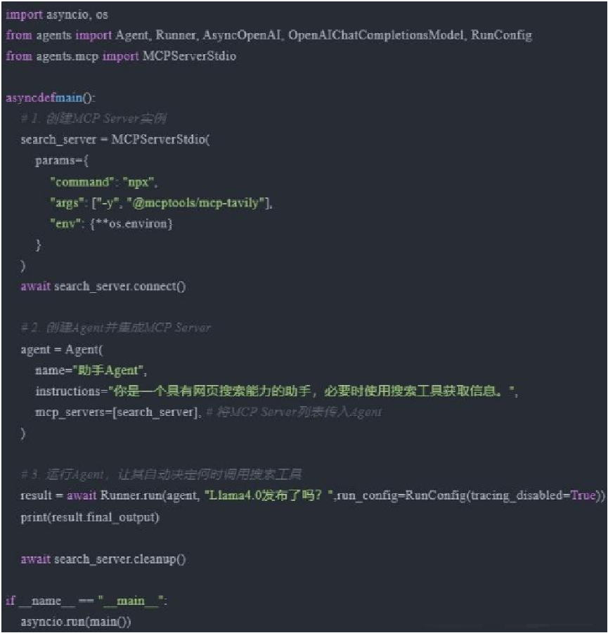
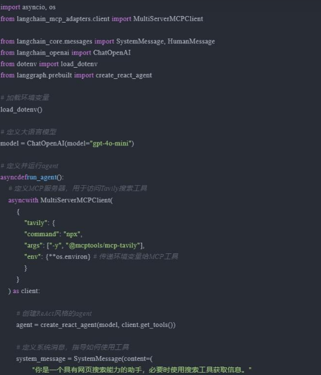

## 8种主流Agent框架与MCP的集成

大模型Agents开发框架如今已经百花齐放，层出不穷。本文将盘点**8种主流LLM Agents开发框架**，并介绍**如何在每种框架中集成当下备受关注的MCP Server**，让Agents系统更方便的接入外部工具。包括：

- **OpenAI Agents SDK**
- **LangGraph**
- **LlamaIndex**
- **AutoGen 0.4+**
- **Pydantic AI**
- **SmolAgents**
- **Camel**
- **[CrewAI]**

### Open AI Agents SDK

OpenAI Agents SDK是OpenAI官方推出的轻量级Agent开发框架，旨在方便开发者构建多Agent协作的智能体系统。该SDK源于OpenAI内部实验项目Swarm，并在近期正式推出生产版本。OpenAI Agents SDK的特点是：简单易用、轻量级、专注在最小集功能，并支持转交（Handoffs）、护栏（Guardrails）等很有特点的功能。

**【集成MCP】**

以下代码演示了如何将OpenAI Agent实例连接到一个搜索的MCP Server，并将其中的工具集成Agent中：



有趣的是，在使用远程MCP Server时，Agents SDK提供了自动缓存工具列表的选项（通过设置`cache_tools_list=True`）。如果需要手动使缓存失效，可以调用MCP Server实例上的`invalidate_tools_cache()`方法 。

### LangGraph

LangGraph来自著名的LangChain，是一个用于构建Agentic Workflow的强大框架，它将任务过程建模为有状态的Graph结构，从而可以实现更复杂和结构化的交互。在该框架内集成MCP Server可以在工作流程的各个阶段更精确地控制何时以及如何调用外部工具，从而实现复杂的Agentic系统。

LangGraph的特点是功能强大，你可以使用**Prebuilt**的接口快速创建Agent，也可以使用Graph定义复杂的Agentic工作流与多Agent系统；缺点是略显复杂。

**【集成MCP】**

将前面的示例修改为LangGraph+MCP Server的代码实现：



```python
	# 处理查询
	agent_response = await agent.ainvoke({"messages": [system_message, HumanMessage(content="Llama4.0发布了吗？")]})

	# 返回agent的回答
	return agent_response["messages"][-1].content

# 运行agent
if __name__ == "__main__":
    response = asyncio.run(run_agent())
    print("\n最终回答:", response)
```

注意这里使用**MultiServerMCPClient**可以灵活的支持多个MCP Server的同时连接，对于单个Server场景，你也可以借助load_mcp_tools方法直接从MCP SDK的session中导入Tools（无需MultiServerMCPClient）。

## LangChain和CoT

**思维链提示（Chain of Thought, CoT）** 是一种强大的推理技术，通过在推理过程中显式地展示中间步骤，帮助模型更好地理解和解答复杂问题。LangChain支持自定义思维链工具，使用户能够构建适合自己任务需求的推理过程。

**Few-Shot CoT**

Few-Shot CoT在提示中提供了一些链式思考示例，通过这些示例，模型的推理能力能够被增强。例如，在一个AI花店助手的应用中，可以通过Few-Shot CoT引导AI从理解问题、搜索信息、制定决策到生成销售列表的全过程。

```python
# 设置环境变量和API密钥
import os
os.environ["OPENAI_API_KEY"] = '你的OpenAI API Key'

# 创建聊天模型
from langchain.chat_models import ChatOpenAI
llm = ChatOpenAI(temperature=0)

# 设定 AI 的角色和目标
role_template = "你是一个为花店电商公司工作的AI助手, 你的目标是帮助客户根据他们的喜好做出明智的决定"

# CoT 的关键部分，AI 解释推理过程，并加入一些先前的对话示例（Few-Shot Learning）
cot_template = """
作为一个为花店电商公司工作的AI助手，我的目标是帮助客户根据他们的喜好做出明智的决定。
我会按部就班的思考，先理解客户的需求，然后考虑各种鲜花的涵义，最后根据这个需求，给出我的推荐。
同时，我也会向客户解释我这样推荐的原因。
示例 1:
人类：我想找一种象征爱情的花。
AI：首先，我理解你正在寻找一种可以象征爱情的花。在许多文化中，红玫瑰被视为爱情的象征，这是因为它们的红色通常与热情和浓烈的感情联系在一起。因此，考虑到这一点，我会推荐红玫瑰。红玫瑰不仅能够象征爱情，同时也可以传达出强烈的感情，这是你在寻找的。
示例 2:
人类：我想要一些独特和奇特的花。
AI：从你的需求中，我理解你想要的是独一无二和引人注目的花朵。兰花是一种非常独特并且颜色鲜艳的花，它们在世界上的许多地方都被视为奢侈品和美的象征。因此，我建议你考虑兰花。选择兰花可以满足你对独特和奇特的要求，而且，兰花的美丽和它们所代表的力量和奢侈也可能会吸引你。
"""


from langchain.prompts import ChatPromptTemplate, HumanMessagePromptTemplate, SystemMessagePromptTemplate
system_prompt_role = SystemMessagePromptTemplate.from_template(role_template)
system_prompt_cot = SystemMessagePromptTemplate.from_template(cot_template)

# 用户的询问
human_template = "{human_input}"
human_prompt = HumanMessagePromptTemplate.from_template(human_template)

# 将以上所有信息结合为一个聊天提示
chat_prompt = ChatPromptTemplate.from_messages([system_prompt_role, system_prompt_cot, human_prompt])
prompt = chat_prompt.format_prompt(human_input="我想为我的女朋友购买一些花。她喜欢粉色和紫色。你有什么建议吗?").to_messages()

# 接收用户的询问，返回回答结果
response = llm(prompt)
print(response)

```

**Zero-Shot CoT**

Zero-Shot CoT则是直接告诉模型要一步一步地思考，慢慢地推理。例如，只需简单地告诉模型“让我们一步步的思考”，模型就能够给出更好的答案[1](https://blog.csdn.net/m0_73302939/article/details/143633463)。

**总结**

通过Few-Shot和Zero-Shot CoT，LangChain能够显著提高模型的推理能力，使其在复杂任务中表现更好。无论是通过示例引导，还是直接提示模型逐步思考，CoT都为开发者提供了强大的工具来优化模型的推理过程。

---

**LangChain和CoT（Chain‑of‑Thought）**是两个不同层面的概念，但它们又有着密切的联系，经常在构建智能应用时结合使用。下面从定义、用途、差异和关系几个角度进行详细解析：

------

### 1. 定义及基本概念

**CoT（Chain‑of‑Thought）：**

- **概念**：CoT是一种提示技术，旨在引导大型语言模型（LLMs）在回答问题之前生成一系列的中间推理步骤。这种方式模拟了人类的思考过程，使模型在面对复杂问题时，能够逐步拆解、分析并最终给出答案。

- **用途**：它主要用于数学、逻辑、常识和符号推理任务中，通过中间步骤展现推理链条，提高输出的准确性和可解释性。

- 在中文语境中，“CoT”通常翻译为**“思维链”**或者**“链式思考”**。这一概念源自英文“Chain‑of‑Thought”，指的是在大型语言模型进行复杂推理（例如数学问题、逻辑推理等）时，通过生成一系列中间推理步骤来最终得出答案的提示技术。这种方法可以让模型展示并利用“思考过程”，从而提高最终回答的准确性和可解释性。

  例如，当模型面对一道数学题时，通过先分解步骤（例如先计算部分结果，再进行加减乘除运算），最终组合出正确答案。正因为这种过程具有可解释性，所以“思维链”成为了提升模型推理能力的一种常见策略。

  这种技术既可以通过少样本提示（Few-shot CoT）提供示例，也可以通过零样本提示（Zero-shot CoT）在提示中加入类似“让我们一步步思考”（“Let's think step by step”）这样的引导词来实现。

**LangChain：**

- **概念**：LangChain是一个开源的开发框架，专注于构建基于LLMs的应用。它提供了一整套组件，如【链（Chains）】、【代理（Agents）】、【内存（Memory）】和【提示模板（Prompts）】，帮助开发者将大模型的能力组合在一起，构成一个端到端的系统。
- **用途**：除了基本的模型调用，LangChain能整合多步推理、外部工具调用以及复杂对话逻辑，使开发者能够快速构建、调试和迭代智能应用，特别适用于对话系统、问答、数据查询等任务。

------

### 2. 差异与侧重点

**技术层面 vs. 开发框架：**

- **CoT是一种技术方法**：
  - 聚焦于如何提升模型“思考”的能力，即在生成最终答案前输出详细的中间推理过程。
  - 它的核心在于提示工程，常见方法包括少样本提示（Few-shot CoT）、零样本提示（Zero-shot CoT）以及自动构建思维链（Auto-CoT）等。
- **LangChain是一个应用开发框架**：
  - 聚焦于如何将大语言模型与各种工具、提示和数据源进行组合和集成，从而开发出成熟的应用系统。
  - 它不仅支持CoT提示，还支持各种推理策略、代理系统（Agent）、内存管理等，让开发者可以更灵活地设计应用逻辑。

------

### 3. 联系与整合

尽管两者侧重点不同，但它们在智能应用的构建中可以互相补充和增强：

- **在LangChain中使用CoT技术**：
  - 开发者可以在LangChain的提示模板（Prompt Templates）中集成CoT方法，编写包含中间推理步骤的提示，从而利用CoT提升模型在复杂任务中的表现。
  - 例如，在构建智能代理（Agent）时，可以通过设计多步思考的prompt来让模型输出详细的推理轨迹，再配合LangChain的其他模块（如记忆和工具调用）实现复杂任务的自动化决策。
- **CoT作为LangChain Agent的一部分**：
  - 在一些示例中，LangChain的Agent就利用了CoT或ReAct（Reason + Action）等方法来引导模型先进行推理，再根据推理结果选择调用外部工具或直接输出答案。
  - 这种组合大大提升了系统在处理开放性和复杂问题上的鲁棒性和解释性。

------

### 4. 总结

- **CoT（Chain‑of‑Thought）** 是一种提示技术，核心在于引导模型生成中间推理过程以提升回答的准确性和可解释性，主要关注“思考过程”。
- **LangChain** 是一个构建智能应用的开发框架，提供了完整的组件化工具，使开发者能够高效整合LLMs、工具、记忆和提示策略，构建复杂且模块化的应用。
- **联系**：在实际应用中，开发者常常利用LangChain来实现包括CoT在内的多种提示技术；即通过LangChain提供的模板和代理机制，将CoT的“思考”过程嵌入到应用逻辑中，从而提升整体系统的推理和决策能力。

通过这两者的组合，既能充分利用大模型的强大生成能力，又能通过结构化框架对推理过程进行有序管理和外部信息交互，形成一个既透明又高效的智能系统。

## LangChain和LangGraph

“LangChain”和“LangGraph”这两个名称看起来相似，但它们的侧重点和定位实际上有所不同，下面从几个方面对两者进行对比说明：

------

### 1. 定位和目标

- **LangChain**
  - **定位**：LangChain 是一个通用的、开源的开发框架，专注于帮助开发者构建利用大型语言模型（LLMs）的应用。
  - **目标**：它主要提供了一整套工具和抽象，比如链（Chains）、代理（Agents）、记忆（Memory）和提示模板（Prompt Templates），让开发者可以将不同的步骤串联起来，构建从简单到复杂的应用流程。
  - **应用场景**：常用于对话系统、问答、内容生成、数据查询等任务中，侧重于通过线性或分支式的多步推理来完成任务。
- **LangGraph**
  - **定位**：LangGraph 目前在社区中更多被视作一种扩展工具或视觉化工具，它侧重于将 LLM 应用流程以图形（Graph）的形式来展示和管理。
  - **目标**：它希望提供一种图形化的、节点化的方式去描述和调试链式（或多分支）任务流程，这对于构建那些涉及多路径探索、分支决策等复杂工作流非常有帮助。
  - **应用场景**：适合那些流程较为复杂，不一定完全是线性链式调用的任务，利用图形界面去构造、调试和监控整个工作流，从而更直观地理解各个环节之间的关系。

------

### 2. 架构和实现侧重点

- **LangChain**
  - **实现**：提供文本模板、链式调用、内存管理等组件，帮助开发者用代码“串起”一个完整的应用流程。
  - **特点**：侧重于灵活的编程接口和丰富的内置模块（如代理、工具调用等），使得应用可以按预定的逻辑顺序运行，也支持一些分支逻辑，但整体更偏向于编程式的实现。
- **LangGraph**
  - **实现**：通常会借助图结构来描述流程，节点表示单个处理模块、子任务或决策点，边则表示数据流和调用关系。
  - **特点**：强调可视化、直观性和易于调试，可以让用户在图形界面上构建和修改复杂工作流。对于那些任务流程具有多种分支和合并逻辑的场景，LangGraph 能更清晰地展现整体架构，便于管理和维护。

------

### 3. 两者之间的关系

- **互补性**：
   尽管两者从名字上看很类似，但目前大多数项目中，LangChain 是构建 LLM 应用的核心框架，而 LangGraph 则有时被视作对 LangChain 的一种补充或扩展，用于更直观地展示和调试那些由 LangChain 构建的工作流。
- **集成使用**：
   在实际应用中，开发者可以先使用 LangChain 构建流程，再利用 LangGraph 来可视化这些链式调用、节点和数据流，从而实现对复杂任务的整体监控和管理。

------

### 4. 总结

- **LangChain** 更注重于模块化、编程式地构建和执行大语言模型应用，适用于绝大多数应用场景，其核心在于“串联”各种能力。
- **LangGraph** 则强调使用图形化和结构化的方式来管理、调试和理解这些流程，适用于流程结构相对复杂且需要直观展示决策分支和数据流的任务。

因此，两者并非对立，而是各有侧重，开发者可以根据实际需求选择单独使用其中之一，或在构建复杂系统时将两者结合起来。

