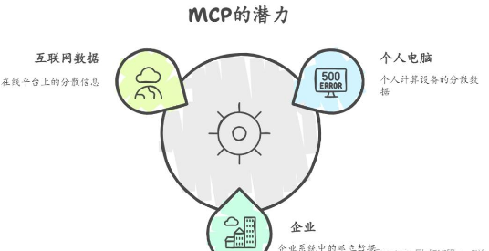
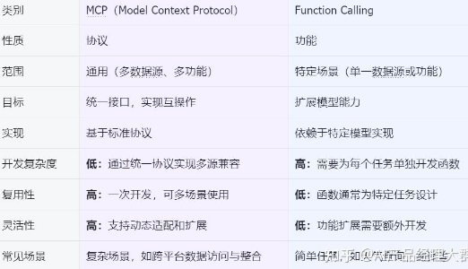
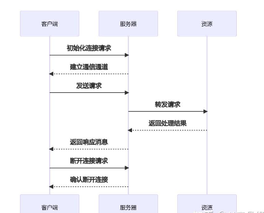

# 一文看懂：MCP(大模型上下文协议)

MCP逐渐被接受，是因为MCP是开放标准。在AI项目开发中可以发现，集成AI模型复杂，现有框架如LangChain Tools、LlamaIndex和Vercel AI SDK存在问题。LangChain和LlamaIndex代码抽象高，商业化过重；Vercel AI SDK与Nextjs绑定过深。

MCP的优势在于：一是开放标准利于服务商开发API，二是避免开发者重复造轮子，可利用现有MCP服务增强Agent。**A Clear Understanding of MCP (Large Model Context Protocol)**

## 一、什么是MCP（Model Context Protocol）

### 定义

MCP（Model Context Protocol，模型上下文协议） ，2024年11月底，由 Anthropic 推出的一种开放标准，旨在统一大型语言模型（LLM）与外部数据源和工具之间的通信协议。MCP 的主要目的在于解决当前 AI 模型因数据孤岛限制而无法充分发挥潜力的难题，MCP 使得 AI 应用能够安全地访问和操作本地及远程数据，为 AI 应用提供了连接万物的接口。

> Function Calling是AI模型调用函数的机制，MCP是一个标准协议，使AI模型与API无缝交互，而AI Agent是一个自主运行的智能系统，利用Function Calling和MCP来分析和执行任务，实现特定目标。

### **MCP 的价值**

举个栗子，在过去，为了让大模型等 AI 应用使用我们的数据，要么复制粘贴，要么上传下载，非常麻烦。

即使是最强大模型也会受到数据隔离的限制，形成信息孤岛，要做出更强大的模型，每个新数据源都需要自己重新定制实现，使真正互联的系统难以扩展，存在很多的局限性。

现在，MCP 可以直接在 AI 与数据（包括本地数据和互联网数据）之间架起一座桥梁，通过 MCP 服务器和 MCP 客户端，大家只要都遵循这套协议，就能实现“万物互联”。

有了MCP，可以和数据和文件系统、开发工具、Web 和浏览器自动化、生产力和通信、各种社区生态能力全部集成，实现强大的协作工作能力，它的价值远不可估量。

### **MCP 与 Function Calling 的区别**

- MCP（Model Context Protocol），模型上下文协议
- Function Calling，函数调用

这两种技术都旨在增强 AI 模型与外部数据的交互能力，但 MCP 不止可以增强 AI 模型，还可以是其他的应用系统。

### **数据安全性**

这样一个理想的“万物互联”生态系统看着很让人着迷。

但是大家是不是担心通过 MCP Server 暴露出来的数据会泄露或被非法访问，这个头疼的问题 MCP 也考虑到了。

MCP 通过标准化的数据访问接口，大大减少了直接接触敏感数据的环节，降低了数据泄露的风险。

还有，MCP 内置了安全机制，确保只有经过验证的请求才能访问特定资源，相当于在数据安全又加上了一道防线。同时，MCP协议还支持多种加密算法，以确保数据在传输过程中的安全性。

例如，MCP 服务器自己控制资源，不需要将 API 密钥等敏感信息提供给 LLM 提供商。这样一来，即使 LLM 提供商受到攻击，攻击者也无法获取到这些敏感信息。

不过，MCP 这套协议/标准，需要大家一起来共建，这个生态才会繁荣，现在，只是测试阶段，一切才刚刚开始，当然，还会涌现出更多的问题。

### 工作原理

MCP 协议采用了一种独特的架构设计，它将 LLM 与资源之间的通信划分为三个主要部分：客户端、服务器和资源。

客户端负责发送请求给 MCP 服务器，服务器则将这些请求转发给相应的资源。这种分层的设计使得 MCP 协议能够更好地控制访问权限，确保只有经过授权的用户才能访问特定的资源。

以下是 MCP 的基本工作流程：

- 初始化连接：客户端向服务器发送连接请求，建立通信通道。
- 发送请求：客户端根据需求构建请求消息，并发送给服务器。
- 处理请求：服务器接收到请求后，解析请求内容，执行相应的操作（如查询数据库、读取文件等）。
- 返回结果：服务器将处理结果封装成响应消息，发送回客户端。
- 断开连接：任务完成后，客户端可以主动关闭连接或等待服务器超时关闭。

### MCP 核心架构

MCP 遵循客户端-服务器架构（client-server），其中包含以下几个核心概念：

- MCP 主机（MCP Hosts）：发起请求的 LLM 应用程序（例如 [Claude Desktop](https://zhida.zhihu.com/search?content_id=254488153&content_type=Article&match_order=1&q=Claude+Desktop&zhida_source=entity)、IDE 或 AI 工具）。
- MCP 客户端（MCP Clients）：在主机程序内部，与 MCP server 保持 1:1 的连接。
- MCP 服务器（MCP Servers）：为 MCP client 提供上下文、工具和 prompt 信息。
- 本地资源（Local Resources）：本地计算机中可供 MCP server 安全访问的资源（例如文件、数据库）。
- 远程资源（Remote Resources）：MCP server 可以连接到的远程资源（例如通过 API）。

**MCP Client**

MCP client 充当 LLM 和 MCP server 之间的桥梁，MCP client 的工作流程如下：

- MCP client 首先从 MCP server 获取可用的工具列表。
- 将用户的查询连同工具描述通过 function calling 一起发送给 LLM。
- LLM 决定是否需要使用工具以及使用哪些工具。
- 如果需要使用工具，MCP client 会通过 MCP server 执行相应的工具调用。
- 工具调用的结果会被发送回 LLM。
- LLM 基于所有信息生成自然语言响应。
- 最后将响应展示给用户。

Claude Desktop 和Cursor都支持了MCP Server接入能力，它们就是作为 MCP client来连接某个MCP Server感知和实现调用。

**MCP Server**

MCP server 是 MCP 架构中的关键组件，它可以提供 3 种主要类型的功能：

- 资源（Resources）：类似文件的数据，可以被客户端读取，如 API 响应或文件内容。
- 工具（Tools）：可以被 LLM 调用的函数（需要用户批准）。
- 提示（Prompts）：预先编写的模板，帮助用户完成特定任务。

这些功能使 MCP server 能够为 AI 应用提供丰富的上下文信息和操作能力，从而增强 LLM 的实用性和灵活性。

你可以在 MCP Servers Repository 和 Awesome MCP Servers 这两个 repo （repo是一个常用于软件开发生态系统中的术语，特别是在版本控制上下文中。 它主要指的是一个存储代码、文件和其他项目相关内容的仓库或存储库）中找到许多由社区实现的 MCP server。使用 TypeScript 编写的 MCP server 可以通过 npx 命令来运行，使用 Python 编写的 MCP server 可以通过 uvx 命令来运行。

### **通信机制**

MCP 协议支持两种主要的通信机制：基于标准输入输出的本地通信和基于SSE（Server-Sent Events）的远程通信。

这两种机制都使用 JSON-RPC 2.0格式进行消息传输，确保了通信的标准化和可扩展性。

- 本地通信**：**通过 stdio 传输数据，适用于在同一台机器上运行的客户端和服务器之间的通信。
- 远程通信**：**利用 SSE 与 HTTP 结合，实现跨网络的实时数据传输，适用于需要访问远程资源或分布式部署的场景。

## 二、MCP的功能与应用：

### 如何使用 MCP

如果你还没有尝试过如何使用 MCP 的话，我们可以考虑用 Cursor(本人只尝试过 Cursor)，Claude Desktop 或者 Cline 来体验一下。

当然，我们并不需要自己开发 MCP Servers，MCP 的好处就是通用、标准，所以开发者并不需要重复造轮子（但是学习可以重复造轮子）。

首先推荐的是官方组织的一些 Server：[官方的 MCP Server 列表](https://link.zhihu.com/?target=https%3A//github.com/modelcontextprotocol/servers)。

目前社区的 MCP Server 还是比较混乱，有很多缺少教程和文档，很多的代码功能也有问题，我们可以自行尝试一下 [Cursor Directory](https://link.zhihu.com/?target=https%3A//cursor.directory/) 的一些例子。

### MCP的功能

MCP通过引入多样化的MCP Server能力，显著增强了AI工具的功能，例如我们常用的Cursor和Claude。以下是一些官方参考服务器，展示了MCP的核心功能和SDK的应用：

**数据与文件系统：**

文件系统：提供安全文件操作，带可配置的访问控制。

[PostgreSQL](https://zhida.zhihu.com/search?content_id=254488153&content_type=Article&match_order=1&q=PostgreSQL&zhida_source=entity)：提供只读数据库访问，具备架构检查功能。

[SQLite](https://zhida.zhihu.com/search?content_id=254488153&content_type=Article&match_order=1&q=SQLite&zhida_source=entity)：支持数据库交互和商业智能功能。

Google Drive：实现Google Drive的文件访问和搜索功能。

**开发工具：**

Git：工具用于读取、搜索和操作Git仓库。

GitHub：集成仓库管理、文件操作和GitHub API。

[GitLab](https://zhida.zhihu.com/search?content_id=254488153&content_type=Article&match_order=1&q=GitLab&zhida_source=entity)：支持项目管理的GitLab API集成。

Sentry：从[http://Sentry.io](https://link.zhihu.com/?target=http%3A//Sentry.io)获取并分析问题。

**网络与浏览器自动化：**

Brave Search：利用Brave的搜索API进行网络和本地搜索。

Fetch：为LLM优化的网络内容获取和转换。

[Puppeteer](https://zhida.zhihu.com/search?content_id=254488153&content_type=Article&match_order=1&q=Puppeteer&zhida_source=entity)：提供浏览器自动化和网页抓取功能。

**生产力和通信：**

[Slack](https://zhida.zhihu.com/search?content_id=254488153&content_type=Article&match_order=1&q=Slack&zhida_source=entity)：支持频道管理和消息功能。

Google Maps：提供位置服务、路线和地点详情。

Memory：基于知识图谱的持久记忆系统。

**AI与专业工具：**

[EverArt](https://zhida.zhihu.com/search?content_id=254488153&content_type=Article&match_order=1&q=EverArt&zhida_source=entity)：使用多种模型进行AI图像生成。

Sequential Thinking：通过思维序列进行动态问题解决。

[AWS KB Retrieval](https://zhida.zhihu.com/search?content_id=254488153&content_type=Article&match_order=1&q=AWS+KB+Retrieval&zhida_source=entity)：使用Bedrock Agent Runtime从AWS知识库检索。

**官方集成工具：**

这些MCP服务器由公司维护，用于其平台：

Axiom：使用自然语言查询和分析日志、跟踪和事件数据。

Browserbase：云端自动化浏览器交互。

Cloudflare：在Cloudflare开发者平台上部署和管理资源。

E2B：在安全的云沙箱中执行代码。

Neon：与Neon无服务器Postgres平台交互。

Obsidian Markdown Notes：读取和搜索Obsidian知识库中的Markdown笔记。

Qdrant：使用Qdrant向量搜索引擎实现语义记忆。

Raygun：访问崩溃报告和监控数据。

Search1API：统一的API用于搜索、爬虫和网站地图。

Tinybird：与Tinybird无服务器ClickHouse平台交互。

**集成工具：**

Docker：管理容器、镜像、卷和网络。

Kubernetes：管理pod、部署和服务。

Linear：项目管理和问题跟踪。

Snowflake：与Snowflake数据库交互。

Spotify：控制Spotify播放和管理播放列表。

Todoist：任务管理集成。

## 参考资源

下面是个人推荐的一些 MCP 的资源，大家可以参考一下。

### MCP 官方资源

- [官方的开源组织 Model Context Protocol](https://link.zhihu.com/?target=https%3A//github.com/modelcontextprotocol)。
- [官方的文档 modelcontextprotocol](https://link.zhihu.com/?target=https%3A//guangzhengli.com/blog/zh/model-context-protocol/%5Bmodelcontextprotocol%5D(https%3A//modelcontextprotocol.io/introduction))。
- [官方的 MCP Server 列表](https://link.zhihu.com/?target=https%3A//github.com/modelcontextprotocol/servers)
- [Claude Blog](https://link.zhihu.com/?target=https%3A//www.anthropic.com/news/model-context-protocol)

### 社区的 MCP Server 的列表

- [Cursor Directory](https://link.zhihu.com/?target=https%3A//cursor.directory/)
- [Pulsemcp](https://link.zhihu.com/?target=https%3A//www.pulsemcp.com/)
- [Glama MCP Servers](https://link.zhihu.com/?target=https%3A//glama.ai/mcp/servers
