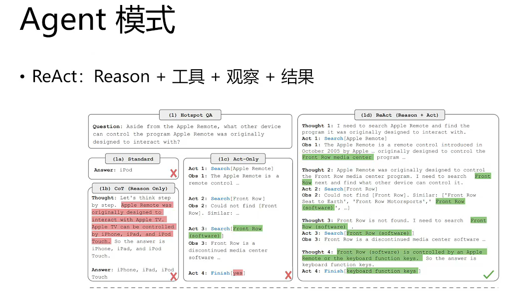

# 基于ReAct机制的AI Agent 

在各个大厂纷纷卷LLM的情况下，各自都借助自己的LLM推出了自己的AI Agent，比如字节的Coze，百度的千帆等，还有开源的Dify。

你是否想知道其中的原理？是否想过自己如何实现一套AI Agent？当然，借助LangChain就可以。

## 1. 简述AI Agent



何为AI Agent呢？如果拿人来对比的话，AI Agent就是一个会思考和行动的人，其中LLM就是这个人的大脑。

说白了，AI Agent就是借助LLM这个大脑，加上一些 能够感知外部环节 和 能够发起行动 的部件，共同组成的一个 机器人。

那怎样能够让 AI Agent这个机器人，充分利用LLM 和 各种部件呢？那ReAct就是这个协作工具。**利用ReAct机制**，LLM可以很好的结合外部环境和行动组件，形成一个完整的AI Agent。

下面将探讨ReAct框架的概念、原理、优势，并通过代码示例展示**如何在LangChain中使用ReAct构建AI Agent**。

## 2. ReAct概念和原理

### 2.1 为什么需要ReAct

我们知道，LLM在训练完毕后，会具备较强的推理能力，但是他的知识随着时间的推移会过时，但是又不可能经常性的去训练LLM，毕竟每次训练的成本太高了。

那怎么解决这个问题？机器可以像人一样自己主动去学习和搜索新知识呀。

那机器怎么知道什么时候该去搜索知识？什么时候该去调用什么样的工具解决当前的问题呢？

ReAct应运而生。ReAct的核心在于，推理和行动（**Reasoning and Action**）。

### 2.2 ReAct的定义

ReAct（`Reasoning and Action`）是一个框架，其概念来源于一篇论文，其核心思想，就是通过`思维链`的方式，引导模型将复杂问题进行拆分，一步一步地进行推理（`Reasoning`）和行动（`Action`），同时还引入了观察（`Observation`）环节，在每次执行（`Action`）之后，都会先观察（`Observation`）当前现状，然后再进行下一步的推理（`Reason`）。

ReAct这个框架，就是要让LLM，进行推理，然后采取行动与外界环境互动。

ReAct这个框架，就是要让开发者一步步引导LLM进行推理，然后根据推理的结果，判断采取哪个行动。

### 2.3 ReAct的核心组件

ReAct框架的核心组件包括：

- **思维链（Chain of Thought）**：将一个大的复杂任务进行拆解，拆解成多个思维步骤。
- **推理（Reasoning）**：负责分析和处理输入的数据，生成有效的决策。
- **行动（Action）**：执行具体的操作，比如搜索、执行代码，或者其余自定义的行动。
- **观察（Observation）**：监控和收集环境反馈的数据，为下一步的推理和行动提供依据。

### 2.4 工作流程

ReAct框架的工作流程如下：

1. **输入数据**：接收用户输入或环境数据。

2. **推理阶段**：分析输入数据，生成决策和计划。

3. **行动阶段**：根据决策执行具体操作。

4. **观察阶段**：监控操作结果，收集反馈数据。

5. **循环迭代**：根据反馈数据调整推理和行动，持续优化结果。

### 2.5 举个例子说明ReAct步骤

   比如，要知道2024年周杰伦最新的演唱会是时间和地点是什么，通过ReAct机制，会被拆解成以下步骤：

   ```text
   推理1：用户想知道2024年周杰伦最新的演唱会是时间和地点是什么，需要查找最新的信息。
   行动1：调用Google的搜索API进行搜索。
   观察1：搜索结束，搜索的结果中出现一些关于《2024年周杰伦最新的演唱会》的网页信息。
   
   推理2：搜索出来的网页较多，大概浏览前6个网页的具体内容。
   行动2：点击第一个网页，开始浏览。
   观察2：浏览结束，浏览的网页内容提及到了2024年周杰伦最新的演唱会信息。
   
   推理3：针对网页的内容进行，问题的总结。
   结果：将最终的答案输出给用户。
   ```

## 3. LangChain的ReAct机制实现AI Agent

以上我们已经了解的原理和步骤，接下来我们使用LangChain定义一个ReAct机制的AI Agent。

### 3.1 示例

比如，在不使用ReAct机制借助外部工具的情况下，让LLM帮我们计算两个小数相加，则直接出错。

然后，借助ReAct机制，会让LLM自动使用自定义工具，最终计算正确。

然后，继续测试，问别的问题，借助ReAct机制，则不会使用到工具，直接给出答案。

### 3.2 代码

具体代码如下：

```python
from langchain import hub
from langchain.agents import create_structured_chat_agent, AgentExecutor
from langchain.memory import ConversationBufferMemory
from langchain.schema import HumanMessage
from langchain.tools import BaseTool
from langchain_openai import ChatOpenAI

# 模型
model = ChatOpenAI(model="gpt-3.5-turbo",
                   openai_api_key="sk-XXXXXXXXXX",
                   openai_api_base="https://api.aigc369.com/v1")
# 直接让模型计算数字，模型会算错
model.invoke([HumanMessage(content="你帮我算下，3.941592623412424+4.3434532535353的结果")])


# 下面开始使用ReAct机制，定义工具，让LLM使用工具做专业的事情。

# 定义工具，要继承自LangChain的BaseTool
class SumNumberTool(BaseTool):
    name = "数字相加计算工具"
    description = "当你被要求计算2个数字相加时，使用此工具"

    def _run(self, a, b):
        return a.value + b.value
        
# 工具合集
tools = [SumNumberTool()]
# 提示词，直接从langchain hub上下载，因为写这个ReAct机制的prompt比较复杂，直接用现成的。
prompt = hub.pull("hwchase17/structured-chat-agent")
# 定义AI Agent
agent = create_structured_chat_agent(
    llm=model,
    tools=tools,
    prompt=prompt
)
# 使用Memory记录上下文
memory = ConversationBufferMemory(
    memory_key='chat_history',
    return_messages=True
)
# 定义AgentExecutor，必须使用AgentExecutor，才能执行代理定义的工具
agent_executor = AgentExecutor.from_agent_and_tools(
    agent=agent, tools=tools, memory=memory, verbose=True, handle_parsing_errors=True
)
# 测试使用到工具的场景
agent_executor.invoke({"input": "你帮我算下3.941592623412424+4.3434532535353的结果"})

# 测试不使用工具的场景
agent_executor.invoke({"input": "请你充当稿件审核师，帮我看看'''号里的内容有没有错别字，如果有的话帮我纠正下。'''今天班级里的学生和老实要去哪里玩'''"})        
```

