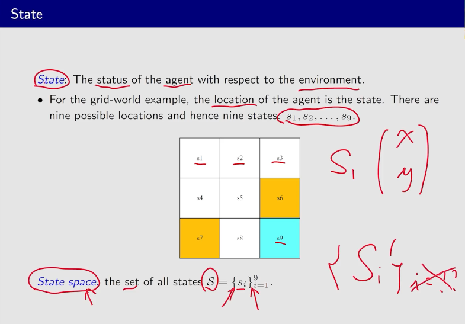
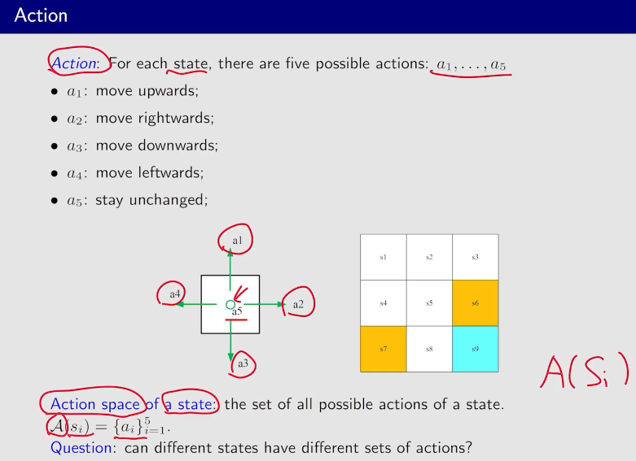
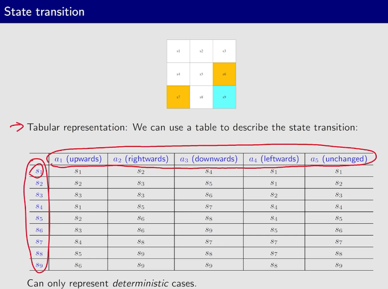

# 强化学习

## Chapter1 基本概念

### 状态（状态空间State）

### 动作（Action）

### 状态转换（State Transition）

**以上表格表示状态转移是确定的例子**

**状态转换随机化**

### 策略（Policy） 

**每一个状态都会有策略**

### 奖励（Reward）

### Trajectory（轨迹）和Return 

**discounted return** 

### Episode（finite trajectory）

### MDP

**马尔科夫过程和马尔科夫决策过程**

>
>
>

## Chapter2 贝尔曼公式

**为什么return重要**

### bellman公式

**计算return**

### State Value

### Bellman Equation