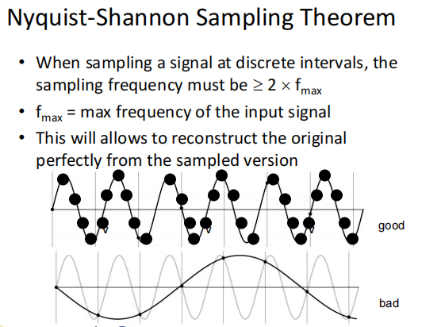
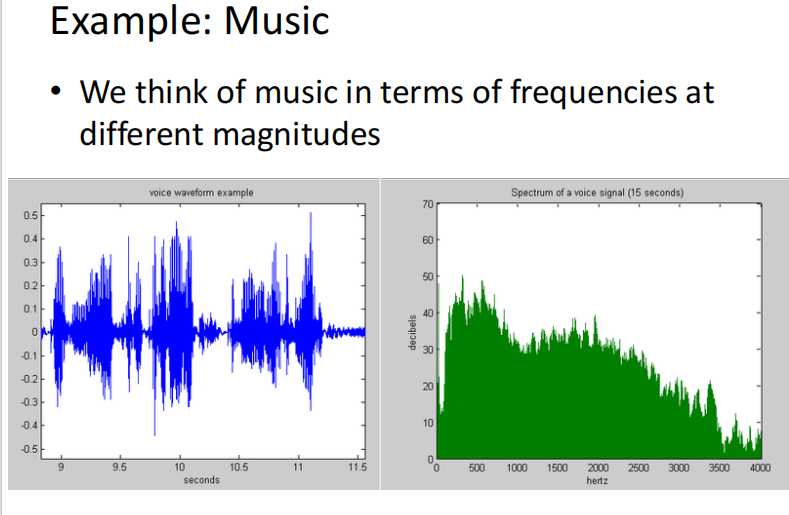
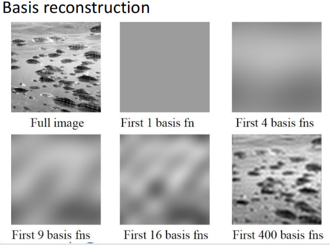
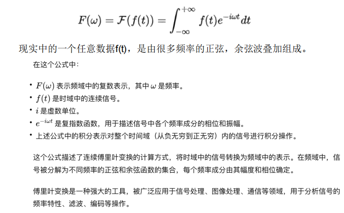
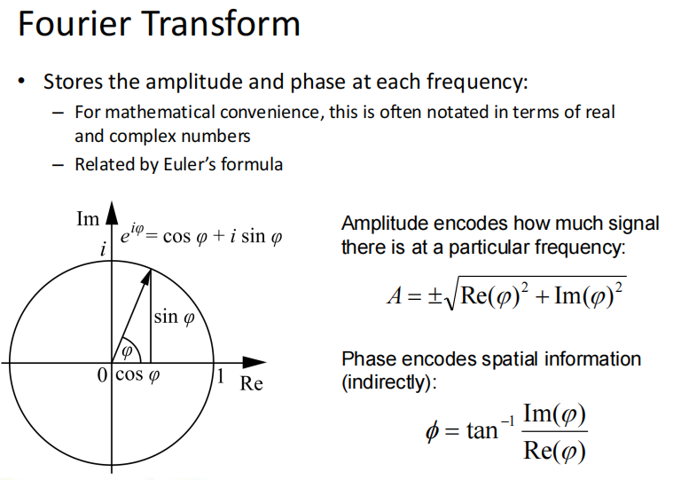

## 频域-Image filters in the frequency domain

图像本质上是由像素组成的，而像素的灰度值或颜色值在空间上是有变化的。这种变化可以映射到频率的概念上。频率描述的是某种模式有多快重复，比如缓慢变化的区域（低频）和快速变化的边缘或纹理（高频）。

大象的图像可能更多包含低频成分，因为它的形状较大而简单，而豹子的图像可能包含更多的高频成分，因为斑点和细节更丰富。

1. **第一个图表**：
   - **低通滤波器的频率响应**：
     - 横轴表示频率（cycles/image），纵轴表示增益（gain）。
     - 从图表中可以看到，增益在低频区域（0到16 cycles/image）接近1，而在高频区域（16 cycles/image以上）迅速下降到0。这表明这个低通滤波器允许低频信号通过，而高频信号被完全衰减。
     - 低通滤波器通常用于平滑图像，减少噪声，或者去除图像中的高频细节。
2. **第二个图表**：
   - **高通滤波器的频率响应**：
     - 横轴表示频率（cycles/image），纵轴表示增益（gain）。
     - 从图表中可以看到，增益在低频区域（0到24 cycles/image）接近0，而在高频区域（24 cycles/image以上）迅速上升到1。这表明这个高通滤波器允许高频信号通过，而低频信号被完全衰减。
     - 高通滤波器通常用于突出图像的边缘和细节，或者用于增强图像的对比度。

### 频率的应用

1. **低通滤波器的应用**：
   - **图像平滑**：通过去除高频噪声，使图像看起来更平滑。
   - **背景提取**：通过保留低频成分，突出图像的背景部分。
2. **高通滤波器的应用**：
   - **边缘检测**：通过保留高频成分，突出图像的边缘和细节。
   - **图像增强**：通过增强高频成分，使图像看起来更清晰。

### 频率在图片中的意义

在图像处理中，频率通常指的是图像中像素值变化的快慢。具体来说：

- **低频**：表示图像中缓慢变化的部分，通常对应于图像的整体结构和大范围的颜色变化。
- **高频**：表示图像中快速变化的部分，通常对应于图像的细节和边缘。

### 为什么图片会有频率

1. **图像的频率特性**：
   - 图像中的每个像素值可以看作是一个信号。这些信号在空间上的变化可以用频率来描述。
   - 例如，一个平滑的背景区域（如天空）通常具有低频特性，而一个复杂的纹理区域（如豹子的斑点）则具有高频特性。
2. **频率处理的应用**：
   - 通过频率分析，可以突出或抑制图像的某些特性。
   
   - 例如，通过去除低频成分，可以突出图像的边缘和细节；通过去除高频成分，可以平滑图像，减少噪声。
   
   - **低频例子：变化慢**
   
     $ \begin{bmatrix} 10 & 11 & 12 & 13 \\ 11 & 12 & 13 & 14 \\ 12 & 13 & 14 & 15 \\ 13 & 14 & 15 & 16 \\ \end{bmatrix} $
   
     👉 灰度值逐渐变亮，相邻差值都很小（变化**慢**）。
      这就是低频。
   
     **高频例子：变化快**
   
     $ \begin{bmatrix} 10 & 20 & 10 & 20 \\ 20 & 10 & 20 & 10 \\ 10 & 20 & 10 & 20 \\ 20 & 10 & 20 & 10 \\ \end{bmatrix} $
   
     👉 灰度值在相邻像素间频繁“上下跳”（变化**快**）。
      这就是高频。
   
     注意这里振幅并不大（只是 10 和 20 之间），但因为变化**频繁**，仍然是高频。

## 奈奎斯特-香农采样定理

采样频率是指在数字信号处理中，每秒钟从连续信号中提取并记录的样本数量。它通常用赫兹（Hz）或每秒样本数（samples per second）来表示。采样频率的高低直接影响到数字信号对原始连续信号的还原能力。

### 奈奎斯特-香农采样定理介绍

- **采样频率**：当对信号进行采样时，采样频率 $f_s$ 必须大于信号中最高频率 *f*max 的两倍。即$f_s$≥2fmax。
- **完美重建**：如果满足上述条件，我们可以从采样版本中完美地重建原始信号。

### 例子解释

为了更好地理解这个定理，我们可以考虑一个简单的例子。假设我们有一个频率为 *f*max=100 Hz 的正弦波信号。

- **好的采样情况**（满足奈奎斯特-香农采样定理）：
  - 设采样频率 $f_s$=210 Hz，满足 $fs$≥2×100=200 Hz。
  - 在这种情况下，每个周期内有超过两个样本点，能够准确地捕捉到信号的形状和特征，从而可以完美地重建原始信号。
- **坏的采样情况**（不满足奈奎斯特-香农采样定理）：
  - 设采样频率 $f_s$=150 Hz，不满足 $f_s$≥200 Hz 的条件。
  - 这时，每个周期内只有不到两个样本点，可能无法准确地捕捉到信号的形状和特征，导致无法完美地重建原始信号，可能引入失真和错误。

## 傅里叶变换 FOURIER SERIES & FOURIER TRANSFORMS

### 1.我们认为音乐的频率是不同的

1. **左图：语音波形示例**：
   - 这是一个时间域的波形图，显示了语音信号随时间的变化。
   - 横轴表示时间（秒），纵轴表示信号的幅度（通常归一化到-1到1之间）。
   - 波形图中可以看到，语音信号在某些时间段内有明显的峰值和谷值，这些对应于语音的音节和停顿。
   
2. **右图：语音信号的频谱（15秒）**：
   - 这是一个频率域的图，显示了语音信号在不同频率上的能量分布。
   
   - 横轴表示频率（赫兹，Hz），纵轴表示能量（通常用分贝，dB）。
   
   - 频谱图中可以看到，语音信号在低频区域（0到约2000 Hz）有较高的能量，而在高频区域（2000 Hz以上）能量逐渐减弱。
   
### 2.图片解释-基础重建

基函数在图像处理和计算机视觉中用于图像的分解和重建，常见的基函数包括傅里叶基、小波基、离散余弦基等。

1. **Full image**:
   - 左上角的图片是原始图像，显示了完整的图像内容。
2. **First 1 basis fn**:
   - 右上角的图片是使用第一个基函数重建的图像。由于只有一个基函数，图像非常模糊，只能看到非常粗糙的轮廓。
3. **First 4 basis fns**:
   - 中上部的图片是使用前四个基函数重建的图像。相比于第一个基函数，图像的细节有所增加，但仍然不够清晰。
4. **First 9 basis fns**:
   - 左下角的图片是使用前九个基函数重建的图像。图像的细节进一步增加，开始能够辨认出一些主要的特征。
5. **First 16 basis fns**:
   - 中下部的图片是使用前十六个基函数重建的图像。图像的细节更加丰富，接近原始图像。
6. **First 400 basis fns**:
   - 右下角的图片是使用前四百个基函数重建的图像。此时，图像已经非常接近原始图像，细节和纹理都得到了较好的还原。

#### 为什么使用基函数重建图像

1. **图像分解**:
   - 图像可以被分解为多个基函数的线性组合。每个基函数代表图像的某个特征或模式。
2. **图像重建**:
   - 通过选择不同数量的基函数，可以逐步逼近原始图像。基函数数量越多，重建的图像越接近原始图像。
3. **压缩和去噪**:
   - 使用较少的基函数可以用于图像压缩，因为只需要存储基函数的系数而不是整个图像。同时，这种方法也可以用于图像去噪，通过忽略高频噪声成分。

### 3.时域转频域-傅里叶变换公式

傅里叶变换的数学表达式如下：

$$
F(\omega) = \int_{-\infty}^{+\infty} f(t)e^{-i\omega t} dt
$$

这个公式将时域中的信号 $f(t)$ 转换为频域中的表示 $F(\omega)$。在频域中，信号被分解为不同频率的正弦和余弦函数的集合，每个频率成分由其幅度和相位确定。

其中，*F(ω)* 是变换后的频谱函数，*f(t)* 是原始时域信号，*ω* 是角频率，$e^{-iωt}$ 是复指数函数。这个公式表明，通过将时域信号与一系列复指数函数相乘并积分，我们可以得到信号在不同频率下的频谱分布。

#### 公式解释

- $F(\omega)$ **:**$F(\omega)$ 是频域中的复数表示，其中 $\omega$ 是频率。它描述了信号在不同频率上的幅度和相位。

- $f(t)$ **:** $f(t)$ 是时域中的连续信号。它可以是任何时间函数，例如声音信号、图像信号等。

- $i$ **: **$i$ 是虚数单位，满足 $i^2 = -1$。

- $e^{-i\omega t}$ **:**  $e^{-i\omega t}$ 是复指数函数，用于描述信号中各个频率成分的相位和振幅。根据欧拉公式，可以表示为：

$$
e^{-i\omega t} = \cos(\omega t) - i\sin(\omega t)
$$

**积分**

积分范围是从负无穷到正无穷，表示对整个时间域内的信号进行积分操作。这个积分将时域信号 $f(t)$ 与复指数函数 $e^{-i\omega t}$ 相乘，然后对所有时间点进行积分，得到频域表示 $F(\omega)$。

#### 例子

假设我们有一个简单的时域信号 $f(t) = \cos(\omega_0 t)$，我们想用傅里叶变换将其转换为频域表示。

##### 傅里叶变换计算：
$$
F(\omega) = \int_{-\infty}^{+\infty} \cos(\omega_0 t) e^{-i\omega t} dt
$$

利用欧拉公式：
$$
\cos(\omega_0 t) = \frac{1}{2} \left(e^{i\omega_0 t} + e^{-i\omega_0 t} \right)
$$

代入积分：
$$
F(\omega) = \int_{-\infty}^{+\infty} \frac{1}{2} \left(e^{i\omega_0 t} + e^{-i\omega_0 t} \right) e^{-i\omega t} dt
$$

$$
F(\omega) = \frac{1}{2} \int_{-\infty}^{+\infty} \left(e^{i(\omega_0 - \omega)t} + e^{-i(\omega_0 + \omega)t} \right) dt
$$

##### 积分结果：
积分 $\int_{-\infty}^{+\infty} e^{i(\omega_0 - \omega)t} dt$ 和 $\int_{-\infty}^{+\infty} e^{-i(\omega_0 + \omega)t} dt$ 都是狄拉克 $\delta$ 函数（Dirac delta function）的表示形式。因此，结果为：

$$
F(\omega) = \frac{1}{2} \left( 2\pi \delta(\omega - \omega_0) + 2\pi \delta(\omega + \omega_0) \right)
$$

简化后：

$$
F(\omega) = \pi \left( \delta(\omega - \omega_0) + \delta(\omega + \omega_0) \right)
$$

#### 结果解释

##### 频域表示：
$F(\omega)$ 在 $\omega = \omega_0$ 和 $\omega = -\omega_0$ 处有两个尖峰，表示信号 $f(t) = \cos(\omega_0 t)$ 由这两个频率成分组成。

##### 幅度：
每个尖峰的幅度为 $\pi$，表示这些频率成分的强度。

#### 总结

傅里叶变换将时域信号转换为频域表示，帮助我们分析信号的频率成分。在这个例子中，我们看到一个简单的余弦信号在频域中表现为两个尖峰，分别对应于其正频率和负频率成分。这种方法在信号处理、图像处理和通信等领域有广泛的应用。

### 4.傅里叶变换公式的解释

你可以把 $(u,v)$ 想象成一个“频率坐标”：

- **横坐标 u** = 控制横向的纹理
- **纵坐标 v** = 控制纵向的纹理

所以频谱图其实就是一个「频率地图」：

- 中心点是低频（平滑背景）
- 四周是高频（边缘、细节）

>#### 1. 一维傅里叶变换
>
>在一维情况下（比如一个信号 $x[n]$，长度 $N$）：
>
>$$
>X[k] = \sum_{n=0}^{N-1} x[n] e^{-i 2\pi kn / N}
>$$
>
>- $k$ 是 **频率索引**，取值 $0,1,2,\dots,N-1$  
>- 每个 $k$ 对应一个正弦/余弦波，频率 = $k/N$（单位：周期/样本）  
>- 所以结果矩阵里的第 $k$ 个位置 = 频率 $k$ 的强度和相位。  
>
>---
>
>#### 2. 二维傅里叶变换
>
>如果信号是二维矩阵（图像）：
>
>$$
>F(u,v) = \sum_{x=0}^{M-1} \sum_{y=0}^{N-1} f(x,y)\, e^{-i 2\pi \left( \frac{ux}{M} + \frac{vy}{N} \right)}
>$$
>
>- $(u,v)$ 是 **频率索引**：  
>  - $u$ 控制 **水平方向的频率**（左右波动有多快）  
>  - $v$ 控制 **竖直方向的频率**（上下波动有多快）  
>
>---
>
>#### 3. 类比例子
>
>拿一个 $4 \times 4$ 图像来说：
>
>- 原图大小 = $M=N=4$  
>- 可能的频率索引 $(u,v) \in \{0,1,2,3\} \times \{0,1,2,3\}$  
>
>比如：  
>
>- $(0,0)$：没有波动 → 图像整体亮度  
>- $(1,0)$：水平方向 1 个波动周期（横向条纹）  
>- $(0,1)$：竖直方向 1 个波动周期（竖向条纹）  
>- $(2,0)$：水平方向 2 个周期（更密的横条纹）  
>- $(u,v)$ 越大，代表图像变化得越快（高频）  
>
>---
>
>#### 4. 直观图像
>
>你可以把 $(u,v)$ 想象成一个“频率坐标”：  
>
>- **横坐标 $u$** = 控制横向的纹理  
>- **纵坐标 $v$** = 控制纵向的纹理  
>
>所以频谱图其实就是一个「频率地图」：  
>
>- 中心点是低频（平滑背景）  
>- 四周是高频（边缘、细节）  
>
>---
>
>✅ 总结一句： 
>在二维傅里叶变换里，矩阵里每个位置 $(u,v)$ 对应一个“二维正弦波”的频率，$u$ 控制横向的波动次数，$v$ 控制纵向的波动次数。

#### 欧拉公式：

为了数学上的便利，幅度和相位通常用实数和复数表示。

欧拉公式将复数与正弦和余弦函数联系起来：
$$
e^{i\varphi} = \cos\varphi + i\sin\varphi
$$

这个公式将复数 $e^{i\varphi}$ 表示为正弦和余弦函数的组合，其中 $\varphi$ 是相位。

#### 幅度计算公式：

幅度表示在特定频率下信号的强度。

数学上，幅度 $A$ 可以通过复数的实部和虚部计算得出：
$$
A = \pm \sqrt{\text{Re}(\varphi)^2 + \text{Im}(\varphi)^2}
$$

这个公式计算复数 $\varphi$ 的幅度，其中 $\text{Re}(\varphi)$ 是实部，$\text{Im}(\varphi)$ 是虚部。

#### 相位计算公式：

相位编码了空间信息（间接地）。

相位 $\varphi$ 可以通过复数的实部和虚部计算得出：
$$
\varphi = \tan^{-1} \left( \frac{\text{Im}(\varphi)}{\text{Re}(\varphi)} \right)
$$

这个公式计算复数 $\varphi$ 的相位，其中 $\text{Re}(\varphi)$ 是实部，$\text{Im}(\varphi)$ 是虚部。

#### 总结

傅里叶变换将时域信号转换为频域表示，帮助我们分析信号的频率成分。在频域中，每个频率成分由其幅度和相位确定。这些公式帮助我们从复数表示中提取幅度和相位信息，从而更好地理解信号的频率特性。

---

### 5.计算

这个公式描述了 **傅里叶变换（Fourier Transform）** 的结果，即频域中信号的 **振幅（Amplitude）** 和 **相位（Phase）** 的计算方法。

傅里叶变换将一个信号从 **时域（time domain）** 转换到 **频域（frequency domain）**，转换后的结果是一个 **复数**，表示每个频率上的幅度和相位信息。通常，我们用符号 **$\varphi$**（或 **$F(\omega)$**）表示这个复数：

$\varphi = \text{Re}(\varphi) + j \cdot \text{Im}(\varphi)$

其中：

- **$\text{Re}(\varphi)$** 表示复数的实部（Real part）。
- **$\text{Im}(\varphi)$** 表示复数的虚部（Imaginary part）。
- **$j$** 是虚数单位，满足 $j^2 = -1$。

#### 1. 振幅（Amplitude）计算

振幅表示该频率分量的强度，计算公式是：

$A = \sqrt{\text{Re}(\varphi)^2 + \text{Im}(\varphi)^2}$

这个公式来源于复数的模（Magnitude），即在复数平面上计算向量的长度：

$|\varphi| = \sqrt{x^2 + y^2}$

其中：

- **$x = \text{Re}(\varphi)$** 是复数的实部。
- **$y = \text{Im}(\varphi)$** 是复数的虚部。

这个公式的几何意义是：在复平面上，每个频率对应一个向量，该向量的长度就是该频率分量的 **振幅**。

------

#### 2. 相位（Phase）计算

相位表示该频率分量的相对位置信息，计算公式是：

$\phi = \tan^{-1} \left( \frac{\text{Im}(\varphi)}{\text{Re}(\varphi)} \right)$

这个公式的意义是：在复数平面上，角度 **$\phi$** 是复数向量与实轴（x 轴）之间的夹角。

这个角度可以用反正切函数 **$\tan^{-1}$** 计算出来，它表示信号在该频率上的相对偏移（相移）。

------

#### 总结

- **振幅** $A$ 代表信号在该频率上的强度。
- **相位** $\phi$ 代表信号的时间（空间）偏移信息。
- 这些值是从复数 $\varphi = \text{Re}(\varphi) + j \cdot \text{Im}(\varphi)$ 计算出来的。

这个公式在 **信号处理、图像分析、通信、音频处理** 等领域都非常重要！
