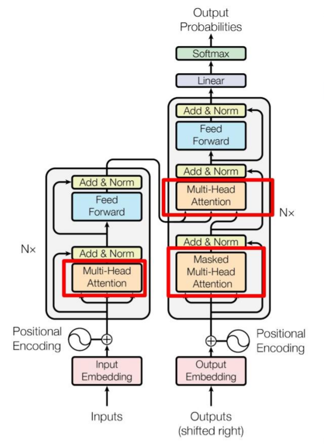
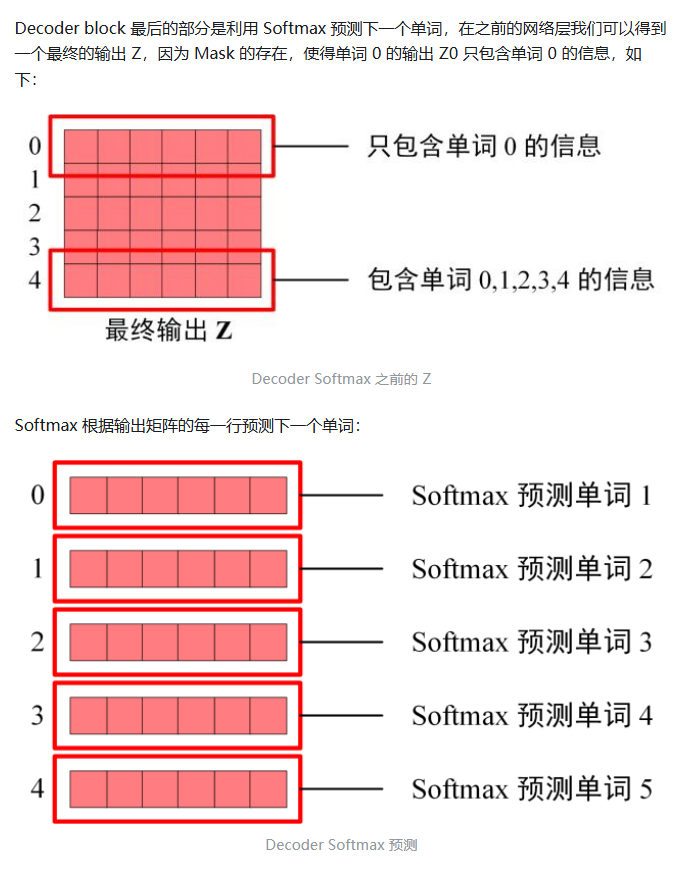

# QLoRA和LoRA

------

## 一句话总结

| 项目       | **LoRA**              | **QLoRA**                       |
| ---------- | --------------------- | ------------------------------- |
| 主模型权重 | 全精度（FP16 / BF16） | **4-bit量化（int4）**           |
| 目标       | 减少训练参数          | **减少显存占用 + 保持微调能力** |
| 显存需求   | 中等                  | **极低（节省3～4倍）**          |
| 效果       | 与全精度几乎相同      | 几乎相同（轻微波动 <1%）        |
| 适用场景   | GPU显存 ≥24GB         | GPU显存较小（8GB~16GB）         |

------

##  二、原理层面区别

### LoRA（Low-Rank Adaptation）

LoRA 的思路是：

> 不改动原模型的参数，只在部分层（通常是注意力层）插入一个可训练的“低秩矩阵”。

公式如下：
 $[
 W' = W + \Delta W = W + BA
 $]
 其中：

- $ W $：原始冻结的权重矩阵
- $ A,B $：小矩阵（低秩 r ≪ d），可训练

👉 优点：

- 只需训练几百万参数
- 显存占用低（相对全参数微调）
- 支持合并 LoRA 适配器（多任务共存）

👉 缺点：

- 主模型仍需 FP16/BF16 加载
- 对 7B、13B 以上模型仍然吃显存（>20GB）

------

### QLoRA（Quantized LoRA）

QLoRA 是 LoRA 的改进版（由 Hugging Face 推出）。
 核心思路是：

> **把主模型进一步量化到 4-bit（int4），然后在量化权重的“近似浮点空间”上做 LoRA 微调。**

结构上是：
$ [
 W_q' = \text{QuantDequant}(W_{int4}) + BA
 ]$
 也就是说：

- 主模型是 **4-bit 权重**
- LoRA Adapter 是 **可训练浮点参数**
- 前向时仍是浮点计算（有 dequantization）

👉 优点：

- 显存占用降至原来的 $1/3～1/4$
- 微调速度快
- 几乎不损失精度（论文测试差距 <0.3%）

👉 缺点：

- 理论复杂一些（需要 bitsandbytes 或 peft 支持）
- 不能合并多个 adapter 直接量化（需重新量化）

------

## 三、显存占用对比（以 LLaMA-7B 为例）

| 微调方式   | 主模型精度 | 显存占用   | 可行GPU           |
| ---------- | ---------- | ---------- | ----------------- |
| 全参数微调 | FP16       | ~60 GB     | A100 80GB         |
| LoRA       | FP16       | ~22 GB     | RTX 3090 / 4090   |
| **QLoRA**  | 4-bit      | **~10 GB** | RTX 3060 / 4060Ti |

👉 这也是为什么很多人用 QLoRA 微调 13B / 70B 模型。

------

## 四、Hugging Face 使用方式区别

### LoRA 微调示例：

```python
from peft import LoraConfig, get_peft_model
from transformers import AutoModelForCausalLM

model = AutoModelForCausalLM.from_pretrained("meta-llama/Llama-3-8B-Instruct",
                                             torch_dtype=torch.bfloat16,
                                             device_map="auto")

config = LoraConfig(r=8, lora_alpha=16, target_modules=["q_proj","v_proj"])
model = get_peft_model(model, config)
```

------

### QLoRA 微调示例：

```python
from transformers import AutoModelForCausalLM, BitsAndBytesConfig
from peft import LoraConfig, get_peft_model

bnb_config = BitsAndBytesConfig(
    load_in_4bit=True,
    bnb_4bit_quant_type="nf4",  # NormalFloat4
    bnb_4bit_use_double_quant=True,
)

model = AutoModelForCausalLM.from_pretrained(
    "meta-llama/Llama-3-8B-Instruct",
    quantization_config=bnb_config,
    device_map="auto"
)

config = LoraConfig(r=8, lora_alpha=16, target_modules=["q_proj","v_proj"])
model = get_peft_model(model, config)
```

------

## 五、总结一句话版

> **LoRA**：冻结 FP16 模型，只训练小矩阵，省参数。
> **QLoRA**：冻结 4-bit 模型，在其上训练小矩阵，更省显存。

------

##  LoRA vs QLoRA 的结构示意图

 **LoRA vs QLoRA 的结构示意图**（对比冻结层、插入层、量化层）？

下面这张图会帮你一眼看懂 **LoRA** 和 **QLoRA** 的区别。
 我会用文字方式“画”出结构关系（很像教材里的简图）👇

### LoRA 原理图（标准版）

```
           ┌──────────────────────────────┐
           │         原始权重层 W         │  ← FP16/BF16 精度
           └──────────────────────────────┘
                          │
                          ▼
                 ┌────────────────┐
                 │ LoRA 插入层 BA │  ← 低秩矩阵，可训练
                 └────────────────┘
                          │
                          ▼
                输出 = X × (W + BA)
```

**解释：**

- `W` 冻结不更新（模型主干）
- `BA` 是一个小的可训练矩阵
- 整个模型仍是 FP16 加载（显存约 20GB 起）

👉 优点：简单、兼容性强
👉 缺点：主模型仍占大显存

### QLoRA 原理图（量化版）

```
           ┌──────────────────────────────┐
           │   量化权重层 W_int4 (4-bit)  │  ← 主模型量化存储
           └──────────────────────────────┘
                          │
         (反量化 Quant-DeQuant in runtime)
                          │
                          ▼
                 ┌────────────────┐
                 │ LoRA 插入层 BA │  ← 低秩矩阵，可训练（FP16）
                 └────────────────┘
                          │
                          ▼
              输出 = X × (DeQuant(W_int4) + BA)
```

**解释：**

- 主模型 `W_int4` 是 **4-bit 量化权重**（超省显存）
- 运行时会临时反量化为 FP16 计算
- LoRA 部分仍在浮点空间训练
- 显存通常只需 1/3～1/4（例如 8B 模型约 10GB）

优点：**省显存 + 可训练**
缺点：依赖 bitsandbytes / peft 支持

### 对比总结表

| 对比项       | LoRA            | QLoRA                 |
| ------------ | --------------- | --------------------- |
| 主模型精度   | FP16/BF16       | 4-bit（int4）         |
| 可训练部分   | LoRA adapter    | LoRA adapter          |
| 是否冻结主干 | ✅               | ✅                     |
| 显存占用     | 中等            | ⭐ 极低                |
| 支持库       | `peft`          | `peft + bitsandbytes` |
| 典型用例     | RTX 3090 / 4090 | RTX 3060 / 4060Ti     |
| 性能损失     | 无              | < 1%（几乎无）        |

------

💡一句话记忆：

> **LoRA = 冻结 FP16 模型 + 训练低秩矩阵**
> **QLoRA = 量化 FP16 → 4-bit + 冻结 + 训练低秩矩阵**

# 模型的结构

**权重、logits、输入输出位置**）是理解 Transformer / LLM 工作原理的核心之一。让你能**从输入→中间→输出**完整理解整个链条。

## 一、模型的结构（宏观视角）

一个语言模型（比如 Llama、Qwen、GPT）其实就是一个**巨大的函数**：

输出 $ logits=f(输入 tokens;权重 W)$

整个流程可以拆成 3 个阶段：

```
输入文本 → [嵌入层] → [Transformer 层堆叠 × N] → [输出层] → logits
```

## 二、权重（Weights）在模型中的位置、

### Transformer模型



**decoder 部分**



### 权重

**权重**（weights）是指模型中所有可训练参数。它们存在于整个模型的每一层：

| 模块                        | 权重示例                                          | 作用                         |
| --------------------------- | ------------------------------------------------- | ---------------------------- |
| **Embedding 层**            | `word_embeddings.weight`                          | 把单词（token ID）映射到向量 |
| **自注意力层（Attention）** | `q_proj.weight`, `k_proj.weight`, `v_proj.weight` | 控制信息如何“关注”上下文     |
| **前馈层（FeedForward）**   | `linear1.weight`, `linear2.weight`                | 把注意力结果映射回高维空间   |
| **LayerNorm 等层**          | `gamma`, `beta`                                   | 控制归一化后的比例           |
| **输出层（LM Head）**       | `lm_head.weight`                                  | 把隐藏向量映射为词汇表分数   |

💬 所以：

> 模型的权重贯穿整个网络，从输入层到输出层都有。

⚙️ 当我们说 “模型权重大小是 8B（80亿）”，指的就是**全模型中所有层的参数数量总和**。

### Lora 权重参数的位置


## 三、Logits 是什么？

这是很多人一开始容易模糊的地方。

简单讲：

> **logits 是模型输出的“原始分数”，在 softmax 之前。**

------

### 举例：

假设模型的词表大小是 50,000
 当你输入一句话 `"I love"`，模型预测下一个词时：

1️⃣ 最后一层输出一个向量（logits），长度为 50,000

```
logits = [ -2.1, 0.7, 5.4, -1.3, ... ]
```

每个数字对应词表中的一个词，比如：

```
"you" → 5.4
"me" → 0.7
"hate" → -2.1
```

这些就是“得分”。

2️⃣ 再通过 **Softmax** 转换为概率分布：

```
P("you") = exp(5.4) / Σ exp(logits)
```

最后输出概率最高的词作为预测。

------

### 图示理解：

```
隐藏层输出 → Linear(权重矩阵 W) → logits → softmax → 预测下一个token
```

也就是：

```
[隐向量] × [lm_head.weight] = [logits]
```

## 四、关系总结（权重 vs logits）

| 名称                   | 属于     | 含义                  | 是否可训练      |
| ---------------------- | -------- | --------------------- | --------------- |
| **权重（Weights）**    | 模型参数 | 控制模型如何处理输入  | ✅（训练中更新） |
| **logits**             | 模型输出 | 每个词的“原始分数”    | ❌（推理时产生） |
| **概率（Softmax 后）** | 派生量   | logits 转换成概率分布 | ❌               |

### 举个比喻：

你可以把整个模型想成一个「乐团」：

- 🎻 **权重**：是每个乐手的演奏技巧和音色参数（在训练中学习出来）
- 🎵 **输入 token**：是谱子（指令）
- 🔊 **logits**：是乐团演奏完的原始声音信号，还没混音（softmax）
- 🎧 **softmax 输出**：是听众感受到的概率结果（最终选出的单词）

### 额外补充：微调时调整的是哪些权重？

在 LoRA / QLoRA 中：

- 模型的主要权重（W）被冻结
- 只在某些子层中添加小矩阵（A、B）
- 训练时只更新这些新增的参数（例如在 Attention 层）