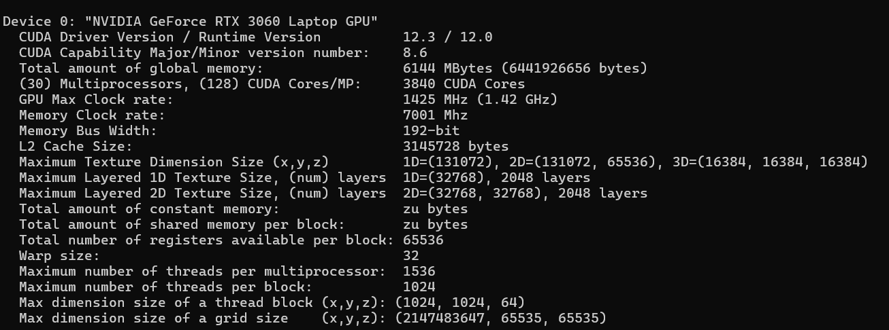
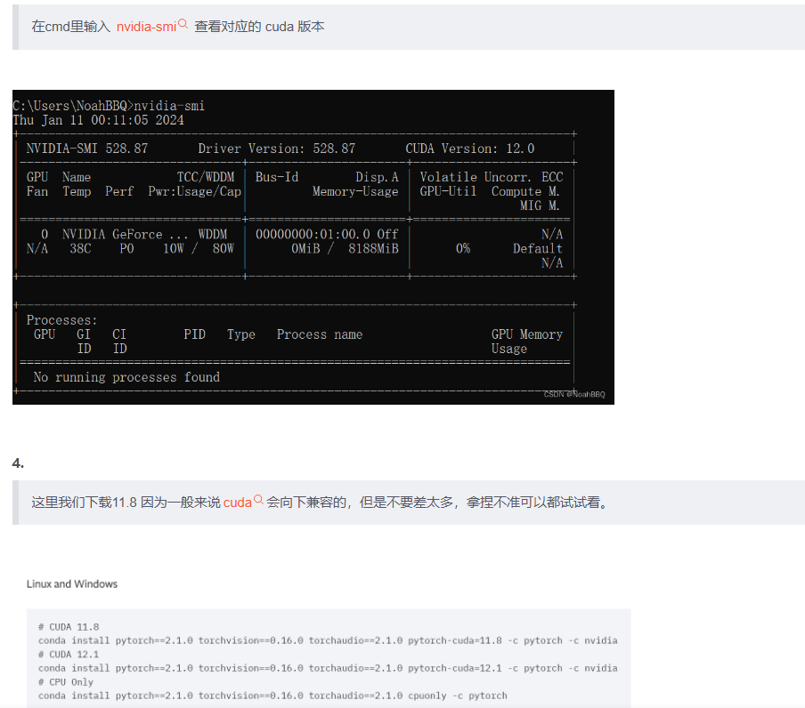

# 安装CUDA

 ## CUDA安装

 windows10 版本安装 [CUDA](https://so.csdn.net/so/search?q=CUDA&spm=1001.2101.3001.7020) ，首先需要下载两个安装包

- CUDA toolkit（toolkit就是指工具包）
- cuDNN

注：cuDNN 是用于配置深度学习使用

cuDNN 其实就是 CUDA 的一个补丁而已，专为深度学习运算进行优化的。

- CUDA：为“GPU通用计算”构建的运算平台。

- cudnn：为深度学习计算设计的软件库。

- CUDA Toolkit (nvidia)： CUDA完整的工具安装包，其中提供了 Nvidia 驱动程序、开发 CUDA 程序相关的开发工具包等可供安装的选项。包括 CUDA 程序的编译器、IDE、调试器等，CUDA 程序所对应的各式库文件以及它们的头文件。（各个软件语言都可以使用）

- CUDA Toolkit (Pytorch)： CUDA不完整的工具安装包，其主要包含在使用 CUDA 相关的功能时所依赖的动态链接库。不会安装驱动程序。

- 注：CUDA Toolkit 完整和不完整的区别：在安装了CUDA Toolkit (Pytorch)后，只要系统上存在与当前的 cudatoolkit 所兼容的 Nvidia 驱动，则已经编译好的 CUDA 相关的程序就可以直接运行，不需要重新进行编译过程。如需要为 Pytorch 框架添加 CUDA 相关的拓展时（Custom C++ and CUDA Extensions），需要对编写的 CUDA 相关的程序进行编译等操作，那么就需要安装完整的 Nvidia 官方提供的 CUDA Toolkit。

- 安装的一些问题

  [【一文解决】已安装CUDA与Pytorch但torch.cuda.is_available()为False_torch.cuda.is available返回false-CSDN博客](https://blog.csdn.net/qq_41112170/article/details/131191827)

## CUDA的API

可以看到自己电脑支持的CUDA版本（支持的最高版本Driver Version）

```
nvidia-smi 中的CUDA 版本与 nvcc不一致
其实是因为CUDA 有两种API，分别是运行时 API 和 驱动API，即所谓的 Runtime API 与 Driver API。
nvidia-smi 的结果除了有 GPU 驱动版本型号，还有 CUDA Driver API的型号。
而nvcc的结果是对应 CUDA Runtime API。

CUDA有两种API，一个是驱动API（Driver Version），依赖NVIDIA驱动，由nvidia-smi查看；另一个是运行API（Runtime Version）是软件运行所需要的，一般驱动API版本>=运行API版本即可。
驱动API的依赖文件由GPU driver installer安装，nvidia-smi属于这一类API；
运行API的依赖文件由CUDA Toolkit installer安装。
```



## 直接安装pytorch对应的cuda

**不需要[安装CUDA](https://so.csdn.net/so/search?q=安装CUDA&spm=1001.2101.3001.7020)，CUDNN ！！！安装官方显卡驱动就行**

在cmd里输入 [nvidia-smi](https://so.csdn.net/so/search?q=nvidia-smi&spm=1001.2101.3001.7020) 查看对应的 cuda 版本

流程如下

1. 首先下载`miniconda` ，我下的是`python3.8`的
2. 创建自己的自定义环境
3. 检查自己的`cuda`版本，我的是`cuda:12.0`
4. 然后再`pytorch`上找到对应`cuda`版本的进行下载，`pip install`或者`conda install` 都可以



## Driver API和Runtime API 的区别

NVIDIA 驱动程序中的 CUDA 版本（通常称为 `Driver Version`）与 CUDA Toolkit 中的 CUDA 版本之间存在一定的关系。它们各自扮演不同的角色，但又相互依赖。下面是对这两者的作用和区别的详细解释：

### 1. **NVIDIA 驱动程序的作用**

   - **硬件接口**: NVIDIA 驱动程序是操作系统与 NVIDIA GPU 之间的接口。它负责管理 GPU 的所有低级操作，包括内存管理、任务调度和硬件资源的分配。
   - **CUDA Driver API**: 驱动程序中包含的 CUDA 版本通常是指驱动程序提供的 CUDA Driver API。这个 API 允许 CUDA 程序（无论是由 CUDA Toolkit 生成的还是由其他深度学习框架如 PyTorch 调用的）与 GPU 通信。
   - **向后兼容性**: 驱动程序中的 CUDA 版本一般向后兼容，这意味着较新版本的驱动程序通常能够支持较老版本的 CUDA Toolkit。例如，驱动程序中的 CUDA 11 可能支持运行 CUDA 10.1 或 10.2 编译的代码。

### 2. **CUDA Toolkit 的作用**
   - **开发和编译环境**: CUDA Toolkit 提供了开发 CUDA 应用所需的工具和库，包括编译器 `nvcc`，以及一些高性能计算库（如 cuBLAS、cuDNN 等）。
   - **运行时库**: CUDA Toolkit 也包含了一些运行时库，这些库与驱动程序中的 CUDA Driver API 一起工作，实际执行 CUDA 程序。

### 3. **Driver Version 中 CUDA 版本的作用**
   - **确保兼容性**: 驱动程序中的 CUDA 版本（Driver Version）确保你的系统能够运行使用特定 CUDA 版本编译的代码。这意味着，无论你是使用 CUDA Toolkit 编译的代码，还是像 PyTorch 这样的深度学习框架，都会通过驱动程序中的 CUDA Driver API 与 GPU 交互。
   - **与 CUDA Toolkit 协作**: 当你运行一个 CUDA 程序时，==程序会通过 CUDA Toolkit 提供的运行时库与驱动程序通信==。如果驱动程序中的 CUDA 版本太旧，可能无法支持最新的 CUDA Toolkit 中的新特性或优化。

### 4. **版本匹配的重要性**
   - **最低驱动版本要求**: 每个 CUDA Toolkit 版本都有一个最低的 NVIDIA 驱动版本要求。例如，CUDA 11.2 可能要求至少 460.32.03 版本的驱动程序。如果驱动程序版本过低，你将无法运行使用该 CUDA Toolkit 编译的代码。
   - **选择合适的驱动**: 在安装 CUDA Toolkit 或使用支持 CUDA 的深度学习框架（如 PyTorch）之前，确保你的 NVIDIA 驱动程序版本符合或高于所需的最低版本要求。


### 总结
NVIDIA 驱动程序中的 CUDA 版本主要负责与 GPU 硬件通信，是 CUDA 程序（包括由 PyTorch 运行的深度学习模型）能够实际在 GPU 上执行的关键。它提供了底层支持，而 CUDA Toolkit 则是用于开发和编译 CUDA 程序的工具。如果你的驱动程序版本中的 CUDA 版本过低，可能会限制你使用较新版本的 CUDA Toolkit 或深度学习框架。

因此，确保驱动程序版本满足所需的 CUDA Toolkit 版本要求对于顺利进行 GPU 加速计算非常重要。

## CUDA Toolkit 和在 PyTorch 中的 CUDA

安装 CUDA Toolkit 和在 PyTorch 中使用 CUDA 的确有些混淆。让我来为你解释一下它们的区别和各自的作用：

### 1. **CUDA Toolkit 的作用**
   - **开发环境**: CUDA Toolkit 提供了开发 GPU 加速应用的工具、库和编译器。例如，`nvcc` 是用于编译 CUDA 代码的编译器。
   - **标准库**: 它还包括一些用于高性能计算的库，比如 cuBLAS、cuDNN（深度学习相关）、cuFFT 等，这些库可以显著提高某些计算任务的性能。
   - **示例和文档**: CUDA Toolkit 通常附带示例代码和详细的开发文档，帮助开发者理解如何编写和优化 GPU 计算。

### 2. **PyTorch 和 CUDA 的关系**
   - **内置支持**: PyTorch 在安装时可以选择带有 CUDA 支持的版本。这些版本会包含与特定 CUDA Toolkit 版本兼容的 CUDA 库，比如 cuBLAS 和 cuDNN。因此，即使你没有手动安装 CUDA Toolkit，==PyTorch 依然可以通过内置的 CUDA 库来使用 GPU 加速==。
   - **驱动要求**: PyTorch 需要你安装与之兼容的 NVIDIA 驱动程序，但不需要完整的 CUDA Toolkit。==驱动程序负责与 GPU 硬件通信，而 PyTorch 使用其内置的 CUDA 库来进行计算==。

### 3. **安装 CUDA Toolkit 的场景**
   - **开发自定义 CUDA 应用**: 如果你计划编写自定义的 CUDA 代码或需要使用 CUDA 的高级功能（例如编写 `.cu` 文件），你需要安装 CUDA Toolkit。
   - **使用其他需要 CUDA Toolkit 的软件**: 如果你使用的其他软件（比如某些科学计算软件）要求完整的 CUDA Toolkit，那么你就需要安装它。

### 总结
如果你只是想使用 PyTorch 进行 GPU 加速的深度学习训练，安装带有 CUDA 支持的 PyTorch 通常已经足够了，不需要额外安装 CUDA Toolkit。只有在需要开发自定义 CUDA 应用或者使用其他依赖 CUDA Toolkit 的工具时，才需要安装完整的 CUDA Toolkit。

##  CUDA Toolkit和不自带 CUDA 库的 PyTorch 版本=>GPU版本

你可以在安装了 CUDA Toolkit 的环境中使用普通的 PyTorch 进行 GPU 加速的深度学习训练，但前提是你的 PyTorch 安装版本需要支持 CUDA。具体来说，有以下几个关键点：

### 1. **CUDA Toolkit 的版本匹配**

如果你==已经安装了 CUDA Toolkit==，你可以使用普通的 PyTorch 版本来进行 GPU 加速的深度学习训练。这里的“普通”是指不自带 CUDA 库的 PyTorch 版本。这种情况下，PyTorch 会使用系统中安装的 CUDA Toolkit 及其库（如 cuBLAS 和 cuDNN）来加速计算。

### 2. **PyTorch 的 CUDA 支持**

   - **检查 CUDA 版本**: 确保你安装的 PyTorch 支持你当前==已安装的 CUDA Toolkit 版本==。你可以在 PyTorch 官方网站上选择相应的 CUDA 版本来安装支持该 CUDA ==的 PyTorch==。
   - **环境配置**: 安装好 PyTorch 后，你可以通过 `torch.cuda.is_available()` 来检查 PyTorch 是否成功检测到 GPU 和 CUDA。如果返回 `True`，说明 PyTorch 可以使用 CUDA 进行加速。

### 3. **潜在问题**

   - **库的版本不匹配**: 如果 PyTorch 和 CUDA Toolkit 版本不兼容，可能会导致运行时错误。因此，确保 PyTorch 和 CUDA Toolkit 的版本匹配非常重要。
   - **性能优化**: 使用自己安装的 CUDA Toolkit 有时会比 PyTorch 内置的库更灵活，但可能需要更多的手动配置和优化。

### 总结

可以在已经安装 CUDA Toolkit 的环境下使用普通版本的 PyTorch 进行 GPU 加速的深度学习训练，只要确保 CUDA Toolkit 和 PyTorch 之间的版本匹配。如果你主要使用 PyTorch 进行深度学习，建议直接安装带有 CUDA 支持的 PyTorch 版本，这样可以简化安装和配置的过程。
