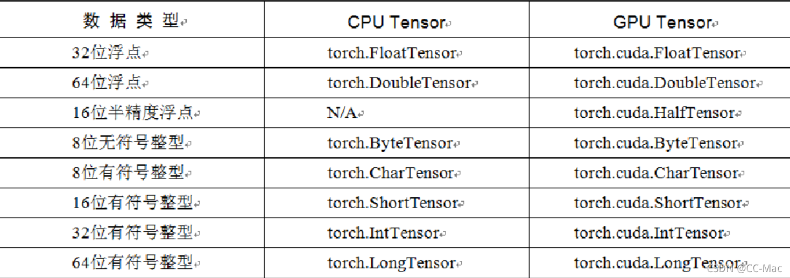
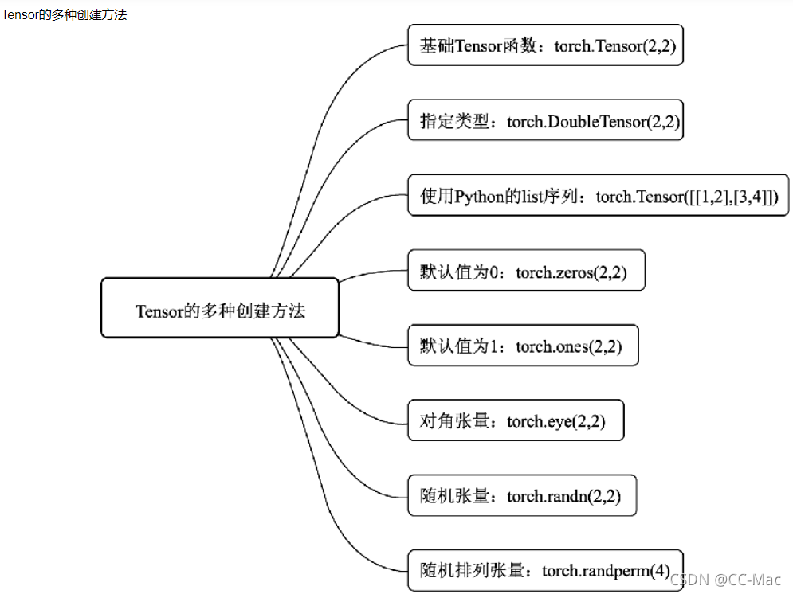

# Pytorch的Tensor

## 一、基本数据：Tensor

Tensor，即张量，是PyTorch中的基本操作对象，可以看做是包含单一数据类型元素的多维矩阵。从使用角度来看，Tensor与NumPy的ndarrays非常类似，相互之间也可以自由转换，只不过Tensor还支持GPU的加速。



### 1.1 Tensor的创建



在 PyTorch 中，`Tensor` 是一种多维数组，类似于 NumPy 的 `ndarray`，同时支持 GPU 加速。可以通过不同的函数来创建 `Tensor`。

**代码示例：**
```python
import torch

# 创建一个 2x3 的随机 Tensor
a = torch.rand(2, 3)
print(a)
```

**输出结果：**
```python
tensor([[0.5625, 0.5815, 0.8221],
        [0.3589, 0.4180, 0.2158]])
```

### 1.2 torch.FloatTensor

`FloatTensor` 是一种元素类型为 `float32` 的 `Tensor`，适用于浮点数的存储和计算。

**代码示例：**
```python
import torch

# 创建一个 FloatTensor
a = torch.FloatTensor([1.0, 2.0, 3.0])
print(a)
```

**输出结果：**
```python
tensor([1., 2., 3.])
```

### 1.3 torch.IntTensor

`IntTensor` 是一种元素类型为 `int32` 的 `Tensor`，适用于整数类型的数据存储。

**代码示例：**
```python
import torch

# 创建一个 2x3 的整数类型 Tensor
a = torch.IntTensor(2, 3)
print(a)

# 通过列表创建一个整数类型的 Tensor
b = torch.IntTensor([[2, 3, 4], [5, 1, 0]])
print(b)
```

**输出结果：**
```python
tensor([[74598400,        521, 1886613091],
        [  664867,          0,          0]], dtype=torch.int32)
tensor([[2, 3, 4],
        [5, 1, 0]], dtype=torch.int32)
```

### 1.4 torch.randn

`torch.randn` 用于创建一个符合标准正态分布（均值为 0，标准差为 1）的 Tensor。

**代码示例：**
```python
import torch

# 创建一个 2x3 的符合标准正态分布的 Tensor
a = torch.randn(2, 3)
print(a)
```

**输出结果：**
```python
tensor([[-0.8067, -0.0707, -0.6682],
        [ 0.8141,  1.1436,  0.5963]])
```

### 1.5 torch.range

`torch.range` 用于创建一个从起始值到终止值的序列 Tensor（包含终止值）。推荐使用 `torch.arange` 代替。

**代码示例：**
```python
import torch

# 创建一个从 1 到 20，步长为 2 的序列 Tensor
a = torch.range(1, 20, 2)
print(a)
```

**输出结果：**

```python
tensor([ 1.,  3.,  5.,  7.,  9., 11., 13., 15., 17., 19.])
```

### 1.6 torch.zeros/ones/empty

`torch.zeros`、`torch.ones` 和 `torch.empty` 用于创建特定初始化方式的 `Tensor`。

**代码示例：**

```python
import torch

# 创建一个 2x2 的全 0 Tensor
zeros_tensor = torch.zeros(2, 2)
print(zeros_tensor)

# 创建一个 2x2 的全 1 Tensor
ones_tensor = torch.ones(2, 2)
print(ones_tensor)

# 创建一个 2x2 的未初始化 Tensor
empty_tensor = torch.empty(2, 2)
print(empty_tensor)
```

**输出结果：**
```python
tensor([[0., 0.],
        [0., 0.]])

tensor([[1., 1.],
        [1., 1.]])

tensor([[4.5414e+21, 3.0706e-41],
        [4.5414e+21, 3.0706e-41]])
```

### 1.7 torch.randperm

torch.randperm(n)：将0~n-1（包括0和n-1）随机打乱后获得的数字序列，函数名是random permutation缩写

【sample】

```python
torch.randperm(10)
```
===> tensor([2, 3, 6, 7, 8, 9, 1, 5, 0, 4])

## 二、Tensor的运算

### 1. abs

`abs` 是求取张量每个元素的绝对值。这个操作不改变张量的形状。

**代码示例：**
```python
import torch

# 创建一个包含正负数的 Tensor
a = torch.tensor([-1.0, -0.5, 0.0, 0.5, 1.0])
print("原始张量：", a)

# 计算张量的绝对值
abs_tensor = torch.abs(a)
print("绝对值张量：", abs_tensor)
```

**输出结果：**
```python
原始张量： tensor([-1.0000, -0.5000,  0.0000,  0.5000,  1.0000])
绝对值张量： tensor([1.0000, 0.5000, 0.0000, 0.5000, 1.0000])
```

---

### 2. add

`add` 用于对两个张量进行逐元素加法，或将一个标量加到每个元素上。

**代码示例：**
```python
import torch

# 创建两个张量
a = torch.tensor([1, 2, 3])
b = torch.tensor([4, 5, 6])

# 逐元素相加
add_tensor = torch.add(a, b)
print("逐元素相加结果：", add_tensor)

# 张量加标量
add_scalar = torch.add(a, 10)
print("张量加标量结果：", add_scalar)
```

**输出结果：**
```python
逐元素相加结果： tensor([5, 7, 9])
张量加标量结果： tensor([11, 12, 13])
```

---

### 3. clamp

`clamp` 将张量中的每个元素限制在一个指定的范围内。如果某个元素小于指定的最小值，则将其替换为最小值；如果某个元素大于最大值，则将其替换为最大值。

**代码示例：**
```python
import torch

# 创建一个张量
a = torch.tensor([0.1, 0.5, 0.9, 1.5])

# 将张量的值限制在 0.3 和 1.0 之间
clamped_tensor = torch.clamp(a, min=0.3, max=1.0)
print("限制后的张量：", clamped_tensor)
```

**输出结果：**
```python
限制后的张量： tensor([0.3000, 0.5000, 0.9000, 1.0000])
```

---

### 4. div

`div` 用于对两个张量进行逐元素除法，或将张量的每个元素除以一个标量。

**代码示例：**
```python
import torch

# 创建两个张量
a = torch.tensor([4, 9, 16])
b = torch.tensor([2, 3, 4])

# 逐元素相除
div_tensor = torch.div(a, b)
print("逐元素相除结果：", div_tensor)

# 张量除以标量
div_scalar = torch.div(a, 2)
print("张量除以标量结果：", div_scalar)
```

**输出结果：**
```python
逐元素相除结果： tensor([2.0000, 3.0000, 4.0000])
张量除以标量结果： tensor([2.0000, 4.5000, 8.0000])
```

---

### 5. pow

`pow` 用于对张量的每个元素进行幂运算。

**代码示例：**
```python
import torch

# 创建一个张量
a = torch.tensor([1, 2, 3, 4])

# 每个元素求平方
pow_tensor = torch.pow(a, 2)
print("平方结果张量：", pow_tensor)

# 每个元素求立方
pow_tensor_cube = torch.pow(a, 3)
print("立方结果张量：", pow_tensor_cube)
```

**输出结果：**
```python
平方结果张量： tensor([ 1,  4,  9, 16])
立方结果张量： tensor([ 1,  8, 27, 64])
```

---

### 6. mm

`mm` 用于两个二维矩阵的矩阵乘法运算。张量的最后两个维度进行矩阵乘法，其余的维度要么广播，要么保持不变。

>其实，`mm` 函数并不支持广播机制，它仅适用于 **二维矩阵** 的乘法运算。如果你想对更高维度的张量进行矩阵乘法，并且希望其余的维度保持不变或者支持广播，你需要使用 `torch.matmul`*函数，而不是 `torch.mm`。
>
>让我们更详细地解释这两者的区别：
>
>#### 1. `torch.mm` (Matrix Multiplication)
>
>`torch.mm` 只支持 **二维矩阵之间的乘法**，所以只能对两个二维张量进行矩阵乘法运算。对于高维张量，它会报错。
>
>**示例：二维矩阵相乘**
>
>```python
>import torch
>
># 定义两个二维矩阵
>A = torch.tensor([[1, 2, 3], [4, 5, 6]])  # 2x3 矩阵
>B = torch.tensor([[7, 8], [9, 10], [11, 12]])  # 3x2 矩阵
>
># 使用 torch.mm 进行矩阵乘法
>result = torch.mm(A, B)
>
>print(result)
>```
>
>输出结果：
>
>```
>tensor([[ 58,  64],
>        [139, 154]])
>```
>
>#### 2. `torch.matmul` (General Matrix Multiplication)
>
>`torch.matmul` 是 PyTorch 中一个更通用的矩阵乘法函数。它不仅可以处理二维矩阵，还可以处理更高维度的张量，自动将张量的 **最后两个维度** 进行矩阵乘法，而 **其余维度会通过广播机制进行运算**。
>
>**示例：高维张量相乘（广播）**
>
>```python
>import torch
>
># 定义两个三维张量
>A = torch.randn(2, 3, 4)  # 形状为 (2, 3, 4)
>B = torch.randn(2, 4, 5)  # 形状为 (2, 4, 5)
>
># 使用 torch.matmul 进行矩阵乘法
>result = torch.matmul(A, B)
>
>print(result.shape)
>```
>
>输出结果的形状：
>
>```
>torch.Size([2, 3, 5])
>```
>
>在这个例子中：
>- 张量 `A` 的形状为 `(2, 3, 4)`，张量 `B` 的形状为 `(2, 4, 5)`。
>- `torch.matmul` 将它们的最后两个维度（即 `3x4` 和 `4x5`）进行矩阵乘法，结果是 `3x5`。
>- 剩下的第一个维度 `2` 保持不变，因此输出的结果形状是 `(2, 3, 5)`。
>
>**示例：张量与矩阵相乘（广播）**
>
>如果你传递一个三维张量和一个二维矩阵，`torch.matmul` 会自动广播二维矩阵并执行矩阵乘法。
>
>```python
>import torch
>
># 三维张量 A 和二维矩阵 B
>A = torch.randn(2, 3, 4)  # 形状为 (2, 3, 4)
>B = torch.randn(4, 5)     # 形状为 (4, 5)
>
># 使用 torch.matmul 进行矩阵乘法
>result = torch.matmul(A, B)
>
>print(result.shape)
>```
>
>输出结果的形状：
>
>```
>torch.Size([2, 3, 5])
>```
>
>在这个例子中，`B` 被自动广播为与 `A` 的第一个维度匹配，然后进行矩阵乘法。
>
>### 总结：
>
>- `torch.mm`：只能用于 **二维张量** 的矩阵乘法，不支持广播。
>- `torch.matmul`：适用于 **任意维度张量**，会在最后两个维度进行矩阵乘法，并自动处理 **广播**。

torch.mm：将参数传递到torch.mm后返回输入参数的求积结果作为输出，不过这个求积的方式和之前的torch.mul运算方式不太一样，torch.mm运用矩阵之间的乘法规则进行计算，所以被传入的参数会被当作矩阵进行处理，参数的维度自然也要满足矩阵乘法的前提条件，即前一个矩阵的行数必须和后一个矩阵列数相等

**代码示例：**

```python
import torch

# 创建两个二维矩阵
a = torch.tensor([[1, 2], [3, 4]])
b = torch.tensor([[5, 6], [7, 8]])

# 进行矩阵乘法运算
mm_tensor = torch.mm(a, b)
print("矩阵乘法结果：", mm_tensor)
```

**输出结果：**
```python
矩阵乘法结果： tensor([[19, 22],
                    [43, 50]])
```

---

### 7.mul

`torch.mul` 是 PyTorch 中的用于执行 **逐元素（element-wise）乘法** 的函数。与矩阵乘法不同，`torch.mul` 直接对两个张量的对应位置上的元素相乘，并返回结果。

- `torch.mul(input, other)`：执行 `input` 和 `other` 两个张量的逐元素乘法。
- 要求 `input` 和 `other` 具有相同的形状，或者可以通过广播机制（broadcasting）兼容。

假设有两个张量 `A` 和 `B`，它们的形状相同，每个元素对应相乘。

```python
import torch

# 定义两个张量
A = torch.tensor([[1, 2], [3, 4]])
B = torch.tensor([[5, 6], [7, 8]])

# 执行逐元素乘法
result = torch.mul(A, B)

print(result)
```

输出结果：

```
tensor([[ 5, 12],
        [21, 32]])
```

**广播机制**

如果两个张量的形状不同，但满足广播机制，它们也可以使用 `torch.mul` 进行逐元素乘法。例如，一个张量是单个值（标量），它可以与另一个张量的每个元素相乘。

```python
import torch

# 定义一个矩阵 A 和一个标量 b
A = torch.tensor([[1, 2], [3, 4]])
b = 2

# 标量与矩阵逐元素相乘
result = torch.mul(A, b)

print(result)
```

输出结果：

```
tensor([[2, 4],
        [6, 8]])
```

在这个例子中，标量 `b = 2` 被广播到矩阵 `A` 的每个元素上，结果是 `A` 的每个元素都乘以 `2`。

**总结**

- `torch.mul` 用于执行逐元素乘法，即对应位置上的元素相乘。
- 如果张量形状不同，但可以通过广播机制使它们兼容，`torch.mul` 也可以进行运算。

### 8. mv

`mv` 用于一个二维矩阵与一个一维向量的矩阵乘法运算。将二维矩阵的每一行与向量进行点积运算。

**代码示例：**
```python
import torch

# 创建一个二维矩阵和一个一维向量
a = torch.tensor([[1, 2], [3, 4]])
b = torch.tensor([2, 3])

# 进行矩阵与向量乘法
mv_tensor = torch.mv(a, b)
print("矩阵与向量乘法结果：", mv_tensor)
```

**输出结果：**
```python
矩阵与向量乘法结果： tensor([ 8, 18])
```

**广播机制**（Broadcasting）是指在进行张量运算时，如果两个张量的形状不同，PyTorch（以及 NumPy 等其他深度学习框架）会通过特定的规则自动调整（扩展）它们的形状，使它们能够进行逐元素运算，而不需要显式地复制数据。

广播机制可以减少显式扩展张量的内存消耗，提高运算的效率，并简化代码编写。

### 广播机制规则：

广播的核心规则是：
1. **比较从尾部开始的每个维度**：
   - 如果两个维度相等，继续比较下一维度。
   - 如果其中一个维度是 1，则可以扩展为另一个维度的大小。
   - 如果两个维度不相等且都不为 1，则无法广播，报错。

#### 举例说明：

#### 1. 标量和张量之间的运算

当一个标量（0 维度）与一个张量（如 2D 矩阵）相乘时，标量会自动扩展为与张量相同的形状。

```python
import torch

# 一个2x3的矩阵
A = torch.tensor([[1, 2, 3], [4, 5, 6]])

# 一个标量
b = 2

# 标量与矩阵逐元素相乘
result = A * b

print(result)
```

输出结果：
```
tensor([[ 2,  4,  6],
        [ 8, 10, 12]])
```

在这个例子中，标量 `b` 自动广播为 `2x3` 的矩阵，与矩阵 `A` 逐元素相乘。

#### 2. 不同形状的张量相乘

如果两个张量的形状不同，但通过广播机制可以扩展它们为相同的形状，那么它们可以进行逐元素运算。

```python
import torch

# 张量 A 形状为 (3, 1)
A = torch.tensor([[1], [2], [3]])

# 张量 B 形状为 (1, 3)
B = torch.tensor([[4, 5, 6]])

# A 和 B 通过广播进行逐元素相乘
result = A * B

print(result)
```

输出结果：
```
tensor([[ 4,  5,  6],
        [ 8, 10, 12],
        [12, 15, 18]])
```

在这个例子中：
- `A` 的形状为 `(3, 1)`，表示 3 行 1 列。
- `B` 的形状为 `(1, 3)`，表示 1 行 3 列。

通过广播机制，`A` 被扩展为 `(3, 3)`，每一列的值都是 `[1, 2, 3]`，而 `B` 被扩展为 `(3, 3)`，每一行的值都是 `[4, 5, 6]`，最终它们逐元素相乘。

#### 3. 更复杂的广播机制

广播机制可以处理更高维度的张量。如果两个张量的形状不同但兼容，PyTorch 会自动扩展较小的张量以适应更大的形状。

```python
import torch

# 张量 A 形状为 (2, 3, 1)
A = torch.tensor([[[1], [2], [3]], [[4], [5], [6]]])

# 张量 B 形状为 (1, 3, 4)
B = torch.tensor([[[7, 8, 9, 10], [11, 12, 13, 14], [15, 16, 17, 18]]])

# A 和 B 通过广播进行逐元素相乘
result = A * B

print(result.shape)  # 输出形状
print(result)
```

输出结果：
```
torch.Size([2, 3, 4])
tensor([[[  7,   8,   9,  10],
         [ 22,  24,  26,  28],
         [ 45,  48,  51,  54]],

        [[ 28,  32,  36,  40],
         [ 55,  60,  65,  70],
         [ 90,  96, 102, 108]]])
```

在这个例子中：
- `A` 的形状为 `(2, 3, 1)`。
- `B` 的形状为 `(1, 3, 4)`。

通过广播机制：
- `A` 被扩展为 `(2, 3, 4)`。
- `B` 也被扩展为 `(2, 3, 4)`，然后它们逐元素相乘。

#### 广播机制的具体步骤：

假设有两个张量 `A` 和 `B`，它们的形状分别是 `(a1, a2, ..., an)` 和 `(b1, b2, ..., bn)`：
1. 从它们的最后一个维度开始逐个比较：
   - 如果这两个维度相同，继续比较下一维度。
   - 如果其中一个维度是 1，则将其扩展为另一个维度的大小。
   - 如果两个维度不同且都不是 1，则报错，无法广播。
2. 如果其中一个张量的维度数量少于另一个，则在前面添加 `1` 进行扩展。

#### 总结：

- **广播机制** 允许在不同形状的张量之间进行运算，通过自动扩展较小的张量，使得它们的形状相同，从而进行逐元素运算。
- 关键规则是：比较每个维度，如果维度相同或其中一个是 1，则可以广播；否则报错。
