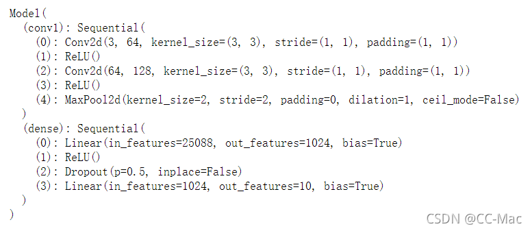

# 搭建神经网络实现手写数据集

## 5.1 torchvision
torchvision 是PyTorch中专门用来处理图像的库。这个包中有四个大类。

torchvision.datasets

torchvision.models

torchvision.transforms

torchvision.utils

### 5.1.1 torchvision.dataets
torchvision.datasets可以实现对一些数据集的下载和加载如MNIST可以用torchvision.datasets.MNIST

COCO、ImageNet、CIFCAR等都可用这个方法下载和载入，这里用torchvision.datasets加载MNIST数据集：

```python
data_train = datasets.MNIST(root="./data/",
                           transform=transform,
                           train = True,
                           download = True)
data_test = datasets.MNIST(root="./data/",
                          transform = transform,
                          train = False)
```

### 5.1.2 torchvision.models
torchvision.models 中为我们提供了已经训练好的模型，让我们可以加载之后，直接使用。

torchvision.models模块的子模块中包含以下模型结构。如：

AlexNet

VGG

ResNet

SqueezeNet

DenseNet等

我们可以直接使用如下代码来快速创建一个权重随机初始化的模型：

```python
import torchvision.models as models
resnet18 = models.resnet18()
alexnet = models.alexnet()
squeezenet = models.squeezenet1_0()
densenet = models.densenet_161()
```

### 5.1.3 torch.transforms

torch.transforms中有大量数据变换类

```python
transform = transforms.Compose([
     transforms.ToTensor(),
     transforms.Lambda(lambda x: x.repeat(3,1,1)),
     transforms.Normalize(mean=(0.5, 0.5, 0.5), std=(0.5, 0.5, 0.5))
 ])   # 修改的位置

data_train = datasets.MNIST(root="./data/",
                           transform=transform,
                           train = True,
                           download = True)
data_test = datasets.MNIST(root="./data/",
                          transform = transform,
                          train = False)
```

### 5.1.4 torch.utils
1.关于torchvision.utils我们介绍一种用来对数据进行装载的类：torch.utils.data.DataLoader

torch.utils.data.DataLoader类中，dataset参数指定我们载入的数据集的名称，batch_size参数设置每个包中图片的数量， shuffle设置为True代表在装载的过程会将数据随机打乱顺序并进行打包。

```python
data_loader_train=torch.utils.data.DataLoader(dataset=data_train,
                                       batch_size=64,#每个batch载入的图片数量，默认为1,这里设置为64
                                        shuffle=True,
                                        #num_workers=2#载入训练数据所需的子任务数
                                       )
data_loader_test=torch.utils.data.DataLoader(dataset=data_test,
                                      batch_size=64,
                                      shuffle=True)
                                      #num_workers=2)

```

2.还有torchvision.utils.make_grid将一个批次的图片构造成网格模式的图片。

```python
images,labels = next(iter(data_loader_train))
# dataiter = iter(data_loader_train) #随机从训练数据中取一些数据
# images, labels = dataiter.next()
img = torchvision.utils.make_grid(images)

img = img.numpy().transpose(1,2,0)
std = [0.5,0.5,0.5]
mean = [0.5,0.5,0.5]
img = img*std+mean
print([labels[i] for i in range(64)])
plt.imshow(img)

```

这里，iter和next获取一个批次的图片数据和其对应的图片标签， 再使用torchvision.utils.make_grid将一个批次的图片构造成网格模式。经过torchvision.utils.make_grid后图片维度变为channel,h,w三维， 因为要用matplotlib将图片显示，我们要使用的数据要是数组且维度（height,weight,channel）即色彩通道在最后，因此我们需要用numpy和transpose完成原始数据类型的转换和数据维度的交换。

## 5.2 模型搭建和参数优化

实现卷积神经网络模型搭建：

```python
import math
import torch
import torch.nn as nn
class Model(nn.Module):
    def __init__(self):
        super(Model, self).__init__()
        
        #构建卷积层之后的全连接层以及分类器
        self.conv1 = nn.Sequential(
                nn.Conv2d(3,64,kernel_size=3,stride=1,padding=1),
                nn.ReLU(),
                nn.Conv2d(64,128,kernel_size=3,stride=1,padding=1),
                nn.ReLU(),
                nn.MaxPool2d(stride=2,kernel_size=2)
                )
        
        self.dense = torch.nn.Sequential(
                nn.Linear(14*14*128,1024),
                nn.ReLU(),
                nn.Dropout(p=0.5),
                nn.Linear(1024,10)
            )
        
    def forward(self,x):
        x=self.conv1(x)
        x=x.view(-1,14*14*128)
        x=self.dense(x)
        return x
```

### 5.2.1 torch.nn.Conv2d
用于搭建卷积神经网络的卷积层，主要参数是：

输入通道数、输出通道数、卷积核大小、卷积核移动步长和padding的值（用于对边界像素的填充）

### 5.2.2 torch.nn.MaxPool2d
实现卷积神经网络的最大池化层，主要参数是：

池化窗口的大小，池化窗口移动步长和padding的值

### 5.2.3 torch.nn.Dropout
用于防止卷积神经网络在训练过程中发生过拟合，原理是以一定的随机概率将卷积神经网络模型的部分参数归零，以达到减少相邻两层神经连接的目的

## 5.3 参数优化

搭完模型后，我们就可以对模型进行训练和参数优化了:

```python
model = Model()
cost = nn.CrossEntropyLoss()
optimizer = torch.optim.Adam(model.parameters())
#Adam 是一种可以替代传统随机梯度下降过程的一阶优化算法，它能基于训练数据迭代地更新神经网络权重。
print(model)
```



### 5.3.1 模型训练

```python
n_epochs = 5

for epoch in range(n_epochs):
    running_loss = 0.0
    running_correct = 0
    print("Epoch {}/{}".format(epoch,n_epochs))
    print("-"*10)
    for data in data_loader_train:
        X_train,y_train = data
        X_train,y_train = Variable(X_train),Variable(y_train)
        outputs = model(X_train)
        _,pred=torch.max(outputs.data,1)
        optimizer.zero_grad()
        loss = cost(outputs,y_train)
        
        loss.backward()
        optimizer.step()
        running_loss += loss.data
        running_correct += torch.sum(pred == y_train.data)
    testing_correct = 0
    for data in data_loader_test:
        X_test,y_test = data
        X_test,y_test = Variable(X_test),Variable(y_test)
        outputs = model(X_test)
        _,pred=torch.max(outputs.data,1)
        testing_correct += torch.sum(pred == y_test.data)
    print("Loss is:{:4f},Train Accuracy is:{:.4f}%,Test Accuracy is:{:.4f}".format(running_loss/len(data_train),100*running_correct/len(data_train),100*testing_correct/len(data_test)))
```
## 5.4 模型验证
为了验证我们训练的模型是不是真的已知结果显示的一样准确，则最好的方法就是随机选取一部分测试集中的图片，用训练好的模型进行预测，看看和真实值有多大的偏差，并对结果进行可视化。测试代码如下：
```python
data_loader_test = torch.utils.data.DataLoader(dataset=data_test,
                                              batch_size = 4,
                                              shuffle = True)
X_test,y_test = next(iter(data_loader_test))
inputs = Variable(X_test)
pred = model(inputs)
_,pred = torch.max(pred,1)

print("Predict Label is:",[i for i in pred.data])
print("Real Label is:",[i for i in y_test])
img = torchvision.utils.make_grid(X_test)
img = img.numpy().transpose(1,2,0)

std = [0.5,0.5,0.5]
mean = [0.5,0.5,0.5]
img = img*std+mean
plt.imshow(img)
```

## 5.5完整代码

```python
import torch 
import torchvision
from torchvision import datasets,transforms
from torch.autograd import Variable
import numpy as np
import matplotlib.pyplot as plt

#torchvision.transforms: 常用的图片变换，例如裁剪、旋转等；
# transform=transforms.Compose(
#     [transforms.ToTensor(),#将PILImage转换为张量
#      transforms.Normalize((0.5,0.5,0.5),(0.5,0.5,0.5))#将[0, 1]归一化到[-1, 1]
#      #前面的（0.5，0.5，0.5） 是 R G B 三个通道上的均值， 后面(0.5, 0.5, 0.5)是三个通道的标准差
#     ])
transform = transforms.Compose([
     transforms.ToTensor(),
     transforms.Lambda(lambda x: x.repeat(3,1,1)),
     transforms.Normalize(mean=(0.5, 0.5, 0.5), std=(0.5, 0.5, 0.5))
 ])   # 修改的位置

data_train = datasets.MNIST(root="./data/",
                           transform=transform,
                           train = True,
                           download = True)
data_test = datasets.MNIST(root="./data/",
                          transform = transform,
                          train = False)

data_loader_train=torch.utils.data.DataLoader(dataset=data_train,
                                       batch_size=64,#每个batch载入的图片数量，默认为1,这里设置为64
                                        shuffle=True,
                                        #num_workers=2#载入训练数据所需的子任务数
                                       )
data_loader_test=torch.utils.data.DataLoader(dataset=data_test,
                                      batch_size=64,
                                      shuffle=True)
                                      #num_workers=2)

#预览
#在尝试过多次之后，发现错误并不是这一句引发的，而是因为图片格式是灰度图只有一个channel，需要变成RGB图才可以，所以将其中一行做了修改：
images,labels = next(iter(data_loader_train))
# dataiter = iter(data_loader_train) #随机从训练数据中取一些数据
# images, labels = dataiter.next()

img = torchvision.utils.make_grid(images)

img = img.numpy().transpose(1,2,0)
std = [0.5,0.5,0.5]
mean = [0.5,0.5,0.5]
img = img*std+mean
print([labels[i] for i in range(64)])
plt.imshow(img)

import math
import torch
import torch.nn as nn
class Model(nn.Module):
    def __init__(self):
        super(Model, self).__init__()
        
        #构建卷积层之后的全连接层以及分类器
        self.conv1 = nn.Sequential(
                nn.Conv2d(3,64,kernel_size=3,stride=1,padding=1),
                nn.ReLU(),
                nn.Conv2d(64,128,kernel_size=3,stride=1,padding=1),
                nn.ReLU(),
                nn.MaxPool2d(stride=2,kernel_size=2)
                )
        
        self.dense = torch.nn.Sequential(
                nn.Linear(14*14*128,1024),
                nn.ReLU(),
                nn.Dropout(p=0.5),
                nn.Linear(1024,10)
            )
        
    def forward(self,x):
        x=self.conv1(x)
        x=x.view(-1,14*14*128)
        x=self.dense(x)
        return x

model = Model()
cost = nn.CrossEntropyLoss()
optimizer = torch.optim.Adam(model.parameters())
print(model)

n_epochs = 5

for epoch in range(n_epochs):
    running_loss = 0.0
    running_correct = 0
    print("Epoch {}/{}".format(epoch,n_epochs))
    print("-"*10)
    for data in data_loader_train:
        X_train,y_train = data
        X_train,y_train = Variable(X_train),Variable(y_train)
        outputs = model(X_train) #前向传播
        _,pred=torch.max(outputs.data,1)
        optimizer.zero_grad() #梯度清零
        loss = cost(outputs,y_train) #计算损失函数
        
        loss.backward() #反向传播
        optimizer.step() #更新参数
        running_loss += loss.data
        running_correct += torch.sum(pred == y_train.data)
    testing_correct = 0
    for data in data_loader_test:
        X_test,y_test = data
        X_test,y_test = Variable(X_test),Variable(y_test)
        outputs = model(X_test)
        _,pred=torch.max(outputs.data,1)
        testing_correct += torch.sum(pred == y_test.data)
    print("Loss is:{:4f},Train Accuracy is:{:.4f}%,Test Accuracy is:{:.4f}".format(running_loss/len(data_train),100*running_correct/len(data_train)
                                                                                  ,100*testing_correct/len(data_test)))

data_loader_test = torch.utils.data.DataLoader(dataset=data_test,
                                              batch_size = 4,
                                              shuffle = True)
X_test,y_test = next(iter(data_loader_test))
inputs = Variable(X_test)
pred = model(inputs)
_,pred = torch.max(pred,1)

print("Predict Label is:",[i for i in pred.data])
print("Real Label is:",[i for i in y_test])
img = torchvision.utils.make_grid(X_test)
img = img.numpy().transpose(1,2,0)

std = [0.5,0.5,0.5]
mean = [0.5,0.5,0.5]
img = img*std+mean
plt.imshow(img)

```
