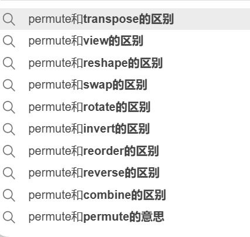
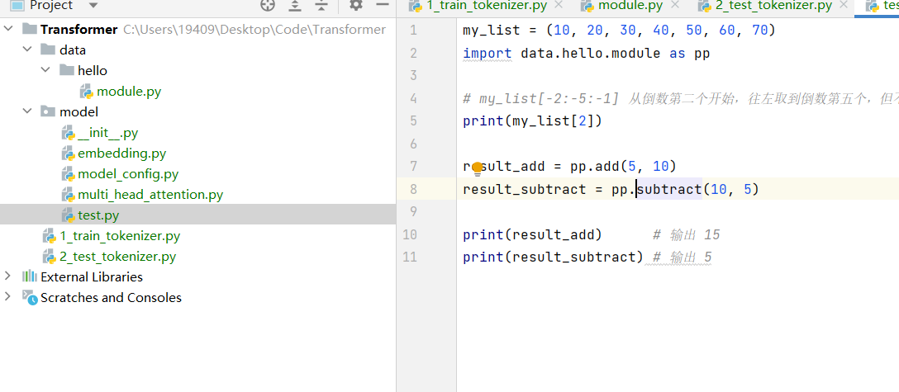

**查看类型**

```
x = 10
print(type(x))  # 输出: <class 'int'>

y = "Hello"
print(type(y))  # 输出: <class 'str'>

z = [1, 2, 3]
print(type(z))  # 输出: <class 'list'>
```

**三个类型的相互转换**

**List 转 Tensor**：使用 `torch.tensor()`

**Tensor 转 List**：使用 `tensor实例.tolist()`


**NumPy 转 Tensor**：`torch.from_numpy()`

**Tensor 转 NumPy**：`tensor示例.numpy()`


**List 转 NumPy 数组**：使用 `np.array()`

**NumPy 数组转 List**：使用 `ndarray实例.tolist()`

**(NumPy 的 N 维数组对象 ndarray，它是一系列同类型数据的集合)**

- **list->tensor**

```
import torch

# 创建一个列表
my_list = [1, 2, 3, 4]

# 将列表转换为 tensor
my_tensor = torch.tensor(my_list)

print(my_tensor)
# 输出: tensor([1, 2, 3, 4])
```

- **tensor->list**

```
# 创建一个 tensor
my_tensor = torch.tensor([1, 2, 3, 4])

# 将 tensor 转换为列表
my_list = my_tensor.tolist()

print(my_list)
# 输出: [1, 2, 3, 4]

```


- **numpy->tensor**

```
import torch
import numpy as np

# 创建一个 NumPy 数组
np_array = np.array([1, 2, 3, 4])

# 将 NumPy 数组转换为 Tensor
tensor_from_np = torch.from_numpy(np_array)

print(tensor_from_np)
# 输出: tensor([1, 2, 3, 4], dtype=torch.int32)（dtype 根据 NumPy 数组而定）

```

- **tensor->numpy**

```
# 创建一个 Tensor
tensor1 = torch.tensor([1, 2, 3, 4])

# 将 Tensor 转换为 NumPy 数组
np_from_tensor = tensor1.numpy()

print(np_from_tensor)
# 输出: array([1, 2, 3, 4])

```

**使用 GPU Tensor**

如果 `tensor` 在 GPU 上，`tensor.numpy()` 不能直接使用。需要先将它移到 CPU，再转换为 NumPy 数组：

```python
#创建一个 GPU 上的 Tensor
tensor_gpu = torch.tensor([1, 2, 3, 4], device='cuda')

# 移到 CPU 后再转换为 NumPy 数组
np_from_tensor_gpu = tensor_gpu.cpu().numpy()

print(np_from_tensor_gpu)
# 输出: array([1, 2, 3, 4])
```


-  **List 转 NumPy 数组**

```
import numpy as np

# 创建一个 Python 列表
my_list = [1, 2, 3, 4]

# 将列表转换为 NumPy 数组
np_array = np.array(my_list)

print(np_array)
# 输出: array([1, 2, 3, 4])

```

- **NumPy 数组转 List**

```
# 创建一个 NumPy 数组
np_array = np.array([1, 2, 3, 4])

# 将 NumPy 数组转换为列表
my_list = np_array.tolist()

print(my_list)
# 输出: [1, 2, 3, 4]

```

## numpy

在 `numpy` 中，`shape` 和 `size` 是两个用于描述数组（`ndarray`）结构的属性。它们有不同的用途：

### ndarray.shape
   - **作用**：返回数组每个维度的大小，表示数组的形状。
   - **返回值**：`shape` 返回一个包含各维度大小的元组。例如，二维数组的 `shape` 为 `(rows, columns)`。
   - **用途**：用于查看或更改数组的结构，例如用于遍历数组的各个维度或将数组输入到特定形状的网络模型中。

**示例**：

```python
import numpy as np

a = np.array([[1, 2, 3], [4, 5, 6]])  # 创建一个2x3的二维数组
print(a.shape)  # 输出：(2, 3)，表示2行3列
```

### ndarray.size
   - **作用**：返回数组的总元素数，即数组中所有维度的大小之积。
   - **返回值**：`size` 返回一个整数，表示数组中包含的元素个数。
   - **用途**：用于确定数组的总大小，比如在数据处理中用来计算数据集的整体规模。

**示例**：

```python
print(a.size)  # 输出：6，表示总共6个元素
```

- `shape`：返回数组各维度的大小，形状信息；数据类型为元组。
- `size`：返回数组中元素的总个数；数据类型为整数。

### np.clip()

`np.clip()` 不是类函数，而是 **NumPy 模块中的一个通用函数**，即**模块函数**。它属于 `numpy` 模块的顶层函数，可以直接通过 `numpy` 调用，而不依赖于任何特定的类。

使用**numpy.clip(…)**根据指定的min和max值将数据限定在一定范围内截断

```python
import numpy as np
data = np.array([i for i in range(-5, 6)])
>>> array([-5, -4, -3, -2, -1,  0,  1,  2,  3,  4,  5])
# 指定min=-3， max=2，将数据限制在-3~2(包括-3和2)
data = np.clip(data, -3, 2)
>>> array([-3, -3, -3, -2, -1,  0,  1,  2,  2,  2,  2])
```

### np.hstack()

按水平方向（列顺序）堆叠数组构成一个新的数组。堆叠的数组需要具有相同的维度

```python
import numpy as np

# 创建两个1-D数组
a = np.array((1,2,3))
b = np.array((4,5,6))

# 水平堆叠这两个数组
result = np.hstack((a,b))
print(result) # 输出: [1 2 3 4 5 6]
```

### np.vstack()

按垂直方向（行顺序）堆叠数组构成一个新的数组。堆叠的数组需要具有相同的维度

### ndarray.astype()

```python
import numpy as np

# 创建一个整数数组
arr = np.array([1, 2, 3])
print(arr, arr.dtype)

# 使用astype转换数组数据类型
float_arr = arr.astype(np.float64)
print(float_arr, float_arr.dtype)
```

在 `numpy` 中，`view()` 和 `reshape()` 也用于改变数组的形状，但它们的作用与 PyTorch 中有一些不同：

### ndarray.reshape()

   - **用途**：`reshape()` 用于改变数组的形状，返回一个新的视图或副本，具体取决于内存布局。
   - **内存布局要求**：如果数据在内存中是连续的，`reshape()` 返回的是一个视图（view），而不是新的数据副本；如果数据不连续，则会创建一个新数组。
   - **灵活性**：`reshape()` 不会改变数组的数据内容，只是重新组织元素以满足新的形状。

**示例**：

```python
import numpy as np

x = np.arange(6)  # 创建一个一维数组
y = x.reshape(2, 3)  # 更改形状为 (2, 3)
print(y)
```

   - 在此例中，`y` 通常是 `x` 的视图，不会占用额外的内存空间，但前提是 `x` 在内存中是连续的。
   - **Note**: `numpy.reshape()` 可以通过参数 `order`（如 `order='C'` 或 `order='F'`）来指定内存布局顺序，分别表示行优先和列优先。

### ndarray.view()

   - **用途**：`view()` 返回相同数据的不同视图，通常用于创建新的数据类型或改变数据解读方式。
   - **不同数据类型的视图**：`view()` 可以用于创建具有不同数据类型（dtype）的视图。不同于 `reshape()`，`view()` 不会更改形状，而是允许你以不同的字节解释数据。
   - **内存开销**：`view()` 不会创建新的数据副本，因此效率高，适合数据的“重解读”。

**示例**：

```python
x = np.array([1, 2, 3, 4], dtype=np.int32)
y = x.view(dtype=np.int16)  # 将 int32 类型的数组视为 int16
print(y)  # 输出：[1 0 2 0 3 0 4 0]
```

   - `reshape()`：用于改变数组形状，返回视图或副本，具体取决于数据在内存中的连续性。
   - `view()`：用于创建相同数据的不同视图，通常用于更改数据类型或重新解释数据内容，而不改变形状。

在 `numpy` 中，`reshape()` 用于改变数组的形状，而 `view()` 更适合数据类型转换或重解读。

## list

### list的切片

Python 的 `list` 没有名为 `slice` 的方法，但可以使用**切片操作**来获取列表的子部分。切片是 `list[start:stop:step]` 的一种索引方式，可以灵活地从列表中提取一部分元素。**Python中列表截取（Slice，即冒号 : ）**

```
a[start:stop]  # 从 index=start 开始（即包含start），到 index=stop-1（即不包含stop）
a[start:]      # 从 index=start 开始（包含 start ），到最后
a[:stop]       # 从头开始，到 stop-1
a[:]           # 取整个 List
```

**选择不同的维度的时候直接使用逗号(,)**

## torch

在 `torch` 中，`tensor.size()` 和 `tensor.shape` 都用于获取张量的维度信息，但它们有一些细微的差异：

### tensor.size()

- `size()` 是 `torch.Tensor` 的一个方法，返回 `torch.Size` 对象。
- `torch.Size` 是一个类似于元组的对象，包含张量的每个维度大小。
- `size()` 是一种调用方式，适用于需要动态获取张量尺寸的情况。

**示例**：

```python
import torch

x = torch.randn(3, 4, 5)
print(x.size())  # 输出：torch.Size([3, 4, 5])
```

### tensor.shape

- `shape` 是张量的一个属性，直接返回 `torch.Size` 对象。
- 作为属性，`shape` 更简洁易读。

**示例**：

```python
print(x.shape)  # 输出：torch.Size([3, 4, 5])
```

**两者的区别**

- **用法**：`size()` 是一个方法，需要括号；`shape` 是属性，不需要括号。
- **功能**：在功能上，两者完全相同，均返回 `torch.Size` 对象，表示张量的维度。

在大多数情况下，`shape` 属性更简洁，使用更为广泛。

### tensor.to()

**torch.device("cuda:0")="cuda:0"**

```python
>>> tensor = torch.randn(2, 2)  # Initially dtype=float32, device=cpu
>>> tensor.to(torch.float64)
tensor([[-0.5044,  0.0005],
        [ 0.3310, -0.0584]], dtype=torch.float64)

>>> cuda0 = torch.device('cuda:0')
>>> tensor.to(cuda0)
tensor([[-0.5044,  0.0005],
        [ 0.3310, -0.0584]], device='cuda:0')

>>> tensor.to(cuda0, dtype=torch.float64)
tensor([[-0.5044,  0.0005],
        [ 0.3310, -0.0584]], dtype=torch.float64, device='cuda:0')
```

`.to()` 方法可以指定数据类型或设备（例如 `cuda`）：

```python
# 创建一个浮点数 Tensor
tensor = torch.tensor([1.2, 3.4, 5.6])

# 转换为整型
tensor_int = tensor.to(torch.int)
print(tensor_int)
```

### tensor.type()

```python
# 创建一个浮点数 Tensor
tensor = torch.tensor([1.2, 3.4, 5.6])

# 转换为整型
tensor_int = tensor.to("cuda")

print(tensor_int.device)
print(tensor_int.dtype)
print(tensor_int.type())
>>>cuda:0
>>>torch.float32
>>>torch.cuda.FloatTensor
```

```python
>>> import torch
>>> a = torch.ones(2,3)
>>> a.type()
'torch.FloatTensor'
>>> a.dtype
torch.float32
>>> b = a.type(dtype='torch.cuda.DoubleTensor')
>>> b
tensor([[1., 1., 1.],
        [1., 1., 1.]], device='cuda:0', dtype=torch.float64)
```

`.type()` 方法也可以指定 Tensor 的具体类型：

这里的dtype的上面的dtype不一样

```python
# 创建一个浮点数 Tensor
tensor = torch.tensor([1.2, 3.4, 5.6])
tensor_int = tensor.type(torch.IntTensor)
print(tensor_int)
```

### tensor.transpose()

**transpose**函数的基本操作是接收两个维度**dim1**和**dim2**，并将这两个维度的内容进行调换。无论**dim1**和**dim2**的顺序如何，结果都是相同的。例如，对于一个二维张量*a*，可以使用**a.transpose(0,1)**或**a.transpose(1,0)**来交换其两个维度的内容。这个函数也可以通过**torch.transpose(tensor, dim1, dim2)**的方式调用。

```python
import torch

a = torch.Tensor([[1,2,3],[4,5,6]])

print(a.transpose(0,1))

# 输出:

# tensor([[1, 4],

# [2, 5],

# [3, 6]])
```
### tensor.permute()

**permute**函数的基本操作是重组张量的维度。它支持高维操作，通过**tensor.permute(dim0, dim1, ..., dimn)**的方式来指定新的维度顺序。在调用**permute**时，必须指定所有维度。例如，对于一个三维张量**b**，可以使用**b.permute(2,0,1)**来重新排列其维度。

```python
b = torch.rand(2,3,4)

print(b.permute(2,0,1))
# 输出的张量将具有新的维度顺序
```
不同点

**transpose**一次只能交换两个维度，而**permute**可以交换多个维度。在处理二维张量时，**transpose**和**permute**可以互相替换。但在处理三维或更高维度的张量时，**permute**的功能更强大。例如，如果需要将三维张量的第零维放到第一维，第一维放到第二维，第二维放回第零维，**permute**可以一次性完成这个操作，而**transpose**则需要进行两次转换。



在 `torch` 中，`view()` 和 `reshape()` 都用于改变张量的形状，但它们在一些细节上有所不同。让我们详细比较它们：

### tensor.view()
   - **用途**：用于重新调整张量的形状（例如改变维度），但要求张量在内存中是连续的。
   - **内存连续性要求**：`view()` 需要张量是**连续的**（contiguous），否则会抛出错误。
   - **执行效率**：如果满足内存连续性条件，`view()` 会直接在原张量上调整形状，而不是创建新的副本，速度更快。

**示例**：

```python
import torch

x = torch.randn(2, 3, 4)
y = x.view(6, 4)  # 更改形状为 (6, 4)
print(y.shape)  # 输出：torch.Size([6, 4])
```

   - **注意**：如果你在某些操作后发现 `view()` 抛出错误，可以先调用 `x = x.contiguous()`，使张量变为连续。

### tensor.reshape()
   - **用途**：同样用于调整张量形状，但不要求张量在内存中是连续的。
   - **灵活性**：`reshape()` 会尝试返回一个具有相同数据但新形状的张量。它首先会检查原张量是否可以直接使用新的形状；如果不可以，它会生成新的张量副本。
   - **内存开销**：`reshape()` 的操作更灵活，但可能会创建新的副本，因此有时候内存开销略高于 `view()`。

**示例**：

```python
x = torch.randn(2, 3, 4)
z = x.reshape(6, 4)  # 形状调整为 (6, 4)，即使不连续也能成功
print(z.shape)  # 输出：torch.Size([6, 4])
```

**总结与选择**

   - `view()`：适用于内存连续的情况，速度更快，通常用于简单的形状变换。
   - `reshape()`：更灵活，不依赖内存连续性，更适合在不确定张量是否连续的情况下使用。

在不确定是否连续的情况下，建议使用 `reshape()`；否则，`view()` 会提供更高的性能。

## tensor autograd

### tensor.grad

### tensor.grad_fn

**梯度函数，grad_function**

grad_fn 属性是 PyTorch 中的一个重要特性，它保存了张量的梯度函数，用于计算当前张量相对于计算图中其他张量的梯度。

**grad_fn**: **叶子节点**通常为None，只有结果节点的**grad_fn**才有效，用于指示梯度函数是哪种类型。

通过张量的 `grad_fn` 属性来检查它的计算历史。`grad_fn` 表示创建该张量的函数，只有当张量是通过某些操作得到的中间张量时，`grad_fn` 才不为 None。

### tensor.grad_fn.next_functions()

### tensor.requires_grad

### tensor模型的计算图

**对应的是grad_fn和function**

在 PyTorch 中，*grad_fn* 属性是动态计算图的关键部分，也是 PyTorch 的关键功能之一。与 TensorFlow 等其他使用静态计算图的深度学习框架不同，PyTorch 根据实际代码执行情况动态构建计算图。这种动态特性允许在每次迭代或运行期间根据不同的输入数据调整和创建计算图

## torch.nn

**==怎么修改这个模型==**

**直接对model模块修改就可以，可以打到模型里面去**

```python
# 替换最后的全连接层
num_features = model.classifier[6].in_features
model.classifier[6] = nn.Linear(num_features, 2)  # 假设为二分类任务
```

### parameter class

**继承自Torch.Tensor**

**model.parameters()**

```python
model = models.vgg16(pretrained=True)

print(model.parameters())
```

`model.parameters` 返回的是一个生成器（generator），而不是一个类。当你调用 `model.parameters` 时，它会返回一个迭代器，可以用来遍历模型中的所有可学习参数（例如权重和偏置）。具体来说，调用 `print(model.parameters)` 只会输出 `<generator object Module.parameters at ...>` 这样的信息，因为生成器本身并没有直接输出内容。

如果你想查看模型的参数，可以将其转换为列表或者遍历它，如下所示：

```python
import torch
from torchvision import models

model = models.vgg16(pretrained=True)

# 打印所有参数
for param in model.parameters():
    print(param.shape)

# 或者将参数转化为列表
params_list = list(model.parameters())
print(params_list)
```

在这个例子中，`for param in model.parameters():` 会遍历所有参数，并输出每个参数的形状。这样你可以更清楚地看到模型中参数的具体信息。

**model.features.parameters()和model.parameters()**

`model.parameters()`

- **作用**：返回模型中所有可训练的参数，包括每一层的权重和偏置。

- **使用场景**：通常用于定义优化器时，传入所有参数以便进行梯度更新。

- **适用范围**：当你想更新模型的全部参数时，可以使用 `model.parameters()`，例如在以下代码中：

  ```python
  for param in model.parameters():
      print("参数类型：", type(param), "参数大小：", param.size(), param.requires_grad)
  
  optimizer = torch.optim.Adam(model.parameters(), lr=0.001)
  ```

----

`model.features.parameters()`

**作用**：只返回模型中 `features` 模块的参数。

**使用场景**：如果只想更新特定部分的参数（如特征提取层 `features`），可以使用 `model.features.parameters()`。这种做法常见于微调预训练模型时，只希望更新特定的几层。

**适用范围**：例如，在经典的卷积神经网络如 VGG、ResNet 等中，特征提取层通常命名为 `features`，而全连接层或分类层可能命名为 `classifier` 或 `fc`。可以分别通过 `model.features.parameters()` 或 `model.classifier.parameters()` 获取这些层的参数。

----
**named_parameters()**

```python
for name, param in model.named_parameters():
    print(f"{name}: {param.requires_grad}")
```

**name的取名很讲究**=> 模块名，模块的层数，具体的参数

features.0.weight: False
features.0.bias: False
features.2.weight: False
features.2.bias: False
features.5.weight: False
features.5.bias: False
features.7.weight: False
features.7.bias: False

```python
for name, param in model.named_parameters():
    print(f"{name}: {param.requires_grad}")
```

## 模块的概念

`numpy` 并不是一个类，而是一个**模块**。在 Python 中，模块是一个包含函数、类、变量等定义的文件或一组文件。NumPy 库是一个模块化的库，其中包含多个模块（如 `numpy.linalg`、`numpy.random` 等），提供了大量用于科学计算的函数和类，但 `numpy` 本身并不是一个类。

**numpy 的结构**

- **模块级别函数**：如 `np.add()`、`np.clip()` 等直接定义在 `numpy` 模块中的函数，它们提供了数学运算、逻辑运算、数组操作等功能。
- **类**：NumPy 中的核心数据结构是 `ndarray`，这是一个类，用于表示多维数组。除了 `ndarray`，NumPy 还提供了其他辅助类（如 `matrix`、`dtype`、`random.Generator` 等）。
- **子模块**：NumPy 包含许多子模块，如 `numpy.linalg`（线性代数）、`numpy.fft`（快速傅里叶变换）和 `numpy.random`（随机数生成器）等，它们各自包含不同的函数和类。

例如，当我们使用 `np.array()` 创建一个数组时，`np.array()` 其实是 `numpy` 模块中的一个函数，而 `ndarray` 是一个类，最终返回的是 `ndarray` 类的一个实例：

```python
import numpy as np

# np.array() 是 numpy 模块中的一个函数，用于创建 ndarray 对象
arr = np.array([1, 2, 3, 4])
print(type(arr))
# 输出: <class 'numpy.ndarray'>
```

在这里：
- `np.array()` 是 `numpy` 模块中的一个函数。
- `arr` 是 `ndarray` 类的一个实例。

**总结**

- `numpy` 是一个模块，而不是一个类。
- `numpy` 模块包含多个函数、类和子模块，用于科学计算。

## numpy的random模块

`numpy.random` 是 NumPy 中用于生成随机数的一个**子模块**，它包含了大量用于随机数生成、随机采样和概率分布相关的函数和工具。

在 `numpy.random` 中，常用的随机数生成功能包括：

1. **基本随机数生成**：生成均匀分布、正态分布等常见分布的随机数。
2. **随机采样**：从指定的范围或数组中随机抽取数据。
3. **概率分布**：生成符合特定概率分布的随机数，如二项分布、泊松分布等。

#### 1. 生成随机数

- `numpy.random.rand(d0, d1, ...)`：生成 \([0, 1)\) 区间的均匀分布随机数，返回形状为 `(d0, d1, ...)` 的数组。
- `numpy.random.randn(d0, d1, ...)`：生成标准正态分布的随机数，返回形状为 `(d0, d1, ...)` 的数组。
- `numpy.random.randint(low, high=None, size=None, dtype=int)`：生成指定范围内的随机整数。

**示例**：

```python
import numpy as np

# 生成一个形状为 (2, 3) 的 [0, 1) 间的均匀分布随机数
random_uniform = np.random.rand(2, 3)

# 生成一个形状为 (2, 2) 的标准正态分布随机数
random_normal = np.random.randn(2, 2)

# 生成范围在 1 到 10 之间的随机整数
random_integers = np.random.randint(1, 10, size=5)

print("Uniform Random Array:", random_uniform)
print("Normal Random Array:", random_normal)
print("Random Integers:", random_integers)
```

#### 2. **随机采样**

- `numpy.random.choice(a, size=None, replace=True, p=None)`：从数组 `a` 中随机采样，返回指定大小的数组。
  

**示例**：

```python
arr = [10, 20, 30, 40]
sample = np.random.choice(arr, size=2, replace=False)
print("Sampled Elements:", sample)
```

#### 3. **概率分布**

`numpy.random` 提供多种概率分布的随机数生成函数，比如：

- `numpy.random.normal(loc=0.0, scale=1.0, size=None)`：生成均值为 `loc`、标准差为 `scale` 的正态分布随机数。
- `numpy.random.binomial(n, p, size=None)`：生成符合二项分布的随机数。

**示例**：

```python
# 正态分布随机数
normal_dist = np.random.normal(0, 1, size=5)

# 二项分布随机数
binomial_dist = np.random.binomial(10, 0.5, size=5)

print("Normal Distribution:", normal_dist)
print("Binomial Distribution:", binomial_dist)
```

## 引用模块函数

在普通的 Python 文件中，可以通过定义函数并在文件中调用它们，或者从其他文件中引用这些函数。下面是两种常见的方法：

### 1. 定义和调用函数

你可以在同一个 Python 文件中定义一个函数，然后直接调用它。

```python
# my_script.py

def my_function(param1, param2):
    return param1 + param2

# 调用函数
result = my_function(5, 10)
print(result)  # 输出 15
```

### 2. 从其他文件引用函数

如果你有多个 Python 文件，并希望在一个文件中引用另一个文件中的函数，可以使用 `import` 语句。假设你有两个文件：`module.py` 和 `main.py`。

a. 创建 `module.py`

```python
# module.py

def add(a, b):
    return a + b

def subtract(a, b):
    return a - b
```

b. 在 `main.py` 中引用 `module.py`

```python
# main.py

# 导入整个模块
import module

result_add = module.add(5, 10)
result_subtract = module.subtract(10, 5)

print(result_add)      # 输出 15
print(result_subtract) # 输出 5
```

c. 只导入特定函数

如果只想导入某个特定的函数，可以这样做：

```python
# main.py

from module import add  # 只导入 add 函数

result = add(5, 10)
print(result)  # 输出 15
```

### 3. 使用包和模块

如果你的项目结构较复杂，可以将多个模块组织成包。包是包含 `__init__.py` 文件的目录。假设你有以下结构：

```
my_project/
│
├── my_package/
│   ├── __init__.py
│   ├── module1.py
│   └── module2.py
│
└── main.py
```

你可以在 `module1.py` 和 `module2.py` 中定义函数，然后在 `main.py` 中引用它们：

`module1.py`

```python
def func1():
    return "Hello from module1"
```

`module2.py`

```python
def func2():
    return "Hello from module2"
```

`main.py`

```python
from my_package.module1 import func1
from my_package.module2 import func2

print(func1())  # 输出 "Hello from module1"
print(func2())  # 输出 "Hello from module2"
```

在 Python 中，`__init__.py` 文件的主要作用是将包含它的目录标记为一个包。在 Python 3.3 及以后的版本中，这个文件不是强制性的，允许创建**无初始化文件的包**（也称为“命名空间包”）。你可以在没有 `__init__.py` 的文件夹中使用模块和函数，但有需要注意：

- **注意路径**： 在没有 `__init__.py` 文件的情况下，Python 仍然能够找到这些模块，只要你确保 Python 的搜索路径中包含了这些目录。默认情况下，当前工作目录和安装的包路径会被包含在 `sys.path` 中。

**总结**

- **在同一个文件中定义和调用函数**：直接定义后调用。
- **从其他文件引用函数**：使用 `import` 语句，可以导入整个模块或特定的函数。
- **使用包和模块**：将函数组织成包，方便管理和引用。



## 列表推导式

在 Python 中，`value_expression for item in iterable if condition` 是一种列表推导式（list comprehension）或生成器表达式（generator expression）的语法，用于从可迭代对象（如列表、元组、集合等）中筛选元素并生成新序列。

这段语法的含义是：

- `value_expression`：表示生成的元素的表达式，可以是对 `item` 的任何操作。
- `for item in iterable`：表示从 `iterable` 中逐个取出元素赋值给 `item`。
- `if condition`：是一个可选的条件，用于过滤 `iterable` 中的元素。只有满足该条件的元素才会被包括在结果中。

以下是一个简单的示例：

```python
# 从一个列表中筛选出偶数并将它们平方
numbers = [1, 2, 3, 4, 5, 6]
squared_evens = [x**2 for x in numbers if x % 2 == 0]
print(squared_evens)  # 输出: [4, 16, 36]
```

在这个示例中，`squared_evens` 列表只包含了 `numbers` 列表中的偶数的平方。

## // 整除除法

在 `torch` 中，`//` 表示 **整数除法**（也称为**地板除法**），它会将除法的结果向下取整到最接近的整数。例如：

```python
import torch

a = torch.tensor([5])
b = torch.tensor([2])
result = a // b  # 结果为 2，而不是 2.5
```

在上面的例子中，`5 // 2` 的结果是 `2`，而不是浮点数 `2.5`，因为 `//` 会向下取整。

在 `torch` 中使用 `//` 操作符的场景通常是为了获取一个分片、分割或索引中的整数值，避免浮点数索引产生错误。

### 整数除法与常规除法
- **常规除法 `/`**：返回浮点数结果，如 `5 / 2` 会返回 `2.5`。
- **整数除法 `//`**：返回整数结果，向下取整
