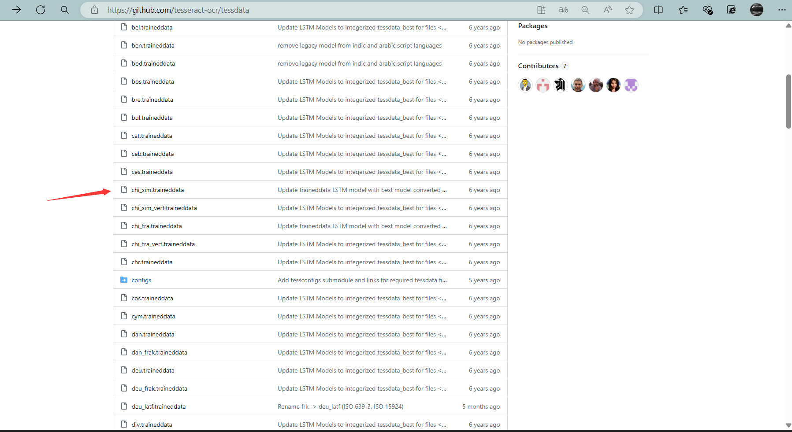
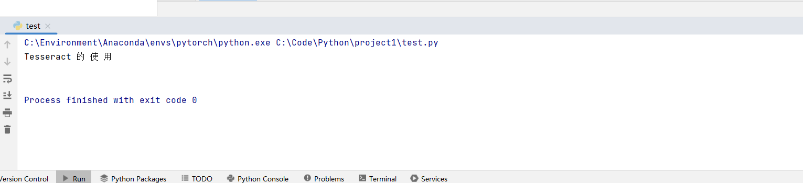

# 文本识别 (OCR)引擎之Tesseract的使用

OCR (Optical Character Recognition，光学字符识别)是指电子设备（例如扫描仪或数码相机）检查纸上打印的字符，经过检测暗、亮的模式肯定其形状，而后用字符识别方法将形状翻译成计算机文字的过程;即，针对印刷体字符，采用光学的方式将纸质文档中的文字转换成为黑白点阵的图像文件，并经过识别软件将图像中的文字转换成文本格式，供文字处理软件进一步编辑加工的技术。如何除错或利用辅助信息提升识别正确率，是OCR最重要的课题，ICR (Intelligent Character Recognition)的名词也随之产生。

## Tesseract

Tesseract是一个开源文本识别 (OCR)引擎，是目前公认最优秀、最精确的开源OCR系统，用于识别图片中的文字并将其转换为可编辑的文本。

Tesseract能够将印刷体文字图像转换成可编辑文本，它支持多种语言，并且在许多平台上都可使用，包括Windows、Mac OS和Linux。Tesseract可以处理各种图像文件格式，如JPEG、PNG、TIFF等。

Tesseract的主要功能是识别图像中的文字，并将其转换成机器可读的文本内容。它采用了一系列图像处理、特征提取和机器学习技术来实现文字识别的过程。Tesseract算法的基础是使用训练好的模型来识别字符，并通过上下文和语言模型来提高识别准确性。

```
语法
英文： tesseract imagename outputbase [-l lang] [--psm pagesegmode]

中文：命令程序    被识别图片    输出文件    -l 语言    --psm 识别级别

0 =定向和脚本检测（OSD）
1 =带OSD的自动页面分割
2 =自动页面分割，但没有OSD或OCR
3 =全自动页面分割，但没有OSD（默认）
4 =假设一列可变大小的文本
5 =假设一个统一的垂直对齐文本块
6 =假设一个统一的文本块
7 =将图像作为单个文本行处理
8 =把图像当作一个单词
9 =把图像当作一个圆圈中的一个词来对待
10 =将图像作为单个字符处理
```

```python
# 导入模块
import pytesseract
# 导入图片库,需要安装库: pip install Pillow
from PIL import Image

# 创建图片对象,使用pillow库加载图片
image = Image.open("E:\\dev\\test.png")

# 识别图片
text = pytesseract.image_to_string(image, config="--psm 7")
print(text)
```

[文本识别 (OCR)引擎之Tesseract的使用_tesseractengine-CSDN博客](https://blog.csdn.net/qq_38628046/article/details/129062682)

## 配置语言字体库

1.配置语言字体库

在安装目录下，默认有个 tessdata目录，该目录中存放的是语言字库文件

访问：https://github.com/tesseract-ocr/tessdata项目，下载需要的语言字库文件，例如中文字库：chi_sim.traineddata下载后放到该目录即可。



2.配置环境变量

添加PATH环境变量，可方便的执行tesseract命令

```
C:\Environment\Tesseract-OCR\
```

添加TESSDATA_PREFIX变量名，将语言字库文件夹添加到变量中

```
C:\Environment\Tesseract-OCR\tessdata
```

3.显示当前训练语言列表

```
C:\Program Files\NVIDIA GPU Computing Toolkit\CUDA\v12.0\extras\demo_suite>tesseract --list-langs
List of available languages in "C:\Environment\Tesseract-OCR/tessdata/" (3):
chi_sim
eng
osd
```

## python 示例

```
import cv2
from PIL import Image

import pytesseract


def Corver_Gray(image_path):
    # 读取模板图像
    img = cv2.imread(image_path)

    # 转换为灰度图 也可读取时直接转换
    ref = cv2.cvtColor(img, cv2.COLOR_BGR2GRAY)

    # 二值图像
    ref = cv2.threshold(ref, 60, 255, cv2.THRESH_BINARY_INV)[1]

    return img


def Read_Img(img_path):
    image = Corver_Gray(img_path)
    image = cv2.imwrite("test.png", image)
    return image


Read_Img(r"C:\Users\19409\Desktop\1111.png")


text = pytesseract.image_to_string(Image.open("test.png"),lang="chi_sim")
print(text)
```

