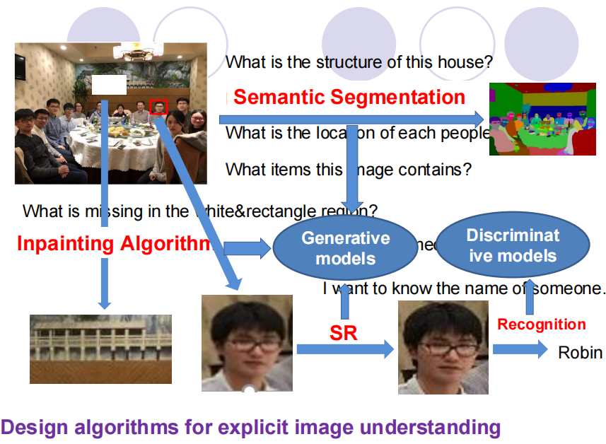
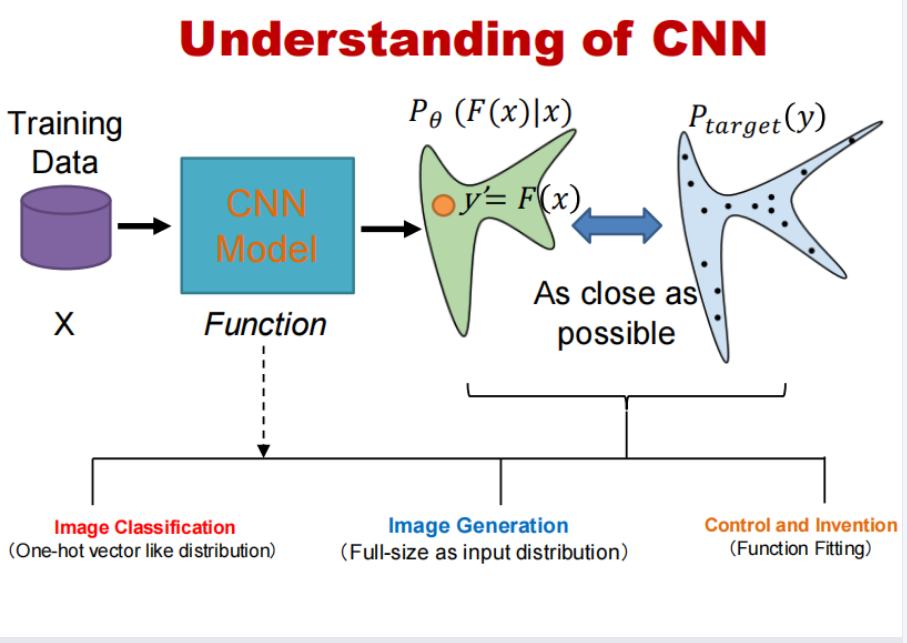
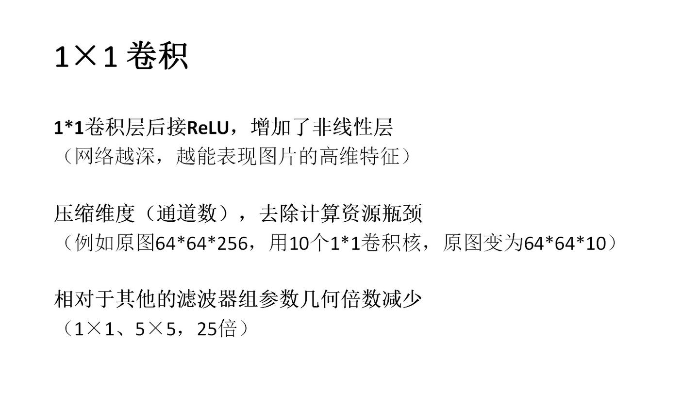

## computer vision

### 语义分割（Semantic Segmentation）

- **任务**：语义分割是将图像中的每个像素分类到特定的类别中，以理解图像中各个部分的含义。
- **问题**：
  - "这所房子的结构是什么？"：通过语义分割，可以识别图像中房子的各个部分，如墙壁、窗户、门等。
  - "每个人的位置在哪里？"：通过语义分割，可以识别图像中每个人的轮廓和位置。
  - "这张图像包含哪些物品？"：通过语义分割，可以识别图像中的各种物品，如桌子、椅子、食物等。

### 图像修复算法（Inpainting Algorithm）

- **任务**：图像修复是指填充图像中的缺失或损坏的区域。
- **问题**："在白色矩形区域中缺少什么？"：通过图像修复算法，可以推测并填充图像中缺失的部分，使其看起来完整。
- **应用**：图像修复常用于修复旧照片、去除图像中的不需要的部分等。

### 生成模型（Generative models）

- **任务**：生成模型是用于生成新数据的模型，通常基于训练数据学习数据的分布。
- **应用**：
  - **超分辨率（SR）**：通过生成模型，可以从低分辨率图像生成高分辨率图像，增强图像细节。
  - **图像修复**：生成模型可以用于图像修复，生成缺失区域的内容。

### 判别模型（Discriminative models）

- **任务**：判别模型是用于分类或回归任务的模型，通常用于区分不同类别的数据。
- **应用**：
  - **人脸识别**：通过判别模型，可以识别图像中的人脸，确定身份。
  - **物体检测**：判别模型可以用于检测图像中的物体，如汽车、行人等。

### 识别（Recognition）

- **任务**：识别是将图像中的某些特征或模式与已知的类别进行匹配，以识别出具体的对象或人物。
- **问题**："我想知道某人的名字..."：通过人脸识别算法，可以识别图像中的某个人，并可能将其与已知的人员数据库进行匹配，确定其身份。例如，图中标注的人被识别为"Robin"。

## Understanding of CNN

### CNN 的基本理解

1. **训练数据（Training Data）**
   - **输入（X）**：训练数据通常是图像或其他类型的输入数据。这些数据用于训练CNN模型，使其能够学习输入数据的特征和模式。
2. **CNN 模型（CNN Model）**
   - **功能（Function）**：CNN模型通过一系列卷积层、池化层、全连接层等，学习输入数据的特征表示。这些层通过权重和偏置参数进行调整，以最小化预测输出与目标输出之间的差异。
3. **概率分布**
   - **模型输出分布（$P_θ(F(x)∣x)$）**：CNN模型的输出可以被视为一个概率分布，表示模型对输入数据的预测。这里的*F*(*x*)是模型对输入*x*的预测，*θ*表示模型的参数。
   - **目标分布**($P_{target}(y)$)：目标分布是希望模型能够接近的实际分布。例如，在分类任务中，目标分布可能是每个类别的概率分布。
4. **目标**
   - **尽可能接近（As close as possible）**：通过训练，CNN模型的目标是使其输出分布$P_θ(F(x)∣x)$尽可能接近目标分布$P_{target}(y)$。这通常通过最小化损失函数（如交叉熵损失）来实现。

### CNN 的应用

1. **图像分类（Image Classification）**
   - **任务**：将图像分类到预定义的类别中。
   - **输出分布**：通常是一个类似one-hot向量的分布，表示每个类别的概率。例如，如果输入图像是猫，模型的输出应该在猫类别上有很高的概率。
2. **图像生成（Image Generation）**
   - **任务**：生成新的图像。
   - **输出分布**：这里的输出分布是与输入分布相同大小的分布。例如，生成对抗网络（GAN）中的生成器网络（Generator）会生成与训练数据分布相似的图像。
3. **控制与发明（Control and Invention）**
   - **任务**：用于控制和自动化任务。
   - **功能拟合**：这里的功能是函数拟合，类似于控制理论中的函数拟合。例如，在自动驾驶汽车中，CNN可以用于将图像输入映射到转向角控制信号。

## Inception model

深度神经网络(Deep Neural Networks, DNN)或深度卷积网络中的Inception模块是由Google的Christian Szegedy等人提出，包括Inception-v1、Inception-v2、Inception-v3、Inception-v4及Inception-ResNet系列。每个版本均是对其前一个版本的迭代改进。另外，依赖于你的数据，低版本可能实际上效果更好。这里是整理的Inception的v1、v2、v3、v4内容。

**Inception**模块的核心思想就是将不同的卷积层通过并联的方式结合在一起，经过不同卷积层处理的结果矩阵在深度这个维度拼接起来，形成一个更深的矩阵。**Inception**模块可以反复叠堆形成更大的网络，它可以对网络的深度和宽度进行高效的扩充，在提升深度学习网络准确率的同时防止过拟合现象的发生。**Inception**模块的优点是可以对尺寸较大的矩阵先进行降维处理的同时，在不同尺寸上对视觉信息进行聚合，方便从不同尺度对特征进行提取。

## mAP、IoU、Recall 和 Precision

### 1. 基础概念

#### (1) IoU (Intersection over Union, 交并比)

- **定义**：预测框和真实框的重叠程度。
- **公式**：

$IoU = \frac{Area(预测框 ∩ 真实框)}{Area(预测框 ∪ 真实框)}$

- **应用**：用来判断预测框是否算“正确检测”。通常设定阈值（如 0.5），当 IoU ≥ 0.5 时，认为预测框与真实框匹配。

>在目标检测里，**IoU（交并比）通常作为阈值来判定预测框是否是 “正确检测”**。
>
>------
>
>### 🔹 为什么用 IoU 当阈值？
>
>- 目标检测要评估“预测框”是否和“真实框”匹配。
>- 不能只看有没有预测，还得看 **框的重叠程度**。
>- 如果 IoU 很低（比如只有 0.2），说明框差得很远，即使预测了正确类别，也算错。
>
>------
>
>### 🔹 常见阈值设置
>
>- **PASCAL VOC**：IoU ≥ **0.5** 就算一个 **TP**（True Positive）。
>- **COCO**：更严格，计算 **mAP@[0.5:0.95]**，也就是 IoU 从 0.5 到 0.95，每隔 0.05 取一次阈值，最后平均。
>  - 这样可以区分“框大概对了”（IoU=0.5）和“框非常准”（IoU=0.9）的区别。

------

#### (2) Precision（精确率，查准率）

- **定义**：在所有预测为正例（检测出的目标）中，有多少是真正的目标。
- **公式**：

$ Precision = \frac{TP}{TP + FP} $

- **含义**：你预测的目标里，有多少是对的。

------

#### (3) Recall（召回率，查全率）

- **定义**：在所有真实目标中，有多少被成功检测出来。
- **公式**：

$ Recall = \frac{TP}{TP + FN} $

- **含义**：真实目标有多少被你找到。

> ⚖️ Precision 和 Recall 是一对“跷跷板”，高 Precision 往往导致低 Recall，反之亦然。

------

#### (4) mAP (mean Average Precision)

- **定义**：综合 Precision 和 Recall 的指标。
- **步骤**：
  1. 画出 **Precision-Recall 曲线**（随着阈值变化，Precision 与 Recall 的关系）。
  2. 计算曲线下面积（AP, Average Precision）。
  3. 对所有类别求平均（mAP, mean Average Precision）。
- **公式（直观表示）**：

$mAP = \frac{1}{N}\sum_{i=1}^N AP_i$

其中 N 是类别数。

- **应用**：目标检测竞赛（如 COCO、VOC）主要用 mAP 作为最终指标。

------

### 2. 区别总结

| 指标          | 类型     | 作用                         | 直观理解       |
| ------------- | -------- | ---------------------------- | -------------- |
| **IoU**       | 几何指标 | 衡量预测框和真实框的重叠程度 | 框对不对齐     |
| **Precision** | 分类指标 | 预测为目标的正确率           | “我报的对不对” |
| **Recall**    | 分类指标 | 真实目标被检测到的比例       | “我有没有漏报” |
| **mAP**       | 综合指标 | 综合 Precision 和 Recall     | 总体性能打分   |

------

### 3. 小例子（直观感受）

假设图片中有 **10 个真实目标**，模型预测了 **12 个框**，其中：

- 8 个框是正确的（TP）
- 4 个框是错误的（FP）
- 2 个目标被漏检（FN）

那么：

- **Precision** = 8 / (8+4) = 0.67
- **Recall** = 8 / (8+2) = 0.80
- **IoU** = 对每个 TP 单独计算，比如某个框 IoU=0.6（是否算 TP 取决于阈值）
- **mAP** = 把所有类别的 Precision-Recall 曲线求面积，再取平均，比如得到 0.72

------

👉 总结：

- **IoU** → 框的重叠程度
- **Precision** → 报的对不对
- **Recall** → 漏没漏
- **mAP** → 综合成绩

## AUC-ROC  AUC-PR

**ROC 曲线下面积 (AUC-ROC)** 或 **Precision-Recall 曲线下面积 (AUC-PR)**。我帮你梳理一下两者的区别和含义。

------

### ROC 曲线 (Receiver Operating Characteristic Curve)

- **横轴 (X)**：False Positive Rate (FPR) = FP / (FP + TN)
- **纵轴 (Y)**：True Positive Rate (TPR) = TP / (TP + FN) = Recall

**曲线意义**：

- ROC 曲线显示了分类器在不同阈值下的**权衡**：更容易预测正例（高Recall） vs. 控制误报（低FPR）。
- 曲线越靠左上角 → 分类器越好。

**AUC-ROC**（Area Under Curve）：

- 表示曲线下的面积，范围 [0,1]
- 0.5 → 相当于随机猜
- 1 → 完美分类

> 直观理解：AUC-ROC 越大，说明模型越容易把正例和负例分开。

------

### Precision-Recall 曲线 (PR Curve)

- **横轴 (X)**：Recall = TP / (TP + FN)
- **纵轴 (Y)**：Precision = TP / (TP + FP)

**曲线意义**：

- 更适合 **类别不平衡** 的情况（正例很少）
- 高 Precision + 高 Recall → 理想分类器

**AUC-PR**：

- PR 曲线下的面积，也越大越好

> 与 ROC 不同：在正负样本极度不平衡时，PR-AUC 更能体现模型能力。

------

### 总结

- **ROC-AUC**：整体区分能力（对称，不依赖正负比例）
- **PR-AUC**：对少数类表现更敏感（类别不平衡时更重要）
- 两者都是用曲线下面积衡量 **分类器的准确度或区分能力**。
