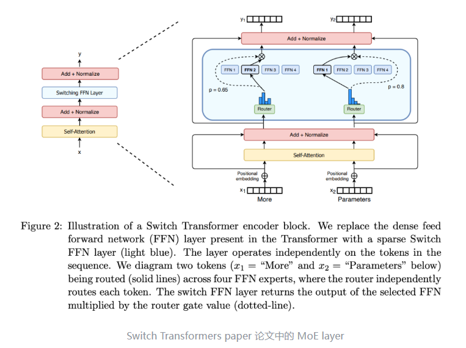

## MoE

**混合专家模型** (Mixed Expert Models，简称 MoEs) ，最早是随着 Mixtral 8x7B 的推出而逐渐引起人们的广泛关注。 最近随着DeepSeek的爆火，MoE又进一步引起大家的关注。在本文中，我们将深入探讨 MoEs 的核心组件、训练方法，以及在推理过程中需要考量的各种因素。

## MoE架构模型

大模型时代，模型规模是提升模型性能的关键因素之一。在有限的计算资源预算下，用更少的训练步数训练一个更大的模型，往往比用更多的步数训练一个较小的模型效果更佳。

**混合专家模型 (MoE) 的一个显著优势是它们能够在远少于稠密模型所需的计算资源下进行有效的预训练**。这意味着在相同的计算预算条件下，您可以显著扩大模型或数据集的规模。特别是在预训练阶段，与稠密模型相比，混合专家模型通常能够更快地达到相同的质量水平。

那么，究竟什么是一个混合专家模型 (MoE) 呢？作为一种基于 Transformer 架构的模型，混合专家模型主要由两个关键部分组成。

- **稀疏 [MoE 层]**: 这些层代替了传统 Transformer 模型中的前馈网络 (FFN) 层。MoE 层包含若干“专家”(例如 8 个)，每个专家本身是一个独立的神经网络。在实际应用中，这些专家通常是前馈网络 (FFN)，但它们也可以是更复杂的网络结构，甚至可以是 MoE 层本身，从而形成层级式的 MoE 结构。
- **门控网络或路由**: 这个部分用于决定哪些Token (token) 被发送到哪个专家。例如，在下图中，“More”这个Token可能被发送到第二个专家，而“Parameters”这个Token被发送到第一个专家。有时，一个Token甚至可以被发送到多个专家。Token的路由方式是 MoE 使用中的一个关键点，因为路由器由学习的参数组成，并且与网络的其他部分一同进行预训练。

总结来说，在混合专家模型 (MoE) 中，我们将传统 Transformer 模型中的每个前馈网络 (FFN) 层替换为 MoE 层，其中 MoE 层由两个核心部分组成: 一个门控网络和若干数量的专家。

尽管混合专家模型 (MoE) 提供了若干显著优势，例如更高效的预训练和与稠密模型相比更快的推理速度，但它们也伴随着一些挑战:

- **训练挑战**: 虽然 MoE 能够实现更高效的计算预训练，但它们在微调阶段往往面临泛化能力不足的问题，长期以来易于引发过拟合现象。
- **推理挑战**: MoE 模型虽然可能拥有大量参数，但在推理过程中只使用其中的一部分，这使得它们的推理速度快于具有相同数量参数的稠密模型。然而，这种模型需要将所有参数加载到内存中，因此对内存的需求非常高。以 Mixtral 8x7B 这样的 MoE 为例，需要足够的 VRAM 来容纳一个 47B 参数的稠密模型。之所以是 47B 而不是 8 x 7B = 56B，是因为在 MoE 模型中，只有 FFN 层被视为独立的专家，而模型的其他参数是共享的。此外，假设每个令牌只使用两个专家，那么推理速度 (以 FLOPs 计算) 类似于使用 12B 模型 (而不是 14B 模型)，因为虽然它进行了 2x7B 的矩阵乘法计算，但某些层是共享的。