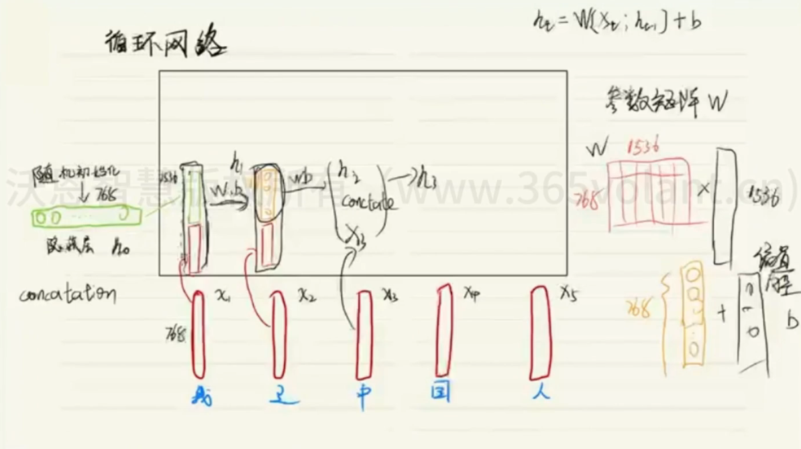
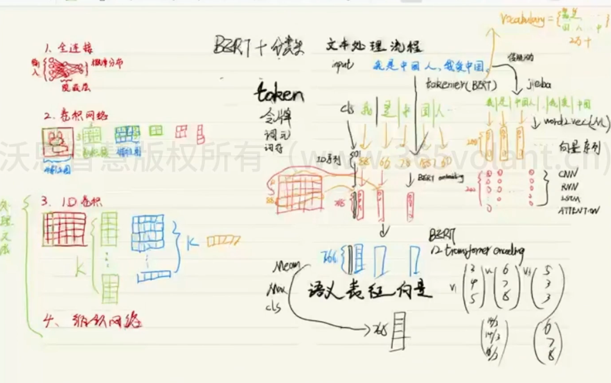

# 深度学习基础

## 全连接网络

**有标签监督学习（one hot向量）的数据去训练模型**

**无监督学习，只给原始训练集（训练集），让计算机自行抽取抽象特征得出隐式变量，常用于聚类分析等问题**

**强化学习是不给数据和结果，让计算机自行交互计算**

**数值化->标准化->扁平化**

## 卷积网络

**扩充->特征提取（使用卷积核）->最大池化->扁平化**

## 循环网络

### 普通循环网络

### 长短期记忆网络LSTM

长短期记忆网络（Long Short-Term Memory，LSTM）是一种特殊类型的循环神经网络（Recurrent Neural Network，RNN），由Hochreiter和Schmidhuber在1997年提出。它被设计用来解决传统RNN中的长期依赖问题，即在处理长序列数据时，传统RNN的梯度消失或梯度爆炸问题。

LSTM通过引入称为“门控”（gate）的机制来实现对信息的选择性保留和遗忘。它包含了三个门：遗忘门（forget gate）、输入门（input gate）和输出门（output gate），以及一个单元状态（cell state）。这些门控机制允许LSTM根据当前输入和之前的状态来决定何时遗忘信息、何时接受新信息以及何时输出信息。

以下是LSTM的基本组件：

1. **单元状态（cell state）**：
   单元状态是LSTM网络中贯穿整个时间步的信息流的主要载体。它可以看作是LSTM内部的记忆单元，可以在长时间范围内保持和传递信息。

2. **遗忘门（forget gate）**：
   遗忘门决定了在当前时间步应该丢弃多少之前的单元状态信息。它根据当前输入和前一个时间步的隐藏状态来计算一个介于0和1之间的值，表示应该保留的信息量。当遗忘门输出接近0时，表示应该完全忘记先前的单元状态；当遗忘门输出接近1时，表示应该保留大部分先前的单元状态。

3. **输入门（input gate）**：
   输入门决定了在当前时间步应该更新多少新的信息到单元状态中。它通过对当前输入和前一个时间步的隐藏状态进行操作，生成一个介于0和1之间的值，表示应该更新的信息量。

4. **输出门（output gate）**：
   输出门决定了在当前时间步应该输出多少信息。它根据当前输入和前一个时间步的隐藏状态来计算一个介于0和1之间的值，表示应该输出的信息量。

LSTM的这些门控机制使其能够更有效地处理长序列数据，并且在很多序列建模任务中取得了很好的表现，如语言建模、机器翻译、语音识别等。

### GRU

门控循环单元（Gated Recurrent Unit，GRU）是另一种常用于处理序列数据的循环神经网络（Recurrent Neural Network，RNN）的变种，由Cho等人于2014年提出。与长短期记忆网络（LSTM）相比，GRU具有更简单的结构，但在某些任务上表现出类似或更好的性能。

GRU包含了更新门（update gate）和重置门（reset gate）两个门，通过这些门的控制，GRU可以更灵活地管理信息的流动。

以下是GRU的基本组件：

1. **更新门（Update Gate）**：
   更新门决定了当前时间步的输入和前一个时间步的隐藏状态之间有多少信息要被更新到当前时间步的隐藏状态中。它的输出值介于0和1之间，用于控制信息的保留和遗忘。

2. **重置门（Reset Gate）**：
   重置门决定了如何将前一个时间步的隐藏状态与当前时间步的输入结合起来。它的输出值也在0到1之间，用于控制前一个时间步的隐藏状态有多少信息被忽略。

3. **当前时间步的候选隐藏状态**：
   候选隐藏状态是由重置门控制的前一个时间步的隐藏状态和当前时间步的输入共同计算得到的。它提供了一个备选的隐藏状态，用于计算更新门。

4. **当前时间步的隐藏状态**：
   当前时间步的隐藏状态是由更新门控制的前一个时间步的隐藏状态和候选隐藏状态之间进行插值得到的。它是GRU的主要输出，用于传递信息到下一个时间步。

GRU的设计相对简单，参数较少，计算效率较高，因此在一些场景下被广泛应用，尤其是当数据量较小或计算资源有限时。它在语言建模、机器翻译、语音识别等任务中取得了很好的表现，并且相对于LSTM来说，更容易训练和调试。

## 注意力机制和transformer

当谈到注意力机制（Attention Mechanism）和Transformer时，通常是指自然语言处理（NLP）领域中的关键概念。以下是它们的简要介绍：

1. **注意力机制（Attention Mechanism）**：
   注意力机制是一种模拟人类视觉或语言处理中的注意力机制的方式，它允许模型在处理序列数据时，根据序列中不同部分的重要性来分配不同的权重。在自然语言处理中，一个词可能在理解句子的时候比其他词更重要。因此，注意力机制允许模型在处理每个词或序列时，动态地学习并关注输入序列的不同部分。这种动态的关注机制使得模型能够更好地捕捉序列数据中的长距离依赖关系，并且在各种NLP任务中表现出色，如机器翻译、语言建模和文本摘要等。

2. **Transformer**：
   Transformer是一种基于注意力机制的深度学习模型，由Vaswani等人在2017年提出。它被广泛应用于自然语言处理任务，特别是机器翻译。Transformer取消了传统循环神经网络（RNN）和卷积神经网络（CNN）的结构，在序列数据处理中采用了完全基于注意力机制的架构。Transformer包括编码器（Encoder）和解码器（Decoder）两个部分，每个部分都由多个相同的层堆叠而成。在编码器中，输入序列的每个词都通过自注意力机制进行编码，以便模型可以考虑输入序列的全局关系。在解码器中，除了自注意力机制，还使用编码器-解码器注意力机制来捕捉输入序列和输出序列之间的对应关系，从而实现翻译等任务。

总的来说，注意力机制允许模型根据输入数据的不同部分分配不同的重要性，而Transformer则是基于注意力机制构建的深度学习模型，在自然语言处理领域取得了巨大成功。

## 处理文本

**input-> tokenizer（分词）->word to vec（把分开的词映射成一个向量）**

