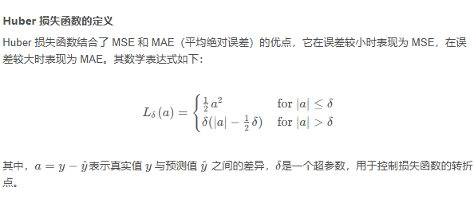

# 激活函数和损失函数
## 激活函数

激活函数是神经网络中非常重要的组成部分之一，其作用是将神经元的输入信号转换为输出信号，常见的激活函数包括：

1. Sigmoid函数：Sigmoid函数是一个常用的激活函数，其将输入信号映射到0到1的范围内，常用于二分类问题中。
2. ReLU函数：ReLU函数是一个非常简单且常用的激活函数，其将所有小于0的输入信号设为0，大于等于0的信号不变，可以加速神经网络的训练速度。
3. Tanh函数：Tanh函数与Sigmoid函数类似，其将输入信号映射到-1到1的范围内，常用于分类和回归问题中。
4. Softmax函数：Softmax函数是一种特殊的激活函数，常用于多分类问题中，将多个输出信号映射到0到1的范围内，并满足输出信号之和为1。

选择激活函数的主要目的是**引入非线性特性**，使得神经网络可以学习更加复杂的模式和关系。不同的激活函数在不同的场景中表现不同，需要根据具体的任务和数据集来选择合适的激活函数。

**如何选择激活函数？**

**隐藏层**

- 优先选择RELU激活函数
- 如果ReLu效果不好，那么尝试其他激活，如Leaky ReLu等。
- 如果你使用了Relu， 需要注意一下Dead Relu问题， 避免出现大的梯度从而导致过多的神经元死亡。
- 不要使用sigmoid激活函数，可以尝试使用tanh激活函数

**输出层**

- 二分类问题选择sigmoid激活函数
- 多分类问题选择softmax激活函数
- 回归问题选择identity激活函数

**选择激活函数时，依据问题类型和模型特性来进行选择。以下是对上述选择激活函数的建议的依据与解释**

>### 隐藏层
>
>1. **ReLU (Rectified Linear Unit)**:
>   - **优先选择ReLU**：ReLU 是目前最常用的激活函数，因为它能够有效地解决梯度消失问题，并且计算简单。ReLU 在大多数情况下表现出色，因此是默认选择。
>   - **避免Dead ReLU问题**：ReLU 的缺点是可能导致“Dead ReLU”问题，即在训练过程中某些神经元可能永远不会被激活（输出恒为零），特别是在权重初始化不当或学习率较大时。为了避免这种情况，可以尝试使用改进版的ReLU，比如 Leaky ReLU 或 Parametric ReLU。
>
>2. **Leaky ReLU**:
>   - 如果 ReLU 导致了过多的“Dead ReLU”，可以尝试 Leaky ReLU 或 Parametric ReLU，这些变体允许负输入有一个小的负斜率，从而减少“神经元死亡”的可能性。
>
>3. **Sigmoid**:
>   - **不推荐在隐藏层使用**：Sigmoid 激活函数在处理深度网络时容易导致梯度消失问题，因为它的导数在输入值非常大或非常小时趋近于零，导致梯度更新非常慢。因此，通常不建议在隐藏层使用。
>
>4. **Tanh**:
>   - **可尝试使用 Tanh**：Tanh 激活函数在 Sigmoid 的基础上进行了改进，其输出范围在 [-1, 1] 之间，这种特性使得 Tanh 在有些情况下优于 Sigmoid，特别是在深度网络中，它能够缓解一定程度的梯度消失问题。
>
>### 输出层
>
>1. **Sigmoid (二分类问题)**:
>   - **适用于二分类问题**：Sigmoid 激活函数将输出映射到 [0, 1] 范围内，可以解释为概率，因此在二分类问题中是常用的输出激活函数。
>
>2. **Softmax (多分类问题)**:
>   - **适用于多分类问题**：Softmax 激活函数将多个输出节点的值转换为概率分布（所有输出的概率之和为 1）。因此，在多分类问题中，Softmax 是最常用的输出激活函数。
>
>3. **Identity (回归问题)**:
>   - **适用于回归问题**：在回归问题中，输出层的任务是预测一个连续的数值。因此，不需要将输出值映射到某个范围内，通常使用线性激活（即 identity 函数），这意味着输出值直接等于输入值。
>
>### 总结
>
>- **隐藏层**：ReLU 是默认的激活函数，如果效果不佳或遇到“Dead ReLU”问题，可以尝试 Leaky ReLU 或其他变体。避免使用 Sigmoid，Tanh 作为备选方案。
>- **输出层**：根据问题类型选择激活函数，二分类问题使用 Sigmoid，多分类问题使用 Softmax，回归问题使用线性激活。

## 损失函数

损失函数是神经网络中非常重要的组成部分之一，其作用是衡量模型预测结果与真实结果之间的差异，常见的损失函数包括：

1. 均方误差（Mean Squared Error，MSE）：均方误差是回归任务中最常用的损失函数，其计算方法是预测结果与真实结果之间差值的平方和的平均值。

2. 交叉熵（Cross Entropy）：交叉熵是分类任务中最常用的损失函数，其计算方法是真实标签和预测标签之间的交叉熵。

3. 对数损失（Log Loss）：也称为二元交叉熵损失（Binary Cross-Entropy Loss）。对数损失是二分类任务中常用的损失函数，其计算方法是真实标签和预测标签之间的对数差。Loss(y, y_pred) = -y * log(y_pred) - (1 - y) * log(1 - y_pred)

4. KL散度（Kullback-Leibler Divergence）：KL散度是衡量两个概率分布之间的差异的一种指标，常用于对比两个分布之间的相似度。

5. Huber Loss：Huber Loss是一种平滑的损失函数，可以在回归任务中比均方误差更加鲁棒。

   

7. Hinge Loss 铰链损失函数是机器学习中的一种损失函数，通常用于最大间隔分类算法，特别是在支持向量机$（SVM）$中作为目标函数使用。它旨在创建一个最大间隔，以便在分类决策中尽可能地将数据点分开。

   铰链损失函数的定义 在二分类问题中，铰链损失函数的定义如下：

   ```python
   def hinge_loss(y_true, y_pred):
   
   	return max(0, 1 - y_true * y_pred)
   ```

   其中，`y_pred` 是模型的预测值，其范围在 -1 到 1 之间，而 `y_true` 是目标值，取值为 1 或 -1。当预测值 *y_pred* 与目标值 *y_true* 的乘积大于等于 1 时，损失为 0，这意味着预测是正确的，并且预测结果与决策边界的距离超过了安全边界。当乘积小于 1 时，损失随着预测值与目标值之间差距的增大而增大。

选择损失函数的主要目的是**最小化预测结果与真实结果之间的差异**，使得模型能够更加准确地预测目标值。不同的损失函数在不同的场景中表现不同，需要根据具体的任务和数据集来选择合适的损失函数。

### MSE损失函数

MSE（Mean Squared Error，均方误差）损失函数是回归问题中最常用的一种损失函数，衡量预测值与真实值之间的差异。其基本原理是计算预测值与真实值之差的平方，再取平均。

MSE 损失函数的公式为：

$
L(y, \hat{y}) = \frac{1}{n} \sum_{i=1}^{n} (y_i - \hat{y}_i)^2
$

其中：
- $ y_i $ 是第 $i$ 个样本的真实值，
- $ \hat{y}_i $ 是第 $i$ 个样本的预测值，
- $ n $ 是样本的总数。

这个公式表示所有样本的预测值与真实值的差的平方和的平均值。差的平方会放大误差，使得模型对大误差更加敏感。MSE 越小，表示预测越接近真实值。

#### MSE

MSE（Mean Squared Error），即均方误差，除了作为损失函数之外，它还可以用作评估模型性能的一个指标，特别是在回归任务中。它用于衡量模型预测的准确性，反映了预测值和真实值之间的平均平方误差。

MSE 的值总是非负的，接近 0 的 MSE 值表示模型的预测与真实值非常接近； 

#### MSE的特点：
- **敏感度**：对大误差敏感。因为误差被平方后，较大的误差将比较小的误差对结果产生更大的影响。
- **可微性**：MSE 是可微的，这使得它适合用于梯度下降优化方法。
  

**总结**

- **MSE损失函数**：用于神经网络或其他回归模型的优化目标，通过最小化 MSE，模型可以获得更精确的预测。
- **MSE评估指标**：用于衡量模型在测试集上的表现，以便判断模型是否适合实际问题。
