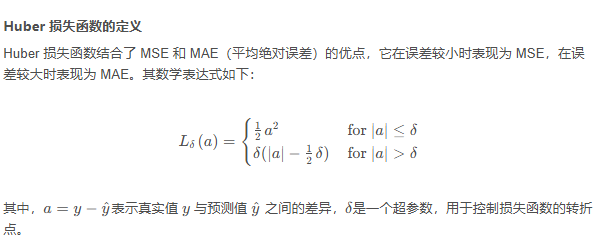

# 激活函数和损失函数
## 激活函数

激活函数是神经网络中非常重要的组成部分之一，其作用是将神经元的输入信号转换为输出信号，常见的激活函数包括：

1. Sigmoid函数：Sigmoid函数是一个常用的激活函数，其将输入信号映射到0到1的范围内，常用于二分类问题中。
2. ReLU函数：ReLU函数是一个非常简单且常用的激活函数，其将所有小于0的输入信号设为0，大于等于0的信号不变，可以加速神经网络的训练速度。
3. Tanh函数：Tanh函数与Sigmoid函数类似，其将输入信号映射到-1到1的范围内，常用于分类和回归问题中。
4. Softmax函数：Softmax函数是一种特殊的激活函数，常用于多分类问题中，将多个输出信号映射到0到1的范围内，并满足输出信号之和为1。

选择激活函数的主要目的是**引入非线性特性**，使得神经网络可以学习更加复杂的模式和关系。不同的激活函数在不同的场景中表现不同，需要根据具体的任务和数据集来选择合适的激活函数。

**如何选择激活函数？**

**隐藏层**

- 优先选择RELU激活函数
- 如果ReLu效果不好，那么尝试其他激活，如Leaky ReLu等。
- 如果你使用了Relu， 需要注意一下Dead Relu问题， 避免出现大的梯度从而导致过多的神经元死亡。
- 不要使用sigmoid激活函数，可以尝试使用tanh激活函数

**输出层**

- 二分类问题选择sigmoid激活函数
- 多分类问题选择softmax激活函数
- 回归问题选择identity激活函数

**选择激活函数时，依据问题类型和模型特性来进行选择。以下是对上述选择激活函数的建议的依据与解释**

>### 隐藏层
>
>1. **ReLU (Rectified Linear Unit)**:
>   - **优先选择ReLU**：ReLU 是目前最常用的激活函数，因为它能够有效地解决梯度消失问题，并且计算简单。ReLU 在大多数情况下表现出色，因此是默认选择。
>   - **避免Dead ReLU问题**：ReLU 的缺点是可能导致“Dead ReLU”问题，即在训练过程中某些神经元可能永远不会被激活（输出恒为零），特别是在权重初始化不当或学习率较大时。为了避免这种情况，可以尝试使用改进版的ReLU，比如 Leaky ReLU 或 Parametric ReLU。
>
>2. **Leaky ReLU**:
>   - 如果 ReLU 导致了过多的“Dead ReLU”，可以尝试 Leaky ReLU 或 Parametric ReLU，这些变体允许负输入有一个小的负斜率，从而减少“神经元死亡”的可能性。
>
>3. **Sigmoid**:
>   - **不推荐在隐藏层使用**：Sigmoid 激活函数在处理深度网络时容易导致梯度消失问题，因为它的导数在输入值非常大或非常小时趋近于零，导致梯度更新非常慢。因此，通常不建议在隐藏层使用。
>
>4. **Tanh**:
>   - **可尝试使用 Tanh**：Tanh 激活函数在 Sigmoid 的基础上进行了改进，其输出范围在 [-1, 1] 之间，这种特性使得 Tanh 在有些情况下优于 Sigmoid，特别是在深度网络中，它能够缓解一定程度的梯度消失问题。
>
>### 输出层
>
>1. **Sigmoid (二分类问题)**:
>   - **适用于二分类问题**：Sigmoid 激活函数将输出映射到 [0, 1] 范围内，可以解释为概率，因此在二分类问题中是常用的输出激活函数。
>
>2. **Softmax (多分类问题)**:
>   - **适用于多分类问题**：Softmax 激活函数将多个输出节点的值转换为概率分布（所有输出的概率之和为 1）。因此，在多分类问题中，Softmax 是最常用的输出激活函数。
>
>3. **Identity (回归问题)**:
>   - **适用于回归问题**：在回归问题中，输出层的任务是预测一个连续的数值。因此，不需要将输出值映射到某个范围内，通常使用线性激活（即 identity 函数），这意味着输出值直接等于输入值。
>
>### 总结
>
>- **隐藏层**：ReLU 是默认的激活函数，如果效果不佳或遇到“Dead ReLU”问题，可以尝试 Leaky ReLU 或其他变体。避免使用 Sigmoid，Tanh 作为备选方案。
>- **输出层**：根据问题类型选择激活函数，二分类问题使用 Sigmoid，多分类问题使用 Softmax，回归问题使用线性激活。

## 损失函数

损失函数是神经网络中非常重要的组成部分之一，其作用是衡量模型预测结果与真实结果之间的差异，常见的损失函数包括：

1. 均方误差（Mean Squared Error，MSE）：均方误差是回归任务中最常用的损失函数，其计算方法是预测结果与真实结果之间差值的平方和的平均值。

2. 交叉熵（Cross Entropy）：交叉熵是分类任务中最常用的损失函数，其计算方法是真实标签和预测标签之间的交叉熵。

3. 对数损失（Log Loss）：也称为二元交叉熵损失（Binary Cross-Entropy Loss）。对数损失是二分类任务中常用的损失函数，其计算方法是真实标签和预测标签之间的对数差。Loss(y, y_pred) = -y * log(y_pred) - (1 - y) * log(1 - y_pred)

4. KL散度（Kullback-Leibler Divergence）：KL散度是衡量两个概率分布之间的差异的一种指标，常用于对比两个分布之间的相似度。

5. Huber Loss：Huber Loss是一种平滑的损失函数，可以在回归任务中比均方误差更加鲁棒。

   

7. Hinge Loss 铰链损失函数是机器学习中的一种损失函数，通常用于最大间隔分类算法，特别是在支持向量机$（SVM）$中作为目标函数使用。它旨在创建一个最大间隔，以便在分类决策中尽可能地将数据点分开。

   铰链损失函数的定义 在二分类问题中，铰链损失函数的定义如下：

   ```python
   def hinge_loss(y_true, y_pred):
   
   	return max(0, 1 - y_true * y_pred)
   ```

   其中，`y_pred` 是模型的预测值，其范围在 -1 到 1 之间，而 `y_true` 是目标值，取值为 1 或 -1。当预测值 *y_pred* 与目标值 *y_true* 的乘积大于等于 1 时，损失为 0，这意味着预测是正确的，并且预测结果与决策边界的距离超过了安全边界。当乘积小于 1 时，损失随着预测值与目标值之间差距的增大而增大。

选择损失函数的主要目的是**最小化预测结果与真实结果之间的差异**，使得模型能够更加准确地预测目标值。不同的损失函数在不同的场景中表现不同，需要根据具体的任务和数据集来选择合适的损失函数。

### MSE损失函数

MSE（Mean Squared Error，均方误差）损失函数是回归问题中最常用的一种损失函数，衡量预测值与真实值之间的差异。其基本原理是计算预测值与真实值之差的平方，再取平均。

MSE 损失函数的公式为：

$
L(y, \hat{y}) = \frac{1}{n} \sum_{i=1}^{n} (y_i - \hat{y}_i)^2
$

其中：
- $ y_i $ 是第 $i$ 个样本的真实值，
- $ \hat{y}_i $ 是第 $i$ 个样本的预测值，
- $ n $ 是样本的总数。

这个公式表示所有样本的预测值与真实值的差的平方和的平均值。差的平方会放大误差，使得模型对大误差更加敏感。MSE 越小，表示预测越接近真实值。

#### MSE

MSE（Mean Squared Error），即均方误差，除了作为损失函数之外，它还可以用作评估模型性能的一个指标，特别是在回归任务中。它用于衡量模型预测的准确性，反映了预测值和真实值之间的平均平方误差。

MSE 的值总是非负的，接近 0 的 MSE 值表示模型的预测与真实值非常接近； 

#### MSE的特点：
- **敏感度**：对大误差敏感。因为误差被平方后，较大的误差将比较小的误差对结果产生更大的影响。
- **可微性**：MSE 是可微的，这使得它适合用于梯度下降优化方法。
  

**总结**

- **MSE损失函数**：用于神经网络或其他回归模型的优化目标，通过最小化 MSE，模型可以获得更精确的预测。
- **MSE评估指标**：用于衡量模型在测试集上的表现，以便判断模型是否适合实际问题。

---

## Loss 的本质、梯度下降与 Batch 训练原理

### Loss 是关于参数 θ 的多元函数

神经网络有几亿个参数，拼成一个向量：

$$\theta = [\theta_1, \theta_2, \dots, \theta_n] \quad (n \approx \text{几亿})$$

Loss 就是关于 $\theta$ 的 **n 元函数**：

$$\mathcal{L}(\theta_1, \theta_2, \dots, \theta_n)$$

**训练目标：找到让 $\mathcal{L}(\theta)$ 最小的 $\theta$。**

梯度 = 对每个参数求偏导，组成一个 n 维向量：

$$\nabla_\theta \mathcal{L} = \left[\frac{\partial \mathcal{L}}{\partial \theta_1},\ \frac{\partial \mathcal{L}}{\partial \theta_2},\ \dots,\ \frac{\partial \mathcal{L}}{\partial \theta_n}\right]$$

- 偏导 > 0：增大这个参数会让 Loss 变大 → 应该减小它
- 偏导 < 0：增大这个参数会让 Loss 变小 → 应该增大它

**参数更新公式（梯度下降）：**

$$\theta \leftarrow \theta - \eta \cdot \nabla_\theta \mathcal{L}$$

```
把 Loss 想象成山地地形，θ 是你的位置：

∇L = 当前位置最陡的上坡方向
-∇L = 最陡的下坡方向

每步往下坡方向走 η 距离 → 最终走到山谷（Loss 最小）
```

---

### SFT 的 Loss：从 token 到 Batch

#### 单个 token 的 Loss（交叉熵）

模型在位置 $t$ 预测下一个 token，真实答案是 $y_t$：

$$\mathcal{L}_t = -\log P_\theta(y_t \mid x, y_{<t})$$

```
模型说"有效图"概率是 90% → -log(0.9) ≈ 0.105  ← loss 小，预测准
模型说"有效图"概率是 10% → -log(0.1) ≈ 2.303  ← loss 大，预测错

负对数：概率越高 → loss 越小，完美对应"预测越准越好"
```

#### 一条样本（T 个 token）

$$\mathcal{L}_\text{seq} = -\frac{1}{T}\sum_{t=1}^{T} \log P_\theta(y_t \mid x, y_{<t})$$

先在序列内部对所有 token 取平均。

#### 一个 Batch（N 条样本，每条长度不同）

$$\mathcal{L}_\text{SFT} = -\frac{1}{N}\sum_{i=1}^{N} \frac{1}{T_i}\sum_{t=1}^{T_i} \log P_\theta(y_t^{(i)} \mid x^{(i)}, y_{<t}^{(i)})$$

```
层层展开：

Batch（N 条样本）
  └── 样本 i（T_i 个 token）
        └── 每个 token 算 -log P(y_t)

步骤：
  ① 每个 token 算 -log P
  ② 在序列内对 token 取平均 → 得到 L_i
  ③ 在 batch 内对样本取平均 → 得到 L_SFT

为什么要先除以 T_i？
  ❌ 不除的话：长句子（100token）贡献 loss 是短句子（10token）的10倍
              → 模型偏向优化长句子，短句子被忽视
  ✅ 除以 T_i：每条样本贡献相同权重，公平对待所有样本
```

---

### GRPO 的完整 Batch Loss

GRPO 多了一层：每个问题生成 G 个回答，共三层循环。

#### 定义每个 token 的 ratio 和 advantage

**ratio（新旧策略的概率比）：**

$$r_{g,t} = \frac{P_\theta(y_{g,t} \mid x, y_{g,<t})}{P_{\theta_\text{old}}(y_{g,t} \mid x, y_{g,<t})}$$

**advantage（第 g 个回答比平均好多少，归一化）：**

$$\hat{A}_g = \frac{R_g - \text{mean}(R_1, \dots, R_G)}{\text{std}(R_1, \dots, R_G)}$$

**KL 散度惩罚（防止跑太远）：**

$$\text{KL}_{g,t} = \frac{P_\theta}{P_\text{ref}} - \log\frac{P_\theta}{P_\text{ref}} - 1$$

#### 完整公式（一个问题，G 个回答）

$$\mathcal{L}_\text{GRPO} = -\frac{1}{G}\sum_{g=1}^{G} \frac{1}{T_g}\sum_{t=1}^{T_g} \left[\min\left(r_{g,t}\cdot\hat{A}_g,\ \text{clip}(r_{g,t}, 1{-}\varepsilon, 1{+}\varepsilon)\cdot\hat{A}_g\right) - \beta\cdot\text{KL}_{g,t}\right]$$

```
展开看结构（G=3 个回答）：

问题 x：
  回答1（5个token）: reward=0.9 → A1=+1.2（好于平均）
  回答2（3个token）: reward=0.3 → A2=-0.8（差于平均）
  回答3（4个token）: reward=0.6 → A3=-0.4

每个token算一项：min(r·A, clip(r)·A) - β·KL

回答1：5个token的值 / 5 → loss1
回答2：3个token的值 / 3 → loss2
回答3：4个token的值 / 4 → loss3

L_GRPO = (loss1 + loss2 + loss3) / 3
```

#### SFT vs GRPO 结构对比

```
SFT：
  Batch
  └── N 条样本
        └── 每条 T_i 个 token
              └── 每个 token：-log P(y_t)

GRPO：
  Batch
  └── N 个问题
        └── 每个问题 G 个回答
              └── 每个回答 T_g 个 token
                    └── 每个 token：min(r·A, clip·A) - β·KL

多了"G 个回答"这一层，其余平均逻辑完全一样。
```

| | SFT | GRPO |
|--|-----|------|
| **监督信号** | 正确答案的 token | 回答之间的相对 reward |
| **每个 token 的目标** | 预测正确 → loss 小 | 好回答概率↑，差回答概率↓ |
| **Loss 核心** | $-\log P(y_t)$ | $-\min(r\cdot A,\ \text{clip}(r)\cdot A)$ |
| **参数更新方式** | `loss.backward()` + 梯度下降 | **完全相同** |

---

### Batch 梯度的本质：B 个样本"投票"

每个样本定义一个关于 $\theta$ 的函数（$x_i, y_i$ 是常数，$\theta$ 是变量）：

$$\ell_i(\theta) = \ell(\theta;\, x_i, y_i)$$

Batch Loss 是这些函数的平均：

$$\mathcal{L}_\text{batch}(\theta) = \frac{1}{B}\sum_{i=1}^{B} \ell_i(\theta)$$

对 Batch Loss 求梯度，由求导的**线性性质**：

$$\nabla_\theta \mathcal{L}_\text{batch} = \frac{1}{B}\sum_{i=1}^{B} \nabla_\theta \ell_i(\theta)$$

**关键理解：不同样本都是在同一个参数点 $\theta_0$ 处求梯度，$x_i$ 不同但求导变量是 $\theta$，所以完全可以平均。这和多元函数求偏导完全一致。**

```
Batch 里 B 个样本，每个样本"建议"参数往某个方向走：

样本1（猫）：θ₁ 应该 +0.3，θ₂ 应该 -0.1
样本2（狗）：θ₁ 应该 +0.1，θ₂ 应该 +0.2
样本3（车）：θ₁ 应该 +0.2，θ₂ 应该 -0.1

平均：θ₁ 应该 +0.2，θ₂ 应该 ≈ 0（抵消）

θ₂ 方向各样本意见相反 → 平均后接近 0 → 说明 θ₂ 不需要动 ✅
θ₁ 方向大家都说增大 → 平均后还是正 → 说明 θ₁ 确实需要增大 ✅

不同样本在"有共识"的维度叠加，在"有争议"的维度互相抵消
→ 这就是我们想要的全局最优方向
```

**最简单的例子（只有两个参数）：**

```python
# 两个样本定义两个 loss 函数（x_i 是常数，θ 是变量）
ℓ₁(θ) = (θ₁ - 1)² + (θ₂ - 2)²   # 样本1
ℓ₂(θ) = (θ₁ - 3)² + (θ₂ - 0)²   # 样本2

# Batch loss = 取平均，就是一个普通的二元函数
L(θ) = ½ [ℓ₁(θ) + ℓ₂(θ)]
     = ½ [(θ₁-1)² + (θ₂-2)² + (θ₁-3)² + θ₂²]

# 在当前 θ=(0,0) 处对这个二元函数求梯度，就能算出该往哪走
```

**真正想优化的是期望损失（整个数据集）：**

$$\mathcal{L}(\theta) = \mathbb{E}_{(x,y)\sim\mathcal{D}}\left[\ell(\theta; x, y)\right]$$

数据集太大算不完，用 Batch 近似：

$$\nabla_\theta \mathcal{L} \approx \frac{1}{B}\sum_{i=1}^{B} \nabla_\theta \ell(\theta; x_i, y_i)$$

Batch 梯度是对"真实期望梯度"的**蒙特卡洛估计**，B 越大越准，但计算越慢。

---

### 反向传播与梯度累积

#### forward 建图，backward 反向传播

前向传播时，PyTorch 偷偷记录了所有计算过程（计算图）：

```
θ₁, θ₂, θ₃, ...（叶子节点，参数）
    ↓
  矩阵乘法
    ↓
  激活函数
    ↓
    ...
    ↓
  softmax → -log(P) → 取平均
    ↓
  L = 2.34（根节点，标量）
```

`loss.backward()` 从根节点出发，沿计算图反向，用链式法则算出每个参数的偏导数，存到 `θ.grad` 里：

$$\frac{\partial \mathcal{L}}{\partial \theta} = \frac{\partial \mathcal{L}}{\partial a_n} \cdot \frac{\partial a_n}{\partial a_{n-1}} \cdots \frac{\partial a_1}{\partial \theta}$$

#### PyTorch 训练完整流程

```python
for batch in dataloader:
    # Step 1: 前向传播，建计算图，算平均 loss（标量）
    loss = model(batch).mean()      # L = (L1+L2+...+LB)/B

    # Step 2: 反向传播，链式法则算所有参数的偏导数
    loss.backward()                 # ∂L/∂θ 存在 param.grad 里

    # Step 3: 更新参数  θ ← θ - η∇L
    optimizer.step()

    # Step 4: 清零梯度（否则下次 backward 会累加！）
    optimizer.zero_grad()
```

#### 梯度累积（Gradient Accumulation）

显存不够放大 batch 时，可以分多步累积梯度，等价于更大的 batch：

```python
accumulation_steps = 4  # 累积4步再更新，等价于 batch×4

for i, batch in enumerate(dataloader):
    loss = model(batch) / accumulation_steps  # ⚠️ 注意要缩放
    loss.backward()         # 梯度累加到 .grad（不清零！）

    if (i + 1) % accumulation_steps == 0:
        optimizer.step()       # 累积够了再更新
        optimizer.zero_grad()  # 更新完再清零
```

```
为什么能累积？
  .grad 是累加的，每次 backward 都往里加，不会覆盖：

  第1步 backward：θ₁.grad = 0.3
  第2步 backward：θ₁.grad = 0.3 + 0.2 = 0.5
  第3步 backward：θ₁.grad = 0.5 + 0.1 = 0.6
  第4步 backward：θ₁.grad = 0.6 + 0.3 = 0.9

  optimizer.step()：用累积的 0.9 更新参数
  optimizer.zero_grad()：清零，开始下一轮

数学上完全等价于一次处理 4×batch 条样本（梯度是线性的）
```

#### 记忆口诀

```
forward   → 建图（记录每一步计算）
backward  → 沿图反向，链式法则算梯度，存到 .grad
step      → 用 .grad 更新参数  θ ← θ - η·grad
zero_grad → 清零 .grad，否则下次累加
```
