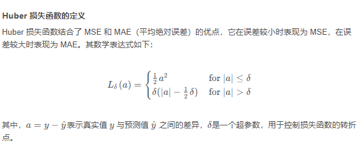

# 激活函数和损失函数

> 关联笔记：SiLU/SwiGLU 在真实模型 FFN 中的应用，以及预训练/SFT 交叉熵损失的完整代码见 [MiniMind从0到1构建大模型](../神经网络代码/MiniMind从0到1构建大模型.md)（3.4 FFN、4.1 预训练）。

## 激活函数

激活函数是神经网络中非常重要的组成部分之一，其作用是将神经元的输入信号转换为输出信号，常见的激活函数包括：

1. Sigmoid函数：Sigmoid函数是一个常用的激活函数，其将输入信号映射到0到1的范围内，常用于二分类问题中。
2. ReLU函数：ReLU函数是一个非常简单且常用的激活函数，其将所有小于0的输入信号设为0，大于等于0的信号不变，可以加速神经网络的训练速度。
3. Tanh函数：Tanh函数与Sigmoid函数类似，其将输入信号映射到-1到1的范围内，常用于分类和回归问题中。
4. Softmax函数：Softmax函数是一种特殊的激活函数，常用于多分类问题中，将多个输出信号映射到0到1的范围内，并满足输出信号之和为1。

选择激活函数的主要目的是**引入非线性特性**，使得神经网络可以学习更加复杂的模式和关系。不同的激活函数在不同的场景中表现不同，需要根据具体的任务和数据集来选择合适的激活函数。

**如何选择激活函数？**

**隐藏层**

- 优先选择RELU激活函数
- 如果ReLu效果不好，那么尝试其他激活，如Leaky ReLu等。
- 如果你使用了Relu， 需要注意一下Dead Relu问题， 避免出现大的梯度从而导致过多的神经元死亡。
- 不要使用sigmoid激活函数，可以尝试使用tanh激活函数

**输出层**

- 二分类问题选择sigmoid激活函数
- 多分类问题选择softmax激活函数
- 回归问题选择identity激活函数

**选择激活函数时，依据问题类型和模型特性来进行选择。以下是对上述选择激活函数的建议的依据与解释**

>### 隐藏层
>
>1. **ReLU (Rectified Linear Unit)**:
>   - **优先选择ReLU**：ReLU 是目前最常用的激活函数，因为它能够有效地解决梯度消失问题，并且计算简单。ReLU 在大多数情况下表现出色，因此是默认选择。
>   - **避免Dead ReLU问题**：ReLU 的缺点是可能导致“Dead ReLU”问题，即在训练过程中某些神经元可能永远不会被激活（输出恒为零），特别是在权重初始化不当或学习率较大时。为了避免这种情况，可以尝试使用改进版的ReLU，比如 Leaky ReLU 或 Parametric ReLU。
>
>2. **Leaky ReLU**:
>   - 如果 ReLU 导致了过多的“Dead ReLU”，可以尝试 Leaky ReLU 或 Parametric ReLU，这些变体允许负输入有一个小的负斜率，从而减少“神经元死亡”的可能性。
>
>3. **Sigmoid**:
>   - **不推荐在隐藏层使用**：Sigmoid 激活函数在处理深度网络时容易导致梯度消失问题，因为它的导数在输入值非常大或非常小时趋近于零，导致梯度更新非常慢。因此，通常不建议在隐藏层使用。
>
>4. **Tanh**:
>   - **可尝试使用 Tanh**：Tanh 激活函数在 Sigmoid 的基础上进行了改进，其输出范围在 [-1, 1] 之间，这种特性使得 Tanh 在有些情况下优于 Sigmoid，特别是在深度网络中，它能够缓解一定程度的梯度消失问题。
>
>### 输出层
>
>1. **Sigmoid (二分类问题)**:
>   - **适用于二分类问题**：Sigmoid 激活函数将输出映射到 [0, 1] 范围内，可以解释为概率，因此在二分类问题中是常用的输出激活函数。
>
>2. **Softmax (多分类问题)**:
>   - **适用于多分类问题**：Softmax 激活函数将多个输出节点的值转换为概率分布（所有输出的概率之和为 1）。因此，在多分类问题中，Softmax 是最常用的输出激活函数。
>
>3. **Identity (回归问题)**:
>   - **适用于回归问题**：在回归问题中，输出层的任务是预测一个连续的数值。因此，不需要将输出值映射到某个范围内，通常使用线性激活（即 identity 函数），这意味着输出值直接等于输入值。
>
>### 总结
>
>- **隐藏层**：ReLU 是默认的激活函数，如果效果不佳或遇到“Dead ReLU”问题，可以尝试 Leaky ReLU 或其他变体。避免使用 Sigmoid，Tanh 作为备选方案。
>- **输出层**：根据问题类型选择激活函数，二分类问题使用 Sigmoid，多分类问题使用 Softmax，回归问题使用线性激活。

---

## 为什么隐藏层不用 Sigmoid 和 Tanh 了（改用 ReLU 系）

### 先搭一个具体的四层链式网络，看清楚 $w_1,w_2,w_3,w_4$ 各自的梯度长什么样

假设网络每层只有 1 个神经元，串行执行，激活函数统一用 $\sigma$（可以代入 Sigmoid，也可以代入 ReLU）：

```
输入 x
  ↓ ×w1, +b1
z1 = w1·x + b1   →  a1 = σ(z1)        第1层
  ↓ ×w2, +b2
z2 = w2·a1 + b2  →  a2 = σ(z2)        第2层
  ↓ ×w3, +b3
z3 = w3·a2 + b3  →  a3 = σ(z3)        第3层
  ↓ ×w4, +b4
z4 = w4·a3 + b4  →  a4 = σ(z4) = ŷ    第4层（输出）
  ↓
Loss = L(ŷ, y)
```

**前向传播：**

$$z_1 = w_1 x + b_1,\ a_1=\sigma(z_1) \quad\to\quad z_2 = w_2 a_1 + b_2,\ a_2=\sigma(z_2) \quad\to\quad z_3 = w_3 a_2 + b_3,\ a_3=\sigma(z_3) \quad\to\quad z_4 = w_4 a_3 + b_4,\ \hat y=\sigma(z_4)$$

**反向传播，四个权重各自的梯度表达式：**

第4层（最靠近输出）$w_4$，只经过 1 个激活函数导数：

$$\frac{\partial \text{Loss}}{\partial w_4} = \frac{\partial \text{Loss}}{\partial \hat{y}} \times \sigma'(z_4) \times a_3$$

第3层 $w_3$，多绕一层，经过 2 个激活函数导数：

$$\frac{\partial \text{Loss}}{\partial w_3} = \frac{\partial \text{Loss}}{\partial \hat{y}} \times \sigma'(z_4) \times w_4 \times \sigma'(z_3) \times a_2$$

第2层 $w_2$，经过 3 个激活函数导数：

$$\frac{\partial \text{Loss}}{\partial w_2} = \frac{\partial \text{Loss}}{\partial \hat{y}} \times \sigma'(z_4) \times w_4 \times \sigma'(z_3) \times w_3 \times \sigma'(z_2) \times a_1$$

第1层（最靠近输入）$w_1$，经过 4 个激活函数导数的连乘：

$$\frac{\partial \text{Loss}}{\partial w_1} = \frac{\partial \text{Loss}}{\partial \hat{y}} \times \sigma'(z_4) \times w_4 \times \sigma'(z_3) \times w_3 \times \sigma'(z_2) \times w_2 \times \sigma'(z_1) \times x$$

**规律一览（对齐着看，越往下 $\sigma'$ 连乘项越多）：**

```
w4 的梯度：Loss' × σ'(z4)                                              × a3    ← 1个σ'
w3 的梯度：Loss' × σ'(z4) × w4                          × σ'(z3)        × a2    ← 2个σ'
w2 的梯度：Loss' × σ'(z4) × w4 × σ'(z3) × w3            × σ'(z2)        × a1    ← 3个σ'
w1 的梯度：Loss' × σ'(z4) × w4 × σ'(z3) × w3 × σ'(z2) × w2 × σ'(z1)     × x     ← 4个σ'
```

四个权重的梯度本质上是**同一条反向传播链**，从 $w_4$ 到 $w_1$ 依次多绕过一层，每多绕一层就多乘一个 $w_i$（权重）和一个 $\sigma'(z_i)$（该层激活函数的导数）。链条越长（层数越深），$\sigma'$ 连乘的项就越多——这就是为什么激活函数导数的大小，会直接决定深层网络"前面的层"能不能学到东西。

#### 代入 Sigmoid：直观看到梯度消失

Sigmoid 导数最大值只有 $\sigma'(0)=0.25$，假设每层都恰好取到这个最大值（实际中往往更小），并简化 $w_2=w_3=w_4=1$：

```
w4 的梯度 ∝ 0.25                            = 0.25
w3 的梯度 ∝ 0.25 × 0.25                     = 0.0625
w2 的梯度 ∝ 0.25 × 0.25 × 0.25              = 0.015625
w1 的梯度 ∝ 0.25 × 0.25 × 0.25 × 0.25       = 0.00390625

每多一层，梯度至少再打个 0.25 的折扣（这还是"最好情况"，实际更小）
层数越深，w1 的梯度衰减得越厉害 → 这就是梯度消失
```

#### 代入 ReLU：看到梯度不衰减

ReLU 在正数区间的导数恒为 1：

```
如果 z1, z2, z3, z4 都 > 0（正常激活）：

w4 的梯度 ∝ 1                        = 1
w3 的梯度 ∝ 1 × 1                    = 1
w2 的梯度 ∝ 1 × 1 × 1                = 1
w1 的梯度 ∝ 1 × 1 × 1 × 1            = 1

不管多少层，只要都在正数区间，梯度连乘不会衰减
这就是 ReLU 能训练很深网络的原因
```

**一句话总结：** 离输出越远（越靠近输入）的权重，梯度表达式里 $\sigma'$ 连乘的项越多；用 Sigmoid（$\sigma' \le 0.25$）连乘会指数级衰减导致梯度消失，用 ReLU（正数区间 $\sigma'=1$）连乘不会衰减，这就是下面要讲的核心原因的具体数学来源。

### 核心原因：梯度消失（Vanishing Gradient）

**Sigmoid 的梯度：**

$$\text{sigmoid}(x) = \frac{1}{1+e^{-x}}, \qquad \text{sigmoid}'(x) = \text{sigmoid}(x)\cdot(1-\text{sigmoid}(x))$$

代入几个值感受一下梯度有多小：

```
x = 0   →  sigmoid=0.5   →  梯度 = 0.5×0.5 = 0.25   ← 梯度最大值也才0.25
x = 2   →  sigmoid=0.88  →  梯度 = 0.88×0.12 ≈ 0.105
x = 5   →  sigmoid=0.99  →  梯度 = 0.99×0.01 ≈ 0.0099
x = 10  →  sigmoid≈1.0   →  梯度 ≈ 0.0000454   ← 几乎为0
```

**Tanh 的梯度：**

$$\tanh(x), \qquad \tanh'(x) = 1-\tanh^2(x)$$

```
x = 0   →  tanh=0      →  梯度 = 1 - 0 = 1        ← 比sigmoid好一点
x = 2   →  tanh=0.96   →  梯度 = 1 - 0.93 ≈ 0.07
x = 5   →  tanh≈1.0    →  梯度 ≈ 0.0002            ← 也几乎为0
```

**问题出在哪：深层网络的链式法则是连乘**

$$\frac{\partial \text{Loss}}{\partial \theta_1} = \frac{\partial \text{Loss}}{\partial a_n} \times \frac{\partial a_n}{\partial a_{n-1}} \times \cdots \times \frac{\partial a_1}{\partial \theta_1}$$

```
假设网络有 20 层，每层都用 sigmoid，每层梯度大约是 0.2：

传到第1层的梯度 ≈ 0.2^20 ≈ 0.0000000001048576

这个数字小到几乎等于 0
前面的层根本学不到东西，这就是"梯度消失"
```

对比 ReLU：正数区域梯度恒为 1，连乘 20 次还是 1，**梯度不会因为网络深就衰减**。这是 ReLU 能训练很深网络的关键原因，也是它取代 Sigmoid/Tanh 成为隐藏层默认选择的最核心原因。

### 次要原因一：计算量

```
sigmoid(x) = 1/(1+e^(-x))   需要算指数 e^(-x)，比较慢
tanh(x)                      同样需要算指数，比较慢
ReLU(x) = max(0, x)         只需要一次比较，非常快
```

网络越深、参数越多，这个速度差异累积起来影响很大。

### 次要原因二：输出不是"以0为中心"（仅 Sigmoid）

```
Sigmoid 输出范围 (0, 1)，恒为正数
  → 反向传播时，某一层所有参数的梯度符号会趋于一致（要么都正要么都负）
  → 导致参数更新时"之字形"震荡，收敛变慢

Tanh 输出范围 (-1, 1)，以0为中心，没有这个问题
  → 这也是 Tanh 比 Sigmoid 稍好一点的原因
  → 但 Tanh 依然有梯度消失问题，所以隐藏层也很少用了
```

#### 为什么不以 0 为中心会导致"之字形"震荡（详细推导）

设某一层的输入 $x$ 来自上一层 Sigmoid 的输出（恒为正数），权重是 $w$，中间量 $z = wx+b$。由链式法则：

$$\frac{\partial \text{Loss}}{\partial w} = \frac{\partial \text{Loss}}{\partial z} \times \frac{\partial z}{\partial w} = \frac{\partial \text{Loss}}{\partial z} \times x$$

关键点：因为 $x$ 恒为正数（上一层 Sigmoid 输出的性质），所以：

$$\frac{\partial \text{Loss}}{\partial w} \text{ 的符号} = \frac{\partial \text{Loss}}{\partial z} \text{ 的符号}$$

也就是说，**同一层里所有权重 $w_1, w_2, w_3, \dots$ 的梯度符号，全部由同一个 $\frac{\partial \text{Loss}}{\partial z}$ 决定**——要么全正要么全负，不可能有的正有的负、各走各的方向。

```
假设最优解需要：w1 增大，w2 减小（两个方向相反）

但因为梯度符号被绑死在一起：
  这一轮：只能"w1和w2都增大" 或者 "w1和w2都减小"
  不可能一个增大一个减小

结果：
  这一轮：w1 +0.1, w2 +0.1  （w2 本不该增大，但被迫跟着走）
  下一轮：发现 w2 错了，纠正 → w1 -0.05, w2 -0.05（这次 w1 又被迫跟着走）
  再下一轮：又要纠正回来...

参数在最优路径上不是走直线，而是像"之字形（zigzag）"一样来回摆动
收敛速度变慢，需要更多轮训练才能到达最优点
```

Tanh 输出范围 (-1,1)，可正可负，上一层输出 $x$ 有正有负，$\frac{\partial \text{Loss}}{\partial w}$ 的符号就不会被绑死在一起，不同权重可以独立地朝各自需要的方向更新，不会出现集体被迫同向移动的问题。

**一句话：** 以 0 为中心的输出，能让同一层里不同权重的梯度方向互相独立，避免"之字形"震荡，收敛更快更稳。这也是 Tanh 通常被认为比 Sigmoid 更适合做隐藏层激活（如果非要在两者之间选）的原因。

### Sigmoid 和 Tanh 现在用在哪

它们并没有消失，只是**从"隐藏层的默认激活函数"退到了"有特定数学含义需求"的位置**：

| 场景 | 用的函数 | 为什么 |
|------|---------|--------|
| 二分类输出层 | Sigmoid | 需要把值压缩到 (0,1) 表示概率 |
| LSTM/GRU 的门控 | Sigmoid | 需要 0~1 之间真正的"开关"值来控制信息流 |
| RNN 隐状态（早期） | Tanh | 需要 -1~1 的对称输出 |
| SwiGLU 的门控里 | 隐含用到 Sigmoid | SiLU = x·sigmoid(x)，本质是用 sigmoid 做非线性软缩放 |

这里有个容易混淆的点：Sigmoid **真正意义上的 0~1 开关性质**，用在了 LSTM 的门控里，这才是"0~1开关"的正确使用场景。这跟前面讲的 SwiGLU 门控不是一回事——SwiGLU 的 gate 是完整的 SiLU（`x·sigmoid(x)`）而不是纯 sigmoid，输出范围并不限于 0~1。

#### LSTM 门控 vs SwiGLU 门控：到底哪个才是真正的"0~1 开关"（详细对比）

**LSTM 的门控（真正的 0~1 开关）**

LSTM 里的"遗忘门"公式：

$$f_t = \text{sigmoid}(W_f \cdot [h_{t-1}, x_t] + b_f), \qquad C_t = f_t \odot C_{t-1} + \cdots$$

```
f_t = sigmoid(...)     ← 纯 sigmoid，输出严格落在 (0, 1) 之间

举例：
  f_t = 0.9  →  C_t = 0.9 × C_{t-1}  → 保留90%的记忆
  f_t = 0.1  →  C_t = 0.1 × C_{t-1}  → 只保留10%的记忆
  f_t = 0.0  →  C_t = 0 × C_{t-1}    → 完全遗忘（彻底关闭开关）
  f_t = 1.0  →  C_t = 1 × C_{t-1}    → 完全保留（彻底打开开关）
```

这才是真正的"开关"语义：**输出严格在 0~1 之间，0 表示完全关闭，1 表示完全打开，中间值表示部分打开**，和物理开关、水龙头的比喻完全成立。

**SwiGLU 的门控（不是 0~1 开关，是"软性强度调节"）**

SwiGLU 的公式：

$$\text{gate} = \text{SiLU}(xW_{\text{gate}}) = (xW_{\text{gate}}) \cdot \text{sigmoid}(xW_{\text{gate}}), \qquad h = \text{gate} \odot (xW_1)$$

```
gate = SiLU(z) = z · sigmoid(z)     ← 注意！多乘了一个 z 本身，不是纯 sigmoid

代入几个值：
  z = -2  →  gate = -2 × 0.12 = -0.24   ← 负数！不在0~1之间
  z =  0  →  gate =  0 × 0.5  =  0
  z =  1  →  gate =  1 × 0.73 =  0.73   ← 这个恰好在0~1之间
  z =  3  →  gate =  3 × 0.95 =  2.85   ← 大于1！不在0~1之间
```

SiLU 的输出可以是**负数**，也可以**远大于 1**，完全不符合"0~1 开关"的定义。

**为什么 SwiGLU 不用纯 sigmoid 做门控，反而用 SiLU：**

```
如果 SwiGLU 用纯 sigmoid 做 gate：
  gate = sigmoid(x @ W_gate)     严格 0~1，像 LSTM 一样的"强度调节"

如果用 SiLU 做 gate（LLaMA 实际采用的方式）：
  gate = SiLU(x @ W_gate)        可正可负，可以超过1

区别在于：
  纯 sigmoid 门控：只能"衰减"信息（乘以0~1的数，最多让信息不变，不能放大或反转）
  SiLU 门控：既能衰减、也能放大（乘以>1的数）、甚至能反转符号（乘以负数）
            表达能力比纯 sigmoid 门控更强
```

虽然 SiLU 内部用到了 sigmoid，但整体行为已经不是"0~1开关"了，而是一个更灵活的、可正可负可放大的"软性调节器"，这就是为什么它叫"SiLU 门控"而不是"Sigmoid 门控"。

**两者区别一览：**

| | LSTM 遗忘门 | SwiGLU 的 gate |
|--|------------|----------------|
| 用的函数 | 纯 `sigmoid(z)` | `SiLU(z) = z·sigmoid(z)` |
| 输出范围 | 严格 (0, 1) | 可以是任意实数（含负数、>1） |
| 语义 | 真正的"开关"：0=关，1=开 | "软性调节强度"：可放大、可缩小、可反转符号 |
| 能否放大信号 | ❌ 不能，最多保持原值(×1) | ✅ 能，比如 ×2.85 |
| 能否反转符号 | ❌ 不能，恒为正 | ✅ 能，比如 ×(-0.24) |

### 激活函数对比总表

| | Sigmoid | Tanh | ReLU | GELU/SiLU |
|--|---------|------|------|-----------|
| 输出范围 | (0,1) | (-1,1) | [0,+∞) | 约(-0.3,+∞) |
| 梯度消失 | ❌ 严重 | ❌ 有（比sigmoid轻） | ✅ 正数区无衰减 | ✅ 正数区无衰减 |
| 计算速度 | 慢（指数） | 慢（指数） | 最快 | 较快 |
| 现在用在哪 | 输出层/门控 | 少数RNN | 传统CNN/早期模型 | 现代Transformer隐藏层 |

**一句话总结：** Sigmoid/Tanh 在深层网络的隐藏层会导致梯度连乘后趋近于 0（梯度消失），网络学不动；ReLU 及其变体在正数区间梯度恒定不衰减，所以能训练很深的网络，这才是它们取代 Sigmoid/Tanh 成为隐藏层主流的根本原因。Sigmoid/Tanh 并没有被淘汰，只是换到了输出层、门控这些真正需要"概率"或"对称区间"含义的地方。

---

## 现代大模型为什么不用 ReLU 了（ReLU → GELU → SiLU → SwiGLU）

激活函数和损失函数是两个不同的东西，容易搞混：

| | 激活函数 | 损失函数 |
|--|---------|---------|
| 位置 | 每一层神经元的输出处 | 网络最末尾，计算预测值与真实值的差距 |
| 作用 | 引入非线性，让网络能学复杂特征 | 衡量模型预测有多"错"，指导参数更新 |
| 例子 | ReLU、GELU、SiLU | 交叉熵、MSE |

### 演进历史

```
ReLU（原始 Transformer，2017）
  ↓
GELU（BERT / GPT-2）
  ↓
SiLU + SwiGLU（LLaMA / Qwen 等现代 LLM）
```

### 1. ReLU

$$\text{ReLU}(x) = \max(0, x)$$

代入几个值感受一下：

```
x = -2  →  0
x = -1  →  0
x =  0  →  0
x =  1  →  1
x =  3  →  3
```

直觉：**负数全部砍掉，正数原样通过**。

问题：
1. 在 `x=0` 处有尖角，不是处处平滑可导
2. **Dead ReLU**：负数区域输出恒为 0，梯度也恒为 0，神经元可能永久"死掉"（下面单独详细讲）
3. 负数直接截断为 0，属于比较粗暴的硬截断，会丢失信息

### 2. GELU

$$\text{GELU}(x) = x \cdot \Phi(x)$$

其中 $\Phi(x)$ 是标准正态分布的累积分布函数（表示"随机变量小于等于 x 的概率"）。

代入几个值：

```
x = -2  →  -0.045   ← 不是硬截断为 0，而是一个很小的负值
x = -1  →  -0.159
x =  0  →   0
x =  1  →   0.841
x =  3  →   2.996
```

直觉：**x 乘以"它自己是正数的概率"**。x 越大越正，$\Phi(x)$ 越接近 1，输出接近 x 本身；x 越负，$\Phi(x)$ 越接近 0，输出被压得越小但不会硬变成 0。

改进：处处平滑可导，没有 Dead ReLU 问题。BERT、GPT-2、GPT-3 都用它。

代价：$\Phi(x)$ 需要用误差函数或近似公式计算，比 ReLU 计算量大一些。

### 3. SiLU（也叫 Swish）

$$\text{SiLU}(x) = x \cdot \text{sigmoid}(x) = \frac{x}{1 + e^{-x}}$$

代入几个值：

```
x = -2  →  -0.238
x = -1  →  -0.269
x =  0  →   0
x =  1  →   0.731
x =  3  →   2.858
```

直觉：和 GELU 几乎一样的形状，同样是"软性压小"负数区域，只是用 sigmoid 代替了正态分布累积函数。

相比 GELU 的优势：
- 只需要算 sigmoid，不需要算正态分布累积函数，**计算更快**
- 效果和 GELU 基本持平
- **天然适合和门控结构结合** → 这才是它被 LLaMA/Qwen 选中的真正原因

⚠️ **一个容易搞错的点**：SiLU 本身的输出范围**不是** 0~1。`sigmoid(x)` 才是严格落在 (0,1) 之间，而 `SiLU(x) = x · sigmoid(x)` 可以是负数（比如 x=-2 时输出 -0.238），也可以远大于 1（比如 x=3 时输出 2.858）。不要把 SiLU 直接当成一个"0~1 的开关"。

### 三者对比

| | ReLU | GELU | SiLU |
|--|------|------|------|
| 负数处理 | 硬截断为 0 | 软性压小 | 软性压小 |
| 0点平滑 | ❌ 有尖角 | ✅ 平滑 | ✅ 平滑 |
| Dead 问题 | ⚠️ 有 | ✅ 没有 | ✅ 没有 |
| 计算速度 | ✅ 最快 | ⚠️ 较慢 | ✅ 较快 |
| 代表模型 | 原始 Transformer | BERT / GPT-2 | LLaMA / Qwen |

一句话：ReLU 最简单但有 Dead ReLU 缺陷 → GELU 用平滑曲线修复了缺陷但计算稍慢 → SiLU 效果和 GELU 相当但计算更快，所以现代大模型选了 SiLU（并进一步用它搭出 SwiGLU）。

---

### Dead ReLU：为什么神经元会"死"，死了还能活过来吗

#### ReLU 的梯度

$$\text{ReLU}(x) = \max(0, x), \qquad \text{ReLU}'(x) = \begin{cases} 1, & x > 0 \\ 0, & x < 0 \end{cases}$$

```
x > 0  →  输出 x，  梯度 = 1   ✅ 正常传播
x < 0  →  输出 0，  梯度 = 0   ❌ 梯度断了
```

#### 神经元的输入从哪来（先分清"神经元"和"参数 θ"）

一个神经元不是一个数字，而是一个计算过程：

$$z = x_1 w_1 + x_2 w_2 + x_3 w_3 + b, \qquad \text{output} = \text{ReLU}(z)$$

- **神经元**：这整个"加权求和 + 激活"的计算单元
- **参数 θ**：神经元里的 $w_1, w_2, w_3, b$ 这些具体数字，是训练要更新的对象

关系：神经元"拥有"参数 θ，θ"属于"某个神经元；训练更新 θ，但"死"的是神经元这个计算单元的行为（恒定输出 0）。

#### 死循环是怎么发生的

举一个具体例子：输入 $x_1=1, x_2=1$，权重 $w_1=-3, w_2=-3$，偏置 $b=0$：

$$z = 1 \times (-3) + 1 \times (-3) + 0 = -6, \qquad \text{ReLU}(-6) = 0$$

反向传播算 $w_1$ 的梯度，链式法则里有一项是 $\text{ReLU}'(z)$：

$$\frac{\partial \text{Loss}}{\partial w_1} = \frac{\partial \text{Loss}}{\partial \text{output}} \times \underbrace{\text{ReLU}'(z)}_{=0} \times \frac{\partial z}{\partial w_1} = 0$$

不管 Loss 多大，梯度都是 0，于是：

$$w_1^{\text{new}} = w_1 - \eta \times 0 = w_1 \quad \text{（完全不变）}$$

$w_1, w_2$ 不变 → 下一轮 $z$ 的计算方式不变 → 只要上一层传来的值没变，$z$ 还是 -6 → 梯度还是 0 → ……

```
x < 0 → 梯度=0 → w不更新 → x还是<0 → 梯度还是0 → 无限循环
```

#### 死了还能活过来吗

理论上能，实际上概率很低。因为神经元的输入 $z$ 不仅取决于自己的权重，还取决于**上一层传来的值**，而上一层的权重也在更新——但上一层更新的方向，是为了让它连接的**其他活着的神经元**表现更好，跟这个死掉的神经元没有关系。训练越往后，上一层的输出越会朝着"服务活着的神经元"的方向固定下来，碰巧让死神经元的输入变正的概率也就越来越低。

#### 大面积死亡会不会连累前面的层

会。反向传播是链式法则，如果中间某一层的神经元大批死亡（梯度=0），那么这一项乘积就会是 0，梯度信号传不到更前面的层：

```
前层 θ → 中间层神经元（死了，梯度=0）→ 后层 → Loss
                ↑
        反向传播在这里断掉，前层 θ 收不到梯度
```

死的神经元越多，前面层能收到的有效梯度信号就越稀疏，整个网络都会学得很慢，甚至学不动。

#### 但同一个 θ 通常被很多神经元共享，不会一下全死

一个 θ（比如某一层的一个权重）往往会同时影响下一层的**多个**神经元，反向传播时它收到的梯度是所有连接到的神经元梯度之**和**：

$$\frac{\partial \text{Loss}}{\partial \theta} = \frac{\partial \text{Loss}}{\partial \theta}\bigg|_{\text{经过神经元A}} + \frac{\partial \text{Loss}}{\partial \theta}\bigg|_{\text{经过神经元B}} + \cdots$$

```
θ → 神经元A（死了，贡献梯度=0）
θ → 神经元B（活着，贡献正常梯度）  ┐
θ → 神经元C（活着，贡献正常梯度）  ┴→ 求和 → θ 仍能更新
```

所以只要还有一部分神经元活着，θ 依然能收到梯度、继续更新；只有当**大面积**神经元都死掉、活着的路径太少时，θ 收到的梯度信号才会变得极度微弱，前面的层才会学不动。这就是 Dead ReLU 在深层网络里真正危险的地方。

#### GELU / SiLU 怎么解决这个问题

```
ReLU：x < 0  →  输出强制 = 0，   梯度 = 0    ← 硬截断，死循环
GELU：x < 0  →  输出是个小负值， 梯度 ≠ 0    ← 软压小，能继续更新
SiLU：x < 0  →  输出是个小负值， 梯度 ≠ 0    ← 软压小，能继续更新
```

因为负数区域的输出不是硬性截断为 0，而是一个很小但非零的负值，所以对应的梯度也不为 0——即使某一轮输入是负的，这个神经元的权重依然能收到（很小的）梯度并继续更新，不会陷入"输出恒为0 → 梯度恒为0 → 权重永远不变"的死循环。

---

### 四个数学形式放在一起对比

```
名字      公式                            本质
ReLU      max(0, x)                       硬截断，负数直接变 0
GELU      x · Φ(x)                        x 乘以"自己是正数的概率"（Φ 是正态分布累积函数）
SiLU      x · sigmoid(x)                  x 乘以 sigmoid，效果类似 GELU 但计算更简单
SwiGLU    SiLU(x@W_gate) × (x@W1)         不是单纯的激活函数，是一个双路门控的 FFN 结构
```

GELU 和 SiLU 关系很近：两者都是"x 乘以一个 S 型曲线"，$\Phi(x)$（正态分布累积函数）和 `sigmoid(x)` 的图像几乎一样，只是数学来源不同（前者来自概率统计计算复杂，后者是 logistic 函数计算简单），效果相近所以现代模型选了更简单的 SiLU。

### SwiGLU：不是激活函数，是双路门控的 FFN 结构

真正让 LLaMA/Qwen 等模型 FFN 效果变好的关键，**不只是把激活函数从 ReLU 换成了 SiLU，而是把单路结构换成了双路门控结构**：

**标准 FFN（原始 Transformer / BERT / GPT-2）：单路**

$$h = \text{Activation}(x W_1), \qquad \text{output} = h W_2$$

```
x → 升维(W1) → 激活函数(ReLU/GELU) → 降维(W2) → output
```

**SwiGLU（LLaMA / Qwen 等现代 LLM）：双路，一路门控 + 一路内容**

$$\text{SwiGLU}(x) = \big(\text{SiLU}(x W_{\text{gate}}) \odot (x W_1)\big) W_2$$

```
gate    = SiLU(x @ W_gate)     # 这条路学"哪些维度重要"，用 SiLU 做软性筛选
content = x @ W1               # 这条路学"内容是什么"
h       = gate * content       # 逐元素相乘：重要的内容才通过，不重要的被压制
output  = h @ W2
```

理解门控的核心直觉时，不要说"gate 的值在 0~1 之间像开关"（这个说法不准确，SiLU 输出可正可负、也可能大于1），更准确的说法是：**W_gate 这条路学习"每个维度该保留多少"，用 SiLU 做非线性的软性缩放；W1 这条路负责生成实际内容；两者逐元素相乘，相当于用前者去调节后者的强弱**。

**为什么 SwiGLU 效果更好：**

```
1. 多了一条可学习的门控路径，比单路多了一次乘法交互，表达能力更强
2. 有实验依据：Google 论文《GLU Variants Improve Transformer》(2020)
   证明 SwiGLU 在几乎所有任务上优于 ReLU/GELU 版本 FFN
   于是被 LLaMA、PaLM、Qwen 等现代大模型采用为标准配置
```

**代价：多了一个权重矩阵，用缩小 d_ffn 来平衡参数量**

```
标准 FFN 需要：W1 [d_model, d_ffn] + W2 [d_ffn, d_model]
SwiGLU 需要：   W_gate + W1 + W2   （多了一个矩阵）

为了保持总参数量大致不变，SwiGLU 会把 d_ffn 调小：
  标准 FFN：d_ffn ≈ 4 × d_model
  SwiGLU：  d_ffn ≈ 8/3 × d_model   （LLaMA 用的比例）

这样即使多了一个矩阵，总参数量和标准 FFN 基本持平
```

## 损失函数

损失函数是神经网络中非常重要的组成部分之一，其作用是衡量模型预测结果与真实结果之间的差异，常见的损失函数包括：

1. 均方误差（Mean Squared Error，MSE）：均方误差是回归任务中最常用的损失函数，其计算方法是预测结果与真实结果之间差值的平方和的平均值。

2. 交叉熵（Cross Entropy）：交叉熵是分类任务中最常用的损失函数，其计算方法是真实标签和预测标签之间的交叉熵。

3. 对数损失（Log Loss）：也称为二元交叉熵损失（Binary Cross-Entropy Loss）。对数损失是二分类任务中常用的损失函数，其计算方法是真实标签和预测标签之间的对数差。Loss(y, y_pred) = -y * log(y_pred) - (1 - y) * log(1 - y_pred)

4. KL散度（Kullback-Leibler Divergence）：KL散度是衡量两个概率分布之间的差异的一种指标，常用于对比两个分布之间的相似度。

5. Huber Loss：Huber Loss是一种平滑的损失函数，可以在回归任务中比均方误差更加鲁棒。

   

7. Hinge Loss 铰链损失函数是机器学习中的一种损失函数，通常用于最大间隔分类算法，特别是在支持向量机$（SVM）$中作为目标函数使用。它旨在创建一个最大间隔，以便在分类决策中尽可能地将数据点分开。

   铰链损失函数的定义 在二分类问题中，铰链损失函数的定义如下：

   ```python
   def hinge_loss(y_true, y_pred):
   
   	return max(0, 1 - y_true * y_pred)
   ```

   其中，`y_pred` 是模型的预测值，其范围在 -1 到 1 之间，而 `y_true` 是目标值，取值为 1 或 -1。当预测值 *y_pred* 与目标值 *y_true* 的乘积大于等于 1 时，损失为 0，这意味着预测是正确的，并且预测结果与决策边界的距离超过了安全边界。当乘积小于 1 时，损失随着预测值与目标值之间差距的增大而增大。

选择损失函数的主要目的是**最小化预测结果与真实结果之间的差异**，使得模型能够更加准确地预测目标值。不同的损失函数在不同的场景中表现不同，需要根据具体的任务和数据集来选择合适的损失函数。

### MSE损失函数

MSE（Mean Squared Error，均方误差）损失函数是回归问题中最常用的一种损失函数，衡量预测值与真实值之间的差异。其基本原理是计算预测值与真实值之差的平方，再取平均。

MSE 损失函数的公式为：

$
L(y, \hat{y}) = \frac{1}{n} \sum_{i=1}^{n} (y_i - \hat{y}_i)^2
$

其中：
- $ y_i $ 是第 $i$ 个样本的真实值，
- $ \hat{y}_i $ 是第 $i$ 个样本的预测值，
- $ n $ 是样本的总数。

这个公式表示所有样本的预测值与真实值的差的平方和的平均值。差的平方会放大误差，使得模型对大误差更加敏感。MSE 越小，表示预测越接近真实值。

#### MSE

MSE（Mean Squared Error），即均方误差，除了作为损失函数之外，它还可以用作评估模型性能的一个指标，特别是在回归任务中。它用于衡量模型预测的准确性，反映了预测值和真实值之间的平均平方误差。

MSE 的值总是非负的，接近 0 的 MSE 值表示模型的预测与真实值非常接近； 

#### MSE的特点：
- **敏感度**：对大误差敏感。因为误差被平方后，较大的误差将比较小的误差对结果产生更大的影响。
- **可微性**：MSE 是可微的，这使得它适合用于梯度下降优化方法。
  

**总结**

- **MSE损失函数**：用于神经网络或其他回归模型的优化目标，通过最小化 MSE，模型可以获得更精确的预测。
- **MSE评估指标**：用于衡量模型在测试集上的表现，以便判断模型是否适合实际问题。

---

### NLL Loss（负对数似然损失）详解

#### 1. 基本概念与核心公式

负对数似然损失（Negative Log-Likelihood Loss, NLL Loss）是分类任务中最基础的损失函数之一，衡量模型对**正确类别**预测概率的自信程度：

$$\text{NLL Loss} = -\frac{1}{N}\sum_{i=1}^{N} \log p(y_i \mid x_i)$$

其中：
- $N$ 为样本数量
- $p(y_i \mid x_i)$ 为模型对第 $i$ 个样本**正确类别**的预测概率
- 前面的负号保证损失值为正，便于最小化优化

#### 2. 与最大似然估计（MLE）的关系

| 步骤 | 表达式 | 说明 |
|--|--|--|
| 似然函数 | $L(\theta) = \prod_{i=1}^{N} p(x_i;\theta)$ | 联合概率，希望最大化 |
| 对数似然 | $\ell(\theta) = \sum_{i=1}^{N} \log p(x_i;\theta)$ | 取对数，乘积变求和（数值更稳定） |
| 负对数似然 | $-\ell(\theta) = -\sum_{i=1}^{N} \log p(x_i;\theta)$ | 加负号，把"最大化"问题转成"最小化"问题 |

**一句话总结：最大化似然函数 ≡ 最小化负对数似然损失，二者数学上完全等价。**

##### 辨析："对偶形式"这个说法准不准确

网上很多资料（包括常见的转述）会把这个关系描述成"NLL Loss 是 MLE 的**对偶形式**"，这个说法**不够严谨**，容易和优化理论里的"对偶问题（Duality）"混淆，最好不要这样表述：

```
优化理论里真正的"对偶"（比如拉格朗日对偶）：
  原问题：min f(x)  s.t.  g(x) ≤ 0
  对偶问题：max_λ  inf_x [f(x) + λg(x)]
  ↑ 对偶问题和原问题是两个不同的优化变量（x vs λ），通过拉格朗日函数构造出来，
    对偶问题的最优值只是原问题最优值的一个"下界"（弱对偶），不一定完全相等

NLL Loss 和似然函数的关系：
  L(θ) = ∏ p(xᵢ;θ)          ← 目标函数A，同一个 θ，要"最大化"
  -log L(θ) = -∑ log p(xᵢ;θ) ← 目标函数B，同一个 θ，要"最小化"
  ↑ 只是给同一个目标函数取了负号（外加取了 log 这个单调变换），
    优化变量还是同一个 θ，最优解 θ* 完全相同，不存在"原问题/对偶问题"两个不同变量的关系
```

更准确的说法应该是：**取负对数（$-\log$）是一个单调递减变换**。因为 $\log$ 是单调递增函数，两边加负号后变成单调递减，所以"让 $L(\theta)$ 最大"和"让 $-\log L(\theta)$ 最小"，得到的是**完全相同的最优解 $\theta^*$**——这叫"等价的优化问题"或者"单调变换下的等价"，而不是数学意义上的"对偶"。

```
单调递增变换 log(·)：
  L(θ) 越大  →  log L(θ) 也越大   （大小关系不变）

再取负号（单调递减）：
  log L(θ) 越大  →  -log L(θ) 越小

串起来：
  L(θ) 最大的地方  ==  log L(θ) 最大的地方  ==  -log L(θ) 最小的地方
  三者的 argmax/argmin 是同一个 θ*，只是数值大小不同
```

**一句话总结：** 严谨表述应该是"最小化 NLL Loss 与最大化似然函数是等价的优化问题（因为 $-\log$ 是单调变换，不改变最优解位置）"，而不是"对偶形式"——"对偶"在数学/优化领域另有专指含义（拉格朗日对偶、凸对偶等），和这里"取负对数"的关系不是一回事，属于科普材料里常见的用词不严谨，需要留意辨析。

#### 3. 与 LogSoftmax 的配合使用

神经网络输出的是未归一化的 logits，需要先转成概率分布才能算 NLL：

$$\text{LogSoftmax}(x_i) = \log\left(\frac{e^{x_i}}{\sum_j e^{x_j}}\right) = x_i - \log\sum_j e^{x_j}$$

配合使用的原因：

1. **概率转换**：Softmax 把 logits 归一化成概率分布
2. **数值稳定**：直接算 `log(softmax(x))` 容易下溢，`LogSoftmax` 用 `x - logsumexp(x)` 的方式一步到位，避免概率值过小导致的精度问题
3. **计算高效**：NLL Loss 只需要索引出正确类别对应的那个对数概率，不需要遍历整个概率分布

##### 展开讲："`x - logsumexp(x)` 为什么能避免数值下溢"

**先看直接按定义计算会出什么问题**

如果分两步算：先 `softmax` 再 `log`，问题出在第一步：

```python
p = torch.softmax(x, dim=-1)   # 第一步：算出概率
log_p = torch.log(p)            # 第二步：再取 log
```

Softmax 的分子分母都要算 $e^{x_i}$。语言模型词表动辄几万 token，某些 logits 会是比较大的负数（比如 -30、-50），代入指数：

```
x_i = -30   →  e^(-30)  ≈ 9.36 × 10⁻¹⁴
x_i = -50   →  e^(-50)  ≈ 1.93 × 10⁻²²
x_i = -100  →  e^(-100) ≈ 3.72 × 10⁻⁴⁴   ← float32 最小正规数约 1.18×10⁻³⁸，已经小于它了！
```

一旦 $e^{x_i}$ 小于 float32 能表示的最小正数，就会**直接被截断成 0.0**（这就是"下溢 underflow"）。后果是：

```
softmax 算出的概率 p_i = 0.0
log(0.0) = -inf
反向传播时 -inf 参与计算 → 出现 NaN，训练直接崩掉
```

即使没有严重到下溢为 0，极小的概率做除法、再取 log，也会在数值上损失大量精度。

**`logsumexp` 怎么绕开这个问题：减去最大值的技巧（log-sum-exp trick）**

先把 `log(softmax(x))` 用对数运算法则展开（这一步是精确的数学恒等变形，没有近似）：

$$\log(\text{softmax}(x_i)) = \log\frac{e^{x_i}}{\sum_j e^{x_j}} = x_i - \underbrace{\log\sum_j e^{x_j}}_{\text{logsumexp}(x)}$$

真正的技巧在 `logsumexp` 内部：先减去整个向量的最大值 $m=\max_j x_j$，算完再加回来：

$$\log\sum_j e^{x_j} = \log\sum_j e^{m}\cdot e^{x_j-m} = \log\left(e^{m}\sum_j e^{x_j-m}\right) = m + \log\sum_j e^{x_j-m}$$

这一步同样是精确的数学恒等式（提取公因子 $e^m$ 再用 $\log(ab)=\log a+\log b$），不是近似。但计算层面效果完全不同：

```
减去最大值之后，指数项 x_j - m 满足：
  - 最大的那一项：x_j - m = 0        →  e^0 = 1        （不会下溢，也不会上溢）
  - 其余项：      x_j - m ≤ 0        →  e^(负数) ∈ (0,1]（数值范围安全，最多下溢成0，不影响总和的量级）

对比直接算 e^x_j：
  - 如果 x_j 本身很大（比如 100），e^100 直接上溢成 inf
  - 如果 x_j 本身很小（比如 -100），e^-100 直接下溢成 0
```

具体代入一个例子直观感受：

```python
x = torch.tensor([-100.0, -101.0, -102.0])

# 直接算：exp(-100) ≈ 3.7e-44，已经在 float32 精度边缘，继续和更小的数相加/取log极易出问题
naive = torch.log(torch.exp(x).sum())          # 数值上非常危险，容易得到 -inf

# log-sum-exp trick：先减最大值 m=-100
m = x.max()                                     # m = -100
safe = m + torch.log(torch.exp(x - m).sum())    # x-m = [0, -1, -2]，exp后是[1, 0.37, 0.14]，全是正常数值
# safe 和 naive 数学上应该相等，但 safe 是数值稳定的，naive 可能已经出问题
```

**一句话总结：** `x - logsumexp(x)` 这个恒等变形本身不改变数学结果，真正解决问题的是 `logsumexp` 内部"减去最大值再算指数、最后加回来"的技巧——它把所有指数项的自变量都平移到 $(-\infty, 0]$ 区间，保证 $e^{x_j-m}\in(0,1]$ 永远不会上溢，且最大项恰好是 $e^0=1$ 锚定了数值范围，从根本上避免了极端 logits 直接导致的上溢/下溢问题。PyTorch 的 `F.log_softmax`、`F.cross_entropy`、`torch.logsumexp` 底层都实现了这个技巧，这也是为什么官方文档一直建议**不要自己写 `log(softmax(x))`，而要用 `log_softmax`**。

**这就是"Safe Softmax"：** "减去最大值再算指数"这个技巧有个专门的名字——**Safe Softmax**（也叫 Numerically Stable Softmax），不仅 `LogSoftmax` 用它，**普通的 `softmax` 本身**（不只是取 log 的场景）内部也是这样实现的：

$$\text{softmax}(x_i) = \frac{e^{x_i}}{\sum_j e^{x_j}} = \frac{e^{x_i-m}}{\sum_j e^{x_j-m}}, \qquad m=\max_j x_j$$

分子分母同时乘以 $e^{-m}$，数学上结果完全不变（这是恒等变形），但计算时因为减去了最大值，指数项被限制在 $(-\infty,0]$，不会再出现 $e^{100}$ 这种直接上溢成 `inf` 的情况。`torch.softmax`、`F.softmax`、几乎所有深度学习框架的 softmax 底层实现都是这个"safe softmax"版本，而不是按最原始公式直接算的"naive softmax"。

```
naive softmax：直接算 e^x_i / Σe^x_j                     ← x 稍微大一点就上溢成 inf
safe  softmax：先减最大值 m，算 e^(x_i-m) / Σe^(x_j-m)     ← 任何输入都安全

两者数学上结果完全相同，只是数值计算的稳定性不同
LogSoftmax 用的 logsumexp trick，本质上就是 safe softmax 思路在"取对数"场景下的版本
```

再补一提：Transformer 里 Attention 计算 Softmax（$\text{softmax}(QK^T/\sqrt{d})$）用的也是这个 safe softmax；像 FlashAttention 这类需要分块（tiling）计算 Attention 的算法，还会用到一种更进阶的 **"online softmax"**（在线/增量 safe softmax）：因为分块算的时候还没看到全部数据、不知道全局最大值，所以要在每处理完一块后动态更新当前已知的最大值 $m$ 并对之前累积的和做修正，本质上仍然是同一个"减最大值保证数值稳定"的思路，只是变成了增量式的算法。

在 PyTorch 中：

```python
import torch.nn as nn

# 方式一：LogSoftmax + NLLLoss（拆开写）
log_softmax = nn.LogSoftmax(dim=1)
nll_loss = nn.NLLLoss()
loss = nll_loss(log_softmax(logits), target)

# 方式二：CrossEntropyLoss（推荐，等价于上面两步的封装）
criterion = nn.CrossEntropyLoss()
loss = criterion(logits, target)
```

**`nn.CrossEntropyLoss` = `LogSoftmax` + `NLLLoss`，两者完全等价。**

#### 4. NLLLoss 到底做了什么（不只是"取反"）

`LogSoftmax` 和 `NLLLoss` 的分工很容易被误解成"log 和取反各干一半"，更准确的拆解是：

| | LogSoftmax | NLLLoss |
|--|--|--|
| 做了什么 | Softmax 归一化 + 取 log | **索引**出正确类别的值 + **取反** + **求均值** |
| 输入 | logits（任意实数） | log 概率矩阵（全是负数） |
| 输出 | log 概率矩阵 | 标量损失值 |

也就是说 `NLLLoss` 做了三件事：① 根据 `target` 标签索引出每个样本对应正确类别的那个 log 概率；② 加负号；③ 对所有样本求平均。**log 的计算已经在 `LogSoftmax` 那一步完成了，`NLLLoss` 本身不算 log。**

手动复现 `NLLLoss` 的内部逻辑验证一下：

```python
import torch
import torch.nn as nn
import torch.nn.functional as F

logits = torch.tensor([
    [2.0, 0.5, 0.2],
    [0.3, 1.8, 0.9],
    [0.1, 0.1, 3.0],
])
target = torch.tensor([0, 1, 2])

log_probs = F.log_softmax(logits, dim=1)

# ① NLLLoss 官方计算
loss = nn.NLLLoss()(log_probs, target)

# ② 手动复现：按标签索引 + 取反 + 求均值
manual_loss = -(
    log_probs[0, 0] +   # 样本1，标签=0，取第0列
    log_probs[1, 1] +   # 样本2，标签=1，取第1列
    log_probs[2, 2]     # 样本3，标签=2，取第2列
) / 3

print(loss.item(), manual_loss.item())  # 完全一致
```

#### 5. 二分类场景下的特殊形式

当 $y \in \{0, 1\}$ 时，NLL Loss 退化为二元交叉熵损失：

$$L = -y\log p(x;\theta) - (1-y)\log(1-p(x;\theta))$$

这也是逻辑回归中最常用的损失函数形式，本质上和多分类 NLL 是同一套逻辑（正确类别的概率越高，损失越小）。

#### 6. 完整例子：三分类动物识别

假设识别 🐱猫 / 🐶狗 / 🐦鸟 三个类别，3 个样本经过 Softmax 后的预测概率：

| 样本 | 真实标签 | P(猫) | P(狗) | P(鸟) |
|--|--|--|--|--|
| 样本1 | 猫（0） | 0.70 | 0.20 | 0.10 |
| 样本2 | 狗（1） | 0.10 | 0.60 | 0.30 |
| 样本3 | 鸟（2） | 0.05 | 0.05 | 0.90 |

**第一步：取正确类别的预测概率**

$$p(y_1|x_1)=0.70,\quad p(y_2|x_2)=0.60,\quad p(y_3|x_3)=0.90$$

**第二步：取对数**（概率在 (0,1) 之间，log 后必为负数）

$$\log(0.70)=-0.357,\quad \log(0.60)=-0.511,\quad \log(0.90)=-0.105$$

**第三步：加负号求平均**

$$\text{NLL Loss} = -\frac{1}{3}\big[(-0.357)+(-0.511)+(-0.105)\big] = -\frac{1}{3}\times(-0.973) = 0.324$$

**直觉理解：预测越自信（且正确），损失越小**

| 正确类别预测概率 | $-\log(p)$ | 含义 |
|--|--|--|
| 0.99 | 0.010 | 非常自信且正确 ✅ 损失极小 |
| 0.70 | 0.357 | 比较自信且正确 ✅ 损失较小 |
| 0.50 | 0.693 | 不确定 ⚠️ 损失中等 |
| 0.10 | 2.303 | 预测错误方向 ❌ 损失很大 |
| 0.01 | 4.605 | 严重预测错误 ❌ 损失极大 |

PyTorch 代码验证（`NLLLoss` 和 `CrossEntropyLoss` 结果完全一致）：

```python
import torch
import torch.nn as nn
import torch.nn.functional as F

logits = torch.tensor([
    [2.0, 0.5, 0.2],   # 样本1
    [0.3, 1.8, 0.9],   # 样本2
    [0.1, 0.1, 3.0],   # 样本3
])
target = torch.tensor([0, 1, 2])  # 猫、狗、鸟

log_probs = F.log_softmax(logits, dim=1)
loss1 = nn.NLLLoss()(log_probs, target)
loss2 = nn.CrossEntropyLoss()(logits, target)

print(f"NLLLoss:          {loss1.item():.4f}")   # 0.3228
print(f"CrossEntropyLoss: {loss2.item():.4f}")   # 0.3228 ← 两者相同
```

**关键结论：** 训练过程本质上就是不断调整模型参数，让正确类别的预测概率越来越高，从而使 NLL Loss（也就是交叉熵）持续下降。这个"负对数概率"的形式，和本文件"SFT 的 Loss：从 token 到 Batch"一节里 $\mathcal{L}_t = -\log P_\theta(y_t \mid x, y_{<t})$ 的写法完全是同一件事——语言模型的下一 token 预测，本质上就是一个超大词表的多分类 NLL Loss。

#### 7. 特性总结

| 特性 | 说明 |
|--|--|
| 概率解释清晰 | 损失值越小，模型对正确类别预测概率越高 |
| 数值稳定 | 结合 LogSoftmax（`x - logsumexp(x)`）可避免数值下溢 |
| 梯度友好 | 相比 MSE，交叉熵/NLL 在分类任务中收敛更快 |
| 适用广泛 | 多分类、二分类及语言模型困惑度（PPL = $e^{\text{NLL}}$）均可使用 |

---

## Loss 的本质、梯度下降与 Batch 训练原理

### Loss 是关于参数 θ 的多元函数

神经网络有几亿个参数，拼成一个向量：

$$\theta = [\theta_1, \theta_2, \dots, \theta_n] \quad (n \approx \text{几亿})$$

Loss 就是关于 $\theta$ 的 **n 元函数**：

$$\mathcal{L}(\theta_1, \theta_2, \dots, \theta_n)$$

**训练目标：找到让 $\mathcal{L}(\theta)$ 最小的 $\theta$。**

梯度 = 对每个参数求偏导，组成一个 n 维向量：

$$\nabla_\theta \mathcal{L} = \left[\frac{\partial \mathcal{L}}{\partial \theta_1},\ \frac{\partial \mathcal{L}}{\partial \theta_2},\ \dots,\ \frac{\partial \mathcal{L}}{\partial \theta_n}\right]$$

- 偏导 > 0：增大这个参数会让 Loss 变大 → 应该减小它
- 偏导 < 0：增大这个参数会让 Loss 变小 → 应该增大它

**参数更新公式（梯度下降）：**

$$\theta \leftarrow \theta - \eta \cdot \nabla_\theta \mathcal{L}$$

```
把 Loss 想象成山地地形，θ 是你的位置：

∇L = 当前位置最陡的上坡方向
-∇L = 最陡的下坡方向

每步往下坡方向走 η 距离 → 最终走到山谷（Loss 最小）
```

---

### SFT 的 Loss：从 token 到 Batch

#### 单个 token 的 Loss（交叉熵）

模型在位置 $t$ 预测下一个 token，真实答案是 $y_t$：

$$\mathcal{L}_t = -\log P_\theta(y_t \mid x, y_{<t})$$

```
模型说"有效图"概率是 90% → -log(0.9) ≈ 0.105  ← loss 小，预测准
模型说"有效图"概率是 10% → -log(0.1) ≈ 2.303  ← loss 大，预测错

负对数：概率越高 → loss 越小，完美对应"预测越准越好"
```

#### 一条样本（T 个 token）

$$\mathcal{L}_\text{seq} = -\frac{1}{T}\sum_{t=1}^{T} \log P_\theta(y_t \mid x, y_{<t})$$

先在序列内部对所有 token 取平均。

#### 一个 Batch（N 条样本，每条长度不同）

$$\mathcal{L}_\text{SFT} = -\frac{1}{N}\sum_{i=1}^{N} \frac{1}{T_i}\sum_{t=1}^{T_i} \log P_\theta(y_t^{(i)} \mid x^{(i)}, y_{<t}^{(i)})$$

```
层层展开：

Batch（N 条样本）
  └── 样本 i（T_i 个 token）
        └── 每个 token 算 -log P(y_t)

步骤：
  ① 每个 token 算 -log P
  ② 在序列内对 token 取平均 → 得到 L_i
  ③ 在 batch 内对样本取平均 → 得到 L_SFT

为什么要先除以 T_i？
  ❌ 不除的话：长句子（100token）贡献 loss 是短句子（10token）的10倍
              → 模型偏向优化长句子，短句子被忽视
  ✅ 除以 T_i：每条样本贡献相同权重，公平对待所有样本
```

---

### GRPO 的完整 Batch Loss

GRPO 多了一层：每个问题生成 G 个回答，共三层循环。

#### 定义每个 token 的 ratio 和 advantage

**ratio（新旧策略的概率比）：**

$$r_{g,t} = \frac{P_\theta(y_{g,t} \mid x, y_{g,<t})}{P_{\theta_\text{old}}(y_{g,t} \mid x, y_{g,<t})}$$

**advantage（第 g 个回答比平均好多少，归一化）：**

$$\hat{A}_g = \frac{R_g - \text{mean}(R_1, \dots, R_G)}{\text{std}(R_1, \dots, R_G)}$$

**KL 散度惩罚（防止跑太远）：**

$$\text{KL}_{g,t} = \frac{P_\theta}{P_\text{ref}} - \log\frac{P_\theta}{P_\text{ref}} - 1$$

#### 完整公式（一个问题，G 个回答）

$$\mathcal{L}_\text{GRPO} = -\frac{1}{G}\sum_{g=1}^{G} \frac{1}{T_g}\sum_{t=1}^{T_g} \left[\min\left(r_{g,t}\cdot\hat{A}_g,\ \text{clip}(r_{g,t}, 1{-}\varepsilon, 1{+}\varepsilon)\cdot\hat{A}_g\right) - \beta\cdot\text{KL}_{g,t}\right]$$

```
展开看结构（G=3 个回答）：

问题 x：
  回答1（5个token）: reward=0.9 → A1=+1.2（好于平均）
  回答2（3个token）: reward=0.3 → A2=-0.8（差于平均）
  回答3（4个token）: reward=0.6 → A3=-0.4

每个token算一项：min(r·A, clip(r)·A) - β·KL

回答1：5个token的值 / 5 → loss1
回答2：3个token的值 / 3 → loss2
回答3：4个token的值 / 4 → loss3

L_GRPO = (loss1 + loss2 + loss3) / 3
```

#### SFT vs GRPO 结构对比

```
SFT：
  Batch
  └── N 条样本
        └── 每条 T_i 个 token
              └── 每个 token：-log P(y_t)

GRPO：
  Batch
  └── N 个问题
        └── 每个问题 G 个回答
              └── 每个回答 T_g 个 token
                    └── 每个 token：min(r·A, clip·A) - β·KL

多了"G 个回答"这一层，其余平均逻辑完全一样。
```

| | SFT | GRPO |
|--|-----|------|
| **监督信号** | 正确答案的 token | 回答之间的相对 reward |
| **每个 token 的目标** | 预测正确 → loss 小 | 好回答概率↑，差回答概率↓ |
| **Loss 核心** | $-\log P(y_t)$ | $-\min(r\cdot A,\ \text{clip}(r)\cdot A)$ |
| **参数更新方式** | `loss.backward()` + 梯度下降 | **完全相同** |

---

### Batch 梯度的本质：B 个样本"投票"

每个样本定义一个关于 $\theta$ 的函数（$x_i, y_i$ 是常数，$\theta$ 是变量）：

$$\ell_i(\theta) = \ell(\theta;\, x_i, y_i)$$

Batch Loss 是这些函数的平均：

$$\mathcal{L}_\text{batch}(\theta) = \frac{1}{B}\sum_{i=1}^{B} \ell_i(\theta)$$

对 Batch Loss 求梯度，由求导的**线性性质**：

$$\nabla_\theta \mathcal{L}_\text{batch} = \frac{1}{B}\sum_{i=1}^{B} \nabla_\theta \ell_i(\theta)$$

**关键理解：不同样本都是在同一个参数点 $\theta_0$ 处求梯度，$x_i$ 不同但求导变量是 $\theta$，所以完全可以平均。这和多元函数求偏导完全一致。**

```
Batch 里 B 个样本，每个样本"建议"参数往某个方向走：

样本1（猫）：θ₁ 应该 +0.3，θ₂ 应该 -0.1
样本2（狗）：θ₁ 应该 +0.1，θ₂ 应该 +0.2
样本3（车）：θ₁ 应该 +0.2，θ₂ 应该 -0.1

平均：θ₁ 应该 +0.2，θ₂ 应该 ≈ 0（抵消）

θ₂ 方向各样本意见相反 → 平均后接近 0 → 说明 θ₂ 不需要动 ✅
θ₁ 方向大家都说增大 → 平均后还是正 → 说明 θ₁ 确实需要增大 ✅

不同样本在"有共识"的维度叠加，在"有争议"的维度互相抵消
→ 这就是我们想要的全局最优方向
```

**最简单的例子（只有两个参数）：**

```python
# 两个样本定义两个 loss 函数（x_i 是常数，θ 是变量）
ℓ₁(θ) = (θ₁ - 1)² + (θ₂ - 2)²   # 样本1
ℓ₂(θ) = (θ₁ - 3)² + (θ₂ - 0)²   # 样本2

# Batch loss = 取平均，就是一个普通的二元函数
L(θ) = ½ [ℓ₁(θ) + ℓ₂(θ)]
     = ½ [(θ₁-1)² + (θ₂-2)² + (θ₁-3)² + θ₂²]

# 在当前 θ=(0,0) 处对这个二元函数求梯度，就能算出该往哪走
```

**真正想优化的是期望损失（整个数据集）：**

$$\mathcal{L}(\theta) = \mathbb{E}_{(x,y)\sim\mathcal{D}}\left[\ell(\theta; x, y)\right]$$

数据集太大算不完，用 Batch 近似：

$$\nabla_\theta \mathcal{L} \approx \frac{1}{B}\sum_{i=1}^{B} \nabla_\theta \ell(\theta; x_i, y_i)$$

Batch 梯度是对"真实期望梯度"的**蒙特卡洛估计**，B 越大越准，但计算越慢。

---

### 反向传播与梯度累积

#### forward 建图，backward 反向传播

前向传播时，PyTorch 偷偷记录了所有计算过程（计算图）：

```
θ₁, θ₂, θ₃, ...（叶子节点，参数）
    ↓
  矩阵乘法
    ↓
  激活函数
    ↓
    ...
    ↓
  softmax → -log(P) → 取平均
    ↓
  L = 2.34（根节点，标量）
```

`loss.backward()` 从根节点出发，沿计算图反向，用链式法则算出每个参数的偏导数，存到 `θ.grad` 里：

$$\frac{\partial \mathcal{L}}{\partial \theta} = \frac{\partial \mathcal{L}}{\partial a_n} \cdot \frac{\partial a_n}{\partial a_{n-1}} \cdots \frac{\partial a_1}{\partial \theta}$$

#### PyTorch 训练完整流程

```python
for batch in dataloader:
    # Step 1: 前向传播，建计算图，算平均 loss（标量）
    loss = model(batch).mean()      # L = (L1+L2+...+LB)/B

    # Step 2: 反向传播，链式法则算所有参数的偏导数
    loss.backward()                 # ∂L/∂θ 存在 param.grad 里

    # Step 3: 更新参数  θ ← θ - η∇L
    optimizer.step()

    # Step 4: 清零梯度（否则下次 backward 会累加！）
    optimizer.zero_grad()
```

#### 梯度累积（Gradient Accumulation）

显存不够放大 batch 时，可以分多步累积梯度，等价于更大的 batch：

```python
accumulation_steps = 4  # 累积4步再更新，等价于 batch×4

for i, batch in enumerate(dataloader):
    loss = model(batch) / accumulation_steps  # ⚠️ 注意要缩放
    loss.backward()         # 梯度累加到 .grad（不清零！）

    if (i + 1) % accumulation_steps == 0:
        optimizer.step()       # 累积够了再更新
        optimizer.zero_grad()  # 更新完再清零
```

```
为什么能累积？
  .grad 是累加的，每次 backward 都往里加，不会覆盖：

  第1步 backward：θ₁.grad = 0.3
  第2步 backward：θ₁.grad = 0.3 + 0.2 = 0.5
  第3步 backward：θ₁.grad = 0.5 + 0.1 = 0.6
  第4步 backward：θ₁.grad = 0.6 + 0.3 = 0.9

  optimizer.step()：用累积的 0.9 更新参数
  optimizer.zero_grad()：清零，开始下一轮

数学上完全等价于一次处理 4×batch 条样本（梯度是线性的）
```

#### 记忆口诀

```
forward   → 建图（记录每一步计算）
backward  → 沿图反向，链式法则算梯度，存到 .grad
step      → 用 .grad 更新参数  θ ← θ - η·grad
zero_grad → 清零 .grad，否则下次累加
```

---

## PyTorch 使用细节：dim 参数怎么理解、F.xxx 和 nn.Module 怎么选

### 一、`dim` 参数怎么理解

`dim` 的本质：**指定在哪个维度上进行操作（沿着哪个轴"压缩/归一化"）**。

以最常见的分类场景为例，假设 `batch_size=3`，`num_classes=4`：

```python
import torch

logits = torch.tensor([
    [2.0, 0.5, 0.2, 1.0],   # 样本1（4个类别的分数）
    [0.3, 1.8, 0.9, 0.5],   # 样本2
    [0.1, 0.1, 3.0, 0.2],   # 样本3
])
print(logits.shape)  # torch.Size([3, 4])
#                                    ↑  ↑
#                                  dim=0 dim=1
```

```
        dim=1 方向 ──────────────▶
        ┌──────────────────────┐
dim=0   │ 2.0  0.5  0.2  1.0  │  ← 样本1（4个类别的分数）
  │     │ 0.3  1.8  0.9  0.5  │  ← 样本2
  ▼     │ 0.1  0.1  3.0  0.2  │  ← 样本3
        └──────────────────────┘
```

**`dim` 的含义：沿着哪个轴"压缩"**

```python
# dim=0：沿着行方向操作（跨样本），每一列的3个数做 softmax
result_dim0 = torch.softmax(logits, dim=0)
# 结果每列之和=1，含义是"比较3个样本在同一类别上的得分" ← 分类任务中通常没意义

# dim=1：沿着列方向操作（跨类别）✅ 分类任务常用
result_dim1 = torch.softmax(logits, dim=1)
# 结果每行之和=1，含义是"同一样本的4个类别概率归一化" ← 这才是我们想要的

print(result_dim1.sum(dim=1))  # tensor([1., 1., 1.]) ✅ 每行之和为1
print(result_dim0.sum(dim=0))  # tensor([1., 1., 1., 1.]) 每列之和为1
```

直观展示 `dim=1` 的 Softmax（对每一行做归一化）：

```
样本1: [2.0, 0.5, 0.2, 1.0] → [0.60, 0.13, 0.10, 0.17]  sum=1 ✅
样本2: [0.3, 1.8, 0.9, 0.5] → [0.12, 0.54, 0.22, 0.12]  sum=1 ✅
样本3: [0.1, 0.1, 3.0, 0.2] → [0.04, 0.04, 0.88, 0.04]  sum=1 ✅
```

**三维张量的情况（NLP 中常见）**

```python
# batch_size=2, seq_len=5, vocab_size=100
output = torch.randn(2, 5, 100)
#                    ↑  ↑   ↑
#                  dim=0 dim=1 dim=2

# 对词表维度做 softmax（每个时间步的词概率归一化）
probs = torch.softmax(output, dim=2)  # 或 dim=-1
# 每个时间步的100个词概率之和=1 ✅
```

💡 **记忆技巧**：`dim` 指定的那个维度会被"消费掉"用于计算；分类/语言模型任务中通常对**最后一个维度（类别/词表维度）**操作，所以常用 `dim=1` 或 `dim=-1`（`-1` 更通用，不受前面维度数量影响）。

### 二、`torch.nn.functional`（F）vs `torch.nn`（nn）怎么选

**本质区别一句话：**

| | `torch.nn.functional`（F） | `torch.nn`（nn） |
|--|--|--|
| 类型 | 纯函数 | 类（对象） |
| 状态 | 无参数，无状态 | 有参数，有状态 |
| 调用方式 | 直接调用 | 先实例化，再调用 |
| 典型场景 | 前向传播中临时使用的运算 | 定义模型结构（层）时使用 |

**判断标准：这个操作有没有"需要学习的参数"？**

```
有需要学习的参数？
        │
        ├── 是 ──▶ 用 nn.XXX（定义在 __init__ 中）
        │          例如：nn.Linear, nn.Conv2d
        │               nn.BatchNorm, nn.Embedding
        │
        └── 否 ──▶ 用 F.XXX（直接在 forward 中调用）
                   例如：F.relu, F.softmax
                        F.dropout（但注意训练/推理模式要手动传）
```

代码对比：

```python
import torch.nn as nn
import torch.nn.functional as F

class MyModel(nn.Module):
    def __init__(self):
        super().__init__()
        # 需要学习参数的层 → 必须用 nn.XXX 定义在 __init__ 里
        self.linear = nn.Linear(10, 4)   # 有权重W和偏置b
        self.dropout = nn.Dropout(0.5)   # 有训练/推理状态
        self.bn = nn.BatchNorm1d(4)      # 有均值/方差统计

    def forward(self, x):
        x = self.linear(x)
        x = self.bn(x)
        x = self.dropout(x)

        # 无参数的操作 → 直接用 F.XXX 在 forward 里调用
        x = F.relu(x)           # 无参数
        x = F.softmax(x, dim=1) # 无参数
        return x
```

**特殊情况：Dropout 两种写法有细微差别**

```python
# nn.Dropout 会自动感知 model.train() / model.eval()，无需手动管理
dropout_layer = nn.Dropout(0.5)

# F.dropout 需要手动传入 training 参数，否则推理时也会随机丢弃
x = F.dropout(x, p=0.5, training=self.training)
```

**损失函数：两种写法都可以**

```python
# 写法1：nn 方式（更常见，代码清晰，可以提前实例化配置好参数）
criterion = nn.CrossEntropyLoss()
loss = criterion(logits, target)

# 写法2：F 方式（更简洁，一行搞定，没有可复用的状态）
loss = F.cross_entropy(logits, target)
```

### 三、深入理解：为什么"能进计算图"不等于"参数能被持久保存"

这是个容易混淆但非常关键的点：**计算图记录的是"这次前向传播做了哪些运算"（每次 forward 后就释放），而参数存储记录的是"模型学到了什么"（需要持久存在于对象中）**，两者是完全不同的概念。

**反面例子：在 `forward` 里创建 `nn.Linear`**

```python
class BadModel(nn.Module):
    def __init__(self):
        super().__init__()

    def forward(self, x):
        linear = nn.Linear(10, 4)     # ❌ 每次 forward 都新建一个
        return linear(x)

bad = BadModel()
x = torch.randn(2, 10)

out1 = bad(x)
out2 = bad(x)
print(torch.allclose(out1, out2))  # False ← 同样的输入，两次结果不同！
# 因为每次 forward 都是随机初始化的全新 Linear，用完就销毁
```

这样写会导致三个问题：

1. **权重永远学不到东西**：`optimizer = torch.optim.Adam(bad.parameters())` 拿到的是空列表——`linear` 是 `forward` 里的局部变量，`forward` 结束就被销毁，`bad.parameters()` 根本不知道它存在过。即使 `loss.backward()` 能正常算出梯度（计算图没问题），`optimizer.step()` 也无法更新任何东西。
2. **BatchNorm 的统计量永远无法积累**：`running_mean`/`running_var` 需要跨多个 batch 持续更新，放在 `forward` 里每次都是全新对象，统计量全部丢失。
3. **`model.save()` / `model.load()` 失效**：`state_dict()` 是空的，保存和加载都没有意义。

**关键机制：`nn.Module` 的参数注册表**

```python
# nn.Linear 内部大概长这样：
class Linear(nn.Module):
    def __init__(self, in_features, out_features):
        super().__init__()
        # nn.Parameter 会把张量"注册"到模块的 _parameters 里，跟着模块对象一起持久存在
        self.weight = nn.Parameter(torch.randn(out_features, in_features))
        self.bias   = nn.Parameter(torch.randn(out_features))

    def forward(self, x):
        return F.linear(x, self.weight, self.bias)
        # ↑ F.linear 本身只是个运算函数，真正的参数 W, b 是从 self 里取的、持久存在的对象
```

**一句话总结区分标准：**

```
能进计算图  → 取决于张量是否 requires_grad=True         （临时的，随 forward 建立、backward 后可释放）
能被持久保存 → 取决于是否注册到 nn.Module._parameters    （持久的，随模块对象一直存在）

F.linear(x, self.W, self.b)  可以正常训练 → 因为 W, b 是 __init__ 里注册的 Parameter，持久存在
forward 里 new 的 nn.Linear  不能训练    → 因为 W, b 随局部变量在 forward 结束时被销毁

nn.Linear 的本质 = 持久存储的 W, b（__init__ 负责） + forward 里调用 F.linear（forward 负责）
```

### 四、可以完全脱离 `nn.Module`，直接用张量手写网络吗

**可以，只要不需要 `nn.Module` 提供的工程化能力（保存/加载/train-eval切换/自动收集参数等），完全可以直接用张量 + `F.xxx` 手写：**

```python
import torch
import torch.nn.functional as F

# 手动定义参数（持久存在，因为是脚本里的全局变量，不会随函数调用销毁）
W1 = torch.randn(4, 10, requires_grad=True)
b1 = torch.randn(4, requires_grad=True)
W2 = torch.randn(2, 4, requires_grad=True)
b2 = torch.randn(2, requires_grad=True)

x = torch.randn(3, 10)
y = torch.tensor([0, 1, 0])

# 前向传播
out = F.linear(x, W1, b1)
out = F.relu(out)
out = F.linear(out, W2, b2)
loss = F.cross_entropy(out, y)

# 反向传播
loss.backward()

# 手动更新参数（也可以直接用 optimizer 管理 [W1, b1, W2, b2] 这个列表）
lr = 0.01
with torch.no_grad():
    W1 -= lr * W1.grad
    b1 -= lr * b1.grad
    W2 -= lr * W2.grad
    b2 -= lr * b2.grad
```

**那为什么实际项目还是都用 `nn.Module`？** 因为网络变复杂后，手动管理几十上百个参数、手写保存/加载逻辑、手动维护训练/推理模式标志（每个 Dropout/BN 调用处都要传 `training=...`）、手动统计参数量等，工程成本会指数级增长。`nn.Module` 提供的 `state_dict()` 保存加载、`model.train()`/`model.eval()` 一键切换、`model.parameters()` 自动收集、`model.cuda()` 一键搬运等，本质上都是在帮你自动化这些手写逻辑，底层原理和上面手写的版本完全一样。

**结论：**

```
只跑一次 / 参数不多 / 验证想法？
→ 直接用张量 + F.xxx 完全没问题，这正是 PyTorch 底层的工作方式

正式训练 / 网络复杂 / 需要保存加载部署？
→ 用 nn.Module，它只是帮你管理参数的"容器"，本质上和手写版本做的事情完全一样
```
