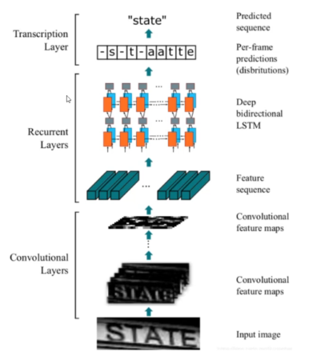

## CRNN

这个图展示了**CRNN**模型的结构，详细分为**卷积层（Convolutional Layers）**、**递归层（Recurrent Layers）**和**转录层（Transcription Layer）**。其中还包含了**CTC（连接时序分类）**模块，用于序列的最终识别。我们逐层解析这个模型：

### 1. **卷积层（Convolutional Layers）**
   - **输入图像**：这是模型处理的原始图像，例如一个带有文本的图像（如 "STATE"）。
   - **卷积特征图（Convolutional Feature Maps）**：卷积层的作用是从输入图像中提取空间特征。它通过一系列卷积操作来捕捉图像中的局部模式和纹理，并生成多层特征图。这些特征图的目的是提取输入数据的高维度特征，同时保留其空间关系（即字符的轮廓、笔画等）。

### 2. **递归层（Recurrent Layers）**
   - **特征序列（Feature Sequence）**：卷积特征图被展平成特征序列，并作为递归层的输入。
   - **双向LSTM（Bidirectional LSTM）**：这是递归层的核心部分。**LSTM（长短期记忆网络）**是一种特殊的RNN，可以捕捉数据中的时序依赖性，尤其适合处理序列数据。双向LSTM能同时从左到右和从右到左对特征序列进行建模，这让模型能够更好地理解前后文的关系。
   - 递归层的目的是将卷积层提取的空间特征转换为时间序列特征，以便后续的文本预测。

### 3. **转录层（Transcription Layer）**
   - **预测序列（Predicted Sequence）**：递归层的输出是特征序列，但它并不能直接表示最终的文本序列。这时候，模型使用转录层来将递归层的输出转换为具体的字符序列。
   - 在图中，我们看到最终的预测序列为 "s-t-a-a-tte"。这里的字符序列可能包含重复字符或空白字符，这就需要CTC模块进行处理。

### 4. **CTC模块（CTC Loss / CTC识别）**
   - **CTC（连接时序分类）**是一种常见的损失函数，专门用于序列预测问题，特别是当预测序列和目标序列长度不一致时。CTC允许模型进行不对齐的序列预测。
   - 在CRNN中，CTC用于解决字符的对齐问题。例如，在图中，模型输出了带有重复字符和空白符的序列，如 "s-t-a-a-tte"。CTC会处理这些重复的字符和空白符，最后得到正确的文本 "state"。
   - 这使得模型不需要精确地预测每个字符的位置，只要预测出字符的出现顺序即可，CTC会负责对齐和去重。

### 总结：
- **卷积层**负责从图像中提取空间特征。
- **递归层**（如双向LSTM）将空间特征转换为时间特征，并捕捉字符间的依赖关系。
- **转录层**生成初步的字符序列。
- **CTC模块**对输出的字符序列进行处理，得到最终的文本结果。

这个结构非常适合像OCR（光学字符识别）这样的任务，因为它能够从图片中识别出序列（文字），并处理字符预测中常见的对齐问题。
