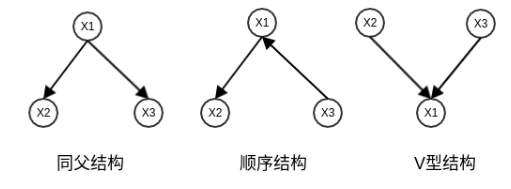
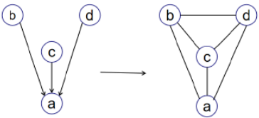

## 概率图模型

### 定义

概率图模型是一类将概率分布与图论结合的模型，通过图的结构表示随机变量之间的依赖关系。其目标是对联合分布$p(x)$ 或$p(x, z)$进行建模。

### 特点

- 图结构：图中的节点表示随机变量，边表示变量之间的条件依赖关系。

  - **有向图**：如贝叶斯网络。
  - **无向图**：如马尔可夫随机场。

- **明确的概率解释**：概率图模型具有严格的数学基础，提供了良好的解释性。

- **学习与推断**：通过学习图的参数和结构，能够高效进行推断（如边缘概率和条件概率计算）。

---

概率图模型（Probabilistic Graphical Model）就是一类用图来表达随机变量之间关系的概率模型：

- 用一个结点表示一个或**一组**随机变量
- 结点之间的边表示变量间的概率关系

根据边的性质不同，概率图模型大致可以分为两类：

1. 使用有向无环图表示随机变量间的依赖关系，称为**贝叶斯网络**，适用于随机变量间存在显示的因果关系
2. 使用无向图表示随机变量间的相关关系，称为**马尔可夫网络**，适用于随机变量间有关系，但是难以显示表达

>- **MRF 是理论上的概率模型**，描述满足特定性质的随机场及其概率分布。
>- **马尔可夫网络是 MRF 的图形化表达形式**，用来表示变量之间的条件独立性关系。
>
>换句话说，马尔可夫网络是马尔可夫随机场的一种表示方式。

例如，联合概率分布 $ P(X_1, X_2, \dots, X_n) $ 可以被分解为：
- 有向图模型：$ P(X_1, X_2, \dots, X_n) = \prod_i P(X_i | \text{Pa}(X_i)) $
- 无向图模型：$ P(X_1, X_2, \dots, X_n) \propto \prod_C \phi_C(X_C) $

### 条件独立

考虑三个随机变量 a,b,c，并且假设给定 b,c 的条件下 a 的条件概率分布不依赖于 b 的值，即

$P(a∣b,c)=P(a∣c)$

用记号

$a⊥b∣c$

表示给定 c 的条件下（或者说 c 被观测到的情况下）a,b 条件独立，实际上条件独立可以扩充到集合范围，即给定集合 X 的条件下，Y,Z 条件独立。在使用概率模型时，条件独立起着重要的作用，它简化了模型的结构，降低了模型训练和推断的计算量

### 贝叶斯网络

贝叶斯网络结构 G 是一个有向无环图，其中每个结点对应于一个随机变量。若两个随机变量之间有直接依赖关系，则将它们用一条带箭头的边相连。贝叶斯网络结构有效地表达了特征间的条件独立性，**它假设每个结点仅与它的直接父结点有关，而与其它结点独立**。但是通常情况下，每个结点的父结点不止一个，所以我们将结点 $X_i$ 的父结点集合记作 $Pa_{X_i}$

> 在概率图模型中，$ \text{Pa}(X_i) $ 表示 **节点 $ X_i $ 的父节点集合**（**Parents of $ X_i $**）。这通常用于描述 **有向图模型**（如贝叶斯网络）中变量之间的条件依赖关系。
>
> 实际上，上面加粗部分规范化的说法是：**贝叶斯网络假设每个特征与它的非后裔结点表达的特征是相互独立的**。但是由于这种说法实在不好理解，故我对其进行了一些修改

贝叶斯网络中三个结点之间的典型依赖关系如下图：

#### D - 划分

为了判断贝叶斯网络中任意两个结点是否独立，我们需要用到 D - 划分。D - 划分其实是贝叶斯网络三种基本拓扑结构的推广，将结点关系推广到集合关系

我们先总结简单的结点关系，之后再推广到集合

设有结点 a,b，若在 a 和 b 之间存在路径结点集合 $V=\{v_1,v_2,...,v_n\}$，若该结点集合中的所有结点 vi 满足：

1. $v_i$ 被观测，且 $v_i$ 拓扑结构为**同父结构**或**顺序结构**
2. $v_i$ 未被观测，且 $v_i$ 拓扑结构为 **V 型结构**

则称 $a,b$ 独立

> 注：a 到 b 某一条路径上的结点 vi 实际上不止一个，但只要有一个满足上面的任意一个条件，就认为该路径被阻断。并且 a 到 b 的路径也可能不止一条（忽略箭头方向），只有当所有的路径都被阻断，才认为 a 和 b 被阻断

推广到集合：若有结点集合 $A,B$，若在集合 $A$ 中的任意结点到 $B$ 中的任意结点，都满足上述条件，则称集合 $A,B$ 独立。

#### 道德图

阅读这一部分可以帮助你更好的理解 D - 划分。为了分析有向图中结点之间的条件独立性，我们会使用 D - 划分，这个技术本身没有什么问题，但实在是不太适合人力去做，因此我们考虑将一个有向图转为无向图，图中各边相连就代表了它们之间的关系，具体步骤如下：

1. 找出有向图中的所有 **V 型结构**，在其两个父结点之间加上一条无向边
2. 将所有的有向边改为无向边

这样产生的无向图称为**道德图（Moral Graph）**，父结点相连的过程称为道德化。基于道德图能直观，迅速的找到结点之间的条件独立性。如下图所示：

**道德图判断独立性的方法：**设道德图中有变量 $x,y$ 和被观测变量集合 $Z=\{z_i\}$，若变量 $x$ 和$ y$ 能在图上被 $Z$ 分开，即从道德图中将变量集合 $Z$ 去除后，$x$ 和$ y $属于两个连通分量，则 $x⊥y∣Z$成立

> 需要注意的是，用道德图判断出来的条件独立性在原有向图中一定是成立的，但反之则不然，有向图中的一些条件独立性不一定能从道德图中判断出来