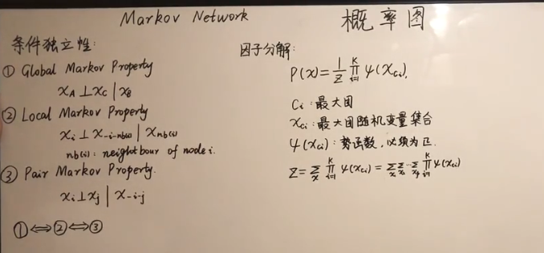
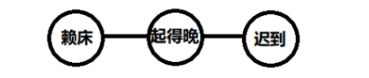
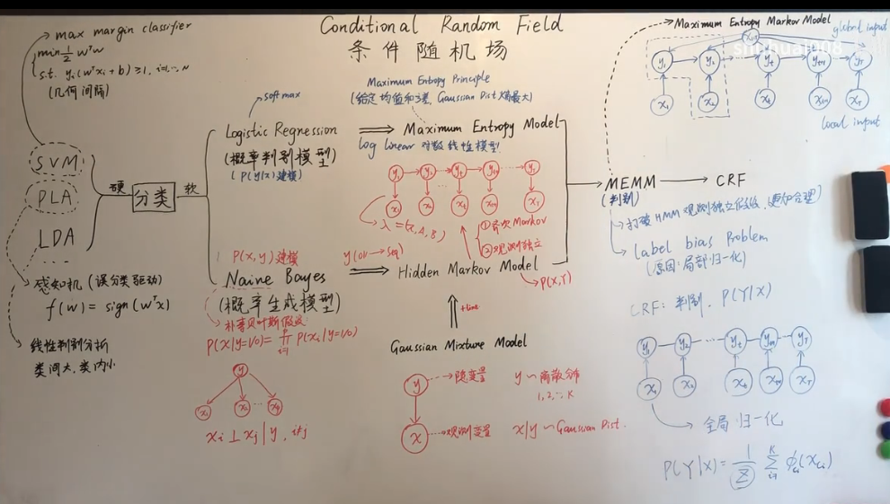
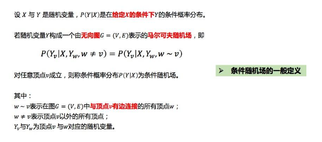
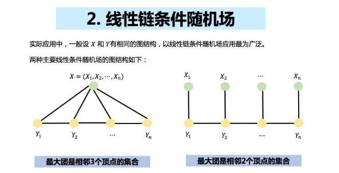
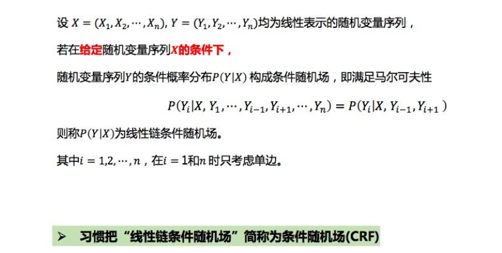
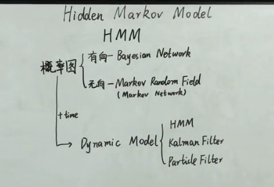

# 概率图模型

**定义**

概率图模型是一类将概率分布与图论结合的模型，通过图的结构表示随机变量之间的依赖关系。其目标是对联合分布$p(x)$ 或$p(x, z)$进行建模。

**特点**

- 图结构：图中的节点表示随机变量，边表示变量之间的条件依赖关系。

  - **有向图**：如贝叶斯网络。
  - **无向图**：如马尔可夫随机场。

- **明确的概率解释**：概率图模型具有严格的数学基础，提供了良好的解释性。

- **学习与推断**：通过学习图的参数和结构，能够高效进行推断（如边缘概率和条件概率计算）。

---

概率图模型（Probabilistic Graphical Model）就是一类用图来表达随机变量之间关系的概率模型：

- 用一个结点表示一个或**一组**随机变量
- 结点之间的边表示变量间的概率关系

根据边的性质不同，概率图模型大致可以分为两类：

1. 使用有向无环图表示随机变量间的依赖关系，称为**贝叶斯网络**，适用于随机变量间存在显示的因果关系
2. 使用无向图表示随机变量间的相关关系，称为**马尔可夫网络**，适用于随机变量间有关系，但是难以显示表达

>- **MRF 是理论上的概率模型**，描述满足特定性质的随机场及其概率分布。
>- **马尔可夫网络是 MRF 的图形化表达形式**，用来表示变量之间的条件独立性关系。
>
>换句话说，马尔可夫网络是马尔可夫随机场的一种表示方式。

---

例如，联合概率分布 $ P(X_1, X_2, \dots, X_n) $ 可以被分解为：

- 有向图模型：$ P(X_1, X_2, \dots, X_n) = \prod_i P(X_i | \text{Pa}(X_i)) $

**解释**：有向图模型中的每个节点表示一个随机变量，而边则表示变量之间的条件依赖关系。

$X_1, X_2, \dots, X_n$ 是一组随机变量。

**Pa$(X_i)$** 是 $X_i$ 的父节点集合（即条件依赖的变量）。

这个公式的含义是：图中的联合概率分布可以表示为所有节点条件概率的乘积。每个节点 $X_i$ 的概率 $P(X_i | \text{Pa}(X_i))$ 仅依赖于其父节点的值（即其条件概率）。因此，图结构通过定义每个变量与其父节点之间的依赖关系来简化联合分布的表示。

- 无向图模型：$ P(X_1, X_2, \dots, X_n) \propto \prod_C \phi_C(X_C) $

**解释**：无向图模型中的节点也表示随机变量，边表示变量之间的相互影响，但没有明确的方向。

$C$ 表示图中的一个**克里格团体**（clique），即一组互相连接的变量的集合。

$\phi_C(X_C)$ 是与克里格团体 $C$ 相关的潜在函数，描述了这些变量的联合分布。

这个公式的含义是：图中的联合概率分布是各个克里格团体潜在函数的乘积。这些潜在函数可以用来表示局部的依赖关系，并通过图结构的约束来定义全局的概率分布。

## 贝叶斯网络

### 条件独立

考虑三个随机变量 a,b,c，并且假设给定 b,c 的条件下 a 的条件概率分布不依赖于 b 的值，即

$P(a∣b,c)=P(a∣c)$

用记号

$a⊥b∣c$

表示给定 c 的条件下（或者说 c 被观测到的情况下）a,b 条件独立，实际上条件独立可以扩充到集合范围，即给定集合 X 的条件下，Y,Z 条件独立。在使用概率模型时，条件独立起着重要的作用，它简化了模型的结构，降低了模型训练和推断的计算量

### 贝叶斯网络

贝叶斯网络结构 G 是一个有向无环图，其中每个结点对应于一个随机变量。若两个随机变量之间有直接依赖关系，则将它们用一条带箭头的边相连。贝叶斯网络结构有效地表达了特征间的条件独立性，**它假设每个结点仅与它的直接父结点有关，而与其它结点独立**。但是通常情况下，每个结点的父结点不止一个，所以我们将结点 $X_i$ 的父结点集合记作 $Pa_{X_i}$

> 在概率图模型中，$ \text{Pa}(X_i) $ 表示 **节点 $ X_i $ 的父节点集合**（**Parents of $ X_i $**）。这通常用于描述 **有向图模型**（如贝叶斯网络）中变量之间的条件依赖关系。
>
> 实际上，上面加粗部分规范化的说法是：**贝叶斯网络假设每个特征与它的非后裔结点表达的特征是相互独立的**。但是由于这种说法实在不好理解，故我对其进行了一些修改

贝叶斯网络中三个结点之间的典型依赖关系如下图：

#### D - 划分

为了判断贝叶斯网络中任意两个结点是否独立，我们需要用到 D - 划分。D - 划分其实是贝叶斯网络三种基本拓扑结构的推广，将结点关系推广到集合关系

我们先总结简单的结点关系，之后再推广到集合

设有结点 a,b，若在 a 和 b 之间存在路径结点集合 $V=\{v_1,v_2,...,v_n\}$，若该结点集合中的所有结点 vi 满足：

1. $v_i$ 被观测，且 $v_i$ 拓扑结构为**同父结构**或**顺序结构**
2. $v_i$ 未被观测，且 $v_i$ 拓扑结构为 **V 型结构**

则称 $a,b$ 独立

> 注：a 到 b 某一条路径上的结点 vi 实际上不止一个，但只要有一个满足上面的任意一个条件，就认为该路径被阻断。并且 a 到 b 的路径也可能不止一条（忽略箭头方向），只有当所有的路径都被阻断，才认为 a 和 b 被阻断

推广到集合：若有结点集合 $A,B$，若在集合 $A$ 中的任意结点到 $B$ 中的任意结点，都满足上述条件，则称集合 $A,B$ 独立。

#### 道德图

阅读这一部分可以帮助你更好的理解 D - 划分。为了分析有向图中结点之间的条件独立性，我们会使用 D - 划分，这个技术本身没有什么问题，但实在是不太适合人力去做，因此我们考虑将一个有向图转为无向图，图中各边相连就代表了它们之间的关系，具体步骤如下：

1. 找出有向图中的所有 **V 型结构**，在其两个父结点之间加上一条无向边
2. 将所有的有向边改为无向边

这样产生的无向图称为**道德图（Moral Graph）**，父结点相连的过程称为道德化。基于道德图能直观，迅速的找到结点之间的条件独立性。如下图所示：

**道德图判断独立性的方法：**设道德图中有变量 $x,y$ 和被观测变量集合 $Z=\{z_i\}$，若变量 $x$ 和$ y$ 能在图上被 $Z$ 分开，即从道德图中将变量集合 $Z$ 去除后，$x$ 和$ y $属于两个连通分量，则 $x⊥y∣Z$成立

> 需要注意的是，用道德图判断出来的条件独立性在原有向图中一定是成立的，但反之则不然，有向图中的一些条件独立性不一定能从道德图中判断出来

## 马尔可夫随机场（MRF）

> 极大团：如果一个团不被其他任一团所包含，即它不是其他任一团的真子集，则称该团为图G的极大团（maximal clique）。
>
> 由于团{0,5}属于{0,4,5}，故{0,5}不是极大团：
>
> 最大团：就是在所有团中结点数最多的极大团。 

**马尔可夫随机场**又称马尔可夫网络（Markov random field (MRF)，Markov network or undirected graphical model）是具有**马尔可夫属性的随机变量的集合**，它由一个无向图来描述。

### 定义
对给定无向图 $G = (V, E)$ 和一个由 $V$ 索引的随机变量的集合 $\mathbf{X} = (X_v)_{v \in V}$，如果它们满足局部马尔可夫性质，就说这是关于 $G$ 的马尔可夫随机场。

---

### 前置知识：条件独立

上图的例子可以说明条件独立：**赖床** 和 **起得晚** 具有相关性，**起得晚** 和 **迟到** 具有依赖性，但是如果提前知道 **起得晚** 的概率，**赖床** 和 **迟到** 就是相互条件独立的。

---

### 马尔可夫的三个性质
#### 1. 成对马尔可夫性质 (Pairwise Markov Property)
给定所有其他变量，任何两个不相邻的变量是条件独立的：

$$
X_u \perp X_v \mid X_{V \setminus \{u,v\}}
$$

---

#### 2. 局部马尔可夫性质 (Local Markov Property)
给定一个变量的所有邻接变量，该变量是条件独立于所有其他变量：

$$
X_v \perp X_{V \setminus N[v]} \mid X_{N(v)}
$$

其中 $N(v)$ 表示变量 $X_v$ 的邻接集合。

---

#### 3. 全局马尔可夫性质 (Global Markov Property)
给定一个分离的子集，任何两个不相邻的变量的子集都是条件独立的：

$$
X_A \perp X_B \mid X_S
$$

其中 $S$ 为分离集合，即在图上阻断了 $A$ 到 $B$ 之间的路径。

---

#### 公式符号解释：
- $\perp$ 代表相互独立。
- $\mid$ 代表条件。
- $V$ 代表变量全集。
- \ 代表差集

>马尔可夫随机场（Markov Random Field，MRF）中的团（clique）确实有一定的要求。具体来说，马尔可夫随机场的团需要满足以下几个条件：
>
>1. **相邻性条件**：马尔可夫随机场中的每个节点（变量）与其相邻的节点（变量）在概率分布中有依赖关系，而不与其它非相邻节点直接相关。因此，MRF的联合分布是基于这些邻接关系来定义的。
>2. **最大团的要求**：在马尔可夫随机场中，最大团（最大完备子图）对应的节点集是指所有这些节点相互之间有边相连的子图。所有的概率分布依赖于这些最大团。马尔可夫随机场中的潜在函数通常与这些团的变量有关，因此，一个团的所有节点必须在相同的潜在能量函数中出现。
>3. **团定义**：在MRF中，一个团是指一个变量集，其满足所有变量之间都有直接连接，即它们在图中形成一个完全子图。这个团的所有变量是相互依赖的，不能通过外部变量来分离。
>
>总结来说，MRF中的团通常需要是**完全连接的子图**，并且这些团在联合概率模型中是通过势函数（potential function）来描述变量之间的依赖关系。
>
>在马尔可夫随机场（MRF）中，**团**并不一定是**极大团**

### 1.具体示例演示

假设我们有一个简单的图 $G$，包含 3 个节点 $x_1, x_2, x_3$，它们之间的边的连接关系如下：

- $x_1$ 和 $x_2$ 之间有边。
- $x_2$ 和 $x_3$ 之间有边。

图 $G$ 对应的团是：

- $\{x_1, x_2\}$ （表示这两个变量互相依赖）
- $\{x_2, x_3\}$ （表示这两个变量互相依赖）

因此，势函数 $\phi_C(x_C)$ 对应于图中每个团的联合概率。

假设我们定义了势函数如下：

$$
\phi_{\{x_1, x_2\}}(x_1, x_2) = \exp(-x_1^2 - x_2^2)
$$

$$
\phi_{\{x_2, x_3\}}(x_2, x_3) = \exp(-x_2^2 - x_3^2)
$$

那么联合概率 $P(x_1, x_2, x_3)$ 为：

$$
P(x_1, x_2, x_3) = \frac{1}{Z_{\Phi}} \phi_{\{x_1, x_2\}}(x_1, x_2) \cdot \phi_{\{x_2, x_3\}}(x_2, x_3)
$$

### 2.计算配分函数 $Z_{\Phi}$

为了归一化概率，我们需要计算配分函数 $Z_{\Phi}$，它是所有可能状态下的概率和。由于我们假设 $x_1, x_2, x_3$ 是离散的，并且每个变量的取值范围是有限的（例如 $\{-1, 0, 1\}$），我们可以通过遍历所有可能的取值来计算配分函数。

$$
Z_{\Phi} = \sum_{x_1, x_2, x_3} \phi_{\{x_1, x_2\}}(x_1, x_2) \cdot \phi_{\{x_2, x_3\}}(x_2, x_3)
$$

例如，如果每个变量 $x_1, x_2, x_3$ 都有三个可能的取值：$-1, 0, 1$，我们可以枚举这些值，计算所有可能的组合。

## 条件随机场（CRF）

条件随机场（Conditional Random Field，CRF）是自然语言处理的基础模型，广泛应用于中文分词、命名实体识别、词性标注等标注场景。

条件随机场CRF与深度学习结合，产生了BiLSTM-CRF、BiLSTM-CNN-CRF等模型，在中文分词、命名实体识别、词性标注也取得不错的效果。

条件随机场CRF与Attention机制结合，又发展成了Transformer-CRF、BERT-BiLSTM-CRF等模型，使中文分词、命名实体识别、词性标注效果又有显著提高。

### 模型总结

**条件随机场定义**

**线性链条件随机场**

**线性链条件随机场的定义如下：**

### CRF

条件随机场（CRF）是一种用于序列标注的模型，特别适合处理那些输入序列与输出标签序列之间存在复杂依赖关系的任务。它是一个 **判别式模型**，与生成式模型不同，生成式模型会尝试建模整个数据的联合概率（输入和输出的联合分布），而CRF直接建模给定输入序列时输出序列的条件概率。

#### 与其他序列标注模型的比较：

- **隐马尔可夫模型（HMM）**：HMM是一个生成模型，模型在生成数据时假设观测序列和隐藏状态（标签）是独立的。在HMM中，标签的依赖关系通常局限于相邻标签的关系（即马尔可夫性）。
- **最大熵马尔可夫模型（MEMM）**：MEMM也是一个判别式模型，但它存在标签偏差问题，因为它基于单一的当前标签来进行预测，可能导致不一致的条件概率。

而 **CRF** 通过建模整个标签序列的条件概率，避免了这些问题，并且能够考虑更复杂的标签依赖关系。

#### CRF的核心概念

CRF 主要有以下几个关键要素：

##### 特征函数和参数

CRF通过定义特征函数来捕捉输入序列与标签序列之间的依赖关系。这些特征函数是针对输入输出对的特征描述，可以是任何与标签和输入相关的特征。

一个特征函数可以是：

- **局部特征**：仅依赖于当前位置的输入和标签（例如，当前词的特征和当前标签的关系）；
- **转移特征**：依赖于标签之间的转移关系（例如，前一个词的标签与当前词标签之间的依赖）。

CRF模型通过权重（λ）来调整每个特征函数的影响力。

##### 条件概率模型

CRF建模的是给定输入序列 $x$ 时标签序列 $y$ 的条件概率。

CRF 的核心思想是：给定输入序列 $x = (x_1, x_2, \dots, x_n)$，预测标签序列 $y = (y_1, y_2, \dots, y_n)$ 的条件概率：

$$
P(y | x) = \frac{1}{Z(x)} \exp\left( \sum_{k} \lambda_k f_k(y, x) \right)
$$

其中：

- $f_k(y, x)$ 是特征函数，表示标签序列 $y$ 和输入序列 $x$ 之间的依赖关系；
- $\lambda_k$ 是对应特征函数的权重；
- $Z(x)$ 是归一化常数，用于确保所有标签序列的概率和为1：

$$
Z(x) = \sum_{y'} \exp\left( \sum_{k} \lambda_k f_k(y', x) \right)
$$

- $f_k(y, x)$ 是特征函数，表示特定标签序列 $y$ 和输入序列 $x$ 下的特征；
- $\lambda_k$ 是对应特征函数的权重。

#### 简单CRF（Linear Chain CRF）
最常见的形式是线性链条件随机场（Linear Chain CRF），其假设标签序列中的每个标签仅与前后相邻标签相关，即标签之间的依赖关系是线性的。这种形式适用于很多序列标注任务，如**词性标注（POS tagging）**、**命名实体识别（NER）**等。

线性链CRF的条件概率公式为：

$$
P(y | x) = \frac{1}{Z(x)} \exp\left( \sum_{i=1}^{n} \sum_{k} \lambda_k f_k(y_i, x, i) + \sum_{i=1}^{n-1} \sum_{k} \lambda_k' g_k(y_i, y_{i+1}, x, i) \right)
$$

其中：
- $f_k(y_i, x, i)$ 是与位置 $i$ 和标签 $y_i$ 相关的特征函数（局部特征）；
- $g_k(y_i, y_{i+1}, x, i)$ 是与相邻标签对 $y_i$ 和 $y_{i+1}$ 相关的特征函数（转移特征）。

#### CRF的训练与推理

**4.1 训练**

训练CRF模型的目标是学习特征函数权重 $\lambda_k$。为了训练CRF模型，我们通常使用对数似然函数进行优化：

$$
\mathcal{L}(\lambda) = \sum_{i} \log P(y^{(i)} | x^{(i)}, \lambda)
$$

训练过程通常通过最大化对数似然来进行，这意味着我们要调整特征函数的权重，使得模型能正确预测标签序列。

常用的优化算法是 **梯度下降** 或 **拟牛顿法**。

**4.2 推理**

在推理阶段，给定一个输入序列 $x$，我们需要计算出最可能的标签序列 $y$，这通常通过**维特比算法（Viterbi Algorithm）**来实现，它可以高效地找到最大化条件概率的标签序列。

#### CRF的应用

- **自然语言处理（NLP）**：
  - **命名实体识别（NER）**：识别文本中的实体，如人名、地点、组织等。
  - **词性标注（POS tagging）**：为每个词分配词性标签。
  - **分块（Chunking）**：将文本划分为语法成分，如名词短语或动词短语。
- **计算机视觉（CV）**：
  - **图像分割**：为每个像素分配标签，判断其属于哪一类物体。
  - **姿势估计**：在人脸识别等任务中，估计关键点的坐标。
- **生物信息学**：
  - **基因序列标注**：根据DNA序列预测其功能区域。

#### 总结

CRF是一种强大的序列标注模型，它通过显式建模标签序列之间的依赖关系，避免了传统方法中的标签偏差问题。通过特征函数，CRF能够灵活地捕捉输入数据和标签序列之间的各种关系，广泛应用于NLP、CV等领域。其训练过程通常使用对数似然最大化，通过梯度下降等方法进行优化，而推理则依赖于维特比算法。

### 简单例子

假设我们有一个序列标注问题，任务是对句子进行词性标注。输入序列 $x = (x_1, x_2)$ 表示两个词，输出标签序列 $y = (y_1, y_2)$ 表示它们的词性标签（比如名词 "N" 和动词 "V"）。

我们定义了两个特征函数：

1. $f_1(y_1, x)$ 表示如果第一个词是名词（$y_1 = N$），则返回1，否则返回0；
2. $f_2(y_2, x)$ 表示如果第二个词是动词（$y_2 = V$），则返回1，否则返回0。

假设我们有以下参数：

- $\lambda_1 = 1$ （与第一个特征相关的权重）；
- $\lambda_2 = 1$ （与第二个特征相关的权重）。

给定输入 $x = (x_1 = \text{"dog"}, x_2 = \text{"runs"})$，我们计算标签序列 $y = (y_1, y_2)$ 的概率。

对于标签序列 $y = (N, V)$，我们有：

- $f_1(N, x) = 1$，因为 $y_1 = N$；
- $f_2(V, x) = 1$，因为 $y_2 = V$。

然后，计算该序列的得分：

$$
\text{score}(y, x) = \lambda_1 f_1(y, x) + \lambda_2 f_2(y, x) = 1 \times 1 + 1 \times 1 = 2
$$

然后计算所有可能标签序列的得分。假设所有标签序列的得分分别为：

- $\text{score}(N, V) = 2$
- $\text{score}(N, N) = 1$
- $\text{score}(V, V) = 0$
- $\text{score}(V, N) = 0$

通过计算归一化常数 $Z(x)$，我们得到：

$$
Z(x) = \sum_{y'} \exp(\text{score}(y', x)) = \exp(2) + \exp(1) + \exp(0) + \exp(0)
$$

假设 $\exp(2) \approx 7.39$，$\exp(1) \approx 2.72$，$\exp(0) = 1$，那么：

$$
Z(x) \approx 7.39 + 2.72 + 1 + 1 = 12.11
$$

因此，标签序列 $y = (N, V)$ 的条件概率为：

$$
P(N, V | x) = \frac{\exp(2)}{Z(x)} = \frac{7.39}{12.11} \approx 0.61
$$

## HMM-隐马尔可夫模型

