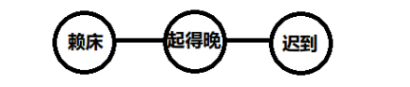
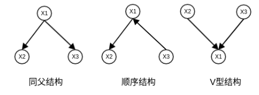
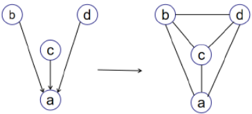
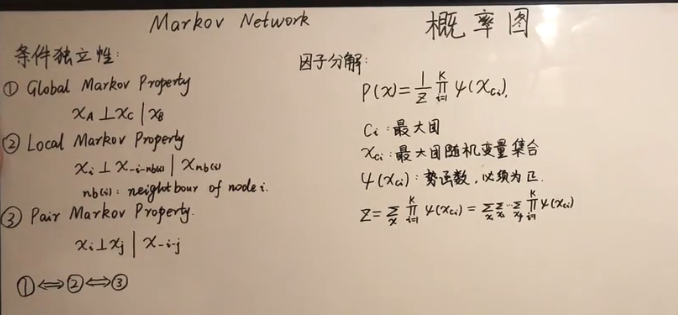
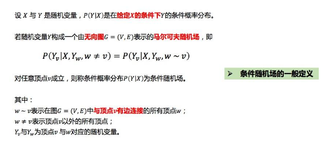
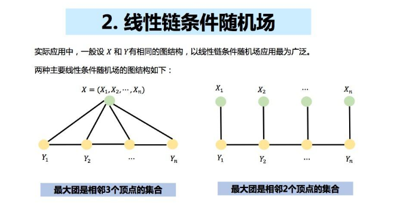
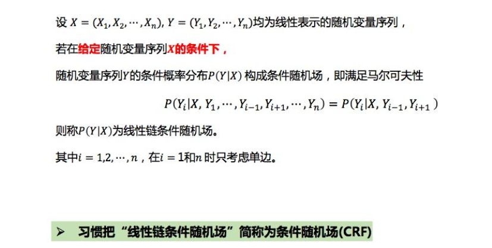
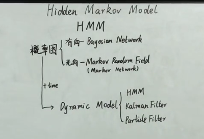
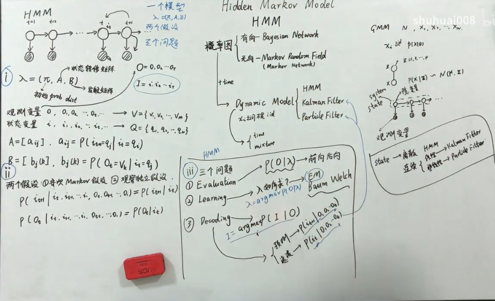
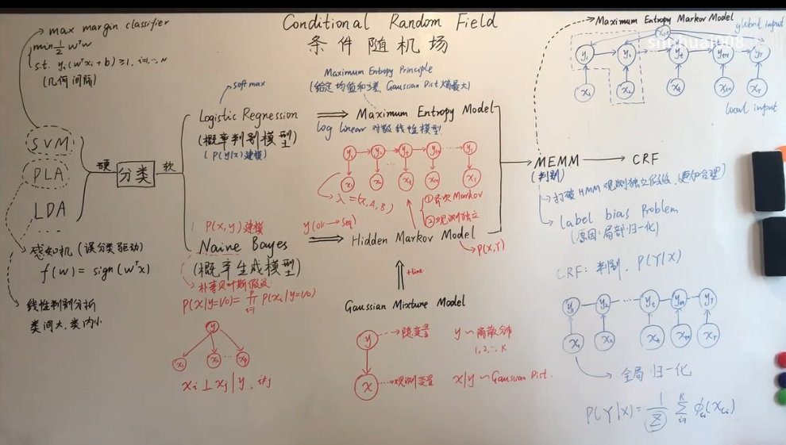

# 概率图模型（零基础详解版）

> 本文把"概率图模型"这一大类知识，按照"是什么 → 为什么这样定义 → 举例子讲清楚 → 和其他知识点的联系"的方式，从零开始逐步展开。整篇文章有一条主线，建议按顺序阅读，不要跳读。

## 全文导览

在正式开始之前，先说清楚这篇文章要讲的整体故事，这样你在阅读细节时不会迷路：

```
概率图模型 = 用"图"（节点+边）来表示一堆随机变量之间"谁依赖谁"的关系
│
├─ 如果关系是"有方向的"（比如因果关系：下雨 → 地面湿），就用有向图
│  └─ 这类模型叫【贝叶斯网络】
│
├─ 如果关系是"没有方向的"（比如只是相关，说不清谁导致谁），就用无向图
│  └─ 这类模型叫【马尔可夫随机场（MRF）】
│     └─ 把马尔可夫随机场用在"给定输入 X，预测标签序列 Y"这种任务上，就得到
│        【条件随机场（CRF）】—— NLP 中做分词、词性标注、命名实体识别的经典模型
│
└─ 如果我们研究的变量本身是"随时间变化的一串数据"（比如一句话里逐个字、逐帧的语音），
   就需要在图模型基础上加上"时间"维度
   └─ 这类模型叫【动态模型】，其中最基础的是【隐马尔可夫模型（HMM）】
      └─ HMM 是"生成式"的（先假设数据是怎么生成的，再反推参数）
      └─ 与 HMM 相对的"判别式"序列模型，就是前面提到的 CRF
```

一句话总结全文的核心问题：**这些模型都是在回答"一堆随机变量放在一起，它们的联合概率应该怎么写、怎么算"这个问题，只是用的"图的结构"不同、"建模思路（生成式/判别式）"不同。**

---

## 第一章：为什么要用"图"来表示概率

### 1.1 问题的起点

假设你有 3 个随机变量 $X_1, X_2, X_3$（比如"是否下雨"、"地面是否湿"、"是否感冒"），你想知道它们同时发生的联合概率 $P(X_1, X_2, X_3)$。

最笨的办法：把所有可能的组合都列出来，一个个记录概率值。如果每个变量只有"是/否"两种取值，3 个变量就有 $2^3=8$ 种组合，需要记 8 个数字。如果是 100 个变量，就要记 $2^{100}$ 个数字——这是天文数字，根本无法处理。

**概率图模型的核心思想**：现实世界中，大多数变量并不是"两两都直接相关"的，而是有一些变量之间根本没有直接关系（比如"今天下雨"和"我数学考试及格"通常没有直接关系）。如果我们能画出一张图，标注清楚"谁和谁有直接关系"，那么复杂的联合概率就可以拆解成很多个"局部的、简单的"概率乘起来，这样需要记录的数字就会大幅减少。

### 1.2 图模型的两种基本形式

- **节点（node）**：代表一个随机变量（比如 $X_1$）。
- **边（edge）**：代表两个变量之间"有直接关系"。

根据边有没有方向，分成两大类：

| | 有向图模型 | 无向图模型 |
|---|---|---|
| 边的含义 | 有方向的箭头，表示**因果/生成关系**（谁是因，谁是果） | 没有方向的连线，表示**相关关系**（说不清谁导致谁，但确实相关） |
| 代表模型 | 贝叶斯网络（Bayesian Network） | 马尔可夫随机场（Markov Random Field） |
| 联合概率公式 | $$P(X_1,\dots,X_n)=\prod_i P(X_i \mid \text{Pa}(X_i))$$ | $$P(X_1,\dots,X_n)=\frac{1}{Z}\prod_C \phi_C(X_C)$$ |

这两个公式现在看不懂完全正常，后面会逐字拆解。这里先建立一个直觉：

- **有向图公式**：每个变量的概率，只需要看"它的直接原因（父节点）"是什么，用条件概率 $P(X_i\mid\text{父节点})$ 表示，然后把所有变量的条件概率**连乘**起来。
- **无向图公式**：把图中"互相紧密连接的一小撮变量"（叫"团"）拎出来，每一小撮变量算一个"评分"（势函数 $\phi_C$），把所有小撮的评分连乘，最后除以一个归一化常数 $Z$（保证所有概率加起来等于1）。

接下来我们分别详细展开这两类模型。

---

## 第二章：有向图模型 —— 贝叶斯网络

### 2.1 条件独立：贝叶斯网络的灵魂概念

在讲贝叶斯网络的图结构之前，必须先理解一个核心概念：**条件独立**。

**直觉例子**：考虑三件事——"赖床"、"起得晚"、"迟到"。



- "赖床"会导致"起得晚"，"起得晚"会导致"迟到"，这是一条链：赖床 → 起得晚 → 迟到。
- 如果你**不知道**"起得晚"这件事有没有发生，那么"赖床"和"迟到"之间显然是有关系的（赖床的人更容易迟到）。
- 但是，如果你**已经知道**"起得晚"这个信息（比如你已经知道某人今天起得晚了），那么这个人是不是"迟到"，就**完全由"起得晚"决定了，跟他到底是不是因为"赖床"才起得晚已经没有关系**（也许他起得晚是因为别的原因，比如堵车前先起晚了，不管原因是什么，只要知道"起得晚"，就能判断"迟到"的概率，不需要再关心"赖床"）。

这就是**条件独立**：给定中间变量"起得晚"之后，"赖床"和"迟到"就相互独立了。

**数学写法**：

$$
P(a\mid b,c) = P(a\mid c)
$$

含义：在已知 $c$（起得晚）的前提下，$a$（迟到）的概率不再需要 $b$（赖床）的信息，因为 $c$ 已经把 $b$ 的全部影响"传递"完了。这种关系记作：

$$
a \perp b \mid c
$$

读作"给定 $c$ 时，$a$ 与 $b$ 条件独立"。

**为什么这个概念重要**：条件独立能大幅简化模型。如果一堆变量之间存在很多条件独立关系，我们就不需要为每一对变量都单独建模，只需要关注"直接相关"的那些变量对，这正是图模型能够简化计算的根本原因。

### 2.2 贝叶斯网络的定义

**贝叶斯网络**是一个**有向无环图（DAG）**：

- "有向"：每条边都有箭头，箭头方向表示"谁影响谁"（从原因指向结果）。
- "无环"：不能出现"A 影响 B，B 又影响 A，形成一个圈"的情况（否则会陷入"鸡生蛋蛋生鸡"的逻辑循环）。

每个节点代表一个随机变量，箭头表示直接的依赖关系。贝叶斯网络有一个核心假设：**每个节点只受它的"直接父节点"影响，跟其他"非后代节点"都是条件独立的**（父节点就是指有箭头指向它的那些节点）。

举个例子：如果图是 "下雨 → 地面湿 → 鞋子滑"，那么"鞋子滑"这个节点的父节点是"地面湿"，它不直接依赖"下雨"——只要知道"地面湿不湿"，"下雨"这个信息对判断"鞋子滑不滑"就没有额外帮助了（因为下雨的全部影响都已经通过"地面湿"这个中间变量传递过去了）。

联合概率的写法：

$$
P(X_1, X_2, \dots, X_n) = \prod_i P(X_i \mid \text{Pa}(X_i))
$$

- $\text{Pa}(X_i)$：变量 $X_i$ 的**父节点集合**（即所有直接指向 $X_i$ 的节点）。
- 这个公式的意思是：**整体的联合概率，等于每个变量"在它父节点条件下"的概率，全部乘起来**。

用"下雨→地面湿→鞋子滑"这个例子代入：

$$
P(\text{下雨}, \text{地面湿}, \text{鞋子滑}) = P(\text{下雨}) \cdot P(\text{地面湿}\mid\text{下雨}) \cdot P(\text{鞋子滑}\mid\text{地面湿})
$$

不需要写 $P(\text{鞋子滑}\mid\text{下雨},\text{地面湿})$ 这么复杂的条件概率，只需要"鞋子滑"关于它父节点"地面湿"的条件概率就够了——这就是图结构帮我们简化计算的地方。

### 2.3 三种基本拓扑结构

贝叶斯网络中，任意三个节点之间的关系，无非是下面三种基本"积木"拼接而成：



#### （1）同父结构（Common Parent）

$X_1 \to X_2$，同时 $X_1 \to X_3$（$X_1$ 是 $X_2$ 和 $X_3$ 的共同父节点）。

**例子**：$X_1$="天气冷"，$X_2$="穿羽绒服"，$X_3$="喝热水"。天气冷会导致人穿羽绒服，也会导致人喝热水。

- **如果不知道 $X_1$（天气冷不冷）**：观察到别人穿羽绒服（$X_2$），会让你更倾向于猜测他也在喝热水（$X_3$）——因为穿羽绒服暗示了天气冷，而天气冷又会导致喝热水。所以此时 $X_2$ 和 $X_3$ 是**相关**的。
- **如果已知 $X_1$（已经知道今天很冷）**：那么这个人穿不穿羽绒服，跟他喝不喝热水，就没有关系了（两者都只是"冷"这个共同原因单独造成的结果，互相之间没有直接联系）。此时 $X_2 \perp X_3 \mid X_1$（$X_1$ 被观测时，$X_2, X_3$ 条件独立）。

**规律**：同父结构中，父节点 $X_1$ 一旦"被观测"（即已知它的取值），就会"阻断"两个子节点之间的关系。

#### （2）顺序结构（Sequential / Chain）

$X_2 \to X_1 \to X_3$（一条链）。

这正是前面"赖床→起得晚→迟到"的例子：$X_2$=赖床，$X_1$=起得晚，$X_3$=迟到。

**规律**：链式结构中，中间节点 $X_1$ 一旦"被观测"，同样会"阻断" $X_2$ 和 $X_3$ 之间的关系（前面已经详细解释过原理）。

#### （3）V 型结构（V-structure，也叫 Collider）

$X_2 \to X_1$，同时 $X_3 \to X_1$（$X_2, X_3$ 是 $X_1$ 的两个父节点，箭头都指向 $X_1$，形状像字母 V）。

**例子**：$X_1$="草地湿"，$X_2$="下雨了"，$X_3$="有人在浇水"。下雨和浇水都能导致草地湿，这两者本身互相没有关系（下不下雨跟有没有人浇水通常无关）。

- **如果不知道 $X_1$（不知道草地湿不湿）**：那么"下雨"和"浇水"两件事确实互相独立，你观测到今天下雨了，并不会改变你对"是否有人浇水"的判断。
- **如果已知 $X_1$（已经看到草地湿了）**：这时"下雨"和"浇水"就变得**相关**了！因为草地湿肯定是这两个原因之一（或两者都有）造成的——如果你进一步得知"今天没有下雨"，那么"有人浇水"的概率就会大幅上升（这是唯一能解释草地湿的原因了）。这种现象叫**"解释消除"（explaining away）**。

**规律**：V 型结构和前两种正好相反——子节点 $X_1$ **不被观测时**，两个父节点 $X_2, X_3$ 是独立的；**一旦被观测**，两个父节点反而变得相关。

三种结构的规律汇总（这是理解下面"D-划分"的基础）：

| 结构 | 中间节点未被观测 | 中间节点被观测 |
|---|---|---|
| 同父结构 | 两端相关 | 两端独立（阻断） |
| 顺序结构 | 两端相关 | 两端独立（阻断） |
| V 型结构 | 两端独立（阻断） | 两端相关 |

### 2.4 D-划分：判断任意两个节点是否独立

现实中的贝叶斯网络往往有很多节点，两个节点之间可能要经过好几个中间节点才能连上，而且可能存在多条路径。**D-划分（D-separation）** 就是把上面三种基本结构的规律推广到"一条完整路径、多条路径、一整个集合"的通用判断方法。

**判断规则**：对于节点 $a$ 到节点 $b$ 之间的某一条路径，只要这条路径上**有一个节点满足下面任意一个条件**，这条路径就被"阻断"了：

1. 该节点是**同父结构或顺序结构**中的中间节点，且**已经被观测**；
2. 该节点是 **V 型结构**中的"碰撞点"，且**没有被观测，同时它的所有后代节点也都没有被观测**。

**只有当 $a$ 到 $b$ 之间所有路径都被阻断，才能说 $a$ 和 $b$（在给定的观测条件下）是独立的**——只要有一条路径没被阻断，$a$ 和 $b$ 就仍然相关。

推广到集合：如果节点集合 $A$ 中任意节点到集合 $B$ 中任意节点的所有路径都被阻断，就说 $A$ 和 $B$（给定某观测集合）是独立的。

这个规则初看比较绕，因为需要检查图中所有路径、每条路径上每个节点的状态，人工做起来容易出错。所以实践中，我们通常借助下面的"道德图"方法来简化判断。

### 2.5 道德图：把有向图问题转化为无向图问题

**核心想法**：D-划分需要区分三种结构（尤其 V 型结构的规则和另外两种是相反的），比较难记忆和操作。如果能把有向图转换成无向图，那么只需要用一种统一的规则（无向图里，两点之间的路径被"切断"就是独立）来判断，就简单多了。

**转换步骤（"道德化"）**：

1. **找出图中所有的 V 型结构**（即所有"两个箭头共同指向同一个节点"的地方），在这两个父节点之间**加一条无向边**（相当于让这两个"共同抚养一个孩子的父母"正式"结婚"，这也是"道德化"这个名字的由来——毕竟他们共同有一个孩子）。
2. **把图中所有的有向边都改成无向边**（去掉箭头方向）。

处理完的图就叫**道德图（Moral Graph）**。

**具体例子**（对应下图）：



原图：$b \to a$，$c \to a$，$d \to a$（$b, c, d$ 都指向 $a$，是一个"三箭头共同指向 $a$"的 V 型结构）。

道德化步骤：

1. 找到 V 型结构：$b, c, d$ 都是 $a$ 的父节点，因此需要把 $b,c,d$ 两两之间都连上无向边：$b-c$、$c-d$、$b-d$。
2. 把原来的有向边 $b\to a, c\to a, d\to a$ 也改成无向边：$b-a, c-a, d-a$。

最终得到右图：$a,b,c,d$ 四个点两两之间几乎都连了起来（一个近似"完全图"的结构）。

**用道德图判断独立性的方法**：

> 设道德图中有变量 $x, y$，以及一个已被观测的变量集合 $Z=\{z_i\}$。如果把集合 $Z$ 中的节点从道德图中**删除**之后，$x$ 和 $y$ 分别落在**两个不连通的部分**（即从 $x$ 走不到 $y$ 了），那么就有 $x \perp y \mid Z$。

**注意**：用道德图判断出的独立性，在原来的有向图中一定成立；但反过来，有向图中的某些独立性关系，可能在道德图判断中被"漏判"（道德图的方法是保守的，不会误判独立，但可能漏判一些独立关系）。

---

## 第三章：无向图模型 —— 马尔可夫随机场（MRF）

### 3.1 为什么需要无向图

贝叶斯网络要求关系必须有"方向"（谁是因、谁是果）。但现实中很多关系是**说不清方向**的——比如图像中相邻像素的颜色会相互影响，但你不能说"左边的像素导致了右边的像素"，它们只是"相关"，没有因果方向。这时就需要**无向图模型**，也叫**马尔可夫随机场（Markov Random Field, MRF）**或**马尔可夫网络（Markov Network）**。

> 补充一个容易混淆的概念区分：**马尔可夫随机场（MRF）**是一个理论概念，描述"满足特定独立性质的一组随机变量"；**马尔可夫网络**则是这个理论用"图"画出来的具体表示形式。换句话说，马尔可夫网络是 MRF 的图形化表达，二者可以基本视为同一回事，只是强调的角度略有不同。

### 3.2 团（Clique）：无向图里的"基本单元"

在无向图中，我们不再用"父节点"这个概念（因为没有方向），而是用**团（clique）**这个概念。

**团的定义**：图中的一个节点子集，如果这个子集里**任意两个节点之间都有边直接相连**（即子集内部两两相连，形成一个"完全子图"），就称这个子集为一个团。

**极大团（maximal clique）**：如果一个团不能再添加任何其他节点（否则就不满足"两两相连"的条件了），并且这个团不是另一个更大团的子集，就称它是极大团。

**最大团（maximum clique）**：所有极大团中，**包含节点数最多**的那个。

**举例**：假设有 6 个节点，编号 0-5，其中 $\{0,4,5\}$ 这三个点两两之间都有边（构成一个团），而 $\{0,5\}$ 这两个点也有边（也是一个团）。因为 $\{0,5\} \subset \{0,4,5\}$（$\{0,5\}$ 是 $\{0,4,5\}$ 的真子集），所以 $\{0,5\}$ **不是**极大团，而 $\{0,4,5\}$ 是极大团（如果它没有被更大的团包含的话）。



### 3.3 马尔可夫随机场的定义

对一个无向图 $G=(V,E)$（$V$ 是节点集合，$E$ 是边集合），以及一组由 $V$ 索引的随机变量 $\mathbf{X}=(X_v)_{v\in V}$，如果这组变量满足下面要讲的"局部马尔可夫性质"，就称它是关于图 $G$ 的马尔可夫随机场。

### 3.4 条件独立的直觉再理解

前面在贝叶斯网络里已经用"赖床→起得晚→迟到"讲过条件独立，这里再强调一遍，因为它同样是理解 MRF 的基础：


赖床和起得晚有相关性，起得晚和迟到有相关性，但如果已经知道"起得晚"这个中间变量，赖床和迟到就相互条件独立了——这个直觉在有向图和无向图中都是相通的。

### 3.5 马尔可夫随机场的三个等价性质

MRF 有三种表述"条件独立"的方式，它们其实是**互相等价**的（数学上可以证明，满足其中一个，另外两个也自动满足）：


#### （1）成对马尔可夫性质（Pairwise Markov Property）

$$
X_u \perp X_v \mid X_{V\setminus\{u,v\}}
$$

**含义**：给定除了 $u, v$ 以外的**所有其他变量**，只要 $u$ 和 $v$ 这两个节点在图上**不相邻**（没有直接的边相连），那么 $X_u$ 和 $X_v$ 就是条件独立的。

**直觉**：如果两个变量之间没有直接的边，说明它们没有"直接关系"，一旦把所有其他的"中间变量"都固定下来（已知），这两个变量之间就再也没有能够"传递影响"的路径了。

#### （2）局部马尔可夫性质（Local Markov Property）

$$
X_v \perp X_{V\setminus N[v]} \mid X_{N(v)}
$$

符号说明：
- $N(v)$：节点 $v$ 的**邻居集合**（所有和 $v$ 有直接边相连的节点，不包括 $v$ 自己）。
- $N[v]$：$N(v)$ 加上 $v$ 自己（闭邻域）。
- $V \setminus N[v]$：除了 $v$ 和它的邻居之外的**所有其他节点**。

**含义**：只要知道了节点 $v$ **所有邻居**的取值，那么 $v$ 就与图中**除了它和它邻居之外的所有其他节点**条件独立。

**直觉**：一个节点的"势力范围"仅限于它的直接邻居，只要邻居的信息已知，这个节点跟"更远"的节点就没有关系了——这跟现实中"物以类聚"的局部影响很像：你的心情只受你身边朋友直接影响，如果已经知道所有朋友今天的心情，那你和一个八竿子打不着的陌生人的心情就没什么关系了。

#### （3）全局马尔可夫性质（Global Markov Property）

$$
X_A \perp X_B \mid X_S
$$

**含义**：$A, B$ 是两个不相交的节点子集，$S$ 是另一个节点子集。如果 $S$ 在图上把 $A$ 和 $B$ **分隔开**了（即从图中去掉 $S$ 这些节点后，$A$ 和 $B$ 分别落在两个互相无法到达的部分，也就是所有 $A$ 到 $B$ 的路径都必须经过 $S$），那么给定 $S$ 后，$A$ 和 $B$ 这两组变量就整体条件独立。

**直觉**：这其实就是前面贝叶斯网络里"道德图判断独立性"方法的无向图版本——只是无向图不需要"道德化"这一步，可以直接用这个规则判断。

这三条性质的强弱关系是：**全局 ⟺ 局部 ⟺ 成对**（三者数学等价，只是应用的场景粒度不同：成对是最细粒度的两两关系，局部是一个节点和它的邻居的关系，全局是任意两组节点集合的关系）。

### 3.6 因子分解：如何写出 MRF 的联合概率

有了"团"的概念，我们就可以正式写出 MRF 的联合概率公式了。这个过程叫**因子分解（factorization）**：

$$
P(\mathbf{X}) = \frac{1}{Z}\prod_{i=1}^{K}\psi(X_{C_i})
$$

逐项解释每个符号（这是整篇文章里最重要的公式之一，一定要理解透）：

- $C_i$：图中的一个**最大团**（前面定义过：极大团中节点数最多的）。$K$ 是最大团的总个数。
- $X_{C_i}$：最大团 $C_i$ 所包含的那些随机变量（一个变量子集，而不是单个变量）。
- $\psi(X_{C_i})$：**势函数（potential function）**，也叫因子。它是一个作用在团 $C_i$ 上的函数，用来给这个团的变量组合"打分"——分数越高，代表这组变量同时取这些值的可能性越大。**势函数必须是非负的**（因为它最终要变成概率的一部分，不能是负数）。
- $Z$：**配分函数（partition function）**，也叫归一化常数。它就是把所有可能的变量取值组合，代入上面的势函数乘积中求和，得到一个总数，再用它去除，从而保证最终算出来的 $P(\mathbf{X})$ 加起来（或积分起来）等于 1（因为任何概率分布都必须满足"所有可能性加起来是100%"这个基本要求）。

$$
Z = \sum_{\mathbf{X}}\prod_{i=1}^{K}\psi(X_{C_i})
$$

**为什么要按"最大团"来分解？** 因为势函数 $\psi$ 本质上是在描述"一小撮变量之间的局部关系"，而"团"正是无向图里"一小撮互相直接关联的变量"的严格定义。按最大团分解，既能覆盖图中所有的依赖关系，又不会重复引入不必要的更小团（因为更小的团已经被包含在最大团的势函数里了）。

### 3.7 完整的手把手数值例子

为了把上面这个公式落到实处，我们用一个具体例子走一遍完整流程。

**设定**：有一个简单的图 $G$，包含 3 个节点 $x_1, x_2, x_3$，边的连接关系是：
- $x_1$ 和 $x_2$ 之间有边
- $x_2$ 和 $x_3$ 之间有边
- （$x_1$ 和 $x_3$ 之间**没有**边）

**第一步：找出所有的团**

因为 $x_1-x_2$ 相连、$x_2-x_3$ 相连，但 $x_1-x_3$ 不相连，所以这个图的最大团有两个：

$$
C_1=\{x_1,x_2\}, \quad C_2=\{x_2,x_3\}
$$

（$\{x_1,x_2,x_3\}$ 不是一个团，因为 $x_1$ 和 $x_3$ 之间没有边，不满足"两两相连"的条件。）

**第二步：为每个团定义势函数**

势函数的具体形式是我们**人为设计**的（类似于神经网络里我们要设计网络结构一样），这里假设：

$$
\psi_{\{x_1,x_2\}}(x_1,x_2)=\exp(-x_1^2-x_2^2)
$$

$$
\psi_{\{x_2,x_3\}}(x_2,x_3)=\exp(-x_2^2-x_3^2)
$$

（用指数函数的原因：可以保证势函数永远是正数，天然满足"非负"的要求，这在实践中是很常用的设计技巧，被称为吉布斯分布/玻尔兹曼分布的形式。）

**第三步：写出（未归一化的）联合概率**

$$
P(x_1,x_2,x_3) = \frac{1}{Z}\,\psi_{\{x_1,x_2\}}(x_1,x_2)\cdot\psi_{\{x_2,x_3\}}(x_2,x_3)
$$

**第四步：计算配分函数 $Z$**

假设 $x_1,x_2,x_3$ 都是离散变量，每个变量的取值范围是 $\{-1,0,1\}$（一共 $3\times3\times3=27$ 种组合）。$Z$ 就是把这 27 种组合，每种组合都代入两个势函数相乘，再把 27 个结果全部加起来：

$$
Z = \sum_{x_1,x_2,x_3 \in \{-1,0,1\}} \psi_{\{x_1,x_2\}}(x_1,x_2)\cdot \psi_{\{x_2,x_3\}}(x_2,x_3)
$$

比如其中一种组合 $(x_1,x_2,x_3)=(0,0,0)$，代入得到 $\exp(0)\times\exp(0)=1\times1=1$；再比如 $(1,1,1)$ 代入得到 $\exp(-1-1)\times\exp(-1-1)=e^{-2}\times e^{-2}\approx 0.135\times0.135\approx0.018$。把 27 种组合的结果都这样算出来再加总，就得到了 $Z$ 的具体数值。

**第五步：算出某个具体组合的真实概率**

一旦 $Z$ 算出来了（假设算出 $Z=5.0$，这里只是示例数字），那么某个具体组合，比如 $(x_1,x_2,x_3)=(0,0,0)$ 的真实概率就是：

$$
P(0,0,0) = \frac{1}{5.0}\times 1 \times 1 = 0.2
$$

**这个例子想说明什么**：无向图模型的计算流程，永远是"**先设计势函数 → 枚举所有组合算出 $Z$ → 用势函数乘积除以 $Z$ 得到归一化的概率**"这三步。这个流程在后面讲 CRF 时会再次用到，是完全一样的套路。

---

## 第四章：条件随机场（CRF）—— 无向图模型的一个"判别式"应用

### 4.1 CRF 是用来做什么的

**条件随机场（Conditional Random Field, CRF）**是自然语言处理中最经典的**序列标注**模型之一，广泛用于：

- **中文分词**：把一句连续的话切分成一个个词。
- **命名实体识别（NER）**：找出句子中的人名、地名、机构名。
- **词性标注（POS Tagging）**：给每个词标注词性（名词、动词……）。

现代深度学习模型如 BiLSTM-CRF、BERT-BiLSTM-CRF，本质都是"用神经网络提取特征 + 用 CRF 层做最终的序列标签预测"的组合，CRF 依然是这些模型里保证"标签之间搭配合理"的关键部分。

**CRF 和前面 MRF 的关系**：CRF 就是马尔可夫随机场的一种，只不过它是专门用来建模"**给定输入 $X$ 后，输出标签序列 $Y$ 的条件概率 $P(Y\mid X)$**"，而不是对 $X,Y$ 的联合概率建模——这一点让它属于**判别式模型**（判别式模型直接学 $P(Y|X)$，生成式模型要学联合分布 $P(X,Y)$，两者的区别后面第六章会详细展开）。

### 4.2 条件随机场的一般定义



原文定义（逐句翻译成人话）：

> 设 $X$ 与 $Y$ 是随机变量，$P(Y\mid X)$ 是在给定 $X$ 的条件下 $Y$ 的条件概率分布。

也就是说，我们只关心"已知输入 $X$ 的情况下，$Y$ 会是什么"，不关心 $X$ 本身是怎么产生的。

> 若随机变量 $Y$ 构成一个由无向图 $G=(V,E)$ 表示的马尔可夫随机场，即：
> $$
> P(Y_v \mid X, Y_w, w\neq v) = P(Y_v \mid X, Y_w, w\sim v)
> $$
> 对任意顶点 $v$ 成立，则称条件概率分布 $P(Y\mid X)$ 为条件随机场。

这个公式拆解一下：
- $Y_v$：图中顶点 $v$ 对应的随机变量。
- $w \neq v$：图中除了 $v$ 以外的**所有其他顶点**。
- $w \sim v$：图中与顶点 $v$ **有边直接相连**的顶点（也就是 $v$ 的邻居）。
- 左边 $P(Y_v \mid X, Y_w, w\neq v)$：在已知输入 $X$、以及**所有其他节点** $Y$ 值的情况下，$Y_v$ 的概率。
- 右边 $P(Y_v \mid X, Y_w, w\sim v)$：在已知输入 $X$、以及 $v$ 的**邻居节点** $Y$ 值的情况下，$Y_v$ 的概率。
- 两边相等，意思是：**只要知道了 $v$ 的邻居的标签，就不需要再知道图中其他更远节点的标签了**——这正是上一章讲的马尔可夫随机场"局部马尔可夫性质"，只不过这里额外多了一个"处处以 $X$ 为条件"的前提。

**一句话概括**：CRF = "在给定 $X$ 的条件下，$Y$ 服从马尔可夫随机场"。

### 4.3 线性链条件随机场（Linear Chain CRF）

上面的定义是最一般的形式，$Y$ 之间的图结构可以是任意形状。但实际应用中，最常用、最简单的形式是**线性链条件随机场**，此时 $Y$ 的图结构是一条"链"（每个标签只与前后相邻的标签有关）。



上图对比了两种可能的图结构：

- **左边**：$X=(X_1,\dots,X_n)$ 被画成一个统一的"全局顶点"，同时连接到 $Y_1, Y_2, \dots, Y_n$ 每一个节点，并且 $Y_1,\dots,Y_n$ 之间也两两相连（形成一个更复杂的团，即"最大团是相邻3个顶点的集合"）。
- **右边**：$Y_1-Y_2-\cdots-Y_n$ 形成一条链（每个 $Y_i$ 只和 $Y_{i-1}, Y_{i+1}$ 相邻），同时每个 $X_i$ 单独对应一个 $Y_i$（"最大团是相邻2个顶点的集合"）。

**线性链CRF用的是右边这种结构**——这也是为什么它叫"线性链"：标签序列 $Y_1,\dots,Y_n$ 排成一条线，每个标签只依赖于自己前后相邻的标签，而不是所有标签互相关联（这大大降低了模型复杂度，同时对大部分序列标注任务来说已经足够合理——比如词性标注里，一个词的词性主要受前后词的词性影响，不太需要考虑很远处的词）。

线性链条件随机场的严格定义：



$$
P(Y_i \mid X, Y_1,\dots,Y_{i-1},Y_{i+1},\dots,Y_n) = P(Y_i\mid X, Y_{i-1},Y_{i+1})
$$

**含义**：给定输入 $X$，第 $i$ 个标签 $Y_i$ 的概率，只需要参考它的**前一个标签 $Y_{i-1}$ 和后一个标签 $Y_{i+1}$**，不需要管序列里更远的标签。（在序列的两端，即 $i=1$ 或 $i=n$ 时，因为只有一侧有邻居，所以只考虑单边。）

> 之后我们提到的"CRF"，如果不特别说明，通常都是指这种"线性链CRF"，因为它是应用最广泛的版本。

### 4.4 CRF 的核心概率公式：逐项拆解

CRF（线性链）建模的核心公式如下，这是全文最重要的公式之一：

$$
P(y\mid x) = \frac{1}{Z(x)}\exp\left(\sum_k \lambda_k f_k(y,x)\right)
$$

我们像剥洋葱一样一层层拆开：

**第一层：什么是特征函数 $f_k(y,x)$？**

特征函数是**人为设计**的一个函数，输入是"输入序列 $x$"和"标签序列 $y$"，输出是一个数字（通常简单情况下输出 0 或 1），代表"某种特定的模式是否出现了"。

特征函数分为两类：

1. **局部特征（状态特征）**：只看"当前位置的输入"和"当前位置的标签"之间搭不搭配。例如：$f_1(y_i,x)=1$，如果"当前词是'跑'，并且当前标签是'动词'"，否则为 0。
2. **转移特征**：看"相邻两个标签"之间搭不搭配。例如：$g_1(y_i,y_{i+1})=1$，如果"当前标签是'形容词'，下一个标签是'名词'"（这种组合在语法上很常见，符合直觉），否则为 0。

**第二层：权重 $\lambda_k$ 是什么？**

每个特征函数 $f_k$ 都配一个权重 $\lambda_k$，代表"这个特征有多重要/多可信"。权重是从训练数据里**学出来的**（不是人工设定的），权重越大，说明这个特征模式在真实数据中越经常成立、越可靠。

**第三层：为什么要用 $\exp(\sum_k \lambda_k f_k(y,x))$ 这种形式？**

$\sum_k \lambda_k f_k(y,x)$ 是把所有特征函数的"贡献"加权求和，得到一个总"分数"（score），分数越高说明这组标签 $y$ 和输入 $x$ 越匹配。但分数可以是任意实数（包括负数），不满足概率"非负"的要求，所以要套一层 $\exp(\cdot)$，把分数变成一个正数——这跟第三章 MRF 里"势函数常用指数形式"是同一个道理，$\exp(\sum_k\lambda_k f_k(y,x))$ 本质上就是这一整条标签序列所在的那个"团"的势函数。

**第四层：$Z(x)$ 是什么？**

$$
Z(x) = \sum_{y'}\exp\left(\sum_k \lambda_k f_k(y',x)\right)
$$

这就是配分函数，和上一章讲的 $Z$ 是完全一样的角色：**把所有可能的标签序列 $y'$ 都枚举出来，各自算一个分数的指数值，再全部加起来**，用来把前面算出来的"未归一化的分数"变成一个真正的、加起来等于 1 的概率分布。

**串起来看整个公式**：先设计一堆特征函数（描述什么样的标签、什么样的相邻标签组合是"合理的"）→ 用权重加权求和得到一个分数 → 用 $\exp$ 变成正数 → 除以所有可能标签序列的分数总和做归一化 → 得到 $P(y\mid x)$，也就是"给定这句话，这组标签序列有多大概率是正确的"。

### 4.5 线性链 CRF 的完整公式（区分局部特征和转移特征）

把 4.4 节的一般公式，具体化到线性链结构上：

$$
P(y\mid x) = \frac{1}{Z(x)}\exp\left(\sum_{i=1}^n\sum_k \lambda_k f_k(y_i,x,i) + \sum_{i=1}^{n-1}\sum_k \lambda_k' g_k(y_i,y_{i+1},x,i)\right)
$$

- 第一个求和项 $\sum_{i=1}^n\sum_k \lambda_k f_k(y_i,x,i)$：对序列中**每一个位置** $i$，计算"当前标签 $y_i$ 与输入 $x$ 在位置 $i$ 处搭配得好不好"（局部特征）。
- 第二个求和项 $\sum_{i=1}^{n-1}\sum_k \lambda_k' g_k(y_i,y_{i+1},x,i)$：对**每一对相邻位置**，计算"相邻两个标签 $y_i, y_{i+1}$ 搭配得好不好"（转移特征）。注意这里下标到 $n-1$，因为最后一个标签没有"下一个"可以配对了。

这两部分加起来，就是整条标签序列的总分数，再套上 $\exp$ 和归一化，就是最终的条件概率。

### 4.6 完整数值例子：给两个词标注词性

现在用一个具体、可以手算的小例子，把上面的公式走一遍完整流程。

**任务**：给一个由两个词组成的句子标注词性。输入序列 $x=(x_1,x_2)=(\text{"dog"},\text{"runs"})$，我们想知道标签序列 $y=(y_1,y_2)$ 最可能是什么（比如名词"N"、动词"V"）。

**第一步：设计特征函数**（这里为了简化，只设计两个局部特征，不设转移特征）

- $f_1(y_1,x)$：如果 $y_1=N$（第一个词被标为名词），返回 1，否则返回 0。
- $f_2(y_2,x)$：如果 $y_2=V$（第二个词被标为动词），返回 1，否则返回 0。

**第二步：设定权重**（这里假设已经训练好了，权重分别是）：

$$
\lambda_1 = 1, \quad \lambda_2 = 1
$$

**第三步：枚举所有可能的标签序列，计算每种的得分**

两个位置，每个位置有 N/V 两种可能，一共 $2\times2=4$ 种标签序列：$(N,V)$、$(N,N)$、$(V,V)$、$(V,N)$。

对于 $y=(N,V)$：
- $f_1(N,x)=1$（因为 $y_1=N$ 确实成立）
- $f_2(V,x)=1$（因为 $y_2=V$ 确实成立）
- 得分：$\text{score}(y,x)=\lambda_1 f_1 + \lambda_2 f_2 = 1\times1+1\times1=2$

同样方式计算其余三种（这里直接给出原文假设的结果，实际计算方式相同）：

| 标签序列 $y$ | 得分 score | $\exp(\text{score})$ |
|---|---|---|
| $(N,V)$ | 2 | $e^2\approx7.39$ |
| $(N,N)$ | 1 | $e^1\approx2.72$ |
| $(V,V)$ | 0 | $e^0=1$ |
| $(V,N)$ | 0 | $e^0=1$ |

**第四步：计算配分函数 $Z(x)$**（把上表最后一列全部加起来）：

$$
Z(x) = 7.39+2.72+1+1 = 12.11
$$

**第五步：算出我们关心的那个标签序列的真实概率**

$$
P(N,V\mid x) = \frac{e^2}{Z(x)} = \frac{7.39}{12.11}\approx 0.61
$$

**结论**：在这个简化例子中，"第一个词是名词、第二个词是动词"（$N,V$）这个标签组合的概率约为 61%，是四种可能里概率最高的——这与"dog runs"（狗 跑）这句话里"dog是名词、runs是动词"的语法直觉是吻合的。

同样的方法，你也可以算出另外三种组合的概率（分别是 $2.72/12.11\approx0.22$、$1/12.11\approx0.08$、$1/12.11\approx0.08$，四者相加正好等于 1，这就是"归一化"的意义所在）。

### 4.7 CRF 怎么训练、怎么用来预测

**训练（学习权重 $\lambda_k$）**：

CRF 的训练目标是找到一组最合适的权重 $\lambda_k$，使得模型在训练数据上给"正确答案"标签序列打出的概率尽可能高。做法是最大化对数似然：

$$
\mathcal{L}(\lambda) = \sum_i \log P(y^{(i)}\mid x^{(i)},\lambda)
$$

（这里的思路和本系列文章前面讲过的"最大似然估计"完全一致：让模型认为"正确答案"发生的概率最大化。）通常使用梯度下降或拟牛顿法等优化算法来求解。

**推理（预测新句子的标签）**：

训练好模型后，给一个新的输入 $x$，我们要找到概率最大的那个标签序列 $\hat y=\arg\max_y P(y\mid x)$。

问题在于：如果句子很长（比如 20 个词，每个词有 10 种可能词性），要枚举的标签序列数量是 $10^{20}$，直接枚举根本不可能算完。这时需要用**维特比算法（Viterbi Algorithm）**——一种动态规划算法，它利用"线性链"这个结构特点（每个标签只依赖相邻标签），把"整体最优"的问题拆解成"每一步的局部最优递推"，从而在很短时间内找到全局最优的标签序列，而不需要真的枚举所有组合。

### 4.8 CRF 的实际应用场景

- **自然语言处理**：命名实体识别（NER）、词性标注（POS）、分词（Chunking）。
- **计算机视觉**：图像分割（给每个像素分配类别标签）、姿态估计（关键点定位）。
- **生物信息学**：基因序列的功能区域标注。

### 4.9 小结

CRF 本质上就是：**把马尔可夫随机场的因子分解思想，用在"给定输入 $X$、预测标签序列 $Y$"这个具体任务上**，用一堆人工设计的特征函数（描述什么样的标签、标签组合是合理的）加权求和，再指数化、归一化，得到条件概率 $P(Y|X)$。它是一个**判别式模型**——不关心 $X$ 本身怎么来的，只关心"给定 $X$，$Y$ 应该是什么"。

---

## 第五章：隐马尔可夫模型（HMM）—— 加入"时间"的生成式模型

### 5.1 HMM 在整个知识地图中的位置

先看下面这张图，它把 HMM 放进了整个"概率图模型家族"的坐标系里：



解读这张图的逻辑：

```
概率图（Probabilistic Graphical Model）
├─ 有向图 → 贝叶斯网络（Bayesian Network）
└─ 无向图 → 马尔可夫随机场（Markov Random Field）

如果给上面的静态图模型再加上"时间"这个维度（即变量是随时间变化的一串序列，而不是一次性的一堆变量）：
└─ 就得到了【动态模型（Dynamic Model）】，常见的有三种：
   ├─ HMM（隐马尔可夫模型）——本章的主角
   ├─ Kalman Filter（卡尔曼滤波）——常用于连续数值状态的跟踪（如目标追踪、导航定位）
   └─ Particle Filter（粒子滤波）——用于状态分布非常复杂、无法用简单公式描述时
```

**直觉理解**：贝叶斯网络和 MRF 讲的是"一堆变量之间静态的关系"，而 HMM 是在这个基础上说："如果这些变量是随着时间/位置一个接一个出现的（比如一句话里一个字一个字往后念，或者机器人每个时刻的位置），那应该怎么建模？"

### 5.2 HMM 要解决什么问题：一个具体场景

在深入公式之前，先用一个经典例子建立直觉——**"看不见的天气，猜得到的心情"**（这是 HMM 教材里最常用的比喻）：

假设有一个远方的朋友，你看不到他那里的天气，但他每天会告诉你他今天做了什么活动（散步、购物、打扫卫生）。你知道：
- 天气（晴天/雨天）会影响他做什么活动的概率（比如晴天更可能散步，雨天更可能打扫卫生）。
- 今天的天气和昨天的天气有关（天气有延续性，不会每天完全随机切换）。

这里：
- **"天气"是你看不到的**，叫**隐状态（hidden state）**。
- **"活动"是你能观测到的**，叫**观测值（observation）**。

HMM 要解决的问题就是：**只能看到一串观测值（活动序列），能不能反推出背后看不见的隐状态序列（天气序列）是什么样的，以及这个"隐状态如何变化、如何产生观测值"的规律本身是什么？**

### 5.3 HMM 的三要素



图片左侧手写内容详细拆解如下：

**图的结构**：一条隐状态的链 $i_1 \to i_2 \to \cdots \to i_t \to i_{t+1}$（图中画的圆圈，比如天气），每个隐状态下面连接一个观测值 $o_1, o_2, \dots$（图中画的带阴影的圆圈，比如活动）。

一个完整的 HMM 模型，由三个要素确定，记作 $\lambda = (\pi, A, B)$：

**（1）初始概率分布 $\pi$**

表示"第一天"（$t=1$ 时）各个隐状态出现的概率。比如"第一天是晴天的概率是 0.6，是雨天的概率是 0.4"。

**（2）状态转移矩阵 $A$**

$$
A = [a_{ij}], \quad a_{ij} = P(i_{t+1}=q_j \mid i_t=q_i)
$$

表示"如果这一时刻的隐状态是 $q_i$，那下一时刻转移到隐状态 $q_j$ 的概率是多少"。比如"今天晴天，明天还是晴天的概率是 0.7，变成雨天的概率是 0.3"。

- $Q=\{q_1,q_2,\dots,q_N\}$：所有可能的隐状态集合（比如 $\{晴天,雨天\}$）。

**（3）观测概率矩阵（发射矩阵）$B$**

$$
B=[b_j(k)], \quad b_j(k) = P(o_t=v_k \mid i_t=q_j)
$$

表示"如果这一时刻的隐状态是 $q_j$，那观测到 $v_k$ 这个值的概率是多少"。比如"如果今天是晴天，观测到'散步'这个活动的概率是 0.6"。

- $V=\{v_1,v_2,\dots,v_M\}$：所有可能的观测值集合（比如 $\{散步,购物,打扫卫生\}$）。

**符号总结**：

- 观测变量序列：$O = o_1,o_2,\dots,o_T$，来自集合 $V=\{v_1,\dots,v_M\}$。
- 状态变量序列：$I = i_1,i_2,\dots,i_T$，来自集合 $Q=\{q_1,\dots,q_N\}$。
- 一个 HMM 模型完全由 $\lambda=(\pi,A,B)$ 三部分确定。

### 5.4 HMM 的两个基本假设

HMM 之所以能够被简化计算，是因为它做了两个非常关键（也比较"大胆"）的简化假设：

**假设一：齐次马尔可夫假设**

$$
P(i_{t+1}\mid i_t,i_{t-1},\dots,i_1,o_t,o_{t-1},\dots,o_1) = P(i_{t+1}\mid i_t)
$$

**含义**：下一时刻的隐状态，只取决于**当前时刻**的隐状态，跟更早之前的状态、以及所有已经观测到的值都没有关系。也就是"未来只由现在决定，跟过去的历史无关"（这也是"马尔可夫"这个词在所有马尔可夫模型里的通用含义——"无记忆性"）。

**直觉**：明天是晴是雨，只取决于今天的天气，不需要知道大前天、上周的天气（虽然现实中天气可能有更长期的相关性，但这个假设是为了简化计算而做的近似）。

**假设二：观测独立假设**

$$
P(o_t\mid i_T,i_{T-1},\dots,i_1,o_{T},\dots,o_{t+1},o_{t-1},\dots,o_1) = P(o_t\mid i_t)
$$

**含义**：当前时刻的观测值，只取决于**当前时刻**的隐状态，跟其他任何时刻的隐状态或观测值都没有关系。

**直觉**：今天做什么活动，只取决于今天的天气，不受"昨天做了什么活动"或者"明天天气如何"影响。

这两个假设合起来，正是第三章里"顺序结构"链式关系的具体应用——HMM 本质上就是一条"隐状态链 + 每个隐状态挂一个观测值"的贝叶斯网络（回忆一下：这是有向图，因为"天气→活动"有明确的因果方向）。

### 5.5 HMM 的三个基本问题

一旦确定了 HMM 的框架，实际应用中会遇到三类核心问题，分别有对应的经典算法（对应下图右下角手写"三个问题"部分）：


**问题一：评估问题（Evaluation）**

**问题描述**：已知模型参数 $\lambda=(\pi,A,B)$ 和一个观测序列 $O$，计算这个观测序列出现的概率 $P(O\mid\lambda)$ 是多少。

**类比**：已经知道"天气变化规律"和"天气如何影响活动"的所有参数，现在问："朋友连续三天做了'散步、购物、打扫卫生'这个序列，这种情况出现的可能性有多大？"

**解决算法**：**前向算法（Forward Algorithm）** 和 **后向算法（Backward Algorithm）**——同样是利用动态规划思想，避免直接暴力枚举所有可能的隐状态序列（隐状态序列数量是 $N^T$，$T$ 稍微大一点就会爆炸）。

**问题二：学习问题（Learning）**

**问题描述**：只知道观测序列 $O$（不知道模型参数），要反过来估计出一组能让这个观测序列出现概率最大的参数：

$$
\hat\lambda = \arg\max_\lambda P(O\mid\lambda)
$$

**类比**：只看到朋友很多天的活动记录，但完全不知道"天气转移规律"和"天气如何影响活动"这些参数是什么，需要从观测数据里"学"出这些参数。

**解决算法**：因为隐状态是不可观测的，无法直接用普通的最大似然估计求解（似然函数里包含了对所有可能隐状态序列的求和，形式复杂），所以要用 **EM 算法（Expectation-Maximization）**的一个具体版本，叫 **Baum-Welch 算法**：先"猜"一组参数，用它估计隐状态的分布（E 步），再用估计出来的隐状态分布重新更新参数（M 步），反复迭代直到收敛。

**问题三：解码问题（Decoding）**

**问题描述**：已知模型参数 $\lambda$ 和观测序列 $O$，找出**最可能**产生这个观测序列的隐状态序列：

$$
\hat I = \arg\max_I P(I\mid O,\lambda)
$$

**类比**：已经知道天气规律和天气对活动的影响，现在看到朋友连续几天的活动记录，反推"这几天最可能的真实天气序列是什么"。

**解决算法**：**维特比算法（Viterbi Algorithm）**——没错，就是第四章 CRF 推理阶段用的那个算法！这不是巧合：CRF 和 HMM 虽然一个是判别式、一个是生成式，但它们的图结构都是"线性链"，所以在"给定观测/输入，找最优标签/状态序列"这个子问题上，可以使用同一套动态规划算法。

如果想更深入地理解解码问题，可以进一步区分两类子问题（图片中提到）：

- **预测问题**：$P(i_{t+1}\mid o_1,\dots,o_t)$——根据已经观测到的部分，预测下一步隐状态。
- **滤波问题**：$P(i_t\mid o_1,\dots,o_t)$——根据已经观测到的部分，估计当前这一刻的隐状态。

### 5.6 补充：GMM 与 HMM 的关系

图片右侧还提到了 **GMM（Gaussian Mixture Model，高斯混合模型）**，这里简单说明它和 HMM 的联系：

- GMM 描述的是：有一个离散的、不随时间变化的隐变量 $Z\in\{1,2,\dots,K\}$（决定属于哪一个"类别/簇"），每个类别下，观测值 $X$ 服从一个高斯分布 $X\mid Z \sim N(\mu,\Sigma)$。这是一个"静态"模型，所有数据点的隐变量之间没有关联。
- 如果把 GMM 的隐变量 $Z$，改成"会随时间变化，且下一时刻的取值依赖当前时刻"（也就是加上第五章开头说的"时间"维度和马尔可夫链的转移关系），GMM 就变成了 HMM。

所以图上那句 **"+time"** 的箭头（从 GMM 指向 HMM）意思就是：**HMM 可以理解成"在时间维度上串联起来的 GMM"**——每个时间步的隐状态决定了一个"高斯分量"，观测值从这个分量对应的分布中产生，同时隐状态之间还存在马尔可夫转移关系。

### 5.7 HMM 小结

HMM 是一个**生成式模型**，核心思想是"先假设有一条看不见的隐状态链，按照转移概率 $A$ 演化，每个隐状态再按照发射概率 $B$ 产生一个可观测值"。它建模的是联合概率 $P(O,I)$（观测和隐状态的联合分布），而不是像 CRF 那样直接建模 $P(Y|X)$。这也是为什么 HMM 需要两个"独立性假设"（齐次马尔可夫 + 观测独立）来简化联合概率的计算——这两个假设让 HMM 的计算变得可行，但也是它的局限所在（后面第六章会讲这些假设造成的问题，以及 CRF 是如何解决的）。

---

## 第六章：全景串联 —— 从硬分类到 CRF 的完整演化脉络

前面五章分别详细讲了贝叶斯网络、MRF、CRF、HMM 四个板块，这一章用一张手绘全景图，把它们（以及分类问题的其他经典模型）串成一条完整的故事线，帮你建立"知识地图"。



### 6.1 分类问题的两条路：硬分类 vs 软分类

所有的分类模型，可以先分成两大类：

- **硬分类**：直接输出一个类别标签，不输出概率。代表模型：
  - **感知机（Perceptron）**：$f(w)=\text{sign}(w^Tx)$，用"哪个点分错了就调整参数"的方式训练（"误分类驱动"）。
  - **SVM（支持向量机）**：核心是找一条"间隔最大"的分界线：
    $$
    \min\frac12 w^Tw \quad \text{s.t. } y_i(w^Tx_i+b)\geq1
    $$
  - **LDA（线性判别分析）**：让"类别之间"的差异尽量大、"类别内部"的差异尽量小（类间大，类内小）。

- **软分类**：输出每个类别的概率，代表模型又分成两条子路线（这是理解后续内容的关键分岔点）：
  - **判别式模型**：直接对 $P(y\mid x)$ 建模。
  - **生成式模型**：对联合分布 $P(x,y)$ 建模。

**判别式 vs 生成式的核心区别**：
- 判别式模型只关心"给定输入，输出是什么"的这条边界，不关心数据本身是怎么产生的。
- 生成式模型试图理解"数据整体是怎么产生出来的"，因此理论上还可以反过来用来生成新数据（这也是"生成式"这个名字的来源）。

### 6.2 判别式路线：从逻辑回归到最大熵模型

- **逻辑回归（Logistic Regression）**：概率判别模型，直接对 $P(y|x)$ 建模，多分类时用 **softmax** 函数把线性输出转换成概率。
- 逻辑回归可以推广为**最大熵模型（Maximum Entropy Model）**：
  - 背后的思想是**最大熵原理**：在满足已知约束（比如已知均值和方差）的前提下，选择"熵最大"（也就是最不确定、最不做多余假设、最"公平"）的那个概率分布。举例来说：如果只知道一组数据的均值和方差，在所有可能符合这两个条件的分布中，高斯分布是熵最大的那一个——这就是为什么高斯分布在现实中如此常见的一个理论解释。
  - 数学形式上，最大熵模型是一种 **log linear（对数线性）模型**：概率正比于一堆特征的线性加权和取指数——这个形式是不是很眼熟？没错，这正是第四章 CRF 核心公式 $\exp(\sum_k\lambda_k f_k(y,x))$ 的雏形！CRF 可以看作是最大熵模型在"序列结构"上的推广。

### 6.3 生成式路线：从朴素贝叶斯到隐马尔可夫模型

- **朴素贝叶斯（Naive Bayes）**：概率生成模型，对联合分布 $P(x,y)$ 建模，核心假设是"朴素贝叶斯假设"——给定类别 $y$ 后，各个特征 $x_i$ 之间**相互条件独立**：
  $$
  P(x\mid y) = \prod_{i=1}^{p}P(x_i\mid y)
  $$
  记号 $x_i\perp x_j\mid y\ (i\neq j)$ 表示的正是这一点。
- 把朴素贝叶斯"时序化"（原本是对一组无序特征做独立同分布假设，现在改成一条随时间演化的序列），就得到了**隐马尔可夫模型（HMM）**——这也是为什么第五章说 HMM 是对 $P(X,Y)$（也就是原图中标的 $P(X,I)$）建模的生成式模型。
- 顺带一提，**高斯混合模型（GMM）** 也可以通过"增加时间维度"（图中标注 **+time**）演化为 HMM——这正是 5.6 节详细解释过的内容。

### 6.4 从 HMM 到 MEMM：打破观测独立假设

HMM 有一个明显的局限：**观测独立假设**太强了——它要求当前观测值只能依赖当前隐状态，无法利用"上下文全局信息"（比如做词性标注时，一个词的词性其实可能受到整个句子里其他词的影响，而不仅仅是它自己）。

**最大熵马尔可夫模型（MEMM, Maximum Entropy Markov Model）** 就是为了解决这个问题而提出的：

- 它把"生成式的 HMM"改造成了"判别式的模型"，同时保留了隐状态之间的链式转移结构（$y_1\to y_2\to \cdots \to y_T$）。
- 关键改进：每个 $y_i$ 在预测时，可以利用**全局的观测信息**（图中标注为 global input），而不像 HMM 里每个隐状态只能看到"局部"对应的观测值（local input）。
- 这正是"打破了 HMM 观测独立假设，更加合理"的含义。

### 6.5 从 MEMM 到 CRF：解决 Label Bias Problem

但 MEMM 本身也有问题：**标签偏置问题（Label Bias Problem）**。

**产生原因**：MEMM 在计算每一步的概率转移时，是在"每一个节点自己的位置上做局部归一化"（即针对当前节点，把所有可能的下一个标签的概率加起来等于 1，这是一次独立的归一化）。这样做的副作用是：**如果某个状态的可能后续选择很少（甚至只有一种），那么无论输入 $X$ 提供了什么证据，模型都会"盲目自信"地把全部概率都分配给这个唯一的后续选择**，导致模型过度依赖训练数据里标签本身的转移模式，而忽视了输入特征的证据，这被称为"标签偏置"。

**CRF 的解决方案**：不再对每个节点单独做局部归一化，而是针对**整条标签序列**做一次性的**全局归一化**——这正是第四章讲过的配分函数 $Z(x)$，它是把所有可能的完整标签序列的分数都加总起来，而不是逐个节点分别归一化。这样一来，模型在决定每一步标签时，都是"放在整条路径的全局视角下"来综合权衡的，不会出现 MEMM 那种因为局部归一化导致的偏置问题。

图中标注的 CRF 结构（$y_1-y_2-\cdots-y_T$ 用无向边连接，区别于 MEMM 的有向箭头）和公式：

$$
P(Y\mid X) = \frac{1}{Z}\sum_{i=1}^K \phi_i(x_{c_i})
$$

（这里原图手写用的是求和符号，但按照第四章讲过的标准 CRF 公式，更严谨的写法应该是 $\phi_i$ 连乘再整体归一化，即 $P(Y|X)=\frac1Z\prod_i\phi_i(x_{c_i})$——这与第三章因子分解公式的写法是完全一致的，也说明了 CRF 本质上就是一个"以 $X$ 为条件的马尔可夫随机场"，与第四章 4.2 节讲的一般定义相互呼应。）

### 6.6 整体演化脉络总结图

```
                    ┌── 硬分类：SVM / PLA / LDA / 感知机（直接分割，不建模概率）
分类模型 ──┤
                    └── 软分类（建模概率）
                          │
              ┌───────────┴───────────┐
        判别式模型                  生成式模型
     P(y|x) 直接建模              P(x,y) 联合建模
              │                          │
      Logistic Regression          Naive Bayes
       (softmax)                 (特征条件独立假设)
              │                          │
      Maximum Entropy Model      + 时间维度(time)
      (最大熵原理，log linear)          │
              │                    Hidden Markov Model (HMM)
              │                  (齐次Markov假设 + 观测独立假设)
              │                          │
              └──────────┬───────────────┘
                          │  打破观测独立假设，引入全局输入
                    Maximum Entropy Markov Model (MEMM)
                    (判别式，但因局部归一化产生 Label Bias Problem)
                          │  局部归一化 → 全局归一化
                    Conditional Random Field (CRF)
                    (无向图，全局归一化，直接建模 P(Y|X))
```

**这条主线想告诉你的核心道理是**：CRF 并不是凭空发明的模型，而是在"生成式 HMM 遇到局限 → 判别式 MEMM 尝试改进却引入新问题 → CRF 通过改变归一化方式最终解决问题"这样一个不断迭代改进的过程中演化出来的。理解了这条演化链，就能理解为什么 CRF 长成现在这个样子（无向图结构 + 全局归一化的条件概率模型），而不是死记硬背它的公式。

---

## 全文总结

回到文章开头的导览图，现在你应该能完整地把每一块拼起来了：

1. **概率图模型**用"图"来表示随机变量之间的依赖关系，核心目的是把复杂的联合概率拆解成局部的、简单的部分相乘，降低计算复杂度。
2. **有向图（贝叶斯网络）**表达因果/生成关系，联合概率是各节点关于其父节点的条件概率连乘；判断独立性用 D-划分（或更简便的道德图方法）。
3. **无向图（马尔可夫随机场）**表达没有方向的相关关系，联合概率是各"最大团"势函数的连乘，再除以配分函数 $Z$ 归一化；判断独立性有三条等价性质（成对/局部/全局）。
4. **条件随机场（CRF）**是马尔可夫随机场在"以 $X$ 为条件、预测标签序列 $Y$"这一具体任务上的应用，是判别式模型，通过特征函数+权重+全局归一化来建模 $P(Y|X)$，最常用的形式是线性链CRF。
5. **隐马尔可夫模型（HMM）**是在概率图模型基础上引入"时间"维度得到的生成式序列模型，由三要素 $\lambda=(\pi,A,B)$ 定义，依赖两个简化假设（齐次马尔可夫假设、观测独立假设），需要解决三个基本问题（评估、学习、解码），分别对应前向后向算法、Baum-Welch 算法、维特比算法。
6. 从**硬分类到软分类，从判别式到生成式，从 HMM 到 MEMM 再到 CRF**，是一条完整的、有内在逻辑的模型演化历史，每一步改进都是为了解决上一个模型的具体局限。
