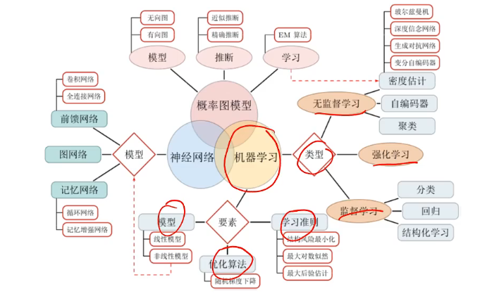
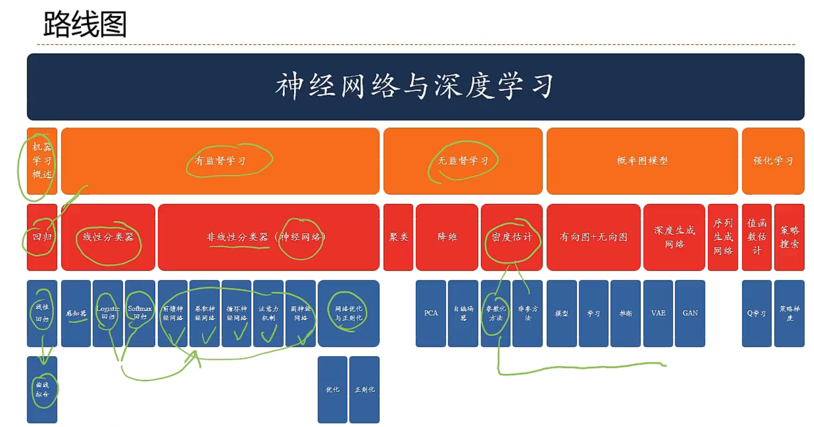

# 前言

## 深度学习是机器学习的一个分支

深度学习是机器学习的一个分支，通过多层神经网络来学习和理解复杂数据的算法。与传统机器学习不同，深度学习使用了神经网络结构，被称为“深度学习”。

- 深度学习是 data driven 的，需要大量的数据，而传统的机器学习算法通常不需要；
- 深度学习本质上可以看作一个特征学习器，在无需另构特征情况下，传统的机器学习算法已经能够胜任日常的任务；
- 如无必要，勿增实体。能够简单的模型解决的，不必要上深度学习算法；

## 深度学习的主要模型是神经网络

深度学习模型通常都是基于神经网络的，但并不是所有的深度学习模型都是神经网络。以下是一些深度学习模型的分类：

1. **人工神经网络（ANNs）**：这是最基础的神经网络，由输入层、隐藏层和输出层组成。每个层由多个神经元组成，神经元之间通过权重连接。

2. **卷积神经网络（CNNs）**：主要用于处理图像和视频数据。它们通过卷积层、池化层和全连接层来提取和分类特征。

3. **循环神经网络（RNNs）**：适用于处理序列数据，如时间序列、文本等。LSTM（长短期记忆网络）和GRU（门控循环单元）是RNN的常见变种。

4. **生成对抗网络（GANs）**：由生成器和判别器组成，用于生成逼真的数据，如图像、音频等。

5. **自编码器（Autoencoders）**：用于数据降维、特征提取和生成数据。它们包括编码器和解码器部分。

6. **变分自编码器（VAEs）**：自编码器的一种变体，用于生成数据，特别适用于无监督学习。

7. **图神经网络（GNNs）**：用于处理图结构数据，适用于社交网络、化学分子结构等。

虽然大多数深度学习模型是基于神经网络的，但深度学习领域还包括其他一些方法和技术，如强化学习中的深度Q网络（DQN），以及某些混合模型。总体来说，深度学习模型通常都是基于神经网络的，但并不是所有的深度学习模型都是神经网络。

**以神经网络为主要模型的深度学习**

 

## 学习路线

