## 表示学习

### 浅层学习

**一般的机器学习的步骤：**

特征处理：人工进行处理和提取特征

浅层学习：建模_x->y_最好的决策（预测）函数

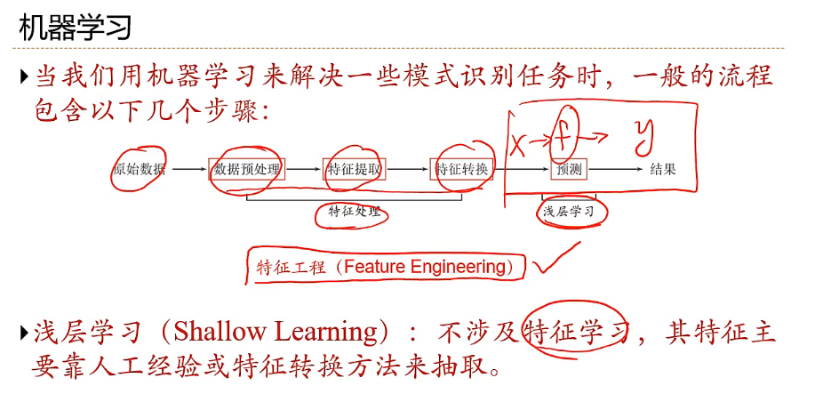

**其中特征处理部分不属于浅层学习，或者浅层学习不包括人工对数据的提取，机器学习只关注最后一步（预测）**

### 如何表示高层语义

**遇到的问题**

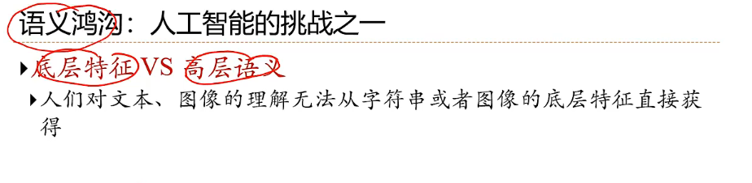

**==解决方法：从底层特征中构造出一些数据表示（representation），然后这些表示能够蕴含高级的语义特征==**

**分布式表示和局部表示**

**语义表示包括：局部表示和分布式表示**

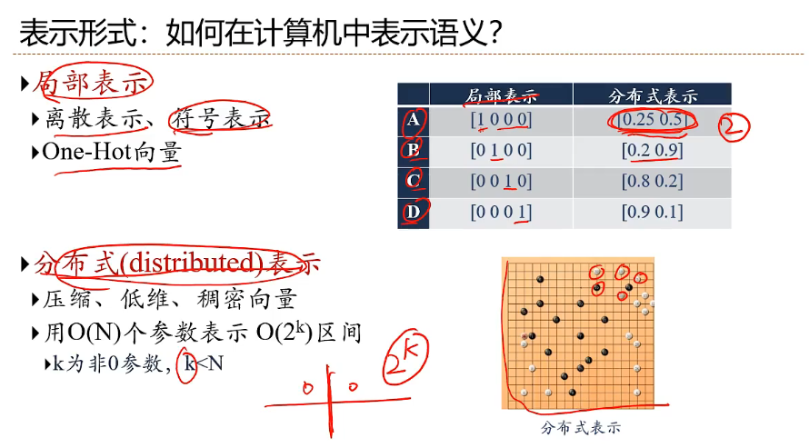

**==符号表示：A B C D==**

**==分布式表示：如词嵌入==**

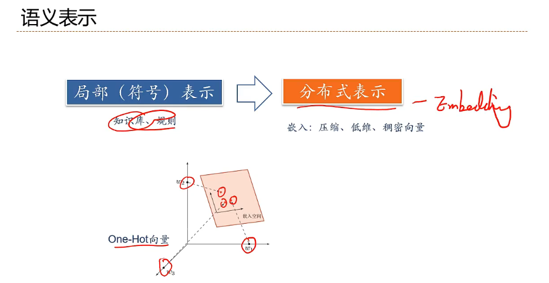

### 表示学习

**==有了语义表示之后，我们希望这些表示能不能自动学习到==**

**表示学习----自动学习特征，从底层特征到高层特征也由计算机自动学习**

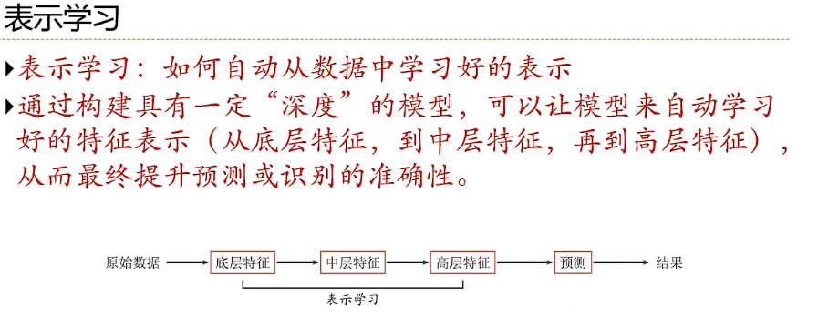

**对于特征工程（人工处理特征的部分），我们希望这些特征由计算机自动进行归纳总结**

### 传统的特征提取和表示学习的差别

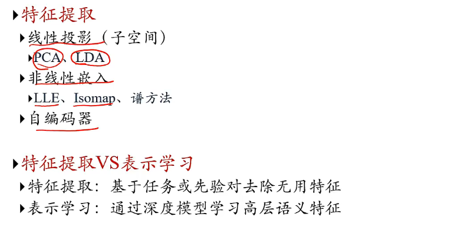

## 深度学习

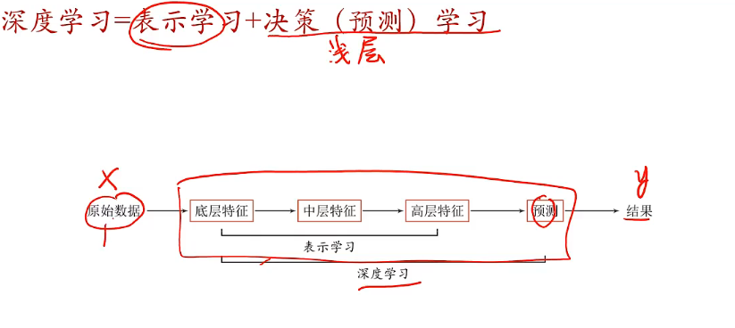

**深度学习=表示学习+浅层学习**

**浅层学习和深度学习的区别**

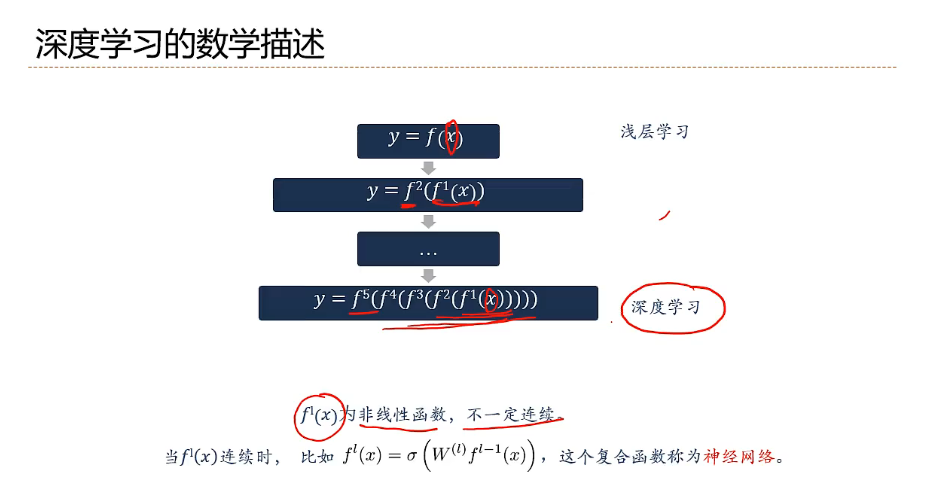

## 神经网络

**人工神经元**

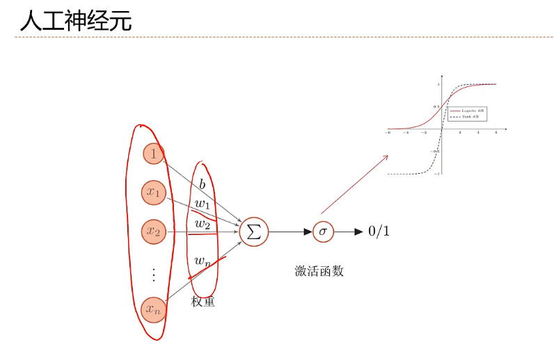

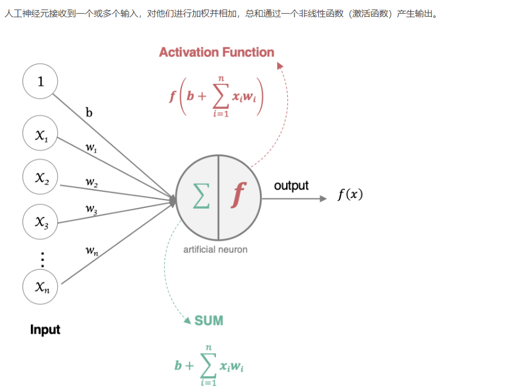

**人工神经网络的要素**

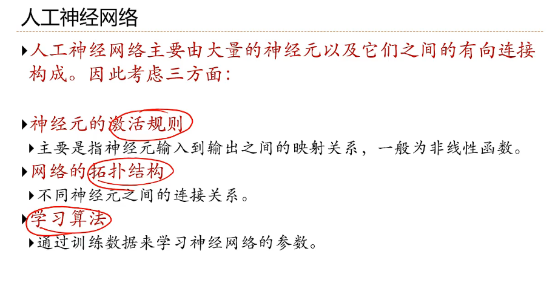

**神经网络的分类**

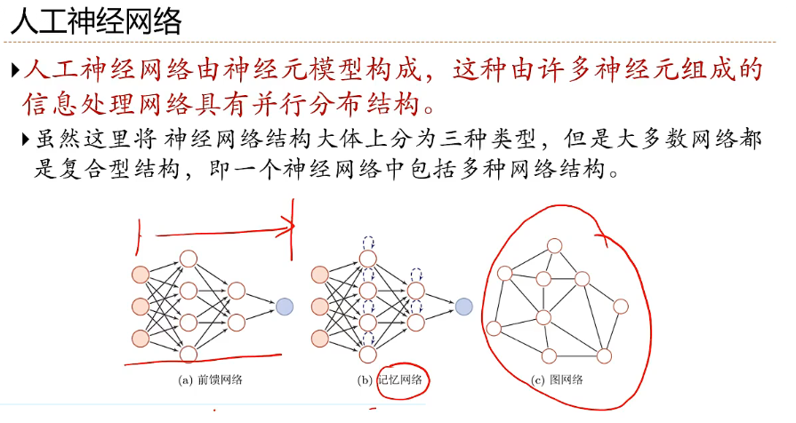

**神经网络和深度学习的对应方式**

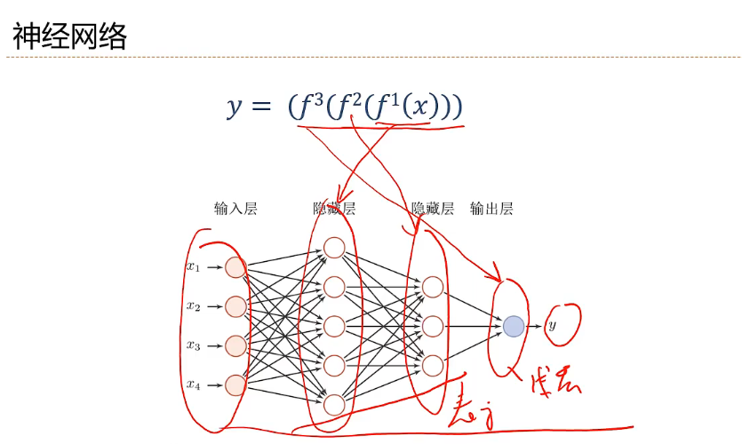

**贡献度分配问题**

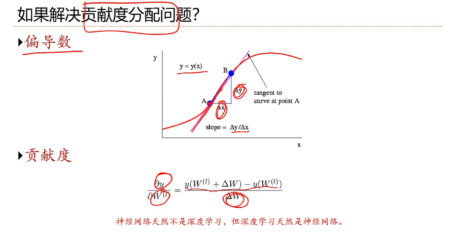

**Question：**

**神经网络中偏导数的计算问题：详见数学中的向量和矩阵求导**

## 前向传播和反向传播示例

### 前向传播

1. 计算隐藏层的输入和输出：

$$
z_1 = w_1 x + b_1 = 0.15 \times 0.5 + 0.35 = 0.425
$$

$$
h = f(z_1) = \frac{1}{1 + e^{-0.425}} \approx 0.604
$$

2. 计算输出层的输入和输出：

$$
z_2 = w_2 h + b_2 = 0.25 \times 0.604 + 0.60 \approx 0.751
$$

$$
\hat{y} = f(z_2) = \frac{1}{1 + e^{-0.751}} \approx 0.679
$$

### 计算损失

损失函数使用均方误差（MSE）：

$$
L = \frac{1}{2} (\hat{y} - y)^2 = \frac{1}{2} (0.679 - 0.8)^2 \approx 0.00734
$$

### 反向传播

1. 计算输出层的误差：

$$
\delta_2 = (\hat{y} - y) \cdot f'(z_2) = (0.679 - 0.8) \cdot \hat{y} \cdot (1 - \hat{y}) = -0.121 \cdot 0.679 \cdot (1 - 0.679) \approx -0.0271
$$

2. 计算隐藏层的误差：

$$
\delta_1 = \delta_2 \cdot w_2 \cdot f'(z_1) = -0.0271 \cdot 0.25 \cdot h \cdot (1 - h) = -0.0271 \cdot 0.25 \cdot 0.604 \cdot (1 - 0.604) \approx -0.0040
$$

3. 计算损失函数对权重和偏置的偏导数：

$$
\frac{\partial L}{\partial w_2} = \delta_2 \cdot h \approx -0.0271 \cdot 0.604 \approx -0.0164
$$

$$
\frac{\partial L}{\partial b_2} = \delta_2 \approx -0.0271
$$

$$
\frac{\partial L}{\partial w_1} = \delta_1 \cdot x \approx -0.0040 \cdot 0.5 \approx -0.0020
$$

$$
\frac{\partial L}{\partial b_1} = \delta_1 \approx -0.0040
$$

4. 使用梯度下降法更新权重和偏置（假设学习率 $\eta = 0.1$）：

$$
w_2 := w_2 - \eta \frac{\partial L}{\partial w_2} = 0.25 - 0.1 \cdot (-0.0164) = 0.25 + 0.00164 = 0.25164
$$

$$
b_2 := b_2 - \eta \frac{\partial L}{\partial b_2} = 0.60 - 0.1 \cdot (-0.0271) = 0.60 + 0.00271 = 0.60271
$$

$$
w_1 := w_1 - \eta \frac{\partial L}{\partial w_1} = 0.15 - 0.1 \cdot (-0.0020) = 0.15 + 0.0002 = 0.1502
$$

$$
b_1 := b_1 - \eta \frac{\partial L}{\partial b_1} = 0.35 - 0.1 \cdot (-0.0040) = 0.35 + 0.0004 = 0.3504
$$
