# 机器学习

## 概率

**我们需要从数量的角度来研究随机现象，从而需要在随机试验的可能结果与数之间建立一个对应关系。许多随机试验的一个可能结果是使用一个数来表示的，这样可在试验结果和数之间建立一个自然的恒等映射。**

### **概率的定义**

**随机现象 随机试验 随机事件 随机变量的定义**

- **随机现象**：事前不可预言的现象，即在相同条件下重复进行试验，每次结果未必相同，或知道事物过去的状况，但未来的发展却不能完全肯定。在一定条件下，出现的可能结果不止一个，事前无法确切知道哪一个结果一定会出现，但大量重复试验中其结果又具有统计规律的现象称为随机现象。

  事前不可预言的现象，即在相同条件下重复进行试验，每次结果未必相同，或知道事物过去的状况，但未来的发展却不能完全肯定。例如：以同样的方式抛置硬币却可能出现正面向上也可能出现反面向上；走到某十字路口时，可能正好是红灯，也可能正好是绿灯。

- 试验：试验是对自然和各种社会现象进行的观察和各种科学实验。

  **随机试验**：随机实验是对随机现象进行的观察和科学实验。随机试验有以下特点：

  （1）可以在相同的条件下重复的进行；

  （2）每次试验的可能结果不止一个，并且能事先明确试验的所有可能结果；

  （3）进行一次试验之前不能确定哪一个结果会出现。

  常见的随机试验，如抛掷一枚硬币，落地时是正面还是反面？从不透明的箱子里拿出一个小球，将是什么颜色的？随机试验随处可见，在此不一一列举。

- **随机事件**：随机事件是在随机试验中，可能出现也可能不出现，而在大量重复试验中具有某种规律性的事件叫做随机事件(简称事件)。随机事件通常用大写英文字母A、B、C等表示。**随机试验中的每一个可能出现的试验结果称为这个试验的一个样本点**，记作ωi。全体样本点组成的集合称为这个试验的样本空间，记作Ω．即Ω={ω1，ω2，…，ωn，…}。仅含一个样本点的随机事件称为基本事件，含有多个样本点的随机事件称为复合事件。

  **必然事件**记作Ω，样本空间Ω也是其自身的一个子集，Ω也是一个“随机”事件，每次试验中必定有Ω中的一个样本点出现，必然发生。

  **不可能事件**记作Φ，空集Φ也是样本空间的一个子集，Φ也是一个特殊的“随机”事件，不包含任何样本点，不可能发生。

  在**随机试验**中，随机事件一般是由若干个基本事件组成的。样本空间Ω的任一子集A称为随机事件。属于事件A的样本点出现，则称事件A发生。

-   **随机变量**：

### 关于概率一些的概念


### **离散型随机变量，利用p(x)表示概率分布**


### **连续随机变量，利用密度函数来描述概率分布**


### **累积分布函数F(x)**


### **随机向量的联合概率分布**


### **条件概率**

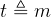 通常指的是 “ t 被定义为m ” 或 “ 根据定义，t 等于m ”(通常在某种条件下)


### 采样（Sampling）

**N个样本，经过统计，服从p(x)分布**


**采样方式：**如何产生服从样本的分布

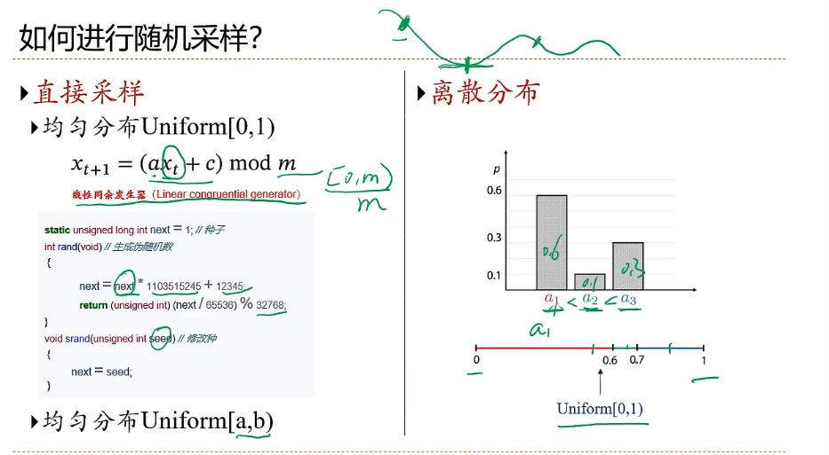

**更复杂的分布的采样（连续分布）**

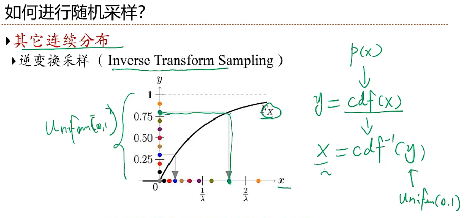

### 大数定律

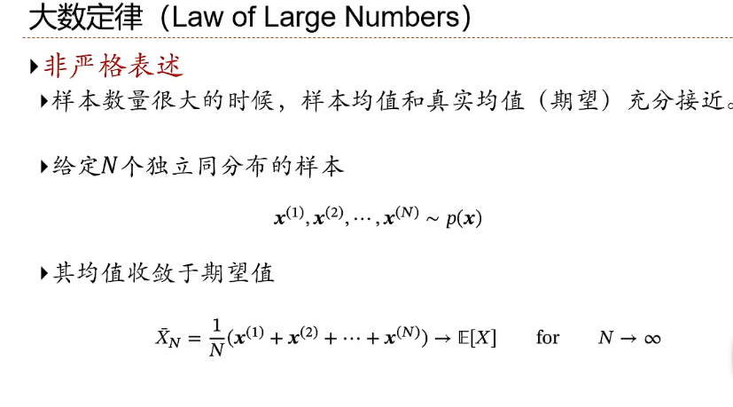

## 机器学习的定义

**机器学习≈自动构建一个映射函数**

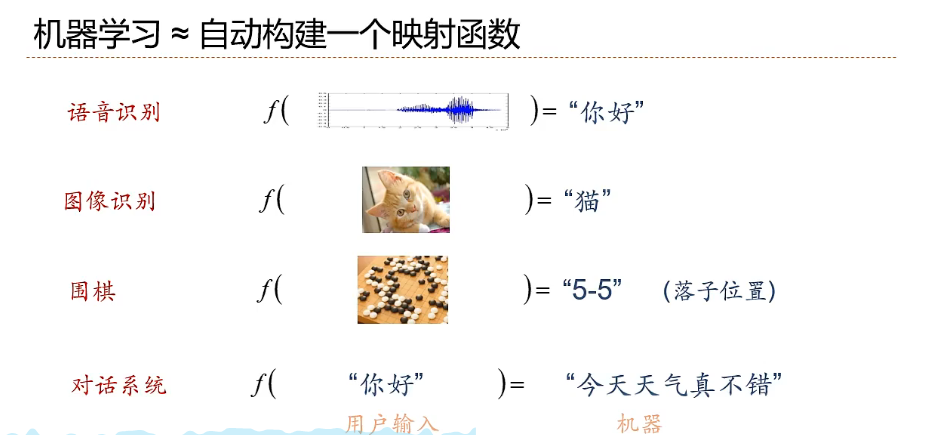

**为什么要机器学习:因为现实世界的问题都比较复杂，很难通过规则来手工实现**

**如何构造映射函数**

构造函数空间（函数族$ \mathscr{F} $），不是简单的拟合问题，对于未知的数据（整个数据分布上），误差要达到尽量小

假设空间：监督学习（supervised learning）的任务是学习一个模型，使模型能够对任意给定的输入，对其相应的输出做出一个好的预测。模型属于由输入空间到输出空间的映射的集合，这个集合就是假设空间(hypothesis space)。也叫函数族$ \mathscr{F} $。

**representation->label**
**x和y之间有一个真实的映射函数g(x)，但是我们不知道**


**机器学习的定义**

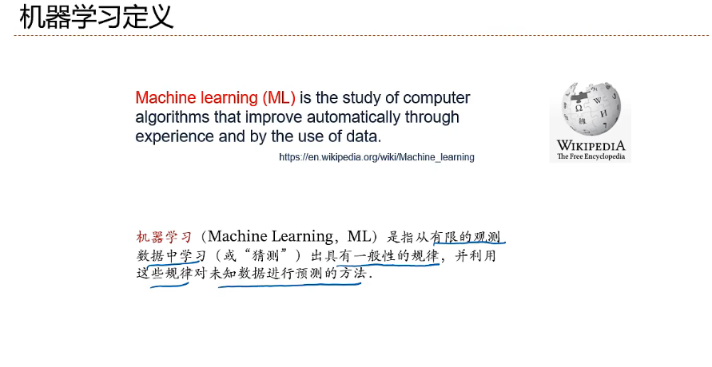

在统计学中，术语**y hat** （写作**ŷ** ）是指线性回归模型中响应变量的估计值。

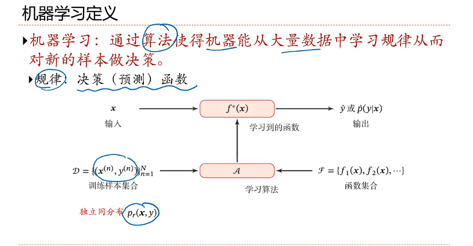

## 机器学习的类型和要素

### 机器学习的类型

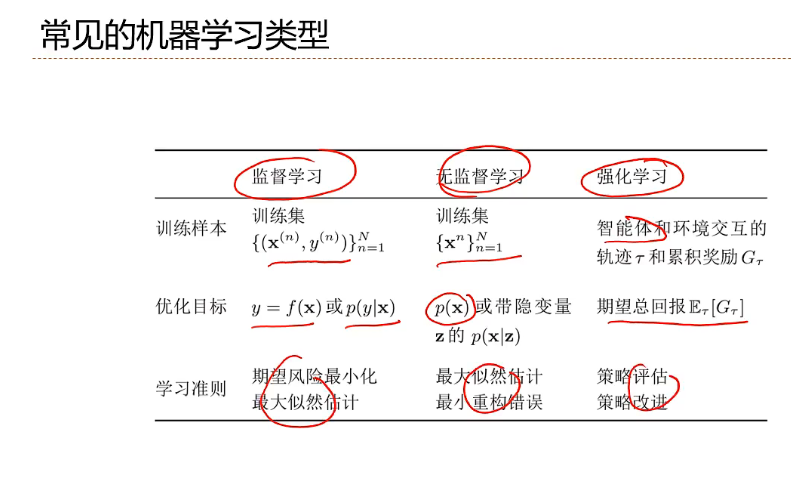

### 机器学习的四个要素
#### 数据

#### 模型


#### 学习准则

**对于单对数据，可以使用损失函数进行量化**

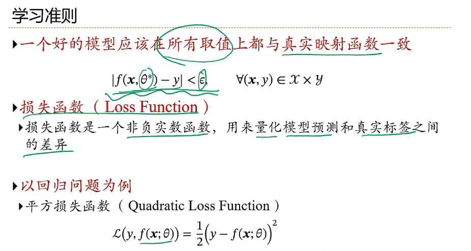

**期望风险最小化，但是无法获取到真正的Pr分布，所以依靠大数定律**

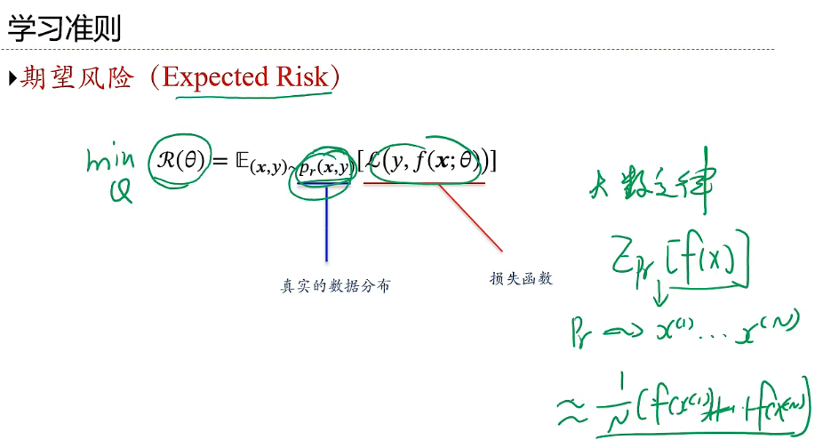

**经验风险最小化**

```
arg    是变元（即自变量argument）的英文缩写。
arg min 就是使后面这个式子达到最小值时的变量的取值
arg max 就是使后面这个式子达到最大值时的变量的取值

例如 函数F(x,y):

arg  min F(x,y)就是指当F(x,y)取得最小值时，变量x,y的取值

arg  max F(x,y)就是指当F(x,y)取得最大值时，变量x,y的取值
```

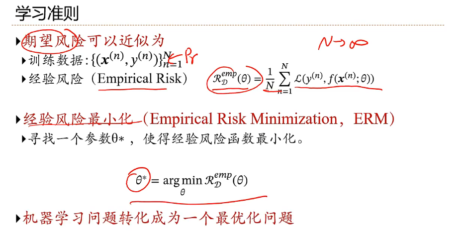

#### 优化方法

**最优化问题**

- **如果是凸函数，那么直接一阶导等于零**
- **对于非凸优化问题，是非常困难的优化问题，选择哪个非凸优化算法是非常重要的研究问题**

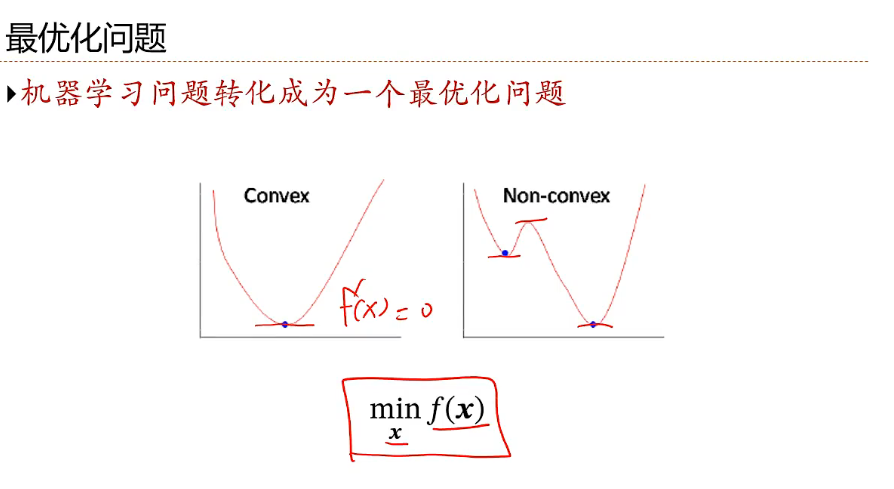

- **梯度下降法--更加具有一般性的优化问题算法**

  超参数：无法学习，需要人为选择

  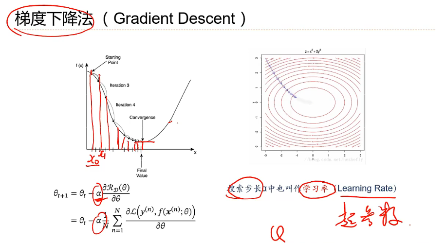


## 泛化和正则化

## 线性回归

## 多项式回归 

## 线性回归的概率视角

## 模型选择和偏差-方差分解

## 常用定理

