# 机器学习

## 概率

### **概率的定义**

**随机现象 随机试验 随机事件 随机变量的定义**

- **随机现象**：事前不可预言的现象，即在相同条件下重复进行试验，每次结果未必相同，或知道事物过去的状况，但未来的发展却不能完全肯定。在一定条件下，出现的可能结果不止一个，事前无法确切知道哪一个结果一定会出现，但大量重复试验中其结果又具有统计规律的现象称为随机现象。

  事前不可预言的现象，即在相同条件下重复进行试验，每次结果未必相同，或知道事物过去的状况，但未来的发展却不能完全肯定。例如：以同样的方式抛置硬币却可能出现正面向上也可能出现反面向上；走到某十字路口时，可能正好是红灯，也可能正好是绿灯。

- 试验：试验是对自然和各种社会现象进行的观察和各种科学实验。

  **随机试验**：随机实验是对随机现象进行的观察和科学实验。随机试验有以下特点：

  （1）可以在相同的条件下重复的进行；

  （2）每次试验的可能结果不止一个，并且能事先明确试验的所有可能结果；

  （3）进行一次试验之前不能确定哪一个结果会出现。

  常见的随机试验，如抛掷一枚硬币，落地时是正面还是反面？从不透明的箱子里拿出一个小球，将是什么颜色的？随机试验随处可见，在此不一一列举。

- **随机事件**：随机事件是在随机试验中，可能出现也可能不出现，而在大量重复试验中具有某种规律性的事件叫做随机事件(简称事件)。随机事件通常用大写英文字母A、B、C等表示。**随机试验中的每一个可能出现的试验结果称为这个试验的一个样本点**，记作ωi。全体样本点组成的集合称为这个试验的样本空间，记作Ω．即Ω={ω~1~，ω~2~，…，ω~n~，…}。仅含一个样本点的随机事件称为基本事件，含有多个样本点的随机事件称为复合事件。

  **必然事件**记作Ω，样本空间Ω也是其自身的一个子集，Ω也是一个“随机”事件，每次试验中必定有Ω中的一个样本点出现，必然发生。

  **不可能事件**记作Φ，空集Φ也是样本空间的一个子集，Φ也是一个特殊的“随机”事件，不包含任何样本点，不可能发生。

  在**随机试验**中，随机事件一般是由若干个基本事件组成的。样本空间Ω的任一子集A称为随机事件。属于事件A的样本点出现，则称事件A发生。

- **随机变量**：**我们需要从数量的角度来研究随机现象，从而需要在随机试验的可能结果与数之间建立一个对应关系。许多随机试验的一个可能结果是使用一个数来表示的，这样可在试验结果和数之间建立一个自然的恒等映射。**

  

### 关于概率一些的概念


### **离散型随机变量，利用p(x)表示概率分布**


### **连续随机变量，利用密度函数来描述概率分布**


### **累积分布函数F(x)**


### **随机向量的联合概率分布**


### **条件概率**

 通常指的是 “ t 被定义为m ” 或 “ 根据定义，t 等于m ”(通常在某种条件下)


### 采样（Sampling）

**N个样本，经过统计，服从p(x)分布**


**采样方式：**如何产生服从样本的分布


**更复杂的分布的采样（连续分布）**


### 大数定律


## 机器学习的定义

**机器学习≈自动构建一个映射函数**


**为什么要机器学习:因为现实世界的问题都比较复杂，很难通过规则来手工实现**

**如何构造映射函数**

构造函数空间（函数族$ \mathscr{F} $），不是简单的拟合问题，对于未知的数据（整个数据分布上），误差要达到尽量小

假设空间：监督学习（supervised learning）的任务是学习一个模型，使模型能够对任意给定的输入，对其相应的输出做出一个好的预测。模型属于由输入空间到输出空间的映射的集合，这个集合就是假设空间(hypothesis space)。也叫函数族$ \mathscr{F} $。

### 假设空间

假设空间是指所有可能用于拟合数据的函数集合。它是**学习算法在训练过程中从数据中选择的模型函数集合的一个数学定义**。

在机器学习中，算法用来从数据中学习并做出预测的数学方程式或函数通常被称为**模型**。 

>**学习算法**
>
>**学习算法**（Learning Algorithm）是指一种用于从数据中学习规律、模式或结构的算法。它通过训练过程优化模型参数，使得模型能够在新数据上进行预测或决策。学习算法通常基于一些数学和统计方法，通过分析训练数据来提取信息。
>
>学习算法的目的是让机器系统根据历史数据（训练集）学习到某些知识，并能够根据这些知识对未来数据进行预测或推断。
>
>**常见的学习算法类型：**
>
>1. **监督学习（Supervised Learning）**
>     在监督学习中，算法通过一组已知输入和输出的训练数据来学习。目标是学习一个映射函数，能够将新的输入映射到正确的输出。
>   - 例如：线性回归、支持向量机（SVM）、神经网络。
>2. **无监督学习（Unsupervised Learning）**
>     在无监督学习中，算法从只有输入数据但没有标签（输出）的数据中学习。目标通常是找出数据中的隐藏结构或模式。
>   - 例如：聚类（如K-means）、主成分分析（PCA）。
>3. **强化学习（Reinforcement Learning）**
>     强化学习是学习算法中的一个特殊领域，智能体通过与环境的互动获得反馈（奖励或惩罚），并根据这些反馈调整其行为。
>   - 例如：Q-learning、深度强化学习（Deep Reinforcement Learning）。
>4. **半监督学习（Semi-supervised Learning）**
>     半监督学习是介于监督学习和无监督学习之间的一种方法，它使用少量标注数据和大量未标注数据进行学习。
>5. **迁移学习（Transfer Learning）**
>     迁移学习是通过将一个领域（源领域）学到的知识迁移到另一个领域（目标领域）来加速学习过程，特别是当目标领域的数据不足时。
>
>**应用实例：**
>
>- **分类任务**：比如通过已标记的邮件数据训练一个垃圾邮件分类器。
>- **回归任务**：通过房价和房屋特征数据训练一个预测房价的模型。
>- **聚类任务**：根据顾客的购买行为将顾客分成不同的群体。
>- **游戏和机器人控制**：通过与环境交互，智能体学习如何玩游戏或控制机器人。

**定义：**

给定一个输入空间 $ \mathcal{X} $ 和输出空间 $ \mathcal{Y} $，假设空间 $ \mathcal{H} $ 是满足
$ \mathcal{H} = \{ h : \mathcal{X} \to \mathcal{Y} \} $
的函数集合。

**关键性质：**

- 有限性或无限性：假设空间可以是有限的（如线性模型）或无限的（如所有连续函数）。
- 参数化：假设空间通常由参数化形式定义，例如线性模型的假设空间可以表示为：
  $
  \mathcal{H} = \{ h(\mathbf{x}) = \mathbf{w}^\top \mathbf{x} + b : \mathbf{w} \in \mathbb{R}^d, b \in \mathbb{R} \}.
  $
- 偏差-方差权衡：假设空间越大，越能拟合复杂的数据分布，但可能导致过拟合；假设空间过小则可能导致欠拟合。

**举例：**

1. 线性模型：
   $
   \mathcal{H} = \{ h(\mathbf{x}) = \mathbf{w}^\top \mathbf{x} + b : \mathbf{w} \in \mathbb{R}^d, b \in \mathbb{R} \}.
   $
2. 高阶多项式模型：
   $
   \mathcal{H} = \{ h(x) = \sum_{i=0}^n w_i x^i : w_i \in \mathbb{R}, n \in \mathbb{N} \}.
   $

### 核函数

使用核函数的学习方法（如支持向量机）通过核技巧避免了显式计算高维特征空间，提升了计算效率。

核函数是一种特殊的数学函数，用于计算两个输入数据点在高维特征空间中的相似度，而无需显式计算映射到高维空间的特征。

**定义：**

给定输入空间 $ \mathcal{X} $，核函数 $ K : \mathcal{X} \times \mathcal{X} \to \mathbb{R} $ 满足：
$
K(\mathbf{x}, \mathbf{x}') = \phi(\mathbf{x})^\top \phi(\mathbf{x}'),
$
其中 $ \phi : \mathcal{X} \to \mathcal{F} $ 是从输入空间到高维特征空间 $ \mathcal{F} $ 的映射。

**关键性质：**

1. 对称性：核函数通常满足对称性，即 $ K(\mathbf{x}, \mathbf{x}') = K(\mathbf{x}', \mathbf{x}) $。
2. 正定性：核函数对应的核矩阵（Gram 矩阵） $ \mathbf{K} $ 是正定的，即对于任意非零向量 $ \mathbf{a} $，有：
   $
   \mathbf{a}^\top \mathbf{K} \mathbf{a} > 0.
   $

**常见核函数：**

1. 线性核：
   $
   K(\mathbf{x}, \mathbf{x}') = \mathbf{x}^\top \mathbf{x}'.
   $
   对应到特征空间时没有显式映射，即 $ \phi(\mathbf{x}) = \mathbf{x} $。

2. 多项式核：
   $
   K(\mathbf{x}, \mathbf{x}') = (\mathbf{x}^\top \mathbf{x}' + c)^d.
   $
   对应到高维特征空间为多项式组合。

3. 高斯核（RBF核）：
   $
   K(\mathbf{x}, \mathbf{x}') = \exp\left(-\frac{\|\mathbf{x} - \mathbf{x}'\|^2}{2\sigma^2}\right).
   $
   高斯核隐式地映射到无穷维的特征空间。

4. Sigmoid核：
   $
   K(\mathbf{x}, \mathbf{x}') = \tanh(\alpha \mathbf{x}^\top \mathbf{x}' + c).
   $

**representation->label**
**x和y之间有一个真实的映射函数g(x)，但是我们不知道**

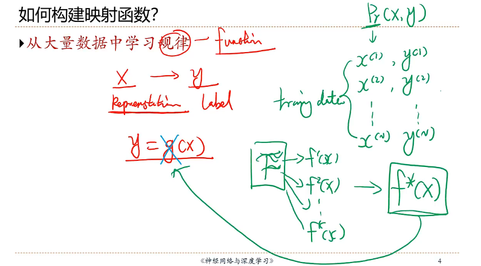

**机器学习的定义**


在统计学中，术语**y hat** （写作**ŷ** ）是指线性回归模型中响应变量的估计值。


## 机器学习的类型和要素

### 机器学习的类型


### 机器学习的四个要素
#### 数据

#### 模型


#### 学习准则

**对于单对数据，可以使用损失函数进行量化**


**期望风险最小化，但是无法获取到真正的Pr分布，所以依靠大数定律**


**经验风险最小化**

```
arg    是变元（即自变量argument）的英文缩写。
arg min 就是使后面这个式子达到最小值时的变量的取值
arg max 就是使后面这个式子达到最大值时的变量的取值

例如 函数F(x,y):

arg  min F(x,y)就是指当F(x,y)取得最小值时，变量x,y的取值

arg  max F(x,y)就是指当F(x,y)取得最大值时，变量x,y的取值
```


#### 优化方法

**最优化问题**

- **如果是凸函数，那么直接一阶导等于零**
- **对于非凸优化问题，是非常困难的优化问题，选择哪个非凸优化算法是非常重要的研究问题**


- **梯度下降法--更加具有一般性的优化问题算法**

  超参数：无法学习，需要人为选择

  
  
- **随机梯度下降法**

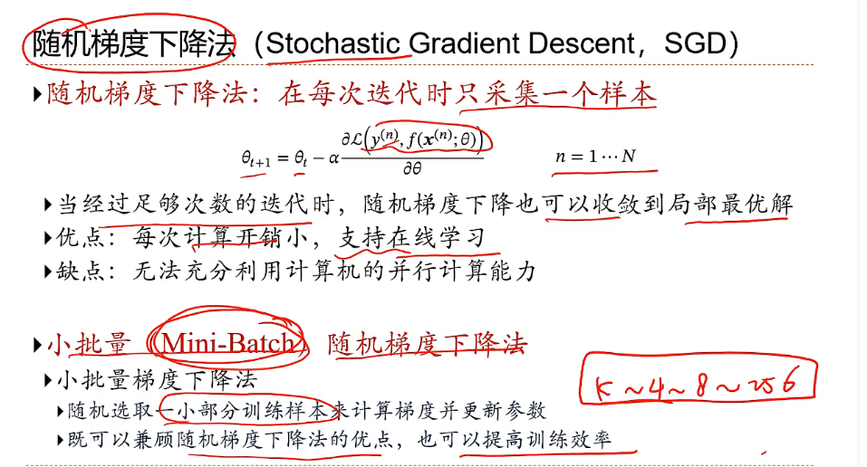

**但是在实际情况中，有些数据集随机就是无法选择到，那么此刻的随机则是将所有训练集的样本进行随机排列，依次训练**

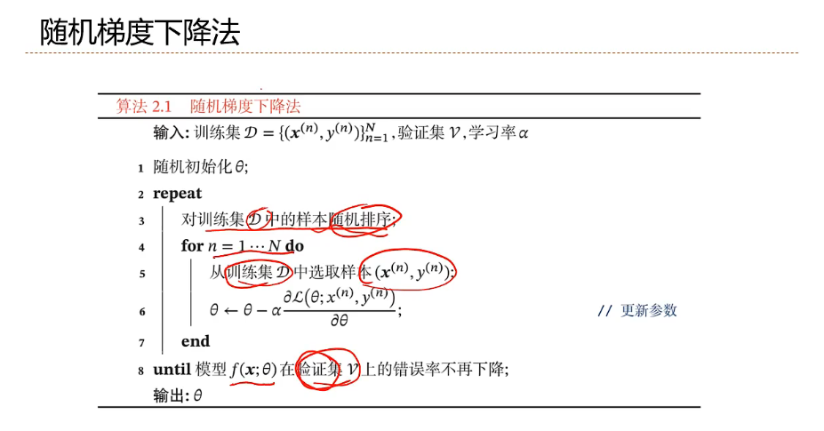

## 泛化和正则化

优化（optimization）是指调节模型以在**训练数据**上得到最佳性能（即机器学习中的学习），而泛化（generalization）是指训练好的模型在**前所未见的数据**上的性能好坏。

机器学习的目的当然是得到良好的泛化，但你无法控制泛化，只能基于训练数据调节模型。

**为什么不用训练集上的错误率为零或者损失为零作为判断条件来停止迭代**


### 泛化误差

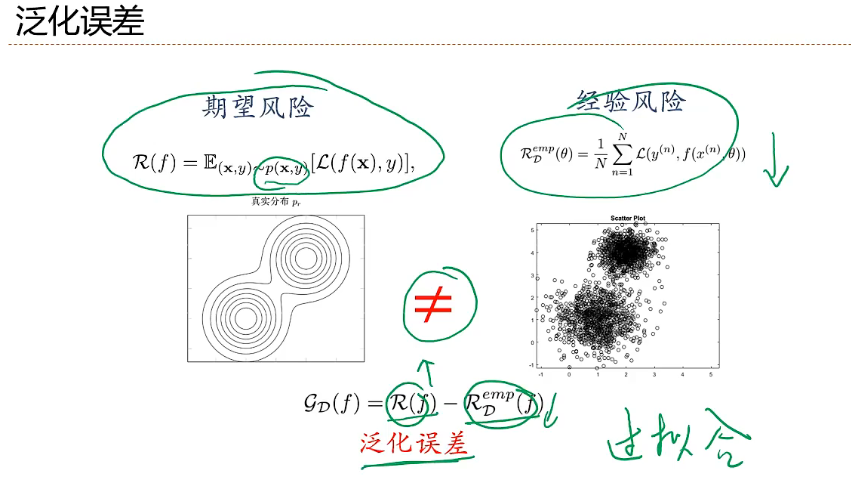

### **减小泛化误差**


#### **正则化**

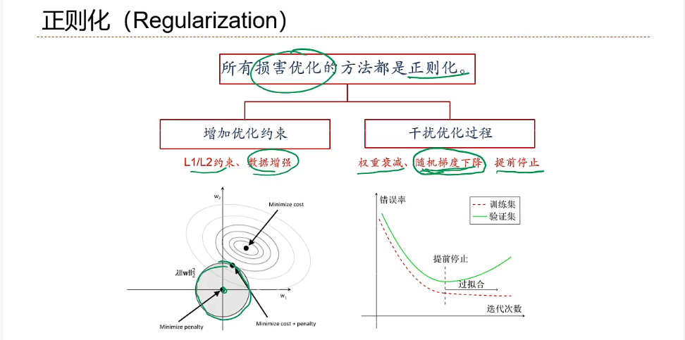

##### **提前停止**

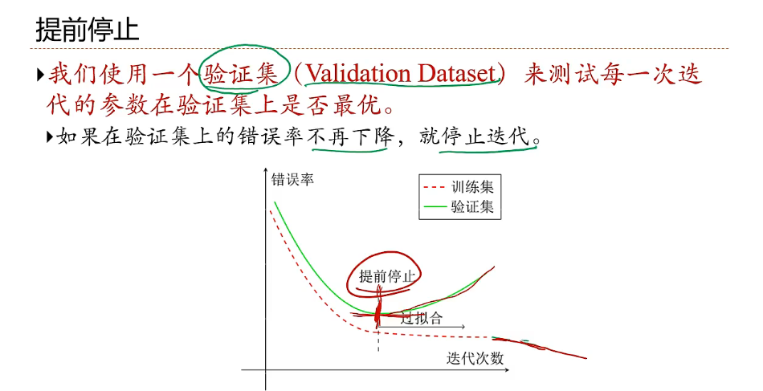

## 线性回归

### 回归问题

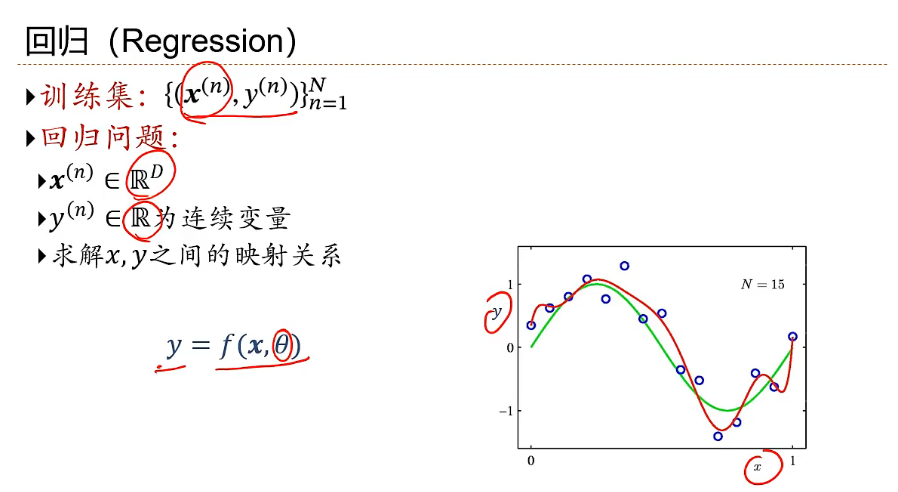

### 模型

**线性回归**

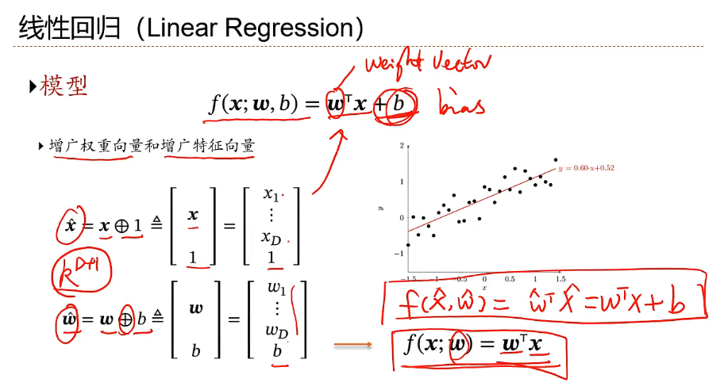

### 学习准则

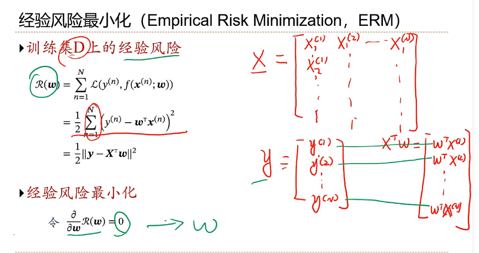

### 矩阵微积分

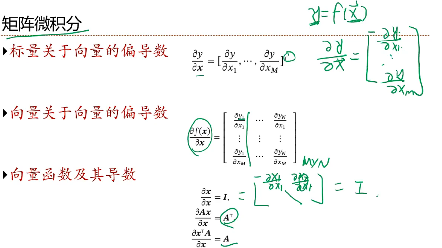

### 经验风险最小化

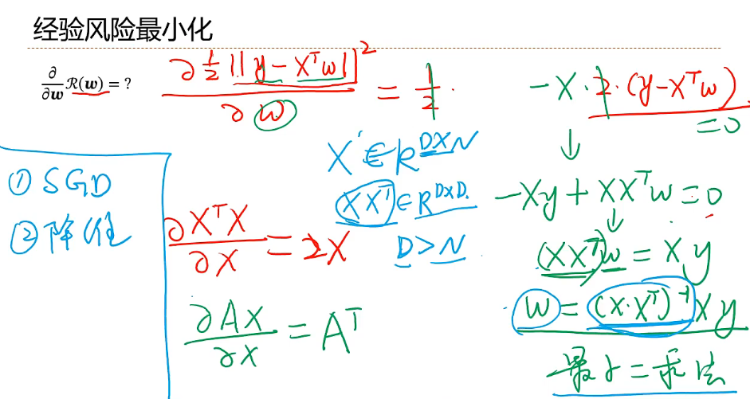

### 结构风险最小化

**特征之间存在共线性，需要使用其他方法，如上面的SGD，降维，或者下面的方法**

**特征之间是冗余的，对于矩阵来讲R^D*N^，对于N个样本的表示来讲，不需要超过其样本维数的表示**

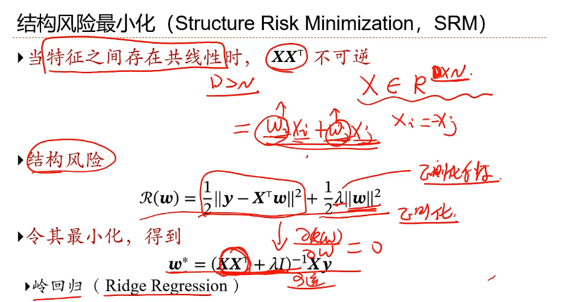

## 多项式回归 


## 线性回归的概率视角


## 模型选择和偏差-方差分解

**选择合适的模型**

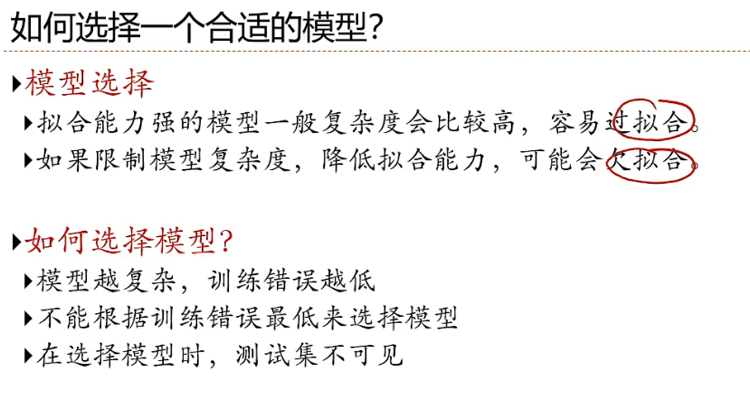

**引入验证集**

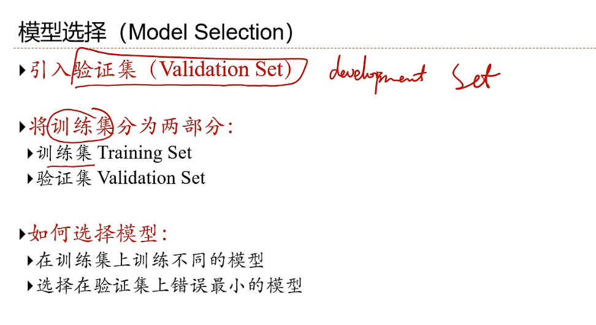

**交叉验证**

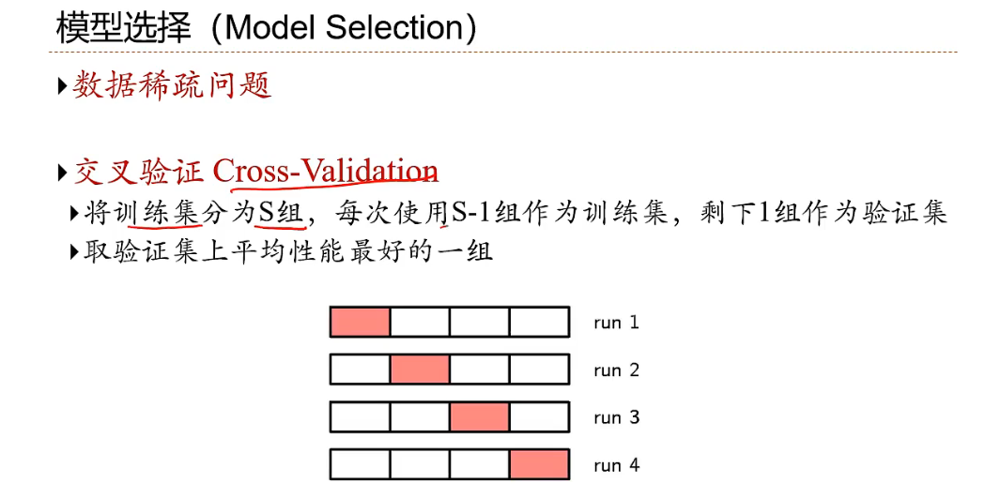

**模型选择就是在期望风险和模型复杂度之间做平衡**

**偏差方差分解**

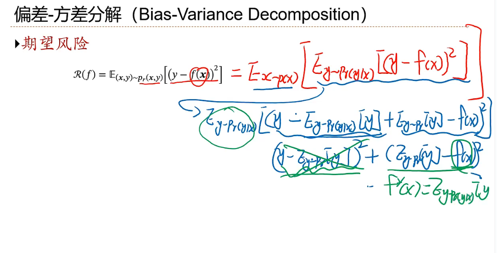

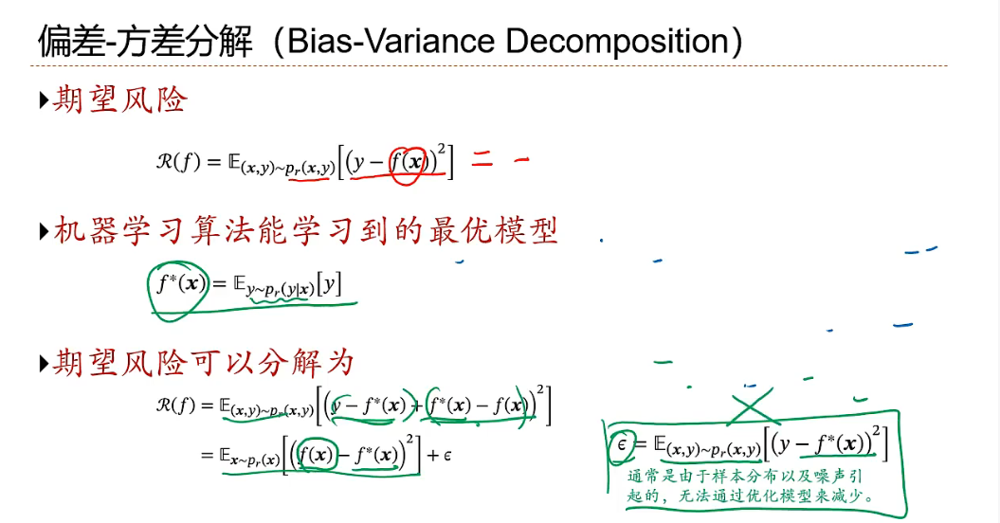

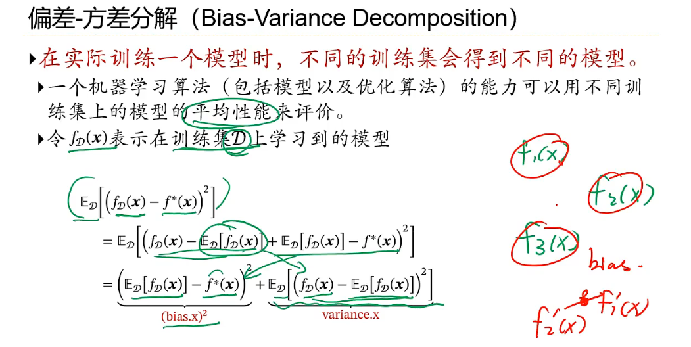

## 常用定理

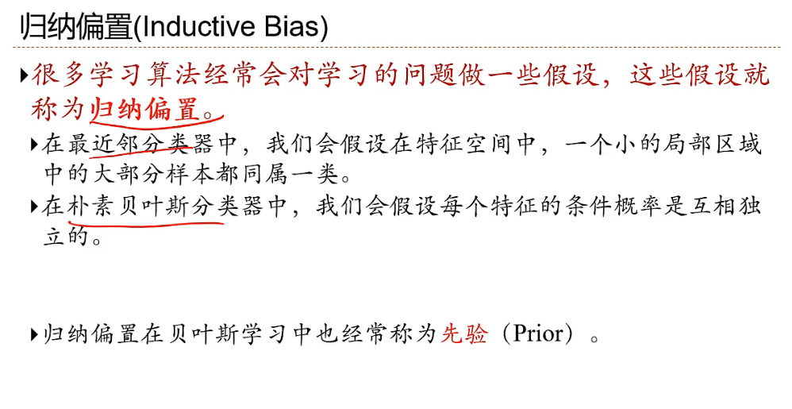

## 范数

L1范数和L2范数是两种常见的向量范数，它们在数学、统计学和机器学习中都有广泛的应用。

### **L1范数**
L1范数，也叫作曼哈顿距离或Taxicab距离，表示向量中各个元素绝对值之和。对于一个n维向量 $\mathbf{x} = [x_1, x_2, \dots, x_n]$，L1范数定义为：

$$
\|\mathbf{x}\|_1 = |x_1| + |x_2| + \dots + |x_n|
$$

**特性**

- L1范数在机器学习中的常见应用是Lasso回归（Least Absolute Shrinkage and Selection Operator，最小绝对收缩和选择算子回归），它用于引入稀疏性（许多系数为零），从而进行特征选择。
- 对异常值不太敏感。

### **L2范数**
L2范数，也叫作欧几里得范数或欧几里得距离，表示向量中各个元素平方和的平方根。对于一个n维向量 $\mathbf{x} = [x_1, x_2, \dots, x_n]$，L2范数定义为：

$$
\|\mathbf{x}\|_2 = \sqrt{x_1^2 + x_2^2 + \dots + x_n^2}
$$

**特性**

- L2范数在机器学习中的常见应用是Ridge回归（也叫岭回归），它用于引入正则化以避免过拟合。
- 对异常值较为敏感。

### **总结**
- **L1范数**用于增强模型的稀疏性，有助于特征选择。
- **L2范数**用于减少模型的复杂度，有助于防止过拟合。

- 当没有明确指定范数的角标时，默认情况下，通常指的是 **L2范数**。也就是说，如果你看到范数符号 $\|\mathbf{x}\|$ 而没有角标，这通常意味着你应该使用 L2 范数来计算。

## L1/L2约束

L1约束和L2约束是指在优化问题中通过引入正则化项来约束模型参数的范数，从而控制模型的复杂度，防止过拟合。

###  **L1约束**
L1约束是通过对模型的参数施加L1范数的限制来实现的。这种约束的特点是它倾向于产生稀疏的模型，即大多数参数被压缩为零。

**数学表达式**
在回归模型中，例如线性回归，L1约束的目标是最小化以下目标函数：

$
\text{目标函数} = \text{损失函数} + \lambda \|\mathbf{w}\|_1
$

其中，$\mathbf{w}$ 是模型的参数向量，$\lambda$ 是正则化强度的超参数，$\|\mathbf{w}\|_1$ 表示参数的L1范数。

**特性**
- **稀疏性**: L1约束会导致许多参数变为零，从而实现特征选择。
- **应用**: 在机器学习中，Lasso回归（Least Absolute Shrinkage and Selection Operator，最小绝对收缩和选择算子回归）就是基于L1约束的回归方法。

### **L2约束**
L2约束是通过对模型的参数施加L2范数的限制来实现的。这种约束会导致模型的参数被均匀地缩小，但通常不会使参数完全归零。

**数学表达式**
在回归模型中，例如线性回归，L2约束的目标是最小化以下目标函数：

$
\text{目标函数} = \text{损失函数} + \lambda \|\mathbf{w}\|_2^2
$

其中，$\mathbf{w}$ 是模型的参数向量，$\lambda$ 是正则化强度的超参数，$\|\mathbf{w}\|_2^2$ 表示参数的L2范数的平方。

**特性**

- **平滑性**: L2约束会让参数值趋向于较小但不为零，从而减少模型的复杂度。
- **应用**: 在机器学习中，Ridge回归（也叫岭回归）就是基于L2约束的回归方法。

### **总结**
- **L1约束**倾向于产生稀疏的模型，适用于特征选择。
- **L2约束**则更适合控制模型复杂度，避免过拟合，同时保持模型的所有特征。
