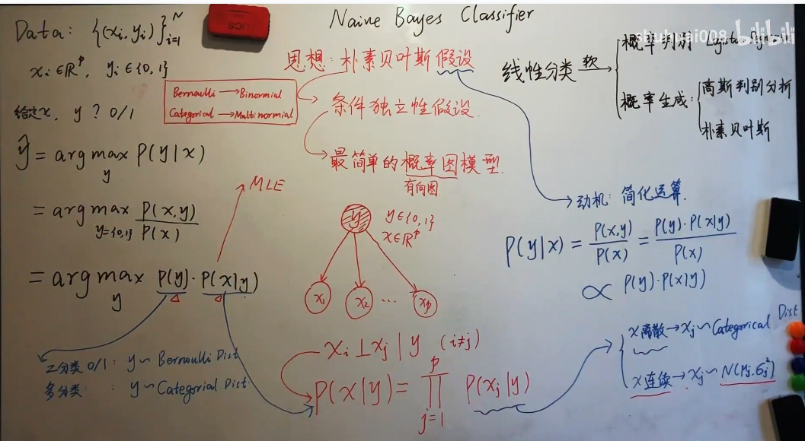

# 线性模型

## 分类问题示例

## 线性分类模型

## 交叉熵与对数似然

### 信息论

### 熵（Entropy）

### 熵编码

### 交叉熵

### KL散度

### 应用到机器学习

==**下面开始具体的分类器**==

## Logistic回归

## Softmax回归

> 主要学习方式，参数化的条件概率和真实的条件概率的交叉熵

**softmax函数**

**softmax回归**

> 学习准则：交叉熵
>
> 优化方法：梯度下降

## 感知器（Perceptron）

## 支持向量机（SVM）

**几何距离**

**支持向量机**

## 朴素贝叶斯分类器

**贝叶斯分类** 是基于贝叶斯定理的一种分类方法，通过计算后验概率来做分类。

**朴素贝叶斯分类器** 是贝叶斯分类的一种简化版本，它假设特征之间条件独立，从而简化了计算。

**贝叶斯估计** 是贝叶斯推断的一种应用，侧重于对未知参数的估计，而不是分类。

### 贝叶斯估计

是的，贝叶斯估计通常指的是最大后验估计（MAP, Maximum A Posteriori Estimation）。在贝叶斯框架下，估计参数时，我们结合了先验分布和观察数据得到后验分布。最大后验估计通过最大化后验分布来得到参数的估计值。

具体来说，对于一个给定的观察数据$D$，参数$\theta$的最大后验估计是通过最大化后验分布$P(\theta | D)$得到的。根据贝叶斯公式，后验分布可以表示为：

$
P(\theta | D) = \frac{P(D | \theta)P(\theta)}{P(D)}
$

其中：
- $P(D | \theta)$是似然函数，表示给定参数$\theta$时观测数据$D$的概率。
- $P(\theta)$是先验分布，表示参数$\theta$在没有数据时的分布。
- $P(D)$是数据的边际概率，通常通过优化估计的常数被忽略。

最大后验估计等价于最大化似然函数和先验分布的乘积：

$
\hat{\theta}_{MAP} = \arg \max_{\theta} P(D | \theta)P(\theta)
$

所以，贝叶斯估计就是通过这种方式找到最有可能的参数$\theta$。

如果先验分布$P(\theta)$是均匀分布或者没有先验信息，那么最大后验估计简化为最大似然估计（MLE）。

**==进一步澄清这个区别：==**

**贝叶斯分类 (Bayesian Classification)**

贝叶斯分类的目标是计算后验概率 $P(C | X)$，用来进行分类决策。这里的类别 $C$ 是我们要预测的标签，特征 $X$ 是给定的输入数据。贝叶斯分类并不涉及对模型参数（如 $\theta$）的估计，而是通过贝叶斯定理直接计算后验概率，并基于此来做分类决策。

在贝叶斯分类中，我们有：

$$
P(C | X) = \frac{P(X | C) P(C)}{P(X)}
$$

但是这个过程中，并没有涉及到对某个模型的“参数”进行估计，而是通过样本数据来计算似然 $P(X | C)$ 和先验 $P(C)$ 等。

---

**贝叶斯估计 (Bayesian Estimation)**

也叫贝叶斯推断。

贝叶斯估计涉及到通过观察数据来估计未知的模型参数 $\theta$，并且它需要使用后验分布来进行推断。在贝叶斯估计中，参数 $\theta$ 是模型的一部分，我们通过最大化后验分布来估计这些参数。

贝叶斯公式为：

$$
P(\theta | D) = \frac{P(D | \theta) P(\theta)}{P(D)}
$$

其中：

- $P(D | \theta)$ 是似然函数，表示在给定参数 $\theta$ 下观察到数据 $D$ 的概率。
- $P(\theta)$ 是参数 $\theta$ 的先验分布。
- $P(D)$ 是数据的边际似然（通常作为常数）。

贝叶斯估计的目标通常是通过最大化后验分布 $P(\theta | D)$ 或者计算后验分布的期望来估计参数 $\theta$。

---

### 总结

- **贝叶斯分类** 不涉及直接估计模型的参数 $\theta$，它通过计算后验概率来进行分类，主要关注的是类别 $C$。
- **贝叶斯估计** 则专注于通过数据来估计模型的参数 $\theta$，这种方法在统计建模中尤其常见。

所以，贝叶斯分类可以看作是没有涉及参数 $\theta$ 的分类方法，而贝叶斯估计则明确涉及到对参数 $\theta$ 的推断。

## 高斯判别分析

