# 线性模型

## 分类问题示例

## 线性分类模型

## 交叉熵与对数似然

### 信息论

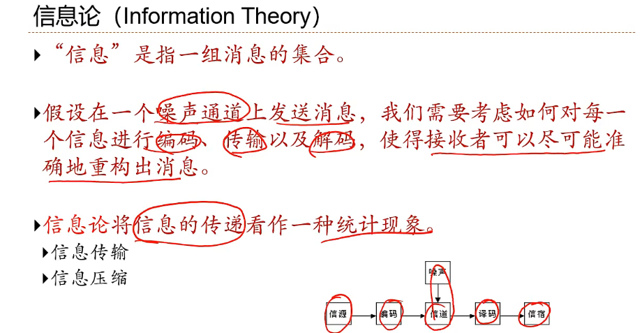

### 熵（Entropy）

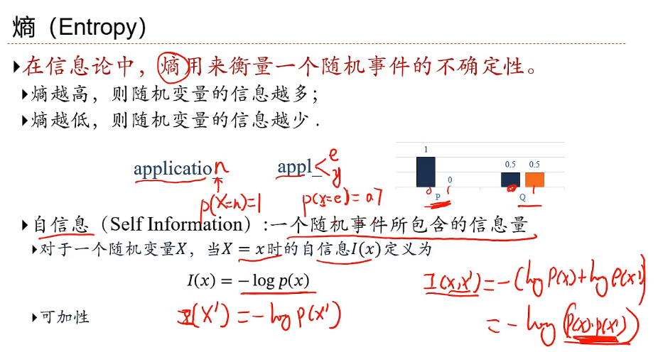

### 熵编码

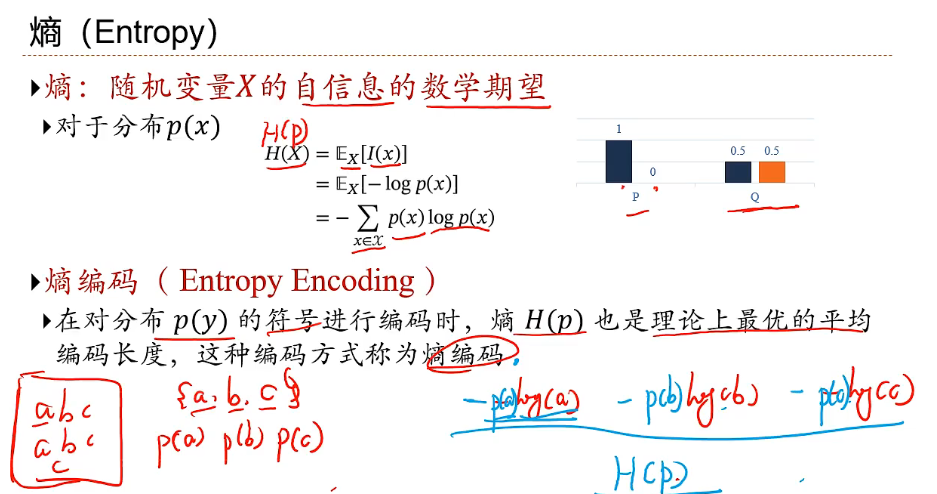

### 交叉熵

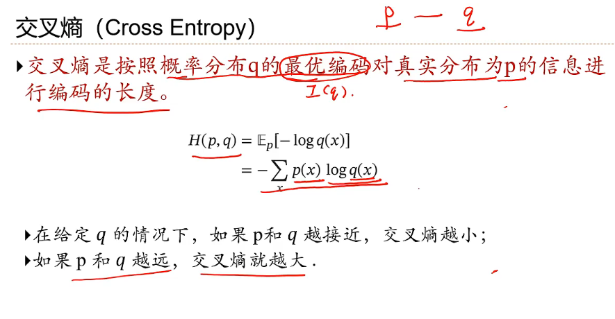

### KL散度

### 应用到机器学习

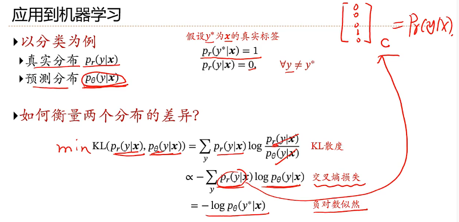

==**下面开始具体的分类器**==

## Logistic回归

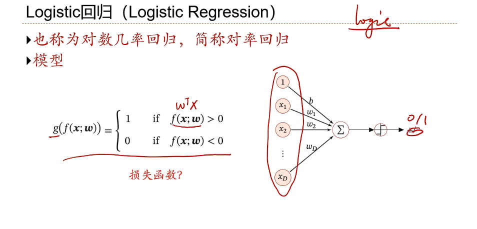

## Softmax回归

> 主要学习方式，参数化的条件概率和真实的条件概率的交叉熵

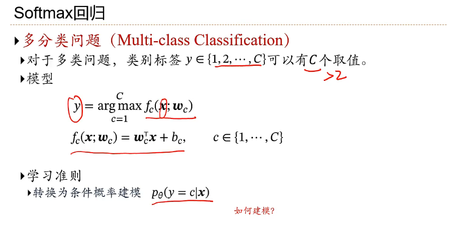

**softmax函数**

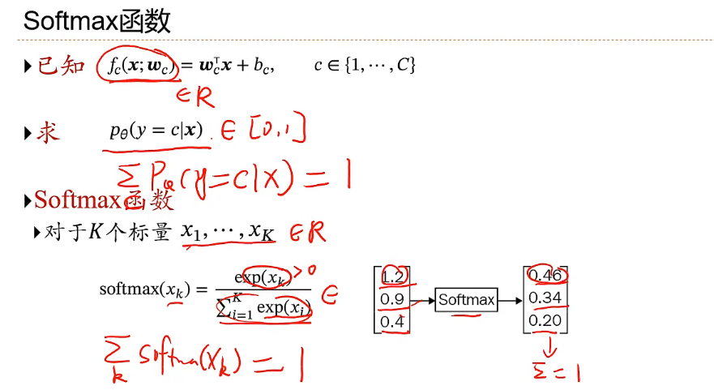

**softmax回归**

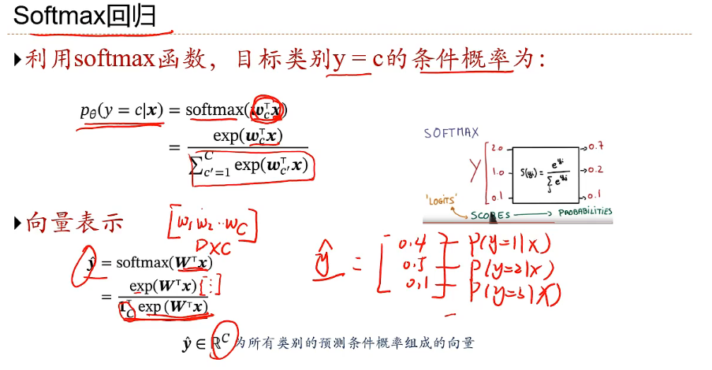

> 学习准则：交叉熵
>
> 优化方法：梯度下降

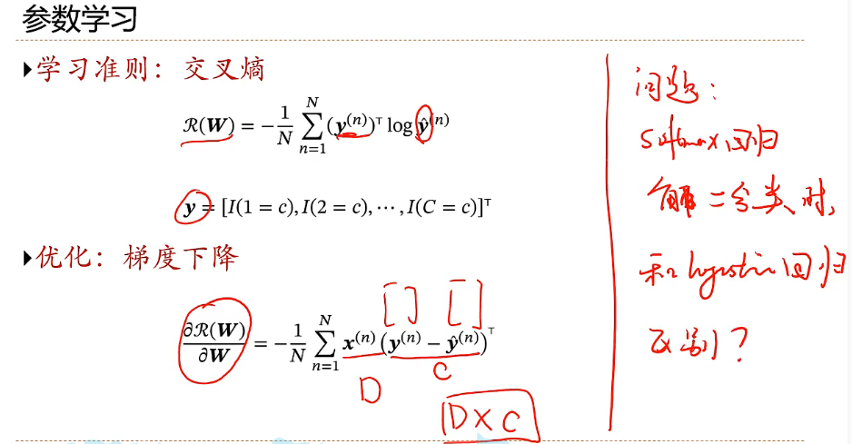

## 感知器（Perceptron）

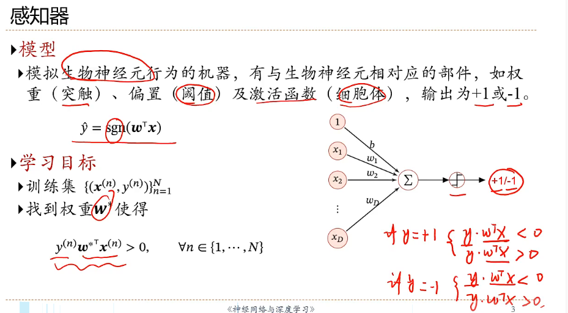

## 支持向量机（SVM）

**几何距离**

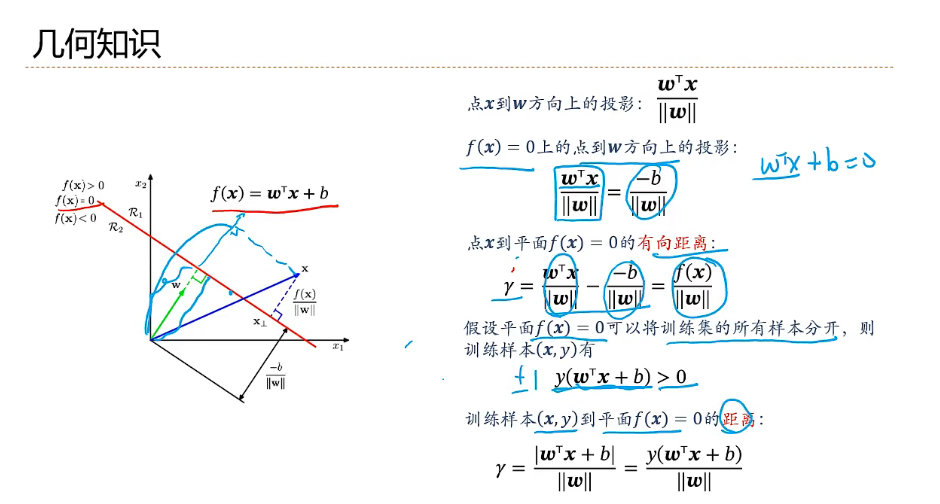

**支持向量机**

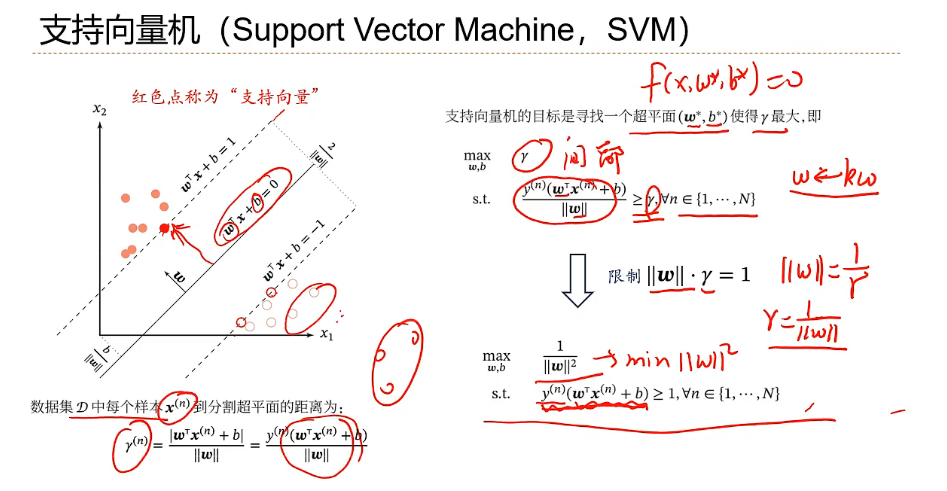

## 小结
