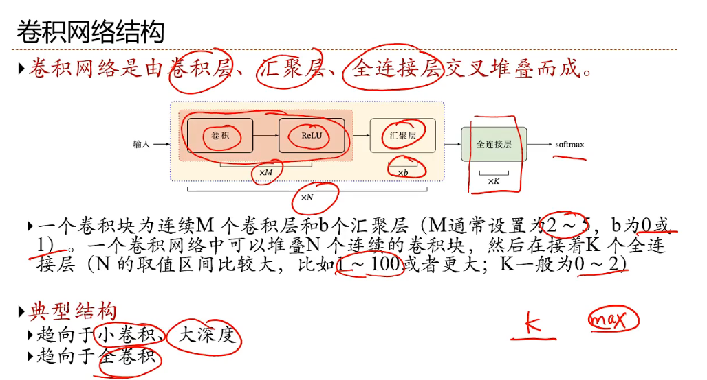

## 卷积的窗口大小

卷积窗口大小是指在卷积操作中使用的滤波器（或卷积核）的尺寸。它决定了在输入数据（如图像）上滑动时，每次处理的区域大小。较大的窗口可以捕捉到更大的特征，但可能会丢失细节，而较小的窗口则能更精确地捕捉细节，但可能忽略全局特征。

## 滑动

在卷积操作中，"滑动"是指将卷积窗口（或滤波器）在输入数据上移动，以便对每个位置进行计算。这里是一个简单的例子来说明这一过程：

### 示例

假设我们有一个简单的 5x5 输入矩阵（例如图像）：

$
\begin{bmatrix}
1 & 2 & 3 & 0 & 1 \\
0 & 1 & 2 & 3 & 0 \\
2 & 0 & 1 & 2 & 3 \\
1 & 2 & 0 & 1 & 0 \\
0 & 1 & 2 & 3 & 1 \\
\end{bmatrix}
$

**卷积窗口**

假设我们的卷积窗口大小为 3x3，定义为：

$
\begin{bmatrix}
1 & 0 & -1 \\
1 & 0 & -1 \\
1 & 0 & -1 \\
\end{bmatrix}
$

**滑动过程**

1. **开始位置**：首先将卷积窗口放在输入矩阵的左上角（位置 [0,0]），计算窗口覆盖的区域的加权和。
2. **计算**：将卷积窗口与输入矩阵对应位置的元素逐一相乘并相加，得到一个单一的输出值。
3. **滑动**：然后将卷积窗口向右移动一个单位，重复上述计算。
4. **继续滑动**：继续向下滑动，当窗口达到矩阵边缘时，向下移动到下一行并从左侧开始。

### 属性

在滑动过程中，有几个重要属性：

- **步幅（Stride）**：滑动窗口的移动步长。例如，步幅为 1 时，每次移动一个单位；步幅为 2 时，每次移动两个单位。
- **填充（Padding）**：在输入矩阵周围添加额外的像素（通常是零），以控制输出矩阵的尺寸。填充可以防止信息在边缘丢失。
- **输出尺寸**：输出矩阵的尺寸由输入尺寸、卷积窗口尺寸、步幅和填充方式共同决定。可以通过公式计算：

$
\text{Output Size} = \frac{\text{Input Size} - \text{Filter Size} + 2 \times \text{Padding}}{\text{Stride}} + 1
$

这个过程在卷积神经网络中非常重要，用于提取特征和降低输入数据的维度。

## 全卷积

### 什么是全卷积（Fully Convolutional Network, FCN）

传统 CNN：

- 通常卷积层 → 池化层 → 全连接层 → 输出
- **全连接层（Fully Connected）固定输入尺寸**
  - 如果输入尺寸不对，FC 层无法使用

全卷积网络（FCN）：

- **去掉全连接层，全用卷积层**
- 输出可以是 **任意输入尺寸**
- 常用于 **语义分割、图像密集预测**
  - 输出保持空间维度，与输入大小相关

**举例**

```
import torch
import torch.nn as nn

x = torch.randn(1, 3, 32, 32)  # [batch, channels, height, width]

conv1 = nn.Conv2d(3, 16, 3, padding=1)  # 卷积层
conv2 = nn.Conv2d(16, 32, 3, padding=1)
relu = nn.ReLU()

# forward
out = relu(conv1(x))
out = relu(conv2(out))

print(out.shape)  # [1, 32, 32, 32] 空间尺寸不变
```

**特点：**

- 没有 FC 层，**输入大小灵活**
- 空间信息保留 → 可以生成像素级输出

---

### 普通 CNN 输出 vs 全卷积输出

#### 普通 CNN（含全连接层）

```
输入图像：32x32
卷积层 → 池化 → 卷积层 → 池化
全连接层 → 输出：1x10（10类）
```

- 最终输出是一个 **单一向量**（分类概率）
- 空间信息（像素位置）被压缩掉
- 你不知道每个像素属于哪类，只知道整张图的类别

------

#### 全卷积网络（FCN）

```
输入图像：32x32
卷积层 → 卷积层 → 卷积层
输出：32x32xC
```

- 输出是 **一个“特征图”**
- 每个像素位置对应一个输出向量（C 个通道）
- 例如语义分割：每个像素预测属于哪类

------

### 举例

假设输入图像 4x4，网络最后卷积输出 4x4x3（3 类）：

```
输入图像 4x4:
[[像素1, 像素2, ..., 像素4],
 ...]

卷积输出 4x4x3:
[[[0.1,0.7,0.2], [0.3,0.2,0.5], ...],
 ...]

每个像素都有一个 3 类的预测 → 可以对每个像素做 argmax 得类别
```

- 这样就完成 **像素级预测**
- 适合分割、图像修复、深度图预测等任务

------

### 核心理解

- **像素级输出** ≠ 整张图一个标签
- 是 **每个像素对应一个输出向量**
- 全卷积网络的卷积操作保持了空间结构（没有压扁成向量）

---

## 卷积之后为什么加 ReLU

卷积本身是线性运算：

$y = w * x + b$

- **线性运算 + 线性运算 = 线性运算**
- 如果一直堆卷积，没有非线性函数，网络相当于一个线性变换
- **ReLU 引入非线性** → 网络可以拟合复杂函数

### 使用方式

```
import torch.nn.functional as F

out = F.conv2d(x, weight, bias, stride=1, padding=1)
out = F.relu(out)
```

- **每个卷积层之后都可以加 ReLU**
- 也可以加 BatchNorm 或 Dropout

## 下采样和上采样，卷积和反卷积

### 下采样（Downsampling）

- **目的**：压缩空间尺寸（宽、高）
- **常用方式**：
  1. **池化（Pooling）**
     - MaxPool2d、AvgPool2d
     - 举例：输入 32×32 → 16×16
  2. **卷积 stride>1**
     - 卷积步长大于 1，相当于对输入“跳着取样”
- **效果**：
  - 特征图尺寸变小
  - 感受野变大
  - 减少计算量
- **用途**：
  - CNN 分类网络
  - 编码器（Encoder）部分

------

### 上采样（Upsampling）

- **目的**：恢复空间尺寸
- **常用方式**：
  1. **插值法**
     - `nn.Upsample` / `F.interpolate`
     - 最近邻、双线性插值
  2. **转置卷积（反卷积）**
     - `nn.ConvTranspose2d`
     - 学习可训练的上采样
- **效果**：
  - 尺寸变大
  - 保留或恢复特征
- **用途**：
  - 生成模型（GAN）
  - 语义分割 / FCN 解码器（Decoder）部分

------

### 卷积 vs 反卷积（转置卷积）

|          | 卷积 Conv2d                  | 反卷积 ConvTranspose2d    |
| -------- | ---------------------------- | ------------------------- |
| 输入     | `[B,C,H,W]`                  | `[B,C,H,W]`               |
| 输出尺寸 | 通常 ≤ 输入                  | 通常 ≥ 输入（放大）       |
| 数学作用 | 特征提取、下采样（stride>1） | 特征恢复、上采样          |
| 参数     | 核权重可训练                 | 核权重可训练              |
| 举例     | 32×32 → 16×16（stride=2）    | 16×16 → 32×32（stride=2） |

**注意**：反卷积不是严格意义上的“卷积逆运算”，而是一种**可学习的上采样方法**。

------

### 图像理解

假设输入 4×4：

**卷积 stride=2 下采样**

```
输入 4x4 -> 卷积 -> 输出 2x2
```

**反卷积 stride=2 上采样**

```
输入 2x2 -> 反卷积 -> 输出 4x4
```

- 卷积压缩信息
- 反卷积扩展信息并可学习重建特征
