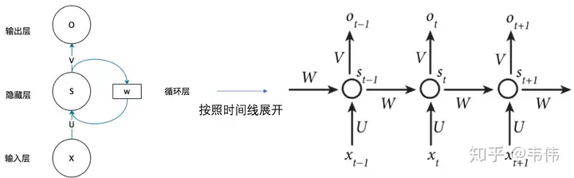
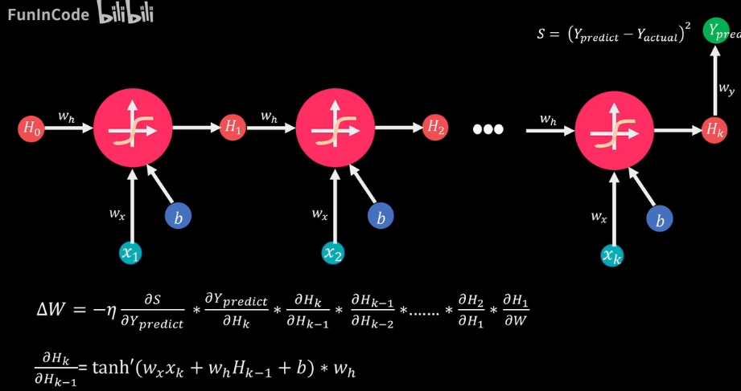
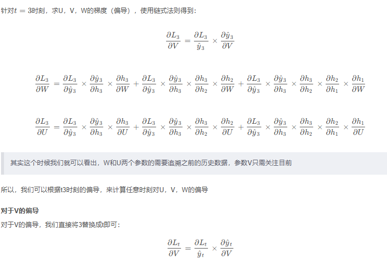
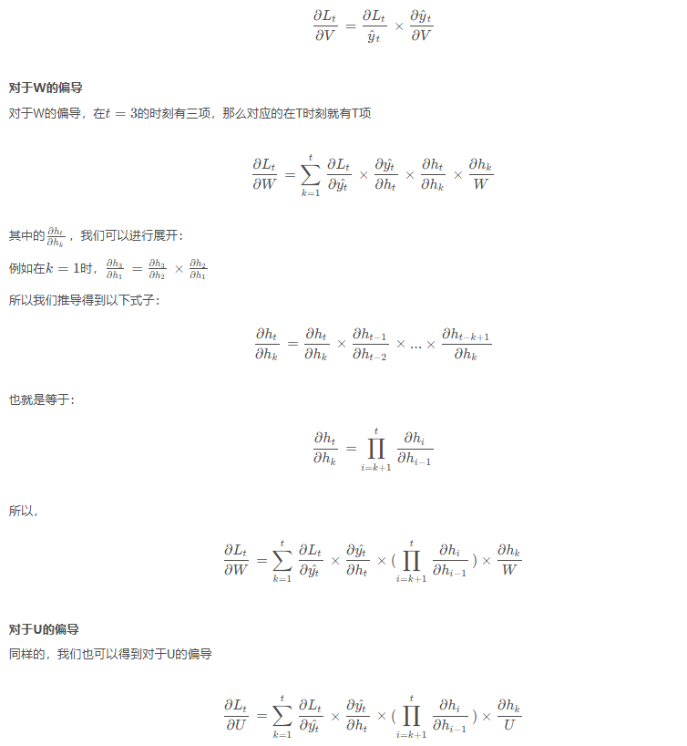
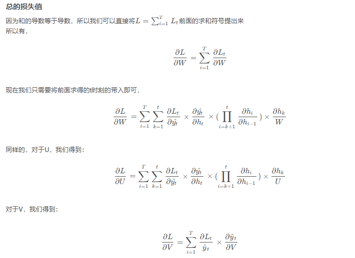
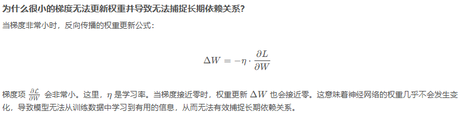
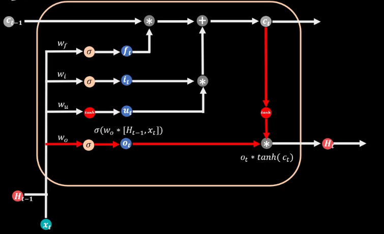
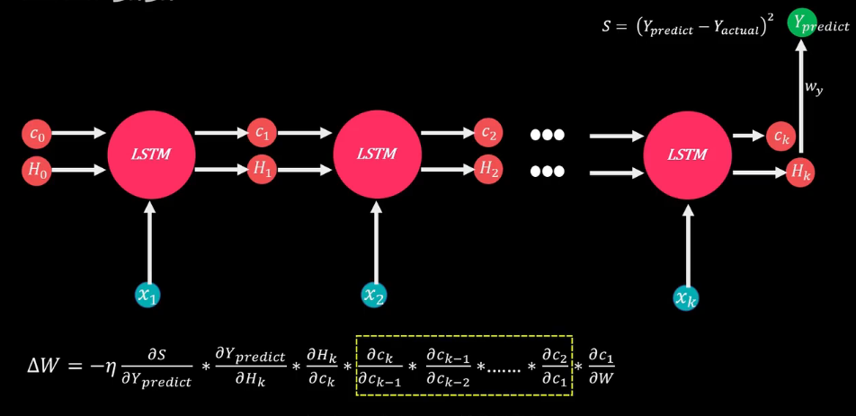
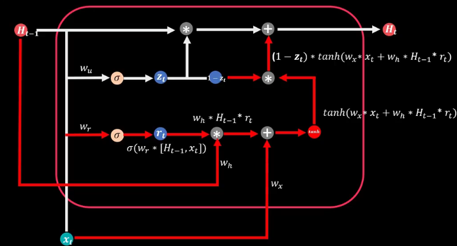

# 循环神经网络

## RNN

### RNN 的基本步骤

1. **输入层**：
   - 输入序列的每个元素在每个时间步都会进入网络。

2. **隐藏层**：
   - RNN 由一个或多个隐藏层构成，每个隐藏层的神经元在每个时间步都会接收前一时间步的隐藏状态和当前时间步的输入。
   - 计算公式为：
   $$
   h_t = f(W_h h_{t-1} + W_x x_t + b)
   $$
   其中 $h_t$ 是当前的隐藏状态，$h_{t-1}$ 是前一时间步的隐藏状态，$x_t$ 是当前输入，$W_h$ 和 $W_x$ 是权重矩阵，$b$ 是偏置，$f$ 是激活函数（如 $\tanh$ 或 ReLU）。

3. **输出层**：
   - 输出层根据当前的隐藏状态生成输出，计算公式为：
   $$
   y_t = W_y h_t + b_y
   $$
   其中 $y_t$ 是当前的输出，$W_y$ 是输出层的权重矩阵，$b_y$ 是输出的偏置。

### 特点

- **时间依赖性**：
  - RNN 能够处理变长的输入序列，适用于时间序列数据和自然语言处理。
  
- **参数共享**：
  - RNN 在每个时间步使用相同的权重矩阵，这使得模型的参数数量大大减少。

### 限制

- **梯度消失和爆炸**：
  - 在处理长序列时，RNN 可能面临梯度消失或梯度爆炸的问题，导致学习效率低下。

### 训练过程

- RNN 通常使用 BPTT 算法进行训练，更新权重以最小化输出与目标之间的误差。

### BPTT

BPTT（Backpropagation Through Time，时间反向传播）是用于训练循环神经网络（RNN）的一种算法。虽然它与传统的反向传播（BP）算法有相似之处，但因为 RNN 的结构具有时间序列特性，所以 BPTT 需要进行特定的处理。

#### BPTT 算法的工作原理

1. **展开 RNN**：
   - 在进行反向传播之前，BPTT 首先将 RNN 展开成一个时间序列的前馈神经网络。例如，对于一个包含 T 个时间步的序列，RNN 会被展开为 T 个相互连接的前馈网络。
  
2. **计算前向传播**：
   - 像传统的 BP 算法一样，首先进行前向传播，计算每个时间步的输出。

3. **计算损失**：
   - 根据模型的输出和目标值计算损失。

4. **反向传播**：
   - 从最后一个时间步开始，将误差反向传播回每个时间步。这意味着需要考虑每个时间步的隐藏状态对输出的影响。

5. **更新权重**：
   - 根据梯度信息更新网络中的所有权重。

#### 为什么采用BPTT

- **时间依赖性**：
  - RNN 的输出不仅依赖于当前输入，还依赖于之前的隐藏状态。这种时间依赖性要求对所有时间步进行反向传播，而不仅仅是当前时间步。
  
- **处理序列数据**：
  - BPTT 设计用于处理变长的序列，因此能够适应序列中信息的动态变化。

#### 总结

BPTT 是 BP 算法的扩展，专门用于处理循环神经网络中的时间序列数据。它通过对每个时间步进行反向传播来捕捉序列中信息的依赖性。

### 梯度下降

循环神经网络（RNN）的反向传播过程被称为**通过时间的反向传播（Backpropagation Through Time, BPTT）**。由于RNN的隐藏状态是通过每个时间步的输入和前一个时间步的隐藏状态递归计算的，所以在计算误差时需要反向传播回多个时间步，这使得RNN的反向传播与普通的前馈神经网络有所不同。

### RNN 的基本结构

RNN 的隐藏层状态 $h_t$ 在每个时间步 $t$ 上会根据输入 $x_t$ 和前一个时间步的隐藏状态 $h_{t-1}$ 来更新。基本公式如下：

$$
h_t = \sigma(W_{hh} h_{t-1} + W_{xh} x_t + b_h)
$$

输出 $y_t$ 则根据隐藏状态 $h_t$ 通过另一个权重矩阵 $W_{hy}$ 来计算：

$$
y_t = W_{hy} h_t + b_y
$$

### 反向传播通过时间（BPTT）

BPTT 是通过展开 RNN，将每个时间步看作一个独立的前馈网络，然后对所有时间步进行反向传播。

假设损失函数为 $L_t$，它依赖于输出 $y_t$ 和真实标签之间的差距。为了更新模型参数，我们需要计算损失相对于参数的梯度。

**总的损失函数：**
$$
L = \sum_{t=1}^{T} L_t
$$

#### 梯度计算

1. **隐藏状态的梯度：** 
   每个时间步 $t$ 的隐藏状态 $h_t$ 依赖于前一个时间步的隐藏状态 $h_{t-1}$，因此损失函数 $L_t$ 对于隐藏状态的梯度需要逐时间步向后传递：
   $$
   \frac{\partial L}{\partial h_t} = \frac{\partial L_t}{\partial h_t} + \sum_{k=t+1}^{T} \frac{\partial L_k}{\partial h_k} \cdot \frac{\partial h_k}{\partial h_t}
   $$
   
   这意味着我们不仅要考虑时间步 $t$ 上的损失对隐藏状态的直接影响，还需要考虑未来时间步对当前隐藏状态的间接影响。
   
2. **权重的梯度：**
   - 对于隐藏层的权重 $W_{hh}$： 
     $W_{hh}$ 在所有时间步中共享，因此在计算梯度时，需要累积每个时间步的梯度：
     $$
     \frac{\partial L}{\partial W_{hh}} = \sum_{t=1}^{T} \frac{\partial L_t}{\partial h_t} \cdot \frac{\partial h_t}{\partial W_{hh}}
     $$
     
   - 对于输入到隐藏层的权重 $W_{xh}$： 
     类似地，$W_{xh}$ 也在各个时间步共享：
     $$
     \frac{\partial L}{\partial W_{xh}} = \sum_{t=1}^{T} \frac{\partial L_t}{\partial h_t} \cdot \frac{\partial h_t}{\partial W_{xh}}
     $$

#### 示例：简化的RNN反向传播

我们用一个简单的例子说明反向传播过程。假设有一个 3 个时间步的序列输入，模型损失 $L = L_1 + L_2 + L_3$，要计算每个参数的梯度。

1. **前向传播：**
   - 时间步 1：
     输入 $x_1$，计算隐藏状态 $h_1$，输出 $y_1$，损失 $L_1$
   - 时间步 2：
     输入 $x_2$，使用 $h_1$ 计算 $h_2$，输出 $y_2$，损失 $L_2$
   - 时间步 3：
     输入 $x_3$，使用 $h_2$ 计算 $h_3$，输出 $y_3$，损失 $L_3$

2. **反向传播：**
   - 时间步 3：
     - 计算 $ \frac{\partial L_3}{\partial h_3} $ 并更新参数
   - 时间步 2：
     - 计算 $ \frac{\partial L_2}{\partial h_2} + \frac{\partial h_3}{\partial h_2} \cdot \frac{\partial L_3}{\partial h_3} $ 并更新参数
   - 时间步 1：
     - 计算 $ \frac{\partial L_1}{\partial h_1} + \frac{\partial h_2}{\partial h_1} \cdot \frac{\partial L_2}{\partial h_2} + \frac{\partial h_3}{\partial h_1} \cdot \frac{\partial L_3}{\partial h_3} $ 并更新参数

#### 梯度消失与梯度爆炸问题

由于 RNN 中的权重在每个时间步都被重复使用，当时间步数很长时，梯度会在反向传播过程中不断地乘以链式导数的积，这可能导致**梯度消失**（梯度趋于零）或**梯度爆炸**（梯度趋于无穷大）的问题。为了解决这些问题，通常使用 LSTM（长短期记忆网络）或 GRU（门控循环单元）等改进的结构，或者使用梯度裁剪（gradient clipping）等技术来限制梯度的大小。

#### 总结

反向传播通过时间的核心思想是在时间维度上展开 RNN，计算每个时间步的梯度并通过时间步反向传播。这种方法要求对多个时间步累积计算梯度，容易遇到梯度消失或爆炸的问题，因此在实践中通常使用一些改进的技术。

### 示例

通过一个更具体的例子来解释RNN的反向传播过程（**通过时间的反向传播**，即BPTT）。

#### 1. 简化的RNN结构

假设我们有一个非常简单的RNN，具有以下元素：
- 输入序列： $ x_1, x_2, x_3 $
- 隐藏状态： $ h_1, h_2, h_3 $
- 输出序列： $ y_1, y_2, y_3 $
- 每个时间步的损失函数： $ L_1, L_2, L_3 $
- 权重矩阵：  
  - $ W_{xh} $（输入到隐藏层的权重）
  - $ W_{hh} $（隐藏层到隐藏层的权重）
  - $ W_{hy} $（隐藏层到输出层的权重）

#### 2. RNN的前向传播

我们通过时间步逐步进行前向传播，更新隐藏状态并计算输出和损失。

- **时间步1**：
  - 隐藏状态 $ h_1 $ 由输入 $ x_1 $ 和初始隐藏状态 $ h_0 $ 通过权重矩阵 $ W_{xh} $ 和 $ W_{hh} $ 计算得到：
    $$
    h_1 = \tanh(W_{xh} x_1 + W_{hh} h_0)
    $$
  - 输出 $ y_1 $ 由隐藏状态 $ h_1 $ 计算得到：
    $$
    y_1 = W_{hy} h_1
    $$
  - 损失 $ L_1 $ 计算输出 $ y_1 $ 和真实标签之间的差距（假设使用均方误差损失）：
    $$
    L_1 = \frac{1}{2} (y_1 - \text{target}_1)^2
    $$

- **时间步2**：
  - 隐藏状态 $ h_2 $ 由输入 $ x_2 $ 和上一时间步的隐藏状态 $ h_1 $ 计算得到：
    $$
    h_2 = \tanh(W_{xh} x_2 + W_{hh} h_1)
    $$
  - 输出 $ y_2 $ 由隐藏状态 $ h_2 $ 计算得到：
    $$
    y_2 = W_{hy} h_2
    $$
  - 损失 $ L_2 $：
    $$
    L_2 = \frac{1}{2} (y_2 - \text{target}_2)^2
    $$

- **时间步3**：
  - 隐藏状态 $ h_3 $：
    $$
    h_3 = \tanh(W_{xh} x_3 + W_{hh} h_2)
    $$
  - 输出 $ y_3 $：
    $$
    y_3 = W_{hy} h_3
    $$
  - 损失 $ L_3 $：
    $$
    L_3 = \frac{1}{2} (y_3 - \text{target}_3)^2
    $$

#### 3. 反向传播（BPTT）

反向传播是通过时间逐步将损失的梯度传递回每一个时间步，进而更新参数 $ W_{xh}, W_{hh}, W_{hy} $。为了更好地理解，假设我们从最后的时间步开始反向传播。

##### 时间步3：反向传播

1. **输出层梯度**：
   对于损失 $ L_3 $，首先计算相对于输出 $ y_3 $ 的梯度：
   $$
   \frac{\partial L_3}{\partial y_3} = y_3 - \text{target}_3
   $$

2. **隐藏层到输出层权重 $ W_{hy} $ 的梯度**：
   由于 $ y_3 = W_{hy} h_3 $，梯度传递到权重 $ W_{hy} $：
   $$
   \frac{\partial L_3}{\partial W_{hy}} = \frac{\partial L_3}{\partial y_3} \cdot h_3
   $$

3. **隐藏状态 $ h_3 $ 的梯度**：
   隐藏状态的梯度通过链式法则传递回去：
   $$
   \frac{\partial L_3}{\partial h_3} = \frac{\partial L_3}{\partial y_3} \cdot W_{hy}
   $$

4. **输入到隐藏层的权重 $ W_{xh} $ 和隐藏层到隐藏层的权重 $ W_{hh} $**：
   因为 $ h_3 = \tanh(W_{xh} x_3 + W_{hh} h_2) $，我们需要计算梯度相对于这两个权重：
   
   - 对于 $ W_{xh} $：
     $$
     \frac{\partial L_3}{\partial W_{xh}} = \frac{\partial L_3}{\partial h_3} \cdot (1 - h_3^2) \cdot x_3
     $$
   - 对于 $ W_{hh} $：
     $$
     \frac{\partial L_3}{\partial W_{hh}} = \frac{\partial L_3}{\partial h_3} \cdot (1 - h_3^2) \cdot h_2
     $$

##### 时间步2：反向传播

时间步2的反向传播类似，但需要加上从时间步3传递过来的梯度。

1. **隐藏状态 $ h_2 $ 的总梯度**：
   不仅包括损失 $ L_2 $ 的直接影响，还包括通过时间步3传递回来的梯度：
   $$
   \frac{\partial L_2}{\partial h_2} = \frac{\partial L_2}{\partial y_2} \cdot W_{hy} + \frac{\partial h_3}{\partial h_2} \cdot \frac{\partial L_3}{\partial h_3}
   $$

2. **更新权重 $ W_{xh} $ 和 $ W_{hh} $**：
   - 对于 $ W_{xh} $：
     $$
     \frac{\partial L_2}{\partial W_{xh}} = \frac{\partial L_2}{\partial h_2} \cdot (1 - h_2^2) \cdot x_2
     $$
   - 对于 $ W_{hh} $：
     $$
     \frac{\partial L_2}{\partial W_{hh}} = \frac{\partial L_2}{\partial h_2} \cdot (1 - h_2^2) \cdot h_1
     $$

##### 时间步1：反向传播

1. **隐藏状态 $ h_1 $ 的总梯度**：
   类似地，包含时间步2和时间步3的梯度：
   $$
   \frac{\partial L_1}{\partial h_1} = \frac{\partial L_1}{\partial y_1} \cdot W_{hy} + \frac{\partial h_2}{\partial h_1} \cdot \frac{\partial L_2}{\partial h_2} + \frac{\partial h_3}{\partial h_1} \cdot \frac{\partial L_3}{\partial h_3}
   $$

2. **更新权重 $ W_{xh} $ 和 $ W_{hh} $**：
   - 对于 $ W_{xh} $：
     $$
     \frac{\partial L_1}{\partial W_{xh}} = \frac{\partial L_1}{\partial h_1} \cdot (1 - h_1^2) \cdot x_1
     $$
   - 对于 $ W_{hh} $：
     $$
     \frac{\partial L_1}{\partial W_{hh}} = \frac{\partial L_1}{\partial h_1} \cdot (1 - h_1^2) \cdot h_0
     $$

#### 总结

反向传播通过时间（BPTT）的核心思想是通过时间步逐步反向传播损失的梯度，从最后一个时间步开始，一步一步地将梯度传递回到每个时间步。同时，由于隐藏状态依赖于前一时间步，因此需要累积每个时间步的梯度。这种梯度传播机制会影响每个共享权重的更新。

可以把每个时间步想象成一个独立的前馈网络，而反向传播就是在这些展开的网络中按时间步逐步进行的。

### 更新参数

我们回到你之前提到的**反向传播中的参数迭代更新**，结合前面的例子，我将详细解释**梯度下降**中的参数更新过程。

#### 梯度下降中的参数更新

在反向传播过程中，**梯度下降**算法通过计算损失函数相对于模型参数的梯度，然后根据这个梯度更新模型参数，使得损失逐渐减少。更新公式如下：

$$
\theta \leftarrow \theta - \eta \cdot \frac{\partial L}{\partial \theta}
$$

其中：
- $ \theta $ 是模型的参数（比如权重矩阵 $ W_{xh}, W_{hh}, W_{hy} $）。
- $ \eta $ 是学习率（Learning Rate），控制每次更新的步长。
- $ \frac{\partial L}{\partial \theta} $ 是损失函数 $ L $ 对参数 $ \theta $ 的梯度（或导数）。

每次迭代都会根据这个公式更新参数。

#### 例子：从RNN反向传播中的参数更新

假设我们对**隐藏层到隐藏层的权重 $ W_{hh} $**进行更新，基于时间步1的反向传播结果。

1. **计算梯度**：
   假设在时间步1我们已经计算出了 $ W_{hh} $ 的梯度为：
   $$
   \frac{\partial L_1}{\partial W_{hh}} = \frac{\partial L_1}{\partial h_1} \cdot (1 - h_1^2) \cdot h_0
   $$
   其中 $ \frac{\partial L_1}{\partial h_1} $ 是损失 $ L_1 $ 对隐藏状态 $ h_1 $ 的梯度，$ h_0 $ 是初始隐藏状态。

2. **参数更新**：
   梯度下降法会根据上面的公式更新权重 $ W_{hh} $。假设学习率 $ \eta = 0.01 $，我们将梯度乘以学习率，然后更新权重：
   $$
   W_{hh} \leftarrow W_{hh} - \eta \cdot \frac{\partial L_1}{\partial W_{hh}}
   $$
   具体来说：
   $$
   W_{hh} \leftarrow W_{hh} - 0.01 \cdot \frac{\partial L_1}{\partial W_{hh}}
   $$

3. **多个时间步的累积梯度**：
   在RNN中，权重 $ W_{hh} $ 会被多个时间步共享。因此，在实践中，我们不会只根据时间步1的梯度更新 $ W_{hh} $，而是根据所有时间步的累积梯度进行更新。具体地，假设时间步1、2、3都有各自的梯度 $ \frac{\partial L_1}{\partial W_{hh}}, \frac{\partial L_2}{\partial W_{hh}}, \frac{\partial L_3}{\partial W_{hh}} $，那么最终的更新步骤为：
   $$
   W_{hh} \leftarrow W_{hh} - \eta \cdot \left( \frac{\partial L_1}{\partial W_{hh}} + \frac{\partial L_2}{\partial W_{hh}} + \frac{\partial L_3}{\partial W_{hh}} \right)
   $$

#### 一个具体的数值例子

假设我们有以下数值：
- 初始权重 $ W_{hh} = 0.5 $
- 在时间步1，我们计算得出 $ \frac{\partial L_1}{\partial W_{hh}} = 0.1 $
- 在时间步2，我们计算得出 $ \frac{\partial L_2}{\partial W_{hh}} = 0.05 $
- 在时间步3，我们计算得出 $ \frac{\partial L_3}{\partial W_{hh}} = -0.02 $
- 学习率 $ \eta = 0.01 $

那么，根据梯度下降法，累积梯度为：
$$
\text{总梯度} = 0.1 + 0.05 - 0.02 = 0.13
$$

然后我们更新权重 $ W_{hh} $：
$$
W_{hh} \leftarrow 0.5 - 0.01 \cdot 0.13
$$
$$
W_{hh} \leftarrow 0.5 - 0.0013 = 0.4987
$$

经过这次更新，新的 $ W_{hh} $ 变为 0.4987。

#### 迭代相减的总结

每次迭代中，参数都会根据计算出的梯度进行更新。这个过程就是**梯度下降**，它不断减小损失函数相对于参数的梯度，使模型逐步优化。

## RNN遇到的问题

RNN 中的反向传播会面临两个主要问题，尤其是在处理长序列数据时：**梯度消失**和**梯度爆炸**。这些问题会使得普通的 RNN 难以捕捉长时间依赖关系，因此在实践中通常使用一些技术来改进RNN的性能。

### 1. 梯度消失与梯度爆炸

**梯度消失**指的是随着时间步数的增加，梯度在反向传播过程中会逐渐变得非常小，接近于零。这会导致远处时间步的参数几乎不会更新，从而导致模型无法学习到长时间的依赖关系。

**梯度爆炸**则是梯度在反向传播过程中变得非常大，使得参数更新剧烈，进而导致模型参数的不稳定，甚至导致数值溢出。

在处理长时间序列时，这两个问题是通过时间反向传播（BPTT）的自然结果，因为链式求导会导致权重在多次相乘后要么趋近于0（梯度消失），要么变得极大（梯度爆炸）。

### 2. 改进技术

为了应对这些问题，研究者们提出了一些改进技术，这些技术在处理长序列依赖问题上表现得更好。

#### 2.1 长短期记忆网络（LSTM）

**LSTM**（Long Short-Term Memory）是一种特殊的RNN结构，专门设计来解决梯度消失问题。LSTM引入了**记忆单元（Memory Cell）**和**门机制（Gate Mechanisms）**，使得网络能够更好地保存长期信息，同时忘记不必要的短期信息。

LSTM 包含三种门：
- **输入门**：控制新的信息是否应该写入记忆单元。
- **遗忘门**：控制是否应该丢弃以前时间步的信息。
- **输出门**：控制记忆单元的输出信息。

这些门机制使得LSTM可以更有效地选择哪些信息需要被保留，哪些信息需要被遗忘，从而减缓了梯度消失问题。

LSTM 的核心更新公式可以描述为：
$$
C_t = f_t \odot C_{t-1} + i_t \odot \tilde{C_t}
$$
其中 $ C_t $ 是当前时间步的记忆单元状态，$ f_t $ 是遗忘门，$ i_t $ 是输入门，$ \tilde{C_t} $ 是新的信息。

#### 2.2 门控循环单元（GRU）

**GRU**（Gated Recurrent Unit）是LSTM的简化版本，具有类似的门机制，但结构更简单，计算开销更小。GRU 通过引入**更新门**和**重置门**来控制信息的流动。

- **更新门**：控制当前时间步的隐藏状态是否要更新。
- **重置门**：控制是否要重置隐藏状态，允许网络忽略部分过去的状态信息。

与LSTM相比，GRU 更轻量化，但在许多任务中表现类似，甚至更好。

#### 2.3 梯度裁剪（Gradient Clipping）

**梯度裁剪**是为了解决梯度爆炸问题的一种常见方法。在反向传播过程中，如果发现梯度过大（超过某个阈值），就将梯度裁剪到这个阈值以内，以防止梯度爆炸。

假设你设定了梯度阈值 $ \text{clip\_value} $，如果梯度超过这个值，就会将梯度裁剪为：
$$
g' = \frac{g}{\|g\|} \times \text{clip\_value}
$$
其中 $ g $ 是原始梯度，$ g' $ 是裁剪后的梯度。

#### 2.4 正则化（Regularization）

**正则化技术**，如**Dropout**，可以防止模型过拟合并提高模型的泛化能力。对于RNN中的Dropout，通常只在非时间维度上进行，以保持时间步之间的连续性。

#### 2.5 使用更短的时间窗口

一种简单但有效的策略是，将长序列分解为多个较短的时间窗口（sub-sequence）。每次只对较短的时间段应用反向传播，减少梯度消失或梯度爆炸的可能性。不过，这种方法也会限制模型的长程依赖能力。

### 3. 总结

改进技术的目的主要是为了解决RNN在处理长序列时遇到的梯度消失或梯度爆炸问题，使得模型能够更好地学习和捕捉长时间依赖。LSTM和GRU是解决这些问题的主流模型，结合梯度裁剪等方法，可以大大提高训练效果。在实际应用中，LSTM和GRU往往会替代标准RNN用于大多数时间序列或自然语言处理任务。

## LSTM

## GRU

