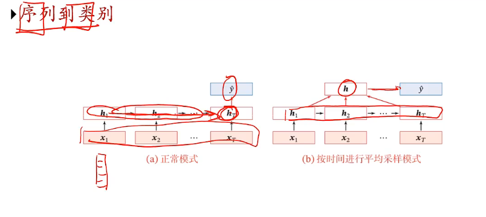
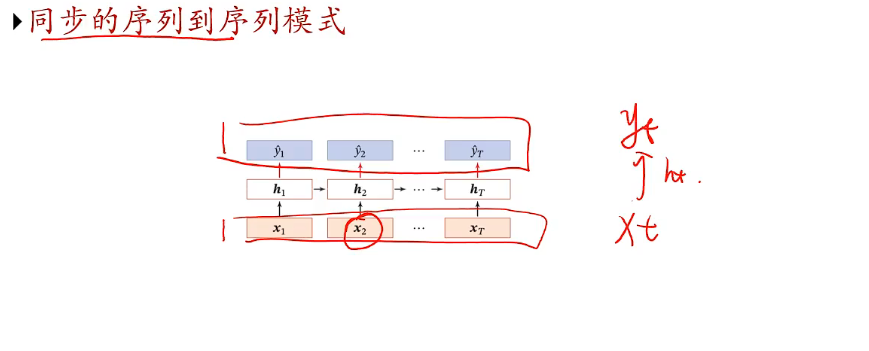
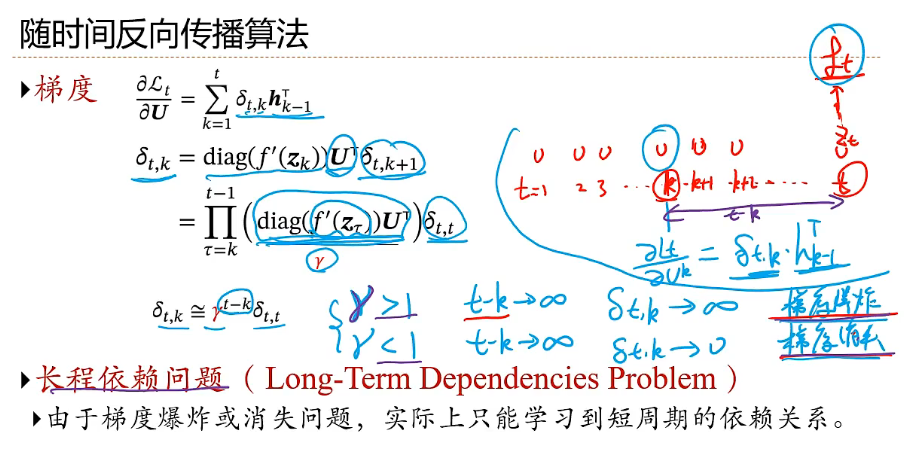
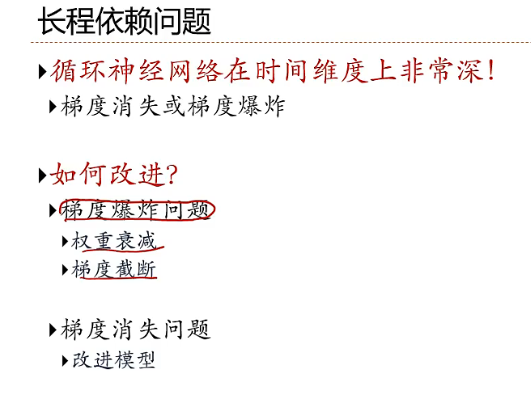

### 应用到机器学习

> 只有最后一个时刻有输出

> 每一时刻都有输入和输出，输入序列和输出序列长度相同。

>AR：自回归模型
>
>具体说，就是用一个变量的时间数列作为因变量数列，用同一变量向过去推移若干期的时间数列作自变量数列，分析一个因变量数列和另一个或多个自变量数列之间的相关关系，建立回归方程进行预测。
>
>再通俗一点讲，就是`用过去时间点的数据预测未来时间点的数据`

### seq2seq

Seq2Seq (Sequence-to-Sequence) 是一种用于序列映射任务的模型架构，广泛应用于自然语言处理（NLP）领域，如机器翻译、文本摘要和语音识别等。

#### **结构**

- **编码器 (Encoder)**:
  - 输入序列通过编码器，逐步编码为一个固定长度的上下文向量（context vector），即输入的抽象语义表示。
  - 通常使用循环神经网络（RNN）、长短时记忆网络（LSTM）或门控循环单元（GRU）来实现。
- **解码器 (Decoder)**:
  - 解码器从编码器生成的上下文向量出发，逐步输出目标序列。
  - 解码过程通常是逐步的，每一步依赖于上一步的输出和编码器的上下文。

#### **特性**

- 单步预测:
  - 解码器的每一步预测当前时刻的输出，然后将其作为下一时刻的输入。
- 上下文向量问题:
  - 早期的 Seq2Seq 模型由于上下文向量的固定长度，难以捕捉长序列的完整信息。

#### **改进**

- 注意力机制 (Attention):
  - 通过引入注意力机制，解码器可以直接访问编码器的中间状态，从而提升对长序列的建模能力。
- Transformer:
  - Transformer 进一步改进了 Seq2Seq 的架构，用自注意力机制代替传统 RNN 架构。

### **自回归模型**

自回归模型是一类通过递归方式生成输出序列的模型，其生成方式是基于之前的输出来预测下一个值。

#### **定义**

- **递归生成**:自回归模型在生成序列时遵循因果顺序：第 $t$ 个输出 $y_t$ 仅依赖于 $\{y_1, y_2, \dots, y_{t-1}\}$。
- 典型公式：$$ P(Y) = \prod_{t=1}^{T} P(y_t \mid y_1, y_2, \dots, y_{t-1}) $$

#### **应用**

- **语言模型 (Language Models)**: 生成式模型（如 GPT）通过自回归方式生成文本。
- **时间序列预测**: 在时间序列分析中，自回归用于建模序列的动态行为。

#### **优缺点**

- 优点:
  - 模型可以精确地捕捉时间相关性。
  - 生成序列时更符合人类理解的因果顺序。
- 缺点:
  - 预测效率较低（递归式生成）。
  - 随着序列长度增加，误差可能会累积（暴露偏差问题）。

**给定一个目标序列 $ Y = [y_1, y_2, \dots, y_T] $，其整体概率可以表示为：**
$$
P(Y) = \prod_{t=1}^{T} P(y_t \mid y_1, y_2, \dots, y_{t-1})
$$

#### 公式分解

根据概率的链式法则（Chain Rule of Probability），联合概率可以被分解为：

$$
P(Y) = P(y_1) \cdot P(y_2 \mid y_1) \cdot P(y_3 \mid y_1, y_2) \cdot \dots \cdot P(y_T \mid y_1, y_2, \dots, y_{T-1})
$$

等价于：

$$
P(Y) = \prod_{t=1}^{T} P(y_t \mid y_1, y_2, \dots, y_{t-1})
$$

#### 具体步骤

1. 对于每个时间步 $ t $，生成当前元素 $ y_t $ 的条件概率为：

$$
P(y_t \mid y_1, y_2, \dots, y_{t-1})
$$

2. 序列的联合概率由所有时间步的条件概率相乘得到。

#### 条件概率计算

在神经网络中，条件概率 $ P(y_t \mid y_1, y_2, \dots, y_{t-1}) $ 通常通过模型隐状态 $ h_t $ 计算，公式为：

$$
P(y_t \mid y_1, y_2, \dots, y_{t-1}) = \text{Softmax}(W \cdot h_t + b)
$$

其中：
- $ h_t $ 是模型在时间步 $ t $ 的隐状态，编码了 $[y_1, y_2, \dots, y_{t-1}]$ 的信息。
- $ W $ 和 $ b $ 是可学习的参数。

### 参数学习

==**长程依赖问题**==

### 解决长程依赖问题

